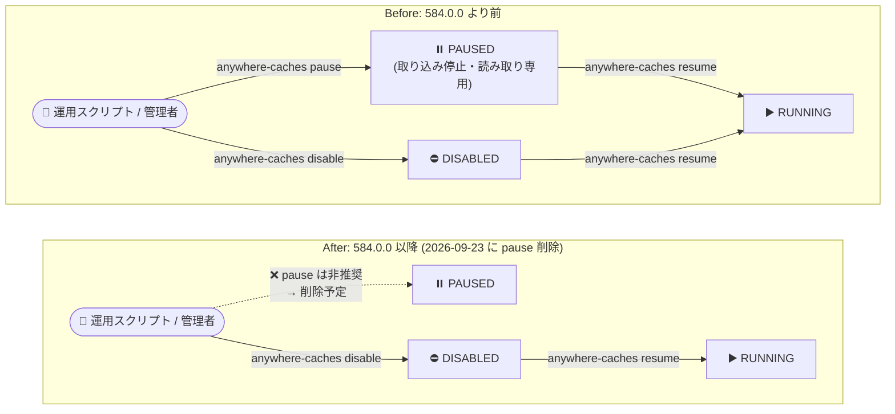

# Cloud SDK: バージョン 584.0.0 リリース (Breaking Changes を含む)

**リリース日**: 2026-09-09

**サービス**: Cloud SDK (Google Cloud CLI / gcloud)

**機能**: gcloud CLI 584.0.0 - `gcloud storage buckets anywhere-caches pause` の非推奨化、minikube コンポーネントの非推奨化ほか

**ステータス**: リリース済み (Breaking Changes / Deprecation を含む)

📊 [このアップデートのインフォグラフィックを見る](https://takech9203.github.io/google-cloud-news-summary/20260909-cloud-sdk-584-breaking-changes.html)

## 概要

2026 年 9 月 9 日、Google Cloud CLI (gcloud) バージョン 584.0.0 がリリースされました。このリリースには **Breaking Changes として Cloud Storage の `gcloud storage buckets anywhere-caches pause` コマンドの非推奨化** が含まれており、Anywhere Cache の一時停止 (pause) 機能を運用スクリプトなどで利用しているユーザーは対応が必要です。コマンドリファレンスによると、このコマンドは **2026 年 9 月 23 日に削除され、pause 機能自体がサポートされなくなります**。

さらに、Google Cloud CLI に同梱されてきた **minikube コンポーネントも非推奨化** されました。minikube コンポーネントは **2027 年 1 月 31 日以降に削除** される予定で、ローカルの Kubernetes 開発環境として gcloud 経由の minikube を利用しているユーザーは、OSS 版 Minikube への移行が推奨されています。既存のローカル設定とクラスタ (`~/.minikube`) は保持されます。

セキュリティ面では、Linux 版にバンドルされる Python の OpenSSL が 3.5.8 にアップグレードされ、**CVE-2026-42508 が解消** されました。このほか、AlloyDB の `--edition` フラグ追加 (alpha/beta)、Apigee の `gcloud apigee apis delete` 追加、Managed Kafka のパブリッククラスタ関連フラグの GA 昇格、Compute Engine の多数のコマンド追加・GA 昇格など、幅広いサービスのコマンド更新が含まれています。

**アップデート前の課題**

- `gcloud storage buckets anywhere-caches pause` は、RUNNING 状態の Anywhere Cache インスタンスのデータ取り込みを停止 (読み取り専用化) する手段として利用できたが、今後この pause 機能はサポート対象外となるため、依存するスクリプトは将来動作しなくなる
- minikube を gcloud のコンポーネント (`gcloud components install minikube`) として導入・更新しているワークフローは、コンポーネント削除後に機能しなくなる
- Linux 版 gcloud にバンドルされた Python の OpenSSL に脆弱性 (CVE-2026-42508) が存在していた

**アップデート後の改善**

- 非推奨化が事前告知され、削除期日 (pause コマンド: 2026 年 9 月 23 日、minikube コンポーネント: 2027 年 1 月 31 日以降) が明示されたことで、計画的な移行が可能になった
- OpenSSL 3.5.8 へのアップグレードにより CVE-2026-42508 が解消された
- Managed Kafka の `--public-cluster` / `--allowed-source-ip-ranges` フラグの GA 昇格、Firestore change-streams コマンドの beta 昇格など、多数の CLI 機能が利用可能になった

## アーキテクチャ図



Anywhere Cache インスタンスの操作フローの Before/After 比較です。584.0.0 以降 `pause` コマンドは非推奨となり、2026 年 9 月 23 日に削除されます。`resume` コマンドは PAUSED と DISABLED の両方の状態から RUNNING/CREATING 状態への復帰に利用できるため、一時的にキャッシュを停止する操作は `disable` → `resume` のフローへの移行を検討します。

## サービスアップデートの詳細

### 主要な変更点

1. **[Breaking Change] `gcloud storage buckets anywhere-caches pause` の非推奨化 (Cloud Storage)**
   - Anywhere Cache インスタンスのデータ取り込みを一時停止するコマンドが非推奨になった
   - コマンドリファレンスの記載: 「このコマンドは非推奨であり、**2026 年 9 月 23 日に削除**される。**pause 機能は今後サポートされない**」
   - `gcloud alpha storage buckets anywhere-caches pause` (alpha 版) も同様に非推奨
   - `anywhere-caches` コマンドグループの他のコマンド (`create` / `describe` / `disable` / `list` / `resume` / `update`) は引き続き利用可能

2. **[Deprecation] minikube コンポーネントの非推奨化 (Google Cloud CLI)**
   - Google Cloud CLI に同梱されている minikube コンポーネントが非推奨になった
   - コンポーネントは **2027 年 1 月 31 日より後に削除** される
   - `~/.minikube` 内の既存のローカル設定とクラスタは保持される
   - Minikube 自体はオープンソースプロジェクトとして引き続き活発にメンテナンスされており、[標準の OSS Minikube インストール](https://minikube.sigs.k8s.io/docs/start/)への移行が推奨されている

3. **[Security] OpenSSL 3.5.8 へのアップグレード**
   - Linux 版 gcloud にバンドルされる Python の OpenSSL を 3.5.8 にアップグレードし、**CVE-2026-42508** を解消

4. **その他の主なコマンド更新**
   - **AlloyDB**: `gcloud alloydb clusters create|update` に `--edition` フラグを追加 (alpha/beta)
   - **Apigee**: API プロキシと全リビジョンを削除する `gcloud apigee apis delete` を追加 (事前に `gcloud apigee apis undeploy` でのアンデプロイが必要)
   - **Artifact Registry**: Conda パッケージをアップロードする `gcloud artifacts files upload` を追加
   - **BigLake**: Iceberg / Delta Sharing カタログの `create` / `update` に `--kms-key`、Iceberg カタログに `--cross-cloud-cache` フラグを追加
   - **Cloud Firestore**: `gcloud firestore change-streams` コマンドを beta に昇格、`gcloud firestore indexes composite create` の検索構成オプションを GA に昇格
   - **Cloud Managed Kafka**: `gcloud managed-kafka clusters create|update` の `--public-cluster` / `--allowed-source-ip-ranges` フラグを GA に昇格
   - **Cloud SQL**: パッケージ版 `cloud-sql-proxy` コンポーネントを Cloud SQL Proxy 2.25.4 に更新
   - **Cloud Services (API Keys)**: `gcloud services api-keys update|delete` に、キーの更新・削除前に非互換トラフィックの有無を検証する `--[no-]check-existing-usage` フラグを追加 (デフォルト: true)
   - **Compute Engine**: `url-maps` の `regex_rewrite` GA 昇格、`backend-services` への `--network-endpoint-group` / `--ha-policy-*` / `--outlier-detection-*` フラグ追加、`recoverable-snapshots` 各コマンドの beta 昇格、`enable-vpc-scoped-dns` の GA 昇格、`reservations update` の `--share-setting` GA 昇格など

## 技術仕様

### 非推奨化のタイムライン

| 項目 | 対象 | 非推奨化 | 削除時期 |
|------|------|----------|----------|
| Anywhere Cache pause コマンド | `gcloud storage buckets anywhere-caches pause` (alpha 含む) | 584.0.0 (2026-09-09) | **2026 年 9 月 23 日** (pause 機能自体がサポート終了) |
| minikube コンポーネント | Google Cloud CLI の `minikube` コンポーネント | 584.0.0 (2026-09-09) | **2027 年 1 月 31 日より後** (`~/.minikube` は保持) |

### Anywhere Cache 関連コマンドの状況 (584.0.0 時点)

| コマンド | 状態 |
|----------|------|
| `anywhere-caches create` | 利用可能 |
| `anywhere-caches describe` | 利用可能 |
| `anywhere-caches disable` | 利用可能 |
| `anywhere-caches list` | 利用可能 |
| `anywhere-caches pause` | **非推奨 (2026-09-23 削除予定)** |
| `anywhere-caches resume` | 利用可能 (PAUSED / DISABLED 状態からの復帰に対応) |
| `anywhere-caches update` | 利用可能 |

## 影響を受けるユーザーの対応 (移行ガイダンス)

### 1. `anywhere-caches pause` を利用しているユーザー

1. 運用スクリプト、CI/CD パイプライン、Runbook 内で `gcloud storage buckets anywhere-caches pause` (および `gcloud alpha storage buckets anywhere-caches pause`) を使用している箇所を洗い出す

   ```bash
   # スクリプトリポジトリでの利用箇所の検索例
   grep -rn "anywhere-caches pause" .
   ```

2. キャッシュを一時的に停止して後で復帰させる運用は、`disable` → `resume` のフローを検討する。`resume` コマンドは PAUSED と DISABLED の両方の状態から復帰できることがコマンドリファレンスに明記されている

   ```bash
   # キャッシュインスタンスの停止 (pause の代替として)
   gcloud storage buckets anywhere-caches disable my-bucket/my-cache-id

   # キャッシュインスタンスの復帰 (RUNNING / CREATING 状態へ)
   gcloud storage buckets anywhere-caches resume my-bucket/my-cache-id
   ```

3. pause と disable では動作が異なるため、移行前に [Anywhere Cache のドキュメント](https://docs.cloud.google.com/storage/docs/rapid/use-rapid-cache)で disable の挙動 (課金やキャッシュデータの扱い) を確認する

**注意**: 削除期日 (2026 年 9 月 23 日) はリリースからわずか 2 週間後であり、pause 機能自体がサポートされなくなるため、早急な対応が推奨されます。

### 2. gcloud の minikube コンポーネントを利用しているユーザー

1. minikube コンポーネントの導入状況を確認する

   ```bash
   gcloud components list --filter="id:minikube"
   ```

2. [OSS 版 Minikube のインストールガイド](https://minikube.sigs.k8s.io/docs/start/)に従って、標準のインストール方法 (パッケージマネージャーやバイナリダウンロード) に移行する
3. `~/.minikube` 内の既存のローカル設定とクラスタは保持されるため、クラスタの再作成は不要
4. 移行完了後、削除期日 (2027 年 1 月 31 日以降) までに CI/CD 等での `gcloud components install minikube` の利用を廃止する

### 3. すべての gcloud ユーザー (推奨)

Linux 環境では OpenSSL の脆弱性 (CVE-2026-42508) が解消されているため、584.0.0 以降へのアップデートを推奨します。

```bash
# gcloud CLI のアップデート
gcloud components update

# バージョン確認
gcloud version
```

## メリット

### ビジネス面

- **計画的な移行が可能**: 削除期日が明示されているため、影響範囲の調査と移行を計画的に進められる
- **セキュリティリスクの低減**: OpenSSL のアップグレードにより既知の脆弱性 (CVE-2026-42508) が解消される

### 技術面

- **CLI 機能の拡充**: Managed Kafka のパブリッククラスタ設定の GA 昇格、Compute Engine のバックエンドサービス関連フラグ追加など、コンソールを使わない IaC / スクリプトベースの運用範囲が広がる
- **API キー操作の安全性向上**: `--check-existing-usage` フラグ (デフォルト有効) により、使用中の API キーの誤削除・誤更新を防止できる

## デメリット・制約事項

### 制限事項

- `anywhere-caches pause` コマンドは 2026 年 9 月 23 日に削除され、pause 機能自体がサポートされなくなる
- minikube コンポーネントは 2027 年 1 月 31 日より後に Google Cloud CLI から削除される

### 考慮すべき点

- pause の削除期日まで約 2 週間と短いため、Anywhere Cache の pause を利用中のユーザーは優先的に対応が必要
- pause (取り込み停止・読み取り専用) と disable は動作が異なるため、単純なコマンド置換ではなく、運用フロー全体での検証が必要
- gcloud のバージョンを固定している CI/CD 環境では、アップデート時に今回の非推奨化の影響を受けるスクリプトがないか事前確認が必要

## 関連サービス・機能

- **Cloud Storage (Anywhere Cache)**: 今回の Breaking Change の対象。バケットのデータをゾーン内に SSD キャッシュする機能で、`gcloud storage buckets anywhere-caches` コマンドグループで管理する
- **Storage Control API**: Anywhere Cache はクライアントライブラリ (Storage Control API) からも操作可能で、pause/resume 相当の操作を API 経由で行っている場合も影響確認が必要
- **Minikube (OSS)**: gcloud コンポーネント版の移行先。オープンソースプロジェクトとして継続的にメンテナンスされている
- **GKE**: ローカル開発に minikube を使い本番に GKE を使う構成では、開発環境のセットアップ手順の更新が必要

## 参考リンク

- 📊 [インフォグラフィック](https://takech9203.github.io/google-cloud-news-summary/20260909-cloud-sdk-584-breaking-changes.html)
- [公式リリースノート (2026 年 9 月 9 日)](https://docs.cloud.google.com/release-notes#September_09_2026)
- [Google Cloud CLI リリースノート](https://docs.cloud.google.com/sdk/docs/release-notes)
- [gcloud storage buckets anywhere-caches pause リファレンス](https://docs.cloud.google.com/sdk/gcloud/reference/storage/buckets/anywhere-caches/pause)
- [gcloud storage buckets anywhere-caches resume リファレンス](https://docs.cloud.google.com/sdk/gcloud/reference/storage/buckets/anywhere-caches/resume)
- [Anywhere Cache の作成と管理](https://docs.cloud.google.com/storage/docs/rapid/use-rapid-cache)
- [gcloud CLI コンポーネントの管理](https://docs.cloud.google.com/sdk/docs/components)
- [Minikube (OSS) インストールガイド](https://minikube.sigs.k8s.io/docs/start/)
- [google-cloud-sdk-announce グループ (リリースノート購読)](https://groups.google.com/forum/#!forum/google-cloud-sdk-announce)

## まとめ

gcloud CLI 584.0.0 は、`gcloud storage buckets anywhere-caches pause` コマンドの非推奨化 (2026 年 9 月 23 日削除・pause 機能のサポート終了) と minikube コンポーネントの非推奨化 (2027 年 1 月 31 日以降削除) という 2 つの重要な非推奨化を含むリリースです。特に pause コマンドは削除まで約 2 週間しかないため、Anywhere Cache の pause を運用に組み込んでいる場合は、`disable` / `resume` を用いたフローへの移行を早急に検討してください。あわせて、OpenSSL の脆弱性修正 (CVE-2026-42508) が含まれるため、Linux 環境では速やかなアップデートを推奨します。

---

**タグ**: Cloud SDK, gcloud, Cloud Storage, Anywhere Cache, minikube, Breaking Changes, Deprecation, CLI, セキュリティ
