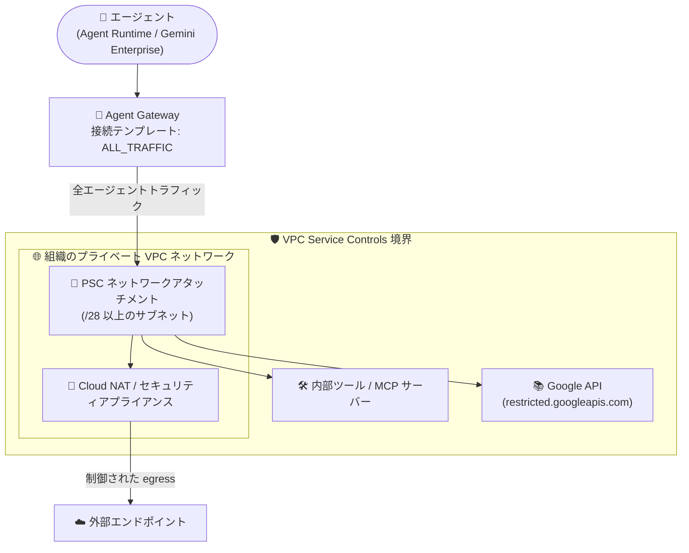

# Gemini Enterprise Agent Platform: Agent Gateway が VPC Service Controls をサポート

**リリース日**: 2026-09-09

**サービス**: Gemini Enterprise Agent Platform (Agent Gateway)

**機能**: Agent Gateway の VPC Service Controls サポート

**ステータス**: Feature

📊 [このアップデートのインフォグラフィックを見る](https://takech9203.github.io/google-cloud-news-summary/20260909-gemini-agent-platform-agent-gateway-vpc-service-controls.html)

## 概要

Gemini Enterprise Agent Platform のネットワークコンポーネントである Agent Gateway が、VPC Service Controls (VPC-SC) の境界ルールをエージェント通信に対して適用できるようになりました。Agent Gateway に VPC 接続を構成すると、エージェントのトラフィックが組織のプライベート VPC ネットワーク経由でルーティングされ、組織の VPC-SC 境界ルールがすべてのエージェントトラフィックに適用されます。

Agent Gateway は、ユーザーとエージェント間、エージェントとツール間、エージェント同士のすべてのエージェント通信のネットワーク出入口として機能し、セキュリティとガバナンスポリシーを適用するコンポーネントです。今回のアップデートにより、AI エージェントの通信経路に対しても VPC-SC によるデータ漏洩 (exfiltration) 対策を組み込めるようになり、厳格なセキュリティ境界を必要とする金融・医療・公共分野などの組織でも、エージェントワークロードを既存のセキュリティ境界に統合しやすくなります。

VPC-SC 境界の適用を有効化するには VPC 接続の設定が必須であり、エージェント接続テンプレート (agent connectivity template) を `ALL_TRAFFIC` egress モードで構成する必要があります。

**アップデート前の課題**

- Agent Gateway を経由するエージェントトラフィックを組織の VPC ネットワークに強制的に経由させて VPC-SC の境界ルールを適用する手段がなかった
- VPC-SC でプロジェクトを保護していても、エージェント通信がその境界制御の対象外となる経路が存在し、エージェントワークロードのデータ漏洩対策に一貫性を持たせることが難しかった
- 厳格なコンプライアンス要件を持つ組織では、エージェント通信の経路を組織のネットワークセキュリティ制御 (ファイアウォール、egress 制御) に組み込めないことが導入の障壁となっていた

**アップデート後の改善**

- Agent Gateway を VPC 接続 (エージェント接続テンプレート + `ALL_TRAFFIC` モード) で構成することで、すべてのエージェントトラフィックがプライベート VPC ネットワーク経由でルーティングされ、組織の VPC-SC 境界ルールが適用されるようになった
- エージェント通信に対しても VPC-SC によるデータ漏洩防止の境界セキュリティを一貫して適用できるようになった
- egress トラフィックの送信元 IP がネットワークアタッチメントのサブネットの静的なプライベート IP レンジに固定されるため、VPC のファイアウォールポリシーでゲートウェイ発のトラフィックを制御できる

## アーキテクチャ図



Agent Gateway からのすべてのエージェントトラフィックが PSC ネットワークアタッチメント経由で組織の VPC に入るため、VPC-SC 境界ルールとファイアウォールポリシーがエージェント通信にも適用されます。

## サービスアップデートの詳細

### 主要機能

1. **VPC-SC 境界ルールのエージェント通信への適用**
   - エージェント接続テンプレート (`ALL_TRAFFIC` モード) で Agent Gateway を構成すると、すべてのエージェントトラフィックがプライベート VPC ネットワークアタッチメント経由でルーティングされる
   - これにより、組織の VPC Service Controls 境界ルールがエージェントトラフィックにも適用され、データ漏洩リスクを低減できる

2. **VPC egress の制御 (エージェント接続テンプレート)**
   - `AgentConnectivityTemplate` リソースで Agent Gateway インスタンスの egress ネットワーク設定を定義・管理する
   - `vpcEgress` 設定で 2 つのモードを選択可能: `PRIVATE_RANGES_ONLY` (デフォルト、プライベート IP レンジ宛のみ VPC 経由) と `ALL_TRAFFIC` (パブリック含む全アウトバウンドトラフィックを VPC 経由)
   - **VPC-SC 境界の適用には `ALL_TRAFFIC` モードが必須**

3. **静的な送信元 IP レンジと Cloud NAT 連携**
   - VPC 接続を有効化すると、Agent Gateway からの egress トラフィックは Private Service Connect インターフェースのネットワークアタッチメントに割り当てたサブネットのプライベート IP レンジを送信元とする
   - この静的な送信元 IP レンジに対して VPC のファイアウォールポリシーを構成できる
   - `ALL_TRAFFIC` モードでは、ネットワークアタッチメントのサブネットに Cloud NAT を構成することで、VPC 経由のインターネット egress を有効化できる

4. **カスタム DNS 解決 (DNS ピアリング)**
   - 接続テンプレートの `dnsPeeringConfig` により、エージェントから内部・外部のドメイン名を直接解決可能
   - IP アドレスではなく安定した DNS 名でターゲット VPC 内のサービスに接続できる

## 技術仕様

### VPC-SC 適用の要件

| 項目 | 詳細 |
|------|------|
| VPC 接続の設定 | 必須 (エージェント接続テンプレートで構成) |
| egress モード | `ALL_TRAFFIC` が必須 |
| 対象デプロイメント | **2026 年 9 月 8 日より後に作成された** Agent Gateway デプロイメントのみ |
| 接続方式 | Private Service Connect (PSC) インターフェースのネットワークアタッチメント |
| サブネット要件 | 最小 /28 (単一ゲートウェイで 12 個の使用可能 IP)。複数ゲートウェイを接続する場合は /26 や /24 を推奨 |
| ネットワークアタッチメント | `ACCEPT_AUTOMATIC` (自動接続受け入れ) で構成。設定後は変更不可 (immutable) |
| 証明書要件 | 接続先エンドポイントはパブリックに署名された信頼済み証明書の HTTP/HTTPS をサポートする必要あり |

### エージェント接続テンプレートの設定例

```yaml
# agw-connectivity-template.yaml
name: projects/AGENT_GATEWAY_PROJECT_ID/locations/LOCATION/agentConnectivityTemplates/CONNECTIVITY_TEMPLATE_NAME
accessPath: AGENT_TO_ANYWHERE
egressNetworkConfig:
  networkAttachment: PSC_NETWORK_ATTACHMENT_URI
  dnsPeeringConfig:
    domain: DOMAIN_NAME          # 例: corp.internal. (末尾のドットが必須)
    targetNetwork: TARGET_VPC_NETWORK_URI
  vpcEgress: ALL_TRAFFIC          # VPC-SC 適用には ALL_TRAFFIC が必須
```

## 設定方法

### 前提条件

1. 2026 年 9 月 8 日より後に作成する Agent Gateway デプロイメントであること (既存デプロイメントは対象外)
2. 接続先の VPC ネットワークに Private Service Connect ネットワークアタッチメント (最小 /28 サブネット、`ACCEPT_AUTOMATIC`) を作成済みであること
3. `ALL_TRAFFIC` モードでは VPC 側でルーティングとセキュリティの管理が必要なため、デフォルトルート (`0.0.0.0/0`) でアウトバウンドゲートウェイやセキュリティアプライアンスにトラフィックを転送できる構成であること
4. エージェントと接続先 (ツール、エンドポイント、MCP サーバー) が Agent Registry に登録済みであること

### 手順

#### ステップ 1: エージェント接続テンプレートを作成する

```bash
gcloud network-services agent-connectivity-templates import CONNECTIVITY_TEMPLATE_NAME \
  --source="agw-connectivity-template.yaml" \
  --location=LOCATION
```

YAML 定義 (前述の設定例) を基に、`vpcEgress: ALL_TRAFFIC` を指定した接続テンプレートを作成します。

#### ステップ 2: 接続テンプレートを参照する Agent Gateway を作成する

```yaml
# my-agent-gateway-vpc-egress.yaml
name: AGENT_GATEWAY_NAME
protocols:
- MCP
googleManaged:
  governedAccessPath: AGENT_TO_ANYWHERE
  agentConnectivityTemplate: projects/AGENT_GATEWAY_PROJECT_ID/locations/LOCATION/agentConnectivityTemplates/CONNECTIVITY_TEMPLATE_NAME
registries:
- AGENT_REGISTRY_PATH
```

```bash
gcloud network-services agent-gateways import AGENT_GATEWAY_NAME \
  --source="my-agent-gateway-vpc-egress.yaml" \
  --location=LOCATION
```

接続テンプレートを参照する Agent Gateway リソースを作成します。これにより、エージェントトラフィックが VPC 経由でルーティングされ、VPC-SC 境界ルールが適用されます。

## メリット

### ビジネス面

- **コンプライアンス要件への対応**: 金融・医療・公共など、データ漏洩防止のために VPC-SC を必須とする組織でも、エージェントワークロードをセキュリティ境界内に統合して展開できる
- **エージェント導入の障壁低減**: エージェント通信が組織のセキュリティ境界の対象外となる懸念が解消され、エンタープライズでのエージェント活用を推進しやすくなる

### 技術面

- **一貫したデータ漏洩対策**: エージェントトラフィックを含むすべての通信に VPC-SC 境界ルールを適用でき、セキュリティ制御の抜け穴を減らせる
- **既存のネットワーク制御との統合**: 静的な送信元 IP レンジに対するファイアウォールポリシー、Cloud NAT、next-hop ファイアウォールなど既存のネットワークセキュリティ機構をエージェントトラフィックに適用できる
- **DNS ピアリングによる内部サービス接続**: エージェントから VPC 内のサービスに安定した DNS 名でアクセスできる

## デメリット・制約事項

### 制限事項

- **2026 年 9 月 8 日より後に作成された Agent Gateway デプロイメントのみ対応**。既存のデプロイメントでは VPC-SC は適用されない
- エージェント接続テンプレートを使用した VPC 接続の構成が必須
- 接続テンプレートは `ALL_TRAFFIC` egress モードで構成する必要がある
- ネットワークアタッチメントの設定 (`networkAttachment` フィールド) は一度構成すると変更不可。egress 設定 (ネットワークアタッチメント、サブネット、DNS ピアリング、egress モード) を変更するには、新しい接続テンプレートを作成して Agent Gateway の参照を更新する必要がある
- Agent Gateway は自己署名証明書チェーンを持つ接続先をサポートしない (パブリックに信頼された CA 証明書が必要)

### 考慮すべき点

- `ALL_TRAFFIC` モードでは全アウトバウンドトラフィックが VPC に入るため、VPC 側でルーティングとセキュリティの管理責任が発生する (デフォルトルート、ファイアウォール、NAT の設計が必要)
- インターネット向け egress が必要な場合は、ネットワークアタッチメントのサブネットに Cloud NAT を構成する必要がある
- 複数の Agent Gateway を同一のネットワークアタッチメント/サブネットに接続する場合は、IP アドレス枯渇を避けるため /26 や /24 などの大きめのサブネットを使用する

## ユースケース

### ユースケース 1: VPC-SC 境界内でのエージェントワークロード展開

**シナリオ**: 金融機関が社内データを扱う AI エージェントを Agent Runtime にデプロイしており、組織ポリシーとしてすべてのワークロードに VPC-SC によるデータ漏洩防止境界を適用する必要がある。

**実装例**:
```bash
# 1. VPC に PSC ネットワークアタッチメントを作成 (最小 /28、ACCEPT_AUTOMATIC)
# 2. ALL_TRAFFIC モードの接続テンプレートを作成
gcloud network-services agent-connectivity-templates import fin-agw-template \
  --source="agw-connectivity-template.yaml" --location=us-central1
# 3. テンプレートを参照する Agent Gateway を新規作成 (2026-09-08 以降)
gcloud network-services agent-gateways import fin-agent-gateway \
  --source="my-agent-gateway-vpc-egress.yaml" --location=us-central1
```

**効果**: エージェントの全通信が VPC 経由となり、VPC-SC 境界ルールが適用されるため、エージェント経由のデータ持ち出し経路を組織のセキュリティ境界で遮断できる。

### ユースケース 2: エージェントの egress トラフィックの集中検査

**シナリオ**: エージェントが外部の SaaS API や MCP サーバーにアクセスする際、組織のセキュリティアプライアンス (next-hop ファイアウォール) を必ず経由させて検査したい。

**効果**: `ALL_TRAFFIC` モードにより、パブリック宛を含むすべてのエージェントトラフィックが VPC に入るため、デフォルトルートでセキュリティアプライアンスに転送して集中検査・ログ取得ができる。送信元 IP がネットワークアタッチメントのサブネットに固定されるため、ファイアウォールルールの管理も容易になる。

## 関連サービス・機能

- **VPC Service Controls**: サービス境界 (perimeter) を作成してリソースとデータを保護し、データ漏洩リスクを低減するサービス。今回のアップデートでエージェントトラフィックにも境界ルールを適用可能になった
- **Private Service Connect (PSC)**: Agent Gateway と組織の VPC を接続するネットワークアタッチメントの基盤技術
- **Cloud NAT**: `ALL_TRAFFIC` モードで VPC 経由のインターネット egress を有効化するために使用
- **Cloud DNS**: 接続テンプレートの DNS ピアリング構成で、ターゲット VPC の限定公開マネージドゾーンを利用したカスタム DNS 解決を実現
- **Agent Registry**: Agent Gateway がアクセスポリシーを適用するための承認済みエージェント・ツールの中央ライブラリ。エージェントと接続先の登録が前提条件
- **Identity-Aware Proxy (IAP) / Model Armor**: Agent Gateway の認可ポリシーと Service Extensions を通じたエージェントガバナンスの補完機能

## 参考リンク

- 📊 [インフォグラフィック](https://takech9203.github.io/google-cloud-news-summary/20260909-gemini-agent-platform-agent-gateway-vpc-service-controls.html)
- [公式リリースノート](https://docs.cloud.google.com/release-notes#September_09_2026)
- [Set up VPC connectivity for Agent Gateway](https://docs.cloud.google.com/gemini-enterprise-agent-platform/govern/gateways/set-up-vpc-connectivity)
- [Agent Gateway overview](https://docs.cloud.google.com/gemini-enterprise-agent-platform/govern/gateways/agent-gateway-overview)
- [Set up an Agent Gateway](https://docs.cloud.google.com/gemini-enterprise-agent-platform/govern/gateways/set-up-agent-gateway)
- [VPC Service Controls overview](https://docs.cloud.google.com/vpc-service-controls/docs/overview)

## まとめ

Agent Gateway の VPC Service Controls サポートにより、AI エージェントの通信を組織のデータ漏洩防止境界に組み込めるようになり、エンタープライズにおけるエージェントワークロードのセキュアな展開が大きく前進しました。VPC-SC の適用は 2026 年 9 月 8 日より後に作成されたデプロイメントに限られるため、境界保護が必要な場合はエージェント接続テンプレート (`ALL_TRAFFIC` モード) を用いた新規デプロイメントを計画してください。既存の VPC-SC 境界を運用中の組織は、エージェントトラフィックの経路設計 (PSC ネットワークアタッチメント、Cloud NAT、ファイアウォール) を含めたネットワークアーキテクチャの見直しを推奨します。

---

**タグ**: #GeminiEnterpriseAgentPlatform #AgentGateway #VPCServiceControls #セキュリティ #ネットワーク #AIエージェント #PrivateServiceConnect
