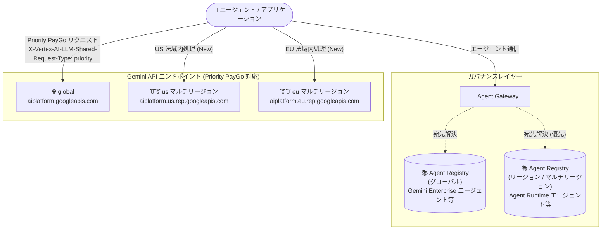

# Gemini Enterprise Agent Platform: Priority PayGo の US/EU マルチリージョンエンドポイント対応と Agent Gateway の複数 Agent Registry サポート

**リリース日**: 2026-09-09

**サービス**: Gemini Enterprise Agent Platform

**機能**: Priority PayGo マルチリージョンエンドポイント対応 / Agent Gateway 複数 Agent Registry インスタンス対応

**ステータス**: Feature (提供中)

📊 [このアップデートのインフォグラフィックを見る](https://takech9203.github.io/google-cloud-news-summary/20260909-gemini-agent-platform-paygo-multiregion-gateway-registries.html)

## 概要

2026 年 9 月 9 日、Gemini Enterprise Agent Platform に 2 つの関連するアップデートが発表されました。いずれも、エンタープライズにおけるエージェントワークロードの「リージョン戦略」を強化するものです。

1 つ目は **Priority PayGo の US/EU マルチリージョンエンドポイント対応** です。Priority PayGo は、Provisioned Throughput のような事前コミットメントなしに、Standard PayGo よりも一貫したパフォーマンスを提供する従量課金の消費オプションです。従来はグローバルエンドポイントのみのサポートでしたが、今回のアップデートにより `us` および `eu` のマルチリージョンエンドポイントにも Priority PayGo リクエストを送信できるようになりました。マルチリージョンエンドポイントは、機械学習処理を米国または EU といった特定の法域内に留めることができるため、データ処理の所在地要件を持つワークロードでも Priority PayGo の安定した性能を利用できます。

2 つ目は **Agent Gateway の複数 Agent Registry インスタンス対応** です。Agent Gateway は、エージェント・ツール・MCP サーバー間の通信をガバナンスするためのゲートウェイであり、宛先の解決やアクセス制御に Agent Registry を利用します。今回のアップデートにより、1 つの Agent Gateway インスタンスに最大 2 つの Agent Registry インスタンス (グローバルレジストリ 1 つ + リージョンまたはマルチリージョンレジストリ 1 つ) を関連付けられるようになりました。これにより、リージョンリソースである Agent Runtime のエージェントと、グローバル/マルチリージョンリソースである Gemini Enterprise のエージェントを、単一のゲートウェイで統合的にガバナンスできます。

なお、同日には Agent Gateway の VPC Service Controls 対応も発表されています。こちらは別レポート「[Agent Gateway の VPC Service Controls サポート](./2026-09-09-gemini-agent-platform-agent-gateway-vpc-service-controls.md)」を参照してください。

**アップデート前の課題**

- Priority PayGo はグローバルエンドポイントでのみ利用可能であり、米国や EU といった法域内での機械学習処理を必要とするワークロードでは Priority PayGo を選択できなかった
- Agent Gateway に関連付けられる Agent Registry は 1 インスタンスのみで、リージョンレジストリに登録される Agent Runtime エージェントと、グローバル/マルチリージョンレジストリに登録される Gemini Enterprise エージェントを単一のゲートウェイで扱うことが難しかった

**アップデート後の改善**

- Priority PayGo リクエストをグローバルエンドポイントに加えて `us` / `eu` マルチリージョンエンドポイント (`aiplatform.us.rep.googleapis.com` / `aiplatform.eu.rep.googleapis.com`) に送信できるようになり、法域内処理の要件と一貫した性能を両立できるようになった
- 1 つの Agent Gateway にグローバルレジストリ 1 つとリージョン/マルチリージョンレジストリ 1 つの計 2 つの Agent Registry を関連付けられるようになり、異なるロケーション特性を持つエージェント群を単一のゲートウェイで統合ガバナンスできるようになった

## アーキテクチャ図



1 つの Agent Gateway が最大 2 つの Agent Registry (グローバル + リージョン/マルチリージョン) を参照して宛先を解決し (URL が競合する場合はリージョン/マルチリージョンのエントリが優先)、Priority PayGo リクエストは従来のグローバルエンドポイントに加えて `us` / `eu` マルチリージョンエンドポイントにも送信できるようになりました。

## サービスアップデートの詳細

### 主要機能

1. **Priority PayGo の US/EU マルチリージョンエンドポイント対応**
   - Priority PayGo リクエストを `global` に加えて `us` および `eu` のマルチリージョンエンドポイントに送信可能
   - マルチリージョンエンドポイントは、サービスによる顧客データの機械学習処理を米国または EU という法域境界内に留めることを保証する
   - REST の場合はホスト名を `aiplatform.us.rep.googleapis.com` または `aiplatform.eu.rep.googleapis.com` に、ロケーションを `us` / `eu` に置き換える
   - `us-central1` などのシングルリージョンエンドポイントは Priority PayGo では引き続き非サポート

2. **Priority PayGo の 2 つの利用モード (従来どおり)**
   - Provisioned Throughput のクォータを優先消費し、超過分を Priority PayGo にスピルオーバーするモード: `X-Vertex-AI-LLM-Shared-Request-Type: priority` ヘッダーを付与
   - Priority PayGo のみを使用するモード: `X-Vertex-AI-LLM-Request-Type: shared` と `X-Vertex-AI-LLM-Shared-Request-Type: priority` の両ヘッダーを付与
   - レスポンスの `usageMetadata.trafficType` に `ON_DEMAND_PRIORITY` が返り、Priority PayGo で処理されたことを確認できる

3. **Agent Gateway の複数 Agent Registry インスタンス対応**
   - 1 つの Agent Gateway インスタンスに最大 2 つの Agent Registry (グローバルレジストリ 1 つ + リージョンまたはマルチリージョンレジストリ 1 つ) を関連付け可能
   - Agent Runtime のエージェントはリージョンリソースであり、通常はデプロイリージョンに一致するリージョンレジストリに登録する
   - Gemini Enterprise のエージェントはグローバルまたはマルチリージョンリソースであり、グローバル/マルチリージョンレジストリ (`global`、`us`、`eu` など) に登録する
   - 宛先 URL をレジストリエントリに解決する際、リージョン/マルチリージョンのエントリがグローバルのエントリより優先される (同一のインターフェース URL を持つエントリが複数レジストリに存在する場合の競合解決)

## 技術仕様

### Priority PayGo のエンドポイント

| 項目 | 詳細 |
|------|------|
| global エンドポイント | `https://aiplatform.googleapis.com` (`locations/global`) |
| US マルチリージョンエンドポイント | `https://aiplatform.us.rep.googleapis.com` (`locations/us`) — 今回追加 |
| EU マルチリージョンエンドポイント | `https://aiplatform.eu.rep.googleapis.com` (`locations/eu`) — 今回追加 |
| シングルリージョンエンドポイント | 非サポート (例: `us-central1`) |
| トラフィック種別の確認 | レスポンスの `usageMetadata.trafficType` が `ON_DEMAND_PRIORITY` |

Priority PayGo がサポートするモデルには gemini-3.8-flash、gemini-3.7-flash、gemini-3.6-flash、gemini-3.5-flash、gemini-3.5-flash-lite、gemini-3.1-flash-lite、gemini-3.1-pro-preview、gemini-3-flash-preview、gemini-2.5-pro、gemini-2.5-flash、gemini-2.5-flash-lite が含まれます (最新のリストは[公式ドキュメント](https://docs.cloud.google.com/gemini-enterprise-agent-platform/models/priority-paygo)を参照)。

**注意**: マルチリージョンエンドポイントは Private Google Access をサポートしていません。プライベート接続が必要な場合は、[リージョン Google API 用の Private Service Connect エンドポイント](https://docs.cloud.google.com/vpc/docs/access-regional-google-apis-endpoints)を構成する必要があります。

### Agent Gateway と Agent Registry の関連付け

| 項目 | 詳細 |
|------|------|
| 関連付け可能なレジストリ数 | 最大 2 (グローバル 1 + リージョンまたはマルチリージョン 1) |
| Agent Runtime エージェント | リージョンリソース。デプロイリージョンに一致するリージョンレジストリに登録 |
| Gemini Enterprise エージェント | グローバル/マルチリージョンリソース。`global`、`us`、`eu` などのレジストリに登録 |
| 宛先解決の優先順位 | リージョン/マルチリージョンのエントリ > グローバルのエントリ |
| クロスプロジェクトエージェント | Agent Gateway がデプロイされた中央ガバナンスプロジェクトのレジストリに登録が必要 |
| 宛先アクセスの権限 | エージェント ID に `iap.resources.egressViaIAP` 権限を付与する IAM ポリシーが必須 |

## 設定方法

### Priority PayGo をマルチリージョンエンドポイントで使用する

REST の場合、ホスト名とロケーションをマルチリージョンに置き換え、Priority PayGo のヘッダーを付与します。

```bash
GOOGLE_CLOUD_PROJECT="PROJECT_ID"
GOOGLE_CLOUD_LOCATION="us"   # または "eu"
MODEL_ID="gemini-3.5-flash"
API_ENDPOINT="https://aiplatform.${GOOGLE_CLOUD_LOCATION}.rep.googleapis.com"

curl -X POST \
  -H "Authorization: Bearer $(gcloud auth print-access-token)" \
  -H "Content-Type: application/json; charset=utf-8" \
  -H "X-Vertex-AI-LLM-Shared-Request-Type: priority" \
  "${API_ENDPOINT}/v1/projects/${GOOGLE_CLOUD_PROJECT}/locations/${GOOGLE_CLOUD_LOCATION}/publishers/google/models/${MODEL_ID}:generateContent" \
  -d '{
    "contents": {
      "role": "user",
      "parts": { "text": "PROMPT_TEXT" }
    }
  }'
```

Python (Google Gen AI SDK) の場合は、クライアント初期化時に `location` を `us` または `eu` に設定し、`http_options` で Priority PayGo ヘッダーを指定します。

```python
from google import genai
from google.genai.types import HttpOptions

client = genai.Client(
    vertexai=True,
    project="your_project_id",
    location="us",  # または "eu"
    http_options=HttpOptions(
        api_version="v1",
        headers={"X-Vertex-AI-LLM-Shared-Request-Type": "priority"},
    ),
)
```

Priority PayGo のみを使用する (Provisioned Throughput を消費しない) 場合は、`X-Vertex-AI-LLM-Request-Type: shared` ヘッダーを追加します。

### Agent Gateway に 2 つの Agent Registry を関連付ける際のポイント

1. 使用する Agent Registry インスタンスを特定する。Agent Gateway には最大 2 つ (グローバル 1 + リージョン/マルチリージョン 1) を関連付けられる
2. エージェント、エンドポイント、MCP サーバーが登録されているレジストリを Agent Gateway に関連付ける
3. エージェントを Agent Registry に登録する ([Register agents](https://docs.cloud.google.com/agent-registry/register-agents) 参照)
4. エージェントが呼び出すツール・MCP サーバー・API エンドポイントの登録が推奨される。登録することでリソース単位のきめ細かなポリシーとツールレベルの制御を適用できる
5. レジストリ全体に対する IAM バインディング (`iap.resources.egressViaIAP`) を使用する場合は、Agent Gateway に構成したレジストリインスタンスとバインディングの対象レジストリが一致していることを確認する

## メリット

### ビジネス面

- **データ処理所在地要件への対応**: 米国または EU 内での機械学習処理が求められる規制業種 (金融、公共、ヘルスケアなど) でも、事前コミットメント不要で一貫した性能を得られる Priority PayGo を採用できる
- **ガバナンスの一元化**: Gemini Enterprise のエージェントと Agent Runtime のエージェントという異なるロケーション特性を持つ資産を単一の Agent Gateway で統制でき、ガバナンス構成の重複を削減できる

### 技術面

- **柔軟な消費オプション選択**: Provisioned Throughput のスピルオーバー先として、または単独の消費オプションとして、マルチリージョンエンドポイントでも Priority PayGo を利用できる
- **宛先解決の一貫性**: 同一 URL のエントリが複数レジストリに存在する場合、リージョン/マルチリージョンのエントリが優先されるという明確な競合解決ルールが定義されている

## デメリット・制約事項

### 制限事項

- Priority PayGo は `us-central1` などのシングルリージョンエンドポイントを引き続きサポートしない
- マルチリージョンエンドポイントは Private Google Access をサポートしない (プライベート接続にはリージョン Google API 用の Private Service Connect エンドポイントの構成が必要)
- Agent Gateway に関連付けられるレジストリは最大 2 つで、構成は「グローバル 1 + リージョンまたはマルチリージョン 1」に限られる
- クロスプロジェクトのエージェントは、Agent Gateway がデプロイされた中央ガバナンスプロジェクトのレジストリに登録する必要がある

### 考慮すべき点

- Priority PayGo は Standard PayGo よりも高いトークン単価で課金されるため、ワークロードの重要度と性能要件に応じた使い分けが必要
- Agent Gateway はホスト名を完全一致で照合するため、エージェントが実際に呼び出すホスト名のバリエーション (リージョン付きホスト名や mTLS ホスト名など) をレジストリに登録しておく必要がある

## ユースケース

### ユースケース 1: EU データ処理要件を持つ顧客向けバーチャルアシスタント

**シナリオ**: EU の顧客向けに提供するバーチャルアシスタントで、機械学習処理を EU 法域内に留める必要がある。トラフィックは変動が大きく、Provisioned Throughput の事前コミットメントは避けたい。

**実装例**: `aiplatform.eu.rep.googleapis.com` (`locations/eu`) に対して `X-Vertex-AI-LLM-Shared-Request-Type: priority` ヘッダー付きでリクエストを送信する。

**効果**: EU 法域内での処理を維持しながら、Standard PayGo より一貫したパフォーマンスをコミットメントなしで確保できる。

### ユースケース 2: Gemini Enterprise と Agent Runtime の混在環境の統合ガバナンス

**シナリオ**: Gemini Enterprise 上のエージェント (グローバル/マルチリージョン) と、Agent Runtime にデプロイしたカスタムエージェント (リージョン) が混在しており、単一の Agent Gateway で通信を統制したい。

**効果**: グローバルレジストリとリージョン/マルチリージョンレジストリの 2 つを 1 つの Agent Gateway に関連付けることで、両方のエージェント群の宛先解決とアクセス制御を単一のゲートウェイで実現できる。

## 料金

Priority PayGo はトークン使用量ベースの従量課金で、Standard PayGo よりも高い単価が適用されます。具体的な料金は [Gemini Enterprise Agent Platform の料金ページ](https://cloud.google.com/gemini-enterprise-agent-platform/generative-ai/pricing)を参照してください。

## 利用可能リージョン

- **Priority PayGo**: `global` エンドポイントおよび `us` / `eu` マルチリージョンエンドポイントでサポート。シングルリージョンエンドポイントは非サポート
- **Agent Registry**: グローバル、マルチリージョン (`us`、`eu` など)、リージョンの各インスタンスが存在し、Agent Gateway にはグローバル 1 つ + リージョンまたはマルチリージョン 1 つを関連付け可能

## 関連サービス・機能

- **Provisioned Throughput**: 事前購入型のスループット保証オプション。Priority PayGo はそのクォータ超過分のスピルオーバー先としても利用できる
- **Agent Registry**: エージェント・MCP サーバー・エンドポイントを登録する管理リポジトリ。Agent Gateway の宛先解決とポリシー適用の基盤
- **Identity-Aware Proxy (IAP) / IAM**: Agent Gateway の宛先アクセス制御は `iap.resources.egressViaIAP` 権限を付与する IAM ポリシーで行う
- **VPC Service Controls**: 同日発表された Agent Gateway の VPC-SC 対応 ([別レポート](./2026-09-09-gemini-agent-platform-agent-gateway-vpc-service-controls.md)参照) と組み合わせることで、境界防御を強化できる
- **Private Service Connect**: マルチリージョンエンドポイントへのプライベート接続に必要

## 参考リンク

- 📊 [インフォグラフィック](https://takech9203.github.io/google-cloud-news-summary/20260909-gemini-agent-platform-paygo-multiregion-gateway-registries.html)
- [公式リリースノート (2026 年 9 月 9 日)](https://docs.cloud.google.com/release-notes#September_09_2026)
- [Priority PayGo ドキュメント](https://docs.cloud.google.com/gemini-enterprise-agent-platform/models/priority-paygo)
- [マルチリージョンエンドポイント (Locations)](https://docs.cloud.google.com/gemini-enterprise-agent-platform/resources/locations#multi-region_endpoints)
- [Agent Gateway のセットアップ (Agent Registry の登録)](https://docs.cloud.google.com/gemini-enterprise-agent-platform/govern/gateways/set-up-agent-gateway#agent-registry)
- [エージェントの登録 (Agent Registry)](https://docs.cloud.google.com/agent-registry/register-agents)
- [料金ページ](https://cloud.google.com/gemini-enterprise-agent-platform/generative-ai/pricing)

## まとめ

今回の 2 つのアップデートにより、Priority PayGo は US/EU の法域内処理要件を持つワークロードでも利用可能になり、Agent Gateway はグローバルとリージョン/マルチリージョンの 2 つの Agent Registry を束ねた統合ガバナンスを実現できるようになりました。データ所在地要件を持つ組織で Gemini モデルやエージェント基盤を運用している場合は、マルチリージョンエンドポイントへの Priority PayGo リクエストの切り替えと、Agent Gateway のレジストリ構成の見直しを検討することを推奨します。

---

**タグ**: #GeminiEnterpriseAgentPlatform #PriorityPayGo #AgentGateway #AgentRegistry #マルチリージョン #データレジデンシー #AIエージェント
