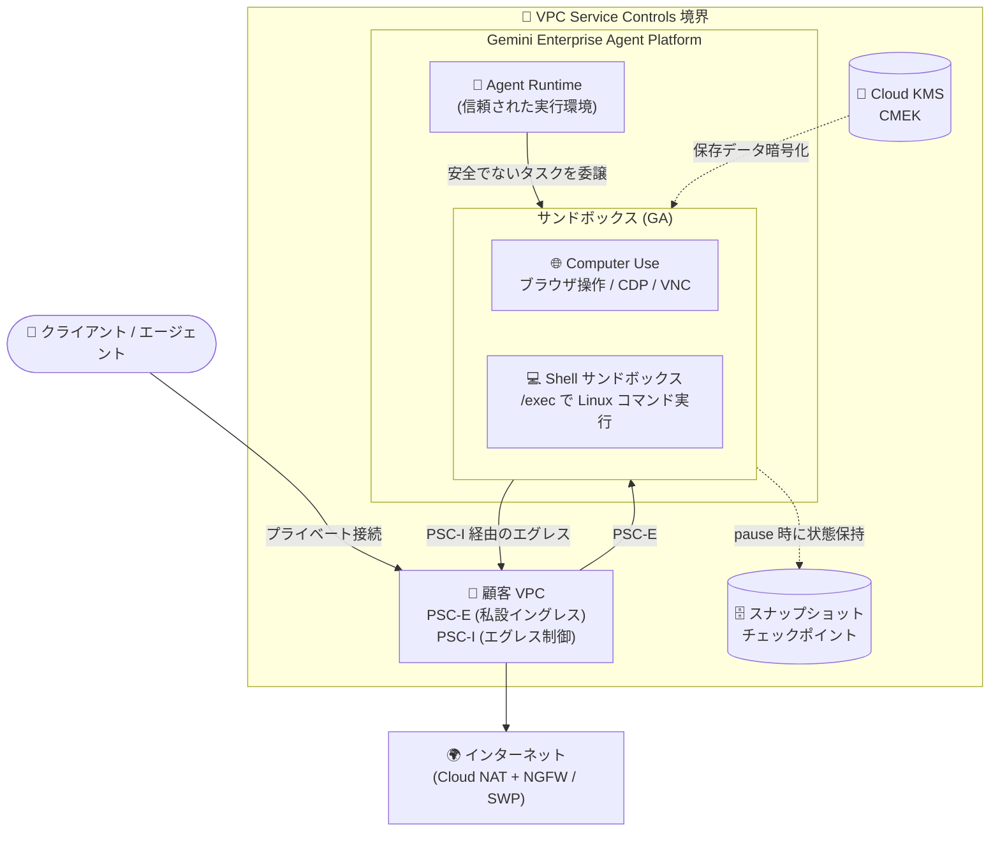

# Gemini Enterprise Agent Platform: Computer Use / Shell サンドボックスが GA

**リリース日**: 2026-09-09

**サービス**: Gemini Enterprise Agent Platform

**機能**: Computer Use サンドボックスと Shell サンドボックスの一般提供 (GA)、およびサンドボックスのエンタープライズ機能強化

**ステータス**: GA (一般提供)

📊 [このアップデートのインフォグラフィックを見る](https://takech9203.github.io/google-cloud-news-summary/20260909-gemini-agent-platform-sandboxes-ga.html)

## 概要

Gemini Enterprise Agent Platform の **Computer Use サンドボックス** と **Shell サンドボックス** が一般提供 (GA) になりました。サンドボックスは、エージェントが信頼できないコードの実行や外部環境との対話といったリスクを伴うタスクを安全に実行するための、隔離されたマネージドコンピューティング環境です。エージェントランタイム (信頼された実行環境) から分離されているため、悪意のある、あるいは誤ったエージェントの操作からインフラストラクチャとデータを保護できます。

Computer Use サンドボックスは、エージェントがクリック、サイト遷移、スクリーンショット取得といった人間の操作を模倣した Web ブラウザ自動化を安全に実行できるコンテナ化されたブラウザ環境を提供します。Shell サンドボックスは、隔離された Linux コンテナ内で信頼できないシェルコマンドの実行、パッケージのインストール、ファイル操作を API の `/exec` 呼び出しで直接行える環境です。

今回のリリースでは GA 化に加えて、**VPC Service Controls / Private Service Connect (PSC-E / PSC-I) 対応**、**顧客管理暗号鍵 (CMEK) 対応**、**サンドボックスの一時停止・再開** といったエンタープライズ向け機能も追加されており、規制の厳しい環境でもエージェントのサンドボックス実行を採用しやすくなりました。

**アップデート前の課題**

- Computer Use サンドボックスと Shell サンドボックスは一般提供ではなく、本番ワークロードでの採用判断が難しかった
- サンドボックスのデータプレーンへのアクセスや外部通信をプライベートネットワーク境界内に閉じ込める手段が提供されていなかった
- サンドボックスの保存データ (ディスク、スナップショットチェックポイント) を顧客管理の暗号鍵で保護できなかった
- アイドル状態のサンドボックスでもコンピュートリソースを保持し続ける必要があり、状態を保持したままリソースを解放する手段がなかった

**アップデート後の改善**

- Computer Use サンドボックスと Shell サンドボックスが GA となり、本番環境で利用可能になった
- VPC Service Controls と Private Service Connect により、プライベートイングレス (PSC-E) とプライベートエグレス (PSC-I) でネットワーク境界を分離し、データ漏洩リスクを軽減できるようになった
- Cloud KMS の鍵を使った CMEK により、ディスクストレージとスナップショットチェックポイントを含む保存データを保護できるようになった
- 一時停止・再開機能により、アイドル状態のサンドボックスのコンピュートリソースを解放しつつ、ファイルシステム状態と接続 ID (PSC エンドポイントを含む) を保持し、数秒で再開できるようになった (一時停止中のコストは実行中より大幅に低い)

## アーキテクチャ図



エージェントランタイムは信頼できないタスクを隔離されたサンドボックス (Computer Use / Shell) に委譲します。サンドボックスへの接続は PSC-E による私設イングレス、外部通信は PSC-I 経由で顧客 VPC にブリッジされ、保存データは CMEK で暗号化されます。

## サービスアップデートの詳細

### 主要機能

1. **Computer Use サンドボックス (GA)**
   - エージェントが操作できる安全で隔離されたブラウザ環境を提供。URL 遷移、座標クリック、テキスト入力、スクリーンショット取得などを API リクエストで実行可能
   - Chrome DevTools Protocol (CDP) の WebSocket 接続に対応し、Playwright などの標準的なブラウザ自動化ツールをそのまま利用可能
   - ライブストリーミングビュー (VNC) により、エージェントの操作をリアルタイムで視覚的にモニタリング・デバッグ可能 (noVNC による WebSocket 接続など)
   - タブ管理 API (`POST /tabs`、`GET /tabs`、`POST /tabs/{tab_id}/activate`、`DELETE /tabs/{tab_id}`) や CDP コマンド実行 (`POST /cdp`、`POST /cdps`) を提供

2. **Shell サンドボックス (新機能・GA)**
   - Agent Platform インスタンスにアタッチされるマネージドな隔離 Linux コンテナ。API の `/exec` 呼び出しでシェルコマンドを実行し、stdout / stderr / 終了コードを返す
   - 信頼できないシェルコマンドの実行、パッケージのインストール、ファイル操作、CLI ツールの操作を自社インフラに影響を与えずに実行可能
   - サンドボックスは通常約 20 秒で `STATE_RUNNING` に到達。削除するとコンテナは破棄される
   - 注意: `send_command()` と `execute_code()` は Code Execution サンドボックス向けのため Shell サンドボックスでは動作せず、`/exec` を使用する

3. **VPC Service Controls & Private Service Connect 対応**
   - PSC-E (私設イングレス): サンドボックスのデータプレーンへの接続を、公共インターネットではなく VPC 内の PSC エンドポイント経由の私設接続にできる
   - PSC-I (エグレス制御): ネットワークアタッチメント経由でサンドボックスの外部通信を顧客 VPC にブリッジし、Cloud NAT + Cloud NGFW (FQDN ルール対応) や Secure Web Proxy で宛先を統制可能
   - VPC Service Controls 境界内で、セッション中のディスク/メモリ上のデータ、スナップショット、データプレーンのリクエスト/レスポンス、Artifact Registry からのカスタムコンテナイメージ取得、Google API 呼び出しを保護

4. **顧客管理暗号鍵 (CMEK) 対応**
   - Cloud KMS で管理する鍵を使用して、ディスクストレージとスナップショットチェックポイントを含むサンドボックスの保存データを暗号化可能

5. **サンドボックスの一時停止・再開**
   - 一時停止 (`pause`) でコンピュートリソースを解放しつつ、サンドボックス ID、接続メタデータ、PSC エンドポイント、コンテナ内ファイルシステム状態を保持 (`STATE_PAUSED` に遷移)
   - 再開 (`resume`) は数秒で完了し、同じ接続エンドポイントで利用を継続可能。一時停止中のコストは実行中より大幅に低い

## 技術仕様

### Shell サンドボックスの基本仕様

| 項目 | 詳細 |
|------|------|
| 実行環境 | 隔離された Linux コンテナ (マネージド) |
| 実行方法 | API の `/exec` 呼び出し (stdout / stderr / 終了コードを返却) |
| 起動時間 | 通常約 20 秒で `STATE_RUNNING` |
| 必要なロール | Agent Platform User (`roles/aiplatform.user`) |
| SDK | `pip install "google-cloud-aiplatform[agent_engines]"` |
| ライフサイクル | `config.ttl` による自動削除、pause / resume / delete に対応 |
| 作成時の指定 | `spec` (例: `shell_environment`)、`config.sandbox_environment_template`、`config.sandbox_environment_snapshot` のいずれか |

### VPC Service Controls / PSC の制限事項

| 項目 | 詳細 |
|------|------|
| 私設イングレス (PSC-E) | 有効化できるコンシューマープロジェクトは 1 つのみで、サンドボックスを実行するユーザープロジェクトと同一である必要がある |
| DNS 解決 | DNS ピアリングによる私設解決のみサポート (トンネリング防止のため公開 DNS フォワーディングは無効) |
| ロギング | VPC Service Controls で保護されたリソースではリクエスト/レスポンスロギングは利用不可 |
| 境界外アクセス | アクセスレベルに含まれない限り、境界外からのプログラム / コンソールアクセスは拒否 |
| PSC-I サブネット | PSC インターフェース用に専用サブネット (最小 /28) とネットワークアタッチメントが必要 |

## 設定方法

### 前提条件

1. Google Cloud プロジェクトで Agent Platform API (`aiplatform.googleapis.com`) を有効化する
2. Agent Platform User (`roles/aiplatform.user`) ロールを持つ
3. SDK をインストールし、認証を設定する

```bash
pip install "google-cloud-aiplatform[agent_engines]"
gcloud auth application-default login
```

### 手順 (Shell サンドボックスの例)

#### ステップ 1: Agent Platform インスタンスを作成

```python
import vertexai

client = vertexai.Client(project='PROJECT_ID', location='LOCATION')
agent_engine = client.agent_engines.create()
agent_engine_name = agent_engine.api_resource.name
```

Shell サンドボックスの利用にエージェントのデプロイは不要で、インスタンス作成は数秒で完了します。

#### ステップ 2: Shell サンドボックスを作成

```python
engine = (
    "projects/PROJECT_ID/locations/LOCATION"
    "/reasoningEngines/INSTANCE_ID"
)
operation = client.agent_engines.sandboxes.create(
    name=engine,
    spec={"shell_environment": {}},
    config={
        "display_name": "my-shell-sandbox",
        "wait_for_completion": True,
        "ttl": "3600s",
    },
)
sandbox = operation.response
print(sandbox.name, sandbox.state)  # SandboxState.STATE_RUNNING
```

#### ステップ 3: 一時停止と再開 (必要に応じて)

```python
sandbox_name = 'projects/PROJECT_ID/locations/LOCATION/reasoningEngines/INSTANCE_ID/sandboxEnvironments/SANDBOX_ID'

# 一時停止 (STATE_PAUSED へ遷移。データプレーンへのリクエストはエラーになる)
pause_operation = client.agent_engines.sandboxes.pause(
    name=sandbox_name,
    config={"wait_for_completion": True},
)

# 再開 (同じ ID・接続エンドポイント・ファイルシステム状態で復帰)
resume_operation = client.agent_engines.sandboxes.resume(
    name=sandbox_name,
    config={"wait_for_completion": True},
)
```

`STATE_PAUSED` のサンドボックスのみ再開でき、実行中のサンドボックスに resume を実行すると `FAILED_PRECONDITION` が返ります。

#### ステップ 4: 不要になったら削除

```python
client.agent_engines.sandboxes.delete(name=sandbox_name)
```

サンドボックスは存在する間課金されるため、`config.ttl` の設定により、プロセスが delete を呼び出す前にクラッシュした場合でも自動削除されるようにできます。

## メリット

### ビジネス面

- **本番採用の障壁が低下**: GA 化により、SLA を前提とした本番エージェントワークロードで Computer Use / Shell サンドボックスを採用しやすくなった
- **コンプライアンス要件への対応**: VPC Service Controls、PSC、CMEK により、データ漏洩防止や暗号鍵管理の要件が厳しい規制業界でもエージェントのサンドボックス実行を導入可能
- **コスト最適化**: 一時停止機能により、アイドル状態のサンドボックスのコストを大幅に削減しつつ、セッション状態を保持できる

### 技術面

- **強力な分離境界**: セキュアなコンテナサンドボックスにより、悪意のあるコードがランタイム内の機密データや認証情報にアクセスすることを防止。暴走したコマンドや無限ループの影響もサンドボックス内に封じ込め
- **標準ツールとの互換性**: Computer Use サンドボックスは CDP 接続に対応しており、Playwright などの既存のブラウザ自動化資産を再利用可能
- **きめ細かなエグレス統制**: PSC-I + Cloud NGFW (FQDN オブジェクト対応) または Secure Web Proxy により、サンドボックスが到達できる宛先をネットワーク層 / アプリケーション層で制御可能
- **高速な状態復帰**: 一時停止したサンドボックスは、ファイルシステム状態と PSC エンドポイントを含む接続 ID を保持したまま数秒で再開可能

## デメリット・制約事項

### 制限事項

- Shell サンドボックスでは `send_command()` と `execute_code()` は使用できない (Code Execution サンドボックス向けのメソッドのため)。`/exec` を使用する
- PSC-E の私設イングレスは、サンドボックスを実行するユーザープロジェクトと同一の 1 プロジェクトに対してのみ有効化可能
- VPC Service Controls で保護されたリソースではリクエスト/レスポンスロギングが利用できない
- DNS はピアリングによる私設解決のみサポート (公開 DNS フォワーディングは無効)
- 既存サンドボックスの構成変更は不可。変更するには削除して再作成する必要がある

### 考慮すべき点

- サンドボックスは存在する間課金されるため、`ttl` の設定や不要時の削除・一時停止の運用設計が必要
- VPC Service Controls で保護する場合、サンドボックス作成前にプロジェクトを境界に含めておく必要がある。依存サービス (Cloud Storage、カスタムコンテナ利用時の Artifact Registry) も同じ境界に含める
- インターネットエグレスを許可する場合は Cloud NAT が必要で、宛先制御には Cloud NGFW または Secure Web Proxy の追加設定が必要

## ユースケース

### ユースケース 1: エージェントによる Web ブラウザ自動化

**シナリオ**: エージェントが外部の Web サイトでフォーム入力、検索、複雑な UI ワークフローの操作を代行する。操作の様子を VNC でモニタリングしながらデバッグしたい。

**実装例**:
```python
# Python SDK で CDP 用の WebSocket URL とヘッダーを生成
ws_url, ws_headers = client.agent_engines.sandboxes.generate_browser_ws_headers(
    sandbox_environment=sandbox,
    service_account_email="SERVICE_ACCOUNT_EMAIL",
)

# Playwright で CDP 接続
browser = await p.chromium.connect_over_cdp(
    endpoint_url=ws_url, headers=ws_headers
)
```

**効果**: 隔離されたブラウザ環境で人間の操作を模倣したタスクを安全に自動化でき、Playwright などの既存資産をそのまま活用できる。

### ユースケース 2: 生成コマンドの安全な実行環境

**シナリオ**: LLM が生成したシェルコマンドやスクリプトを実行してデータ加工や CLI ツール操作を行いたいが、自社インフラ上で信頼できないコマンドを実行するリスクは避けたい。

**効果**: Shell サンドボックスの `/exec` で隔離 Linux コンテナ内にコマンド実行を閉じ込め、stdout / stderr / 終了コードのみを受け取ることで、自社環境を汚染せずにエージェントの自律的なコマンド実行を実現できる。

### ユースケース 3: 規制業界でのセキュアなエージェント基盤

**シナリオ**: 金融機関などで、エージェントのサンドボックス通信をすべてプライベートネットワークに閉じ、保存データを自社管理の鍵で暗号化する必要がある。

**効果**: PSC-E / PSC-I と VPC Service Controls でネットワーク境界を分離し、CMEK で保存データを保護することで、データ漏洩防止と鍵管理のコンプライアンス要件を満たしながらサンドボックスを利用できる。

## 料金

サンドボックスは存在する間課金され、一時停止中のサンドボックスは実行中よりコストが大幅に低くなります。具体的な料金は公式の料金ページを参照してください。

- [Agent Platform の料金](https://cloud.google.com/products/gemini-enterprise-agent-platform/pricing)

## 利用可能リージョン

サンドボックス (Code Execution、Shell、Computer Use、カスタムコンテナ) は Agent Platform のサポートリージョンで利用できます。us-central1、us-east1、us-east4、us-west1、europe-west1〜4/6/8、europe-southwest1、asia-northeast1 (東京)、asia-northeast3 (ソウル)、asia-southeast1 (シンガポール) などが含まれます。GA 機能は v1 API、Preview 機能は v1beta1 API でサポートされます。

詳細は [サポートされているリージョン](https://docs.cloud.google.com/gemini-enterprise-agent-platform/resources/agent-locations) を参照してください。

## 関連サービス・機能

- **VPC Service Controls**: サービス境界を定義してデータ漏洩リスクを軽減。サンドボックスの制御プレーン (`aiplatform.googleapis.com`) を制限付きサービスに追加して保護する
- **Private Service Connect**: PSC-E (私設イングレスエンドポイント) と PSC-I (PSC インターフェースによるエグレス) でサンドボックスのネットワーク経路を私設化する
- **Cloud KMS**: CMEK によるサンドボックス保存データ (ディスク、スナップショットチェックポイント) の暗号化に使用
- **Cloud NAT / Cloud NGFW / Secure Web Proxy**: サンドボックスのインターネットエグレスの実現と宛先統制に使用
- **Cloud DNS**: DNS ピアリングによるサンドボックスの私設名前解決に使用
- **Artifact Registry**: カスタムコンテナ (BYOC) サンドボックスのイメージ取得元。VPC Service Controls 境界内で保護可能
- **Code Execution サンドボックス**: Python コードの生成・実行向けのサンドボックス。Shell サンドボックスとは実行方法 (`execute_code()` / `send_command()` と `/exec`) が異なる

## 参考リンク

- 📊 [インフォグラフィック](https://takech9203.github.io/google-cloud-news-summary/20260909-gemini-agent-platform-sandboxes-ga.html)
- [公式リリースノート](https://docs.cloud.google.com/release-notes#September_09_2026)
- [サンドボックスの概要](https://docs.cloud.google.com/gemini-enterprise-agent-platform/scale/sandbox)
- [Computer Use サンドボックス](https://docs.cloud.google.com/gemini-enterprise-agent-platform/scale/sandbox/computer-use)
- [Shell サンドボックス クイックスタート](https://docs.cloud.google.com/gemini-enterprise-agent-platform/scale/sandbox/shell-sandbox-quickstart)
- [VPC Service Controls と Private Service Connect の構成](https://docs.cloud.google.com/gemini-enterprise-agent-platform/scale/sandbox/configure-vpc-sc)
- [CMEK の構成](https://docs.cloud.google.com/gemini-enterprise-agent-platform/scale/sandbox/configure-cmek)
- [サンドボックスの管理 (一時停止・再開)](https://docs.cloud.google.com/gemini-enterprise-agent-platform/scale/sandbox/manage-sandboxes#pause-a-sandbox)
- [料金ページ](https://cloud.google.com/products/gemini-enterprise-agent-platform/pricing)

## まとめ

Computer Use / Shell サンドボックスの GA 化により、エージェントによるブラウザ自動化や信頼できないコマンド実行を本番環境で安全に運用する基盤が整いました。VPC Service Controls、PSC、CMEK、一時停止・再開といったエンタープライズ機能が同時に提供されたことで、規制業界を含む幅広い組織で採用可能です。エージェントに自律的なコード実行やブラウザ操作をさせる予定がある場合は、まず Shell サンドボックスのクイックスタートで動作を確認し、ネットワーク・暗号化要件に応じて VPC-SC / CMEK 構成を検討することを推奨します。

---

**タグ**: #GeminiEnterpriseAgentPlatform #Sandbox #ComputerUse #ShellSandbox #GA #VPCServiceControls #PrivateServiceConnect #CMEK #AIAgent #Security
