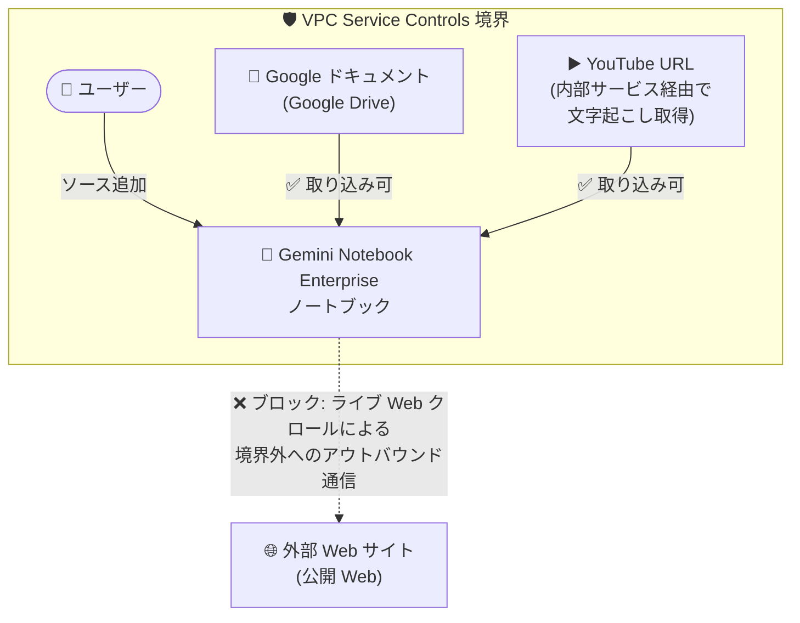

# Gemini Enterprise: Gemini Notebook Enterprise の Web サイト URL 取り込みが VPC Service Controls によりブロック

**リリース日**: 2026-09-09

**サービス**: Gemini Enterprise (Gemini Notebook Enterprise)

**機能**: VPC Service Controls 有効プロジェクトにおける Web サイト URL ソース取り込みのブロック

**ステータス**: Breaking Change (破壊的変更)

📊 [このアップデートのインフォグラフィックを見る](https://takech9203.github.io/google-cloud-news-summary/20260909-gemini-enterprise-notebook-vpc-sc-url-ingestion.html)

## 概要

Google Cloud は 2026 年 9 月 9 日、Gemini Notebook Enterprise に関する破壊的変更 (Breaking Change) を発表しました。VPC Service Controls (VPC-SC) が有効なプロジェクトでは、Web サイトの URL をノートブックのソースとして追加できなくなります。

Web サイト URL の直接取り込みは、公開 Web のライブクロールを実行するため、Google のネットワーク外へのアウトバウンドトラフィックが発生します。これは VPC Service Controls のサービス境界 (perimeter) ポリシーに違反するため、VPC-SC で保護されたプロジェクトではこの機能がブロックされます。データ漏洩 (data exfiltration) 防止という VPC-SC 本来の目的に沿った仕様変更であり、セキュリティとコンプライアンスを維持するための措置です。

なお、Google ドキュメントや YouTube URL など、その他のソースタイプは VPC Service Controls が有効なプロジェクトでも引き続きサポートされます。公式 FAQ によると、YouTube のリンクがサポートされ続けるのは、YouTube の文字起こし (トランスクリプト) が公開 Web のライブクロールではなく内部サービス経由で取得されるためです。

**アップデート前の課題**

- VPC Service Controls で保護されたプロジェクトでも、Web サイト URL をノートブックのソースとして追加でき、その際のライブ Web クロールにより Google ネットワーク外へのアウトバウンドトラフィックが発生していた
- この挙動は、アウトバウンドトラフィックを遮断してデータ漏洩を防ぐという VPC Service Controls の境界ポリシーと矛盾する可能性があった

**アップデート後の改善**

- VPC Service Controls が有効なプロジェクトでは、Web サイト URL のソース追加が無効化され、境界外への意図しないアウトバウンドトラフィックの発生が防止される
- VPC-SC の境界ポリシーと Gemini Notebook Enterprise の動作が整合し、セキュリティ・コンプライアンス要件が一貫して適用される
- Google ドキュメント (Google Drive ドキュメント) や YouTube URL などのソースタイプは引き続き利用可能で、既存のワークフローへの影響は Web サイト URL 取り込みに限定される

## アーキテクチャ図

VPC Service Controls 境界内のプロジェクトでは、境界外の公開 Web へのライブクロールを伴う Web サイト URL の取り込みがブロックされる一方、Google ネットワーク内で完結する Google ドキュメントや YouTube URL の取り込みは引き続き利用できます。

## サービスアップデートの詳細

### 主要な変更点

1. **Web サイト URL のソース追加がブロック**
   - VPC Service Controls が有効なプロジェクトでは、公開 Web サイトや外部 Web サイトの URL をノートブックのソースとして追加できない
   - Web サイト URL の直接取り込みは公開 Web のライブクロールを実行し、Google ネットワーク外へのアウトバウンドトラフィックを生成するため、VPC-SC の境界ポリシーに違反する

2. **その他のソースタイプは引き続きサポート**
   - Google ドキュメント (Google Drive ドキュメント) や YouTube URL は、VPC Service Controls が有効なプロジェクトでも引き続き利用可能
   - YouTube リンクは、文字起こしが公開 Web のライブクロールではなく内部サービスを使用して取得されるためサポートが継続される

3. **VPC-SC の設計思想との整合**
   - VPC Service Controls は、指定したリソースとデータを保護するサービス境界を作成し、境界外へのデータ持ち出しを防止する仕組み
   - 今回の変更により、Gemini Notebook Enterprise のソース取り込み動作が VPC-SC のデータ漏洩防止ポリシーと一貫するようになった

## 技術仕様

### VPC-SC 有効プロジェクトにおけるノートブックソースタイプの扱い

| ソースタイプ | VPC-SC 有効時の可否 | 理由 |
|------|------|------|
| Web サイト URL | ❌ ブロック | 公開 Web のライブクロールにより境界外へのアウトバウンドトラフィックが発生するため |
| Google ドキュメント (Google Drive) | ✅ 利用可 | Google ネットワーク内で取り込みが完結するため |
| YouTube URL | ✅ 利用可 | 文字起こしを内部サービス経由で取得し、ライブ Web クロールを行わないため |

### Gemini Enterprise と VPC Service Controls の関連仕様

| 項目 | 詳細 |
|------|------|
| 境界で制限する API | Discovery Engine API (`discoveryengine.googleapis.com`) |
| VPC-SC 有効時のその他の制限 | Gemini Enterprise のアシスタントアクション (メール送信、Jira チケット作成など) はデフォルトでブロックされ、利用には Google 担当者への許可リスト登録依頼が必要 |
| 既存データストアへの適用 | 既存データストアを持つプロジェクトへの境界適用はサポートされず、データストアの削除・再作成が必要 |
| 推奨テスト方法 | 境界を強制適用する前に dry run モードでのテストが推奨される |

## 対応方法 (VPC-SC 保護プロジェクトへの影響と対策)

### 影響を受ける環境

1. VPC Service Controls のサービス境界に含まれるプロジェクトで Gemini Notebook Enterprise を利用している場合
2. ノートブックのソースとして公開 Web サイトの URL 取り込みに依存したワークフローを運用している場合

### 推奨される対応

#### ステップ 1: 影響範囲の確認

VPC Service Controls の境界に含まれるプロジェクトで、Web サイト URL をソースとして使用しているノートブックやワークフローを棚卸しします。

#### ステップ 2: 代替ソースタイプへの移行

Web サイト URL の代わりに、VPC-SC 有効環境でも利用可能なソースタイプ (Google ドキュメント、YouTube URL、ファイルアップロード、テキストコンテンツなど) を検討します。ノートブックのソース追加 API (`notebooks.sources.batchCreate`) では、`googleDriveContent` (Google Docs / Google Slides)、`textContent` (テキスト)、`videoContent` (YouTube URL) などのコンテンツタイプが定義されています。

#### ステップ 3: 境界ポリシーの検証

新規に VPC-SC を導入する場合は、dry run モードで境界をテストし、Gemini Notebook Enterprise を含む Gemini Enterprise ワークロードへの影響を事前に確認します。

## メリット

### ビジネス面

- **コンプライアンスの一貫性**: 規制の厳しい業界において、VPC-SC の境界ポリシーがノートブックのソース取り込みにも一貫して適用され、統制上の抜け穴が解消される
- **データ漏洩リスクの低減**: 境界外への意図しないアウトバウンドトラフィックの経路が閉じられ、データ持ち出しリスクが低減する

### 技術面

- **セキュリティ境界の整合性**: ライブ Web クロールという境界外通信の経路が明示的にブロックされ、VPC-SC の保護モデルと Gemini Notebook Enterprise の動作が整合する
- **サポート継続ソースの明確化**: Google ネットワーク内で完結するソースタイプ (Google ドキュメント、YouTube URL) が引き続き利用可能であることが明確になった

## デメリット・制約事項

### 制限事項

- VPC Service Controls が有効なプロジェクトでは、公開 Web サイト・外部 Web サイトの URL をノートブックソースとして追加できない
- この制限に対する境界内での例外設定 (Web サイト URL 取り込みのみを許可する設定) は、リリースノートおよび FAQ には記載されていない

### 考慮すべき点

- Web サイト URL の取り込みを前提としたリサーチワークフローは、VPC-SC 保護プロジェクトでは代替ソースタイプへの移行が必要
- VPC-SC 有効時は、本変更以外にも Gemini Enterprise のアシスタントアクションがデフォルトでブロックされるなどの制限があるため、境界設計時には全体の制限事項を確認する必要がある

## ユースケース

### ユースケース 1: 金融機関などの規制業界における社内リサーチ基盤

**シナリオ**: VPC Service Controls で保護されたプロジェクト上で Gemini Notebook Enterprise を社内リサーチツールとして運用しており、これまで一部のユーザーが公開 Web サイトの URL をソースに追加していた。

**効果**: 本変更により Web サイト URL の追加が自動的にブロックされ、境界外への意図しない通信が発生しなくなる。管理者は個別の利用制限を設けることなく、VPC-SC のポリシーで統制を担保できる。

### ユースケース 2: 社内ドキュメント中心のナレッジベース構築

**シナリオ**: Google Drive 上の社内ドキュメント (Google Docs / Slides) や研修用の YouTube 動画を中心にノートブックを構築している。

**効果**: これらのソースタイプは VPC-SC 有効環境でも引き続きサポートされるため、既存のワークフローに影響なく利用を継続できる。

## 関連サービス・機能

- **VPC Service Controls**: Google Cloud リソースの周囲にサービス境界を作成し、データ漏洩リスクを軽減するサービス。今回の変更の根拠となる境界ポリシーを提供する
- **Access Context Manager**: VPC-SC と組み合わせて、IP アドレスやユーザー ID などの属性に基づくきめ細かなアクセス制御を定義できる
- **Gemini Enterprise**: Gemini Notebook Enterprise を包含するエンタープライズ向け AI プラットフォーム。VPC-SC で保護する場合は Discovery Engine API を制限対象サービスに追加する
- **Google Drive**: VPC-SC 有効環境でも引き続きノートブックソースとして利用可能な Google ドキュメントの提供元

## 参考リンク

- 📊 [インフォグラフィック](https://takech9203.github.io/google-cloud-news-summary/20260909-gemini-enterprise-notebook-vpc-sc-url-ingestion.html)
- [公式リリースノート](https://docs.cloud.google.com/release-notes#September_09_2026)
- [Gemini Notebook Enterprise FAQ (Web サイト URL をソースに追加できない理由)](https://docs.cloud.google.com/gemini/enterprise/notebooklm-enterprise/docs/faq)
- [Gemini Notebook Enterprise の概要](https://docs.cloud.google.com/gemini/enterprise/notebooklm-enterprise/docs/overview)
- [Gemini Enterprise で VPC Service Controls を使用する](https://docs.cloud.google.com/gemini/enterprise/docs/use-vpc-service-controls)
- [VPC Service Controls の概要](https://docs.cloud.google.com/vpc-service-controls/docs/overview)

## まとめ

VPC Service Controls で保護されたプロジェクトでは、Gemini Notebook Enterprise への Web サイト URL のソース追加がブロックされる破壊的変更です。VPC-SC 保護環境で Web サイト URL 取り込みに依存したワークフローを運用している場合は、Google ドキュメントや YouTube URL などサポートが継続されるソースタイプへの移行を検討してください。VPC-SC のデータ漏洩防止ポリシーとノートブックの動作が整合するため、規制業界におけるガバナンス強化の観点では歓迎すべき変更といえます。

---

**タグ**: #GeminiEnterprise #GeminiNotebookEnterprise #VPCServiceControls #セキュリティ #BreakingChange #データ漏洩防止
