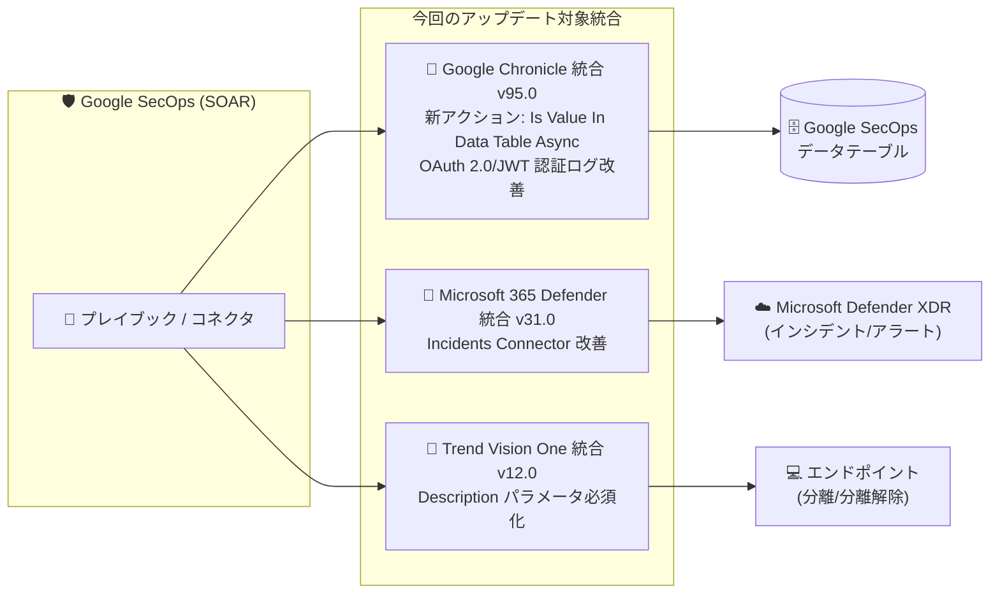

# Google SecOps Marketplace: Google Chronicle v95.0 / Microsoft 365 Defender v31.0 / Trend Vision One v12.0 統合アップデート

**リリース日**: 2026-09-09

**サービス**: Google SecOps Marketplace

**機能**: Google Chronicle、Microsoft 365 Defender、Trend Vision One 統合のアップデート

**ステータス**: リリース済み

📊 [このアップデートのインフォグラフィックを見る](https://takech9203.github.io/google-cloud-news-summary/20260909-google-secops-marketplace-integration-updates.html)

## 概要

Google SecOps Marketplace において、SOAR (Security Orchestration, Automation and Response) で利用する 3 つの統合 (インテグレーション) が同日にアップデートされました。対象は Google Chronicle 統合 (バージョン 95.0)、Microsoft 365 Defender 統合 (バージョン 31.0)、Trend Vision One 統合 (バージョン 12.0) です。

Google Chronicle 統合 v95.0 では、データテーブル内の値を非同期に検索する新しいアクション「Is Value In Data Table Async」が追加され、あわせて OAuth 2.0/JWT 認証に関するロギング・検証診断・エラーメッセージが改善されました。Microsoft 365 Defender 統合 v31.0 では、Incidents Connector のアラート追跡ロジック、アラートオブジェクトメタデータの抽出、ページネーションとタイムアウト処理が改善されました。Trend Vision One 統合 v12.0 では、Isolate Endpoint / Unisolate Endpoint アクションの Description パラメータが必須に変更されました。

これらのアップデートは、Google SecOps でプレイブックやコネクタを運用する SOC (Security Operations Center) チームやセキュリティエンジニアに影響します。特に Trend Vision One 統合の変更は既存プレイブックの修正が必要になる可能性があるため注意が必要です。

**アップデート前の課題**

- Google Chronicle 統合のデータテーブル検索は同期アクション「Is Value In Data Table」のみで、大規模なデータテーブルに対する検索では長時間実行の処理を扱いにくかった
- Google Chronicle 統合の OAuth 2.0/JWT 認証で問題が発生した際、ロギングやエラーメッセージから原因を特定しづらかった
- Microsoft 365 Defender - Incidents Connector は Microsoft Graph API の厳しいレート制限 (アラート取得は毎分 20 リクエスト) の下で動作するため、ページネーションやタイムアウトの処理精度が運用の安定性に直結していた
- Trend Vision One 統合のエンドポイント分離/分離解除アクションでは Description (実行理由) が省略可能であり、操作理由の記録が徹底されないケースがあった

**アップデート後の改善**

- Google Chronicle 統合に「Is Value In Data Table Async」が追加され、長時間実行の検索オペレーションを用いてデータテーブル内の値を非同期にチェックできるようになった
- Google Chronicle 統合の OAuth 2.0/JWT 認証のロギング、検証診断、エラーメッセージが改善され、認証トラブルの切り分けが容易になった
- Microsoft 365 Defender - Incidents Connector のアラート追跡ロジックとアラートオブジェクトメタデータの抽出が更新され、ページネーションとタイムアウト処理のメカニズムが改善された
- Trend Vision One 統合の Isolate Endpoint / Unisolate Endpoint アクションで Description が必須となり、エンドポイント分離操作の理由が必ず記録されるようになった

## アーキテクチャ図

Google SecOps の SOAR プレイブックから利用される 3 つの Marketplace 統合が、それぞれデータテーブル検索、Microsoft Defender XDR からのインシデント取り込み、エンドポイント分離操作の観点でアップデートされました。

## サービスアップデートの詳細

### 主要機能

1. **Google Chronicle 統合 v95.0: 新アクション「Is Value In Data Table Async」(Feature)**
   - Google SecOps のデータテーブル内に指定した値が存在するかを、長時間実行の検索オペレーションを用いて非同期にチェックするアクション
   - 非同期アクションのため、必要に応じて Google SecOps IDE でスクリプトタイムアウト値を調整する
   - Chronicle API 認証でのみ動作し、Backstory API はサポートされない。Unified SecOps デプロイメントでは専用のサービスアカウントの構成と統合パラメータへの認証情報の設定が必要
   - 既存の同期アクション「Is Value In Data Table」と同等のパラメータ体系 (データテーブル名、列、検索値、大文字小文字を区別しない検索、返却行数上限) を持つ

2. **Google Chronicle 統合 v95.0: OAuth 2.0/JWT 認証まわりの改善 (Change)**
   - OAuth 2.0/JWT 認証のロギングが改善された
   - 検証診断 (validation diagnostics) とエラーメッセージが改善され、認証設定の不備を特定しやすくなった

3. **Microsoft 365 Defender 統合 v31.0: Incidents Connector の改善 (Change)**
   - Microsoft 365 Defender - Incidents Connector のアラート追跡ロジックが更新された
   - アラートオブジェクトのメタデータ抽出が追加・更新された
   - ページネーションとタイムアウト処理のメカニズムが改善された
   - このコネクタは Microsoft Defender XDR からインシデントと関連アラートを取り込むためのもの

4. **Trend Vision One 統合 v12.0: Description パラメータの必須化 (Change)**
   - Isolate Endpoint (エンドポイント分離) および Unisolate Endpoint (分離解除) アクションで、Description パラメータが必須になった
   - Description はエンドポイントを分離 (または分離解除) する理由を記録するパラメータ
   - 両アクションは IP Address / Hostname エンティティに対して非同期に実行される

## 技術仕様

### Is Value In Data Table Async アクションのパラメータ

| パラメータ | 必須 | 説明 |
|------|------|------|
| Data Table Name | 必須 | 検索対象のデータテーブルの表示名 |
| Column | 任意 | 検索対象の列 (カンマ区切り)。未指定の場合は全列を検索 |
| Values | 必須 | 検索する値 (カンマ区切り) |
| Case Insensitive Search | 任意 | 大文字小文字を区別しない検索 (デフォルトで有効) |
| Max Data Table Rows To Return | 必須 | マッチした値ごとに返す行数。最大値・デフォルト値は 1000 |

出力は JSON 結果、出力メッセージ、スクリプト結果 (`is_success`: true/false) が利用可能です。

### Microsoft 365 Defender - Incidents Connector の運用上の推奨値 (公式ドキュメントより)

| 項目 | 詳細 |
|------|------|
| Max Incidents To Fetch | 10 (推奨) |
| Run Every | 1 分 (推奨) |
| API レート制限 | アラート取得に使用する Microsoft Graph API エンドポイントは毎分 20 リクエストまで |
| レート制限到達時の動作 | 現在のインシデント処理を停止して 90 秒待機し、次のイテレーションで再処理 |

## デメリット・制約事項

### 制限事項

- Is Value In Data Table Async アクションは Chronicle API 認証でのみ動作し、Backstory API 構成では利用できない
- Is Value In Data Table Async は非同期アクションのため、Google SecOps IDE でスクリプトタイムアウト値の調整が必要になる場合がある

### 考慮すべき点

- **Trend Vision One 統合の破壊的変更の可能性**: Isolate Endpoint / Unisolate Endpoint アクションを使用している既存のプレイブックで Description を設定していない場合、v12.0 への更新後にアクションが失敗する可能性があるため、プレイブックの見直しが必要
- Microsoft 365 Defender - Incidents Connector を利用している場合は、v31.0 でのアラート追跡ロジック変更が既存のケース/アラートの取り込み挙動に影響しないか、更新後に動作確認することが望ましい
- Marketplace 統合の更新は Google SecOps の Marketplace から各統合のバージョンを更新することで反映される

## ユースケース

### ユースケース 1: 大規模データテーブルを使った IoC 照合の自動化

**シナリオ**: SOC チームが、脅威インテリジェンスから取り込んだ大量の IoC (侵害指標) を Google SecOps のデータテーブルに保持し、アラートに含まれる値との照合をプレイブックで自動化している。同期アクションではタイムアウトが懸念される規模のデータテーブルを扱う。

**効果**: Is Value In Data Table Async を利用することで、長時間実行の検索オペレーションとして照合を非同期に実行でき、プレイブックの安定性が向上する。

### ユースケース 2: エンドポイント分離操作の監査性向上

**シナリオ**: インシデント対応で Trend Vision One 連携によるエンドポイント分離を行う際、対応の根拠を後から監査できるようにしたい。

**効果**: Description パラメータの必須化により、すべての分離/分離解除操作に理由が記録され、インシデント対応の監査証跡が確実に残る。

## 関連サービス・機能

- **Google Security Operations (Google SecOps)**: 本 Marketplace 統合が動作する SIEM/SOAR プラットフォーム。データテーブルはプレイブックから参照できる構造化データストア
- **Microsoft Defender XDR**: Microsoft 365 Defender 統合の連携先。インシデント/アラートの取り込みや双方向同期 (Sync Alerts ジョブ) に対応
- **Trend Vision One**: Trend Micro の XDR プラットフォーム。エンドポイントの分離/分離解除、カスタムスクリプト実行などのレスポンスアクションを SOAR から実行可能

## 参考リンク

- 📊 [インフォグラフィック](https://takech9203.github.io/google-cloud-news-summary/20260909-google-secops-marketplace-integration-updates.html)
- [公式リリースノート](https://docs.cloud.google.com/release-notes#September_09_2026)
- [Google Chronicle 統合ドキュメント](https://docs.cloud.google.com/chronicle/docs/soar/marketplace-integrations/google-chronicle)
- [Microsoft 365 Defender 統合ドキュメント](https://docs.cloud.google.com/chronicle/docs/soar/marketplace-integrations/microsoft-365-defender)
- [Trend Vision One 統合ドキュメント](https://docs.cloud.google.com/chronicle/docs/soar/marketplace-integrations/trend-vision-one)

## まとめ

Google SecOps Marketplace の 3 統合が同日に更新され、データテーブルの非同期検索、認証診断の改善、コネクタの安定性向上、分離操作の理由記録の必須化といった SOAR 運用品質に直結する改善が行われました。Google Chronicle 統合のデータテーブル照合を利用しているチームは Async アクションの活用を検討し、Trend Vision One 統合を利用しているチームは Description 未設定のプレイブックがないか確認することを推奨します。

---

**タグ**: Google SecOps, SOAR, Marketplace, Google Chronicle, Microsoft 365 Defender, Trend Vision One, セキュリティ運用, インシデント対応
