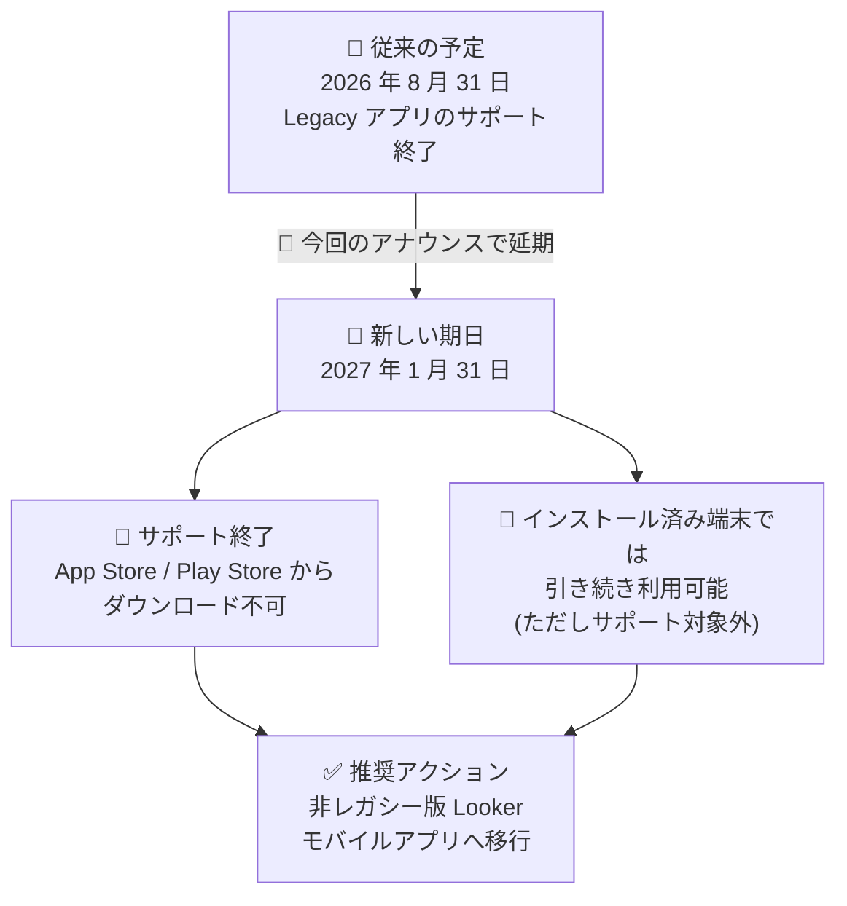

# Looker: Looker Mobile (Legacy) アプリの非推奨化が 2027 年 1 月 31 日に延期

**リリース日**: 2026-09-09

**サービス**: Looker

**機能**: Looker Mobile (Legacy) アプリケーションの非推奨化スケジュール変更

**ステータス**: Deprecated (非推奨化の延期)

📊 [このアップデートのインフォグラフィックを見る](https://takech9203.github.io/google-cloud-news-summary/20260909-looker-mobile-legacy-deprecation-postponed.html)

## 概要

Looker Mobile (Legacy) アプリケーションの非推奨化 (サポート終了) の期日が、**2027 年 1 月 31 日に延期**されました。従来のドキュメントでは 2026 年 8 月 31 日にサポートが終了する予定と案内されていましたが、今回のアナウンスにより組織は約 5 か月の追加の移行期間を得たことになります。

2027 年 1 月 31 日以降、Looker Mobile (Legacy) アプリのサポートは終了し、App Store および Play Store からダウンロードできなくなります。すでにインストール済みのユーザーは引き続きアプリを使用できますが、Google は非レガシー版の Looker モバイルアプリ (Looker アプリ) への移行を推奨しています。

対象は、Looker Mobile (Legacy) アプリを利用して Looker (original) インスタンスのダッシュボードや Look をモバイル端末から閲覧しているユーザー、およびその移行計画を管理する Looker 管理者です。

**アップデート前の状況**

- Looker Mobile (Legacy) アプリの非推奨化期日は 2026 年 8 月 31 日と案内されており、移行期限が目前に迫っていた
- 期限までに新しい Looker アプリへの移行 (管理者によるモバイルアクセスの有効化、ユーザーへの周知、認証方式の確認) を完了する必要があった

**アップデート後の変更**

- 非推奨化期日が 2027 年 1 月 31 日に延期され、移行準備の期間が約 5 か月延長された
- 2027 年 1 月 31 日以降は、サポートが終了し App Store / Play Store からのダウンロードが不可となる
- インストール済みの端末では期日以降も Legacy アプリ自体は動作するが、サポート対象外となるため、非レガシー版 Looker モバイルアプリのインストールが推奨される

## アーキテクチャ図

非推奨化スケジュールの変更と、期日以降の影響および推奨される移行先を示しています。

## サービスアップデートの詳細

### 主要ポイント

1. **非推奨化期日の延期**
   - Looker Mobile (Legacy) アプリのサポート終了日が 2026 年 8 月 31 日から 2027 年 1 月 31 日に延期された
   - 移行が完了していない組織は追加の猶予期間を得られる

2. **2027 年 1 月 31 日以降の影響**
   - Looker Mobile (Legacy) アプリのサポートが終了する
   - App Store (iOS) および Play Store (Android) からアプリをダウンロードできなくなる
   - インストール済みのユーザーは引き続きアプリを使用できるが、非レガシー版 Looker モバイルアプリのインストールが推奨される

3. **移行先: 非レガシー版 Looker モバイルアプリ**
   - Looker (Google Cloud core) と Looker (original) の両方のインスタンスタイプに対応
   - Google OAuth、SAML、LDAP、OpenID Connect、メールによる認証をサポート (Legacy アプリはメールと QR コードのみ)
   - Looker Studio Pro (Data Studio Pro) コンテンツにも単一アプリからアクセス可能

## 技術仕様

### Looker アプリと Looker Mobile (Legacy) アプリの機能比較

公式ドキュメントに記載されている両アプリの主な違いは次のとおりです。

| 機能 | Looker アプリ (移行先) | Looker Mobile (Legacy) アプリ |
|------|------------------------|-------------------------------|
| 対応インスタンスタイプ | Looker (Google Cloud core)、Looker (original) | Looker (original) のみ |
| Data Studio Pro コンテンツへのアクセス | 対応 | 非対応 |
| 認証方式 | Google OAuth、SAML、LDAP、OpenID Connect、メール | メール、QR コード |
| 生体認証 | 対応 | 対応 |
| ドリル (Drilling) | 対応 | iOS のみ対応 |
| アラート | 対応 | iOS のみ対応 |
| コンテンツ検索 | 非対応 | 対応 |
| ダッシュボード / Look のモバイル向けレンダリング | 対応 | 対応 |
| IP アドレスによるアクセス制限 | 非対応 | 非対応 |

### Looker アプリの動作要件

| 項目 | 詳細 |
|------|------|
| iOS | iOS 13 以降 |
| Android | Android 8 以降 |
| インスタンス要件 | Looker アプリは Public IP インスタンスでのみ利用可能 |

## 移行方法

### 前提条件

1. Looker 管理者がインスタンスで Mobile Application Access (モバイルアプリケーションアクセス) を有効化していること
2. 移行先の Looker アプリは Public IP インスタンスでのみ利用可能であること
3. IP 許可リスト (IP allowlisting) を有効化しているインスタンスでは、静的 IP を持つ企業 VPN 経由での接続と、その静的 IP の許可リストへの追加が必要

### 手順

#### ステップ 1: 管理者がモバイルアクセスを有効化する

Looker 管理者は、ユーザーがモバイルアプリからインスタンスにサインインできるように、モバイルアプリケーションアクセスを有効化します。詳細は [モバイルアプリケーションの有効化](https://docs.cloud.google.com/looker/docs/mobile-app-enablement) を参照してください。

#### ステップ 2: ユーザーが非レガシー版 Looker アプリをインストールする

App Store または Play Store で「Looker」を検索するか、以下のリンクからインストールします。

- [App Store (iOS)](https://apps.apple.com/us/app/looker-studio/id1644381985)
- [Play Store (Android)](https://play.google.com/store/apps/details?id=com.google.android.apps.cloud.cloudbi)

#### ステップ 3: サインインして利用を開始する

メールまたは QR コードなどでインスタンスにサインインし、お気に入り / 最近閲覧した Look やダッシュボード、ボード、フォルダ内コンテンツへアクセスできることを確認します。詳細は [モバイルアプリケーションへのサインイン](https://docs.cloud.google.com/looker/docs/mobile-app-sign-in) を参照してください。

## メリット

### ビジネス面

- **移行期間の延長**: 期日が 2027 年 1 月 31 日に延期されたことで、ユーザーへの周知やトレーニングを含む移行計画を余裕を持って進められる
- **単一アプリへの集約**: 移行先の Looker アプリは Looker と Looker Studio Pro のコンテンツを 1 つのアプリで閲覧でき、モバイル BI 環境を統一できる

### 技術面

- **エンタープライズ認証への対応**: 移行先の Looker アプリは Google OAuth、SAML、LDAP、OpenID Connect に対応しており、組織の既存の認証基盤と統合しやすい
- **Looker (Google Cloud core) 対応**: Legacy アプリでは不可能だった Looker (Google Cloud core) インスタンスへのモバイルアクセスが可能になる

## デメリット・制約事項

### 制限事項

- 2027 年 1 月 31 日以降、Legacy アプリは App Store / Play Store からダウンロードできなくなる (新規インストール・再インストールが不可)
- 移行先の Looker アプリはコンテンツ検索に対応していない (Legacy アプリは対応)
- 移行先の Looker アプリは Public IP インスタンスでのみ利用可能

### 考慮すべき点

- 期日以降もインストール済み端末では Legacy アプリを利用できるが、サポート対象外となるため、期日を待たずに計画的に移行することが推奨される
- Legacy アプリで QR コード認証を利用していた場合、移行先アプリの認証方式 (Google OAuth、SAML、LDAP、OpenID Connect、メール) への切り替えをユーザーに案内する必要がある
- IP 許可リストを使用しているインスタンスでは、静的 IP を持つ企業 VPN 経由での接続構成が必要

## ユースケース

### ユースケース 1: Legacy アプリ利用ユーザーの計画的移行

**シナリオ**: Looker (original) インスタンスを利用する組織で、現場ユーザーが Looker Mobile (Legacy) アプリでダッシュボードを閲覧している。2026 年 8 月末の期限までの移行が間に合っていなかった。

**効果**: 期日が 2027 年 1 月 31 日に延期されたため、モバイルアクセスの有効化、ユーザーへのインストール案内、認証方式の切り替えを段階的に実施できる。

### ユースケース 2: Looker (Google Cloud core) への移行と合わせたモバイル環境の刷新

**シナリオ**: Looker (original) から Looker (Google Cloud core) への移行を検討している組織。Legacy アプリは Looker (Google Cloud core) に対応していない。

**効果**: 非レガシー版 Looker アプリへ移行することで、Looker (Google Cloud core) インスタンスと Looker Studio Pro コンテンツの両方にモバイルからアクセスできる体制を先行して整備できる。

## 関連サービス・機能

- **Looker アプリ (非レガシー版モバイルアプリ)**: 今回のアナウンスで移行先として推奨されているアプリ。Looker (Google Cloud core) / Looker (original) / Looker Studio Pro コンテンツに対応
- **Looker (Google Cloud core)**: Legacy アプリでは非対応、Looker アプリでのみモバイルアクセスが可能なインスタンスタイプ
- **Looker Studio Pro**: 移行先の Looker アプリから Data Studio Pro (Looker Studio Pro) コンテンツにアクセス可能

## 参考リンク

- 📊 [インフォグラフィック](https://takech9203.github.io/google-cloud-news-summary/20260909-looker-mobile-legacy-deprecation-postponed.html)
- [公式リリースノート (2026-09-09)](https://docs.cloud.google.com/release-notes#September_09_2026)
- [Looker Mobile (Legacy) アプリのドキュメント](https://docs.cloud.google.com/looker/docs/mobile-app-legacy)
- [Looker モバイルアプリのインストール](https://docs.cloud.google.com/looker/docs/mobile-app-installation)
- [Looker モバイルアプリの概要](https://docs.cloud.google.com/looker/docs/looker-core-mobile-app)
- [モバイルアプリケーションの有効化 (管理者向け)](https://docs.cloud.google.com/looker/docs/mobile-app-enablement)

## まとめ

Looker Mobile (Legacy) アプリの非推奨化が 2027 年 1 月 31 日に延期され、移行のための猶予期間が約 5 か月延長されました。ただし期日以降はサポートが終了しストアからのダウンロードも不可となるため、この延期を移行完了の好機と捉え、モバイルアクセスの有効化と非レガシー版 Looker アプリへのユーザー移行 (特に認証方式の切り替え) を計画的に進めることを推奨します。

---

**タグ**: Looker, モバイルアプリ, 非推奨, Deprecation, 移行, BI
