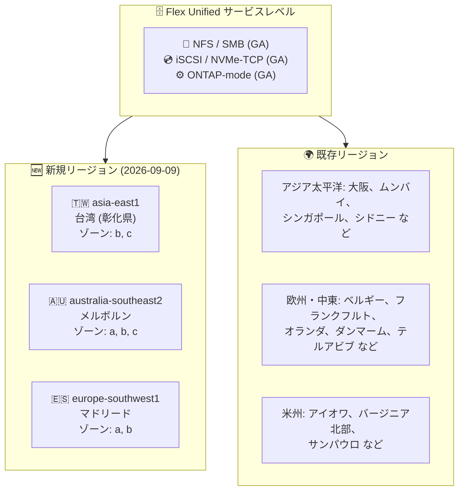

# NetApp Volumes: Flex Unified サービスレベルが新規 3 リージョンで利用可能に

**リリース日**: 2026-09-09

**サービス**: Google Cloud NetApp Volumes

**機能**: Flex Unified サービスレベルのリージョン拡大 (asia-east1、australia-southeast2、europe-southwest1)

**ステータス**: Announcement

📊 [このアップデートのインフォグラフィックを見る](https://takech9203.github.io/google-cloud-news-summary/20260909-netapp-volumes-flex-unified-new-regions.html)

## 概要

Google Cloud NetApp Volumes の Flex Unified サービスレベルが、新たに asia-east1 (台湾)、australia-southeast2 (メルボルン)、europe-southwest1 (マドリード) の 3 リージョンで利用可能になった。Flex Unified は、キャパシティとパフォーマンス (スループット・IOPS) を独立してプロビジョニングできる汎用ストレージのサービスレベルで、NFS/SMB のファイルストレージと iSCSI/NVMe-TCP のブロックストレージを単一プラットフォームで提供する。

今回追加された 3 リージョンはいずれも、パフォーマンスを柔軟に設定できる「カスタムパフォーマンス」対応リージョンとして提供される (性能上限が制限される limited performance リージョンではない)。これにより、Flex Unified のカスタムパフォーマンス対応リージョンは 19 リージョンとなり、limited performance の 6 リージョンと合わせて計 25 リージョンでの提供となった。

Flex Unified は 2026 年 4 月に NFS/SMB/NVMe-TCP プロトコルおよび ONTAP-mode が GA となっており、今回のリージョン拡大により、台湾・オーストラリア南東部 (メルボルン)・スペインにデータレジデンシー要件やレイテンシ要件を持つユーザーが、GA 済みの統合ストレージ機能をフルに活用できるようになった。

**アップデート前の課題**

- asia-east1 (台湾) と australia-southeast2 (メルボルン) では、NetApp Volumes はファイル専用の Flex File サービスレベルのみ利用可能で、iSCSI などのブロックストレージや ONTAP-mode を利用できなかった
- europe-southwest1 (マドリード) では Flex File および Standard/Premium/Extreme は利用できたが、キャパシティとパフォーマンスを独立してプロビジョニングできる Flex Unified は選択できなかった
- これらのリージョンにデータレジデンシー要件を持つワークロードは、Flex Unified を利用するために他リージョンを選択する必要があった

**アップデート後の改善**

- 3 リージョンで Flex Unified ストレージプールを作成できるようになり、NFS/SMB/iSCSI/NVMe-TCP を単一サービスレベルで利用可能になった
- 3 リージョンともカスタムパフォーマンス対応であり、スループット 64 MiBps〜5 GiBps、最大 160,000 IOPS の独立プロビジョニングが可能
- 台湾・メルボルン・マドリードのデータレジデンシー要件を満たしつつ、ONTAP-mode や大容量ボリュームなど Flex Unified の GA 機能を活用できるようになった

## アーキテクチャ図



Flex Unified サービスレベルの提供リージョンが 3 リージョン拡大した。新規リージョンはいずれもカスタムパフォーマンス対応で、既存リージョンと同等の機能 (NFS/SMB/ブロックストレージ/ONTAP-mode) を利用できる。

## サービスアップデートの詳細

### 主要機能

1. **asia-east1 (台湾) での Flex Unified 提供開始**
   - ロケーション: 彰化県 (Changhua County)
   - 対応ゾーン: asia-east1-b、asia-east1-c
   - 台湾国内にデータを保持する必要があるワークロードで Flex Unified を利用可能に

2. **australia-southeast2 (メルボルン) での Flex Unified 提供開始**
   - 対応ゾーン: australia-southeast2-a、australia-southeast2-b、australia-southeast2-c
   - 既存の australia-southeast1 (シドニー) と合わせ、オーストラリア国内 2 リージョン体制となり、国内 DR 構成の選択肢が拡大

3. **europe-southwest1 (マドリード) での Flex Unified 提供開始**
   - 対応ゾーン: europe-southwest1-a、europe-southwest1-b
   - Standard/Premium/Extreme に加えて Flex Unified も選択可能になり、スペイン国内でのサービスレベルの選択肢が拡大

## 技術仕様

### 新規リージョンの Flex Unified パフォーマンス仕様

3 リージョンともカスタムパフォーマンス対応リージョンであり、以下の仕様が適用される。

| 項目 | 仕様 |
|------|------|
| スループットのプロビジョニング | 64 MiBps 〜 5 GiBps (1 MiBps 刻み) |
| IOPS | プロビジョニングスループット 1 MiBps あたり 16 IOPS を含む。追加プロビジョニングで最大 160,000 IOPS |
| 大容量プール | 最大 22 GiBps スループット、750,000 IOPS |
| 運用モード | Default-mode (フルマネージド) / ONTAP-mode (ONTAP REST API 直接アクセス) |

### Flex Unified 対応リージョン一覧 (2026-09-09 時点)

**カスタムパフォーマンス対応リージョン (19 リージョン)**

| リージョン | ロケーション | 備考 |
|-----------|------------|------|
| **asia-east1** | **台湾 (彰化県)** | **今回追加** |
| asia-northeast2 | 大阪 | |
| asia-south1 | ムンバイ | |
| asia-southeast1 | シンガポール | |
| australia-southeast1 | シドニー | |
| **australia-southeast2** | **メルボルン** | **今回追加** |
| **europe-southwest1** | **マドリード** | **今回追加** |
| europe-west1 | ベルギー | |
| europe-west3 | フランクフルト | |
| europe-west4 | オランダ | |
| me-central2 | ダンマーム | |
| me-west1 | テルアビブ | |
| southamerica-east1 | サンパウロ | |
| us-central1 | アイオワ | |
| us-east1 | サウスカロライナ | |
| us-east4 | バージニア北部 | |
| us-south1 | ダラス | |
| us-west1 | オレゴン | |
| us-west4 | ラスベガス | |

**limited performance リージョン (6 リージョン)**: asia-northeast1 (東京)、europe-west2 (ロンドン)、europe-west9 (パリ)、us-east5 (コロンバス)、us-west2 (ロサンゼルス)、us-west3 (ソルトレイクシティ)。これらのリージョンではストレージプールの性能上限が 1.6 GiBps / 90,000 IOPS に制限され、大容量プールは利用できない。

## 設定方法

### 前提条件

1. Google Cloud プロジェクトで NetApp Volumes API が有効であること
2. Private Service Access が構成された VPC ネットワーク
3. SMB や Kerberos を使用する場合は Active Directory ポリシーの構成

### 手順

#### ステップ 1: 新規リージョンでストレージプールを作成

```bash
# 例: asia-east1 (台湾) に Flex Unified ストレージプールを作成
gcloud netapp storage-pools create my-flex-unified-pool \
  --location=asia-east1 \
  --service-level=FLEX \
  --capacity=2048 \
  --network=my-vpc-network
```

#### ステップ 2: ボリュームを作成

作成したストレージプール上に、NFS/SMB/iSCSI などプロトコルを指定してボリュームを作成する。手順は既存リージョンと同一。

## メリット

### ビジネス面

- **データレジデンシー対応**: 台湾、オーストラリア (メルボルン)、スペインの国内データ保持要件を満たしつつ Flex Unified の統合ストレージ機能を利用可能
- **国内 DR 構成の実現**: オーストラリアではシドニーとメルボルンの 2 リージョン体制となり、国内完結の災害対策構成を検討できる

### 技術面

- **フル機能での提供**: 3 リージョンとも limited performance ではなくカスタムパフォーマンス対応であり、最大 5 GiBps (大容量プールで 22 GiBps) の性能を利用可能
- **レイテンシの改善**: 対象地域のクライアントに近いリージョンでボリュームを提供でき、NFS/SMB/iSCSI アクセスのレイテンシを低減できる

## デメリット・制約事項

### 制限事項

- 対応ゾーンはリージョンによって異なる (asia-east1 は 2 ゾーン、australia-southeast2 は 3 ゾーン、europe-southwest1 は 2 ゾーン)
- asia-east1 と australia-southeast2 では Standard/Premium/Extreme サービスレベルは引き続き提供されていない (2026-09-09 時点)

### 考慮すべき点

- リージョンによって料金が異なるため、新規リージョンでの利用時は料金ページで対象リージョンの単価を確認する必要がある
- Flex Unified のボリュームレプリケーションは同一リージョングループ内のゾーン間でサポートされるため、リージョン間 DR を設計する場合はレプリケーションのリージョングループ対応状況を確認すること

## ユースケース

### ユースケース 1: 台湾国内でのエンタープライズファイル共有

**シナリオ**: 台湾に拠点を持つ企業が、データを国内に保持しながら Windows (SMB) と Linux (NFS) の混在環境向けファイル共有基盤を構築する。

**効果**: asia-east1 で Flex Unified ボリュームを作成することで、データレジデンシー要件を満たしつつ、NFS/SMB のマルチプロトコルアクセスを単一プラットフォームで提供できる。

### ユースケース 2: オーストラリア国内 2 リージョンでの可用性向上

**シナリオ**: オーストラリアの金融・公共系ワークロードで、国外にデータを出さずにシドニーとメルボルンの 2 リージョンを活用した構成を組みたい。

**効果**: australia-southeast1 (シドニー) に加えて australia-southeast2 (メルボルン) でも Flex Unified が利用可能になり、国内 2 リージョンでのワークロード配置や災害対策の設計余地が広がる。

## 料金

Flex サービスレベルの料金は、キャパシティ、スループット、IOPS の 3 要素を独立して時間課金する体系となっている。リージョンごとに単価が異なるため、新規 3 リージョンの単価は料金ページのリージョン選択ドロップダウンで確認できる (3 リージョンとも料金ページのカスタムプロビジョニング対応リージョン一覧に掲載済み)。

### 料金例 (us-central1 のリスト価格、参考)

| 課金要素 | リスト価格 | 1 年 CUD | 3 年 CUD |
|---------|-----------|----------|----------|
| キャパシティ (GiB/時間) | $0.000287671 | $0.000244521 | $0.000230137 |
| スループット (MiBps/時間) | $0.003424658 | $0.002910959 | $0.002739726 |
| IOPS (IOPS/時間) | $0.000046575 | $0.000039589 | $0.00003726 |

上記は us-central1 (アイオワ) のリージョナルプールのリスト価格の例であり、asia-east1、australia-southeast2、europe-southwest1 の単価は [料金ページ](https://cloud.google.com/netapp/volumes/pricing) で対象リージョンを選択して確認すること。1 年 / 3 年の支出ベースのコミットメント割引 (CUD) も利用可能。

## 利用可能リージョン

今回のアップデートで追加されたリージョン:

| リージョン | ロケーション | ゾーン |
|-----------|------------|--------|
| asia-east1 | 台湾 (彰化県) | asia-east1-b、asia-east1-c |
| australia-southeast2 | メルボルン | australia-southeast2-a、australia-southeast2-b、australia-southeast2-c |
| europe-southwest1 | マドリード | europe-southwest1-a、europe-southwest1-b |

全リージョンの一覧は「技術仕様」セクションおよび [サービスレベル別対応リージョン](https://docs.cloud.google.com/netapp/volumes/docs/discover/service-levels#supported_regions) を参照。

## 関連サービス・機能

- **Flex File サービスレベル**: asia-east1、australia-southeast2、europe-southwest1 では従来からファイル専用の Flex File が利用可能。ブロックストレージや ONTAP-mode が不要な場合の選択肢
- **Standard/Premium/Extreme サービスレベル**: europe-southwest1 では従来から利用可能。ボリューム容量に比例した性能を提供する従来型のサービスレベル
- **Google Cloud VMware Engine**: NetApp Volumes の NFS ボリュームを VMware Engine のデータストアとして利用可能
- **Cloud Monitoring**: ストレージプール・ボリュームのメトリクス監視に使用

## 参考リンク

- 📊 [インフォグラフィック](https://takech9203.github.io/google-cloud-news-summary/20260909-netapp-volumes-flex-unified-new-regions.html)
- [公式リリースノート](https://docs.cloud.google.com/release-notes#September_09_2026)
- [NetApp Volumes リリースノート](https://docs.cloud.google.com/netapp/volumes/docs/release-notes)
- [サービスレベルと対応リージョン](https://docs.cloud.google.com/netapp/volumes/docs/discover/service-levels#supported_regions)
- [NetApp Volumes 概要](https://docs.cloud.google.com/netapp/volumes/docs/discover/overview)
- [料金ページ](https://cloud.google.com/netapp/volumes/pricing)

## まとめ

Flex Unified サービスレベルのカスタムパフォーマンス対応リージョンが 19 に拡大し、台湾・メルボルン・マドリードでも NFS/SMB/ブロックストレージ/ONTAP-mode を含む GA 済みの統合ストレージ機能が利用可能になった。これらの地域にデータレジデンシーやレイテンシ要件を持つワークロードでは、Flex File や他サービスレベルとの比較を含めて Flex Unified の採用を検討するとよい。特にオーストラリアでは国内 2 リージョン体制となったため、国内完結の DR 設計を見直す好機である。

---

**タグ**: #NetAppVolumes #FlexUnified #リージョン拡大 #asia-east1 #australia-southeast2 #europe-southwest1 #データレジデンシー #GoogleCloud
