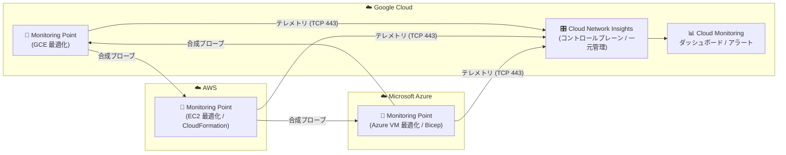

# Network Intelligence Center: AWS / Azure 最適化 Monitoring Points のデプロイに対応

**リリース日**: 2026-09-09

**サービス**: Network Intelligence Center (Cloud Network Insights)

**機能**: AWS / Microsoft Azure クラウドインフラに最適化された Monitoring Points のデプロイ

**ステータス**: リリース済み (Feature)

📊 [このアップデートのインフォグラフィックを見る](https://takech9203.github.io/google-cloud-news-summary/20260909-network-intelligence-center-monitoring-points-aws-azure.html)

## 概要

Network Intelligence Center の Cloud Network Insights から、Amazon Web Services (AWS) および Microsoft Azure のクラウドインフラに最適化された Monitoring Points をデプロイできるようになりました。Monitoring Points は、ネットワークや Web アプリケーションのパフォーマンスを監視するための合成プローブ (synthetic probe) を実行する軽量なソフトウェアエージェントです。

Cloud Network Insights は AppNeta by Broadcom とのパートナーシップで提供されるサービスで、マルチクラウドおよびハイブリッド環境にまたがるネットワークの健全性とアプリケーションパフォーマンスの可視化を実現します。今回のアップデートにより、AWS では AWS CloudFormation テンプレート (またはクイック作成リンク)、Azure では Bicep を使用したインストールバンドルという、各クラウドのネイティブなプロビジョニング手段で Monitoring Points を展開できるようになり、マルチクラウド環境の監視体制の構築が容易になります。

Google Cloud プロジェクトを中央管理点として、AWS・Azure を含むすべての Monitoring Points のステータスやインベントリを一元的に確認でき、収集されたメトリクスは Cloud Monitoring のダッシュボードやアラートポリシーで活用できます。マルチクラウド構成を運用するネットワークチームや SRE チームにとって有用なアップデートです。

**アップデート前の課題**

- AWS や Azure などの他クラウド環境を監視する場合、Docker コンテナや Kubernetes (Helm) などの汎用的な Monitoring Point を利用する必要があった
- AWS・Azure のインフラに最適化された専用の Monitoring Point デプロイオプションは Cloud Network Insights のコンソールから提供されていなかった

**アップデート後の改善**

- Google Cloud コンソールの Cloud Network Insights から、AWS 向け (Amazon EC2)・Azure 向け (Azure VM) に最適化された Monitoring Points をデプロイできるようになった
- AWS では CloudFormation のプロビジョニングテンプレートのダウンロード、または事前入力された CloudFormation スタックを開くクイック作成リンクの 2 つのデプロイ方法を選択できるようになった
- Azure では Google Cloud からインストールバンドルをダウンロードし、Bicep を使用してデプロイできるようになった
- GCP・AWS・Azure にまたがる Monitoring Points を Google Cloud プロジェクトから一元管理し、Cloud Monitoring / Cloud Logging と統合した監視・アラートが可能

## アーキテクチャ図

GCP・AWS・Azure の各環境にデプロイされた Monitoring Points が相互に合成プローブを実行し、収集したテレメトリを Google Cloud 上の Cloud Network Insights コントロールプレーンに送信します。メトリクスは Cloud Monitoring で一元的に可視化・アラート設定できます。

## サービスアップデートの詳細

### 主要機能

1. **AWS 最適化 Monitoring Point (Amazon EC2)**
   - AWS インフラ向けに最適化された Monitoring Point を AWS 環境に組み込み、ネットワークや Web アプリケーションのパフォーマンスを監視
   - デプロイ方法は 2 種類: (1) AWS CloudFormation プロビジョニングテンプレートをダウンロードしてデプロイ、(2) 事前入力された CloudFormation の Create stack を開くクイック作成リンクを使用 (一部の高度な構成オプションは利用不可)
   - テンプレートはローカルにダウンロードするか、ターゲットホスト上でトークン付き curl コマンド (有効期間 1 時間) を実行して取得

2. **Azure 最適化 Monitoring Point (Azure VM)**
   - Microsoft Azure インフラ向けに最適化された VM Monitoring Point を Azure 環境に組み込み可能
   - Google Cloud からインストールバンドルをダウンロードし、AppNeta の手順に従って Bicep でデプロイ

3. **Google Cloud からの一元管理**
   - Google Cloud コンソールの「Network Intelligence > Cloud Network Insights > Monitoring Points」からプラットフォームタイプ (AWS / Azure) を選択してデプロイを開始
   - インストール後 2〜5 分で Monitoring Point がコンソールの一覧に「Active」ステータスで表示され、デプロイを確認可能
   - すべての Monitoring Points のステータス・インベントリの確認、Cloud Monitoring ダッシュボードへのアクセス、アラートポリシーと通知チャネルの設定を Google Cloud プロジェクトから実施

## 技術仕様

### Monitoring Point のタイプ (Cloud カテゴリ)

| タイプ | 最適な用途 | デプロイ方法 |
|------|------|------|
| Google Cloud (GCE) | Google Cloud インフラへの組み込み | 既存サポート |
| Amazon EC2 | AWS インフラへの組み込み | AWS CloudFormation (テンプレート / クイック作成リンク) |
| Microsoft Azure (Azure VM) | Azure インフラへの組み込み | インストールバンドル + Bicep |

このほか、コンテナ (Docker / Podman)、Kubernetes (Helm、Amazon EKS や Azure AKS も対象)、VMware (OVA)、KVM (QCOW2) といった汎用タイプも引き続きサポートされます。

### ファイアウォール要件

Monitoring Points は Cloud Network Insights コントロールプレーンと通信するためにアウトバウンドのインターネットアクセスが必要です。

| プロトコル | ポート | 説明 |
|------|------|------|
| TCP | 443 (HTTPS) | 必須。Cloud Network Insights コントロールプレーンへの接続 |
| UDP | 123 (NTP) | 必須。時刻同期ができていない場合、Monitoring Point は接続に失敗する |
| UDP/TCP | 53 (DNS) | 必須。Cloud Network Insights エンドポイントの名前解決 |
| UDP | 3239, 33434 | テストトラフィック。標準の Network Path 監視 (dual-ended) に必要 |
| ICMP | Type 8 (echo request) | テストトラフィック。single-ended パス (例: 8.8.8.8 への ping) に必要 |

### 必要な IAM ロール

| ロール | 説明 |
|------|------|
| `roles/networkmanagement.CloudNetworkInsightsEditor` | Cloud Network Insights Editor。Cloud Network Insights を有効化したプロジェクトで Monitoring Points を追加するために必要 |

## 設定方法

### 前提条件

1. Google Cloud プロジェクトで Cloud Network Insights が有効化されていること
2. 対象プロジェクトに対して Cloud Network Insights Editor (`roles/networkmanagement.CloudNetworkInsightsEditor`) ロールが付与されていること
3. デプロイ先環境のファイアウォールで、コントロールプレーンへのアウトバウンド通信 (TCP 443、UDP 123、DNS 53 など) が許可されていること

### 手順

#### ステップ 1: Monitoring Point の追加を開始

Google Cloud コンソールで「Network Intelligence > Cloud Network Insights > Monitoring Points」に移動し、「Add monitoring point」をクリックします。Platform Type のリストから **AWS** または **Azure** を選択して続行し、Monitoring Point をインストールするホスト名を入力します。

#### ステップ 2: デプロイオプションの選択と取得

**AWS の場合**: 「AWS CloudFormation」(プロビジョニングテンプレートをローカルダウンロード、またはターゲットホスト上で生成された curl コマンドを実行して取得) か、「AWS Quick-Create Link」(AWS アカウントにサインインすると事前入力された CloudFormation Create stack が開く) を選択します。

**Azure の場合**: インストールバンドルをローカルにダウンロードするか、ターゲットホスト上でトークン付きコマンドを実行して取得し、AppNeta の手順に従って Bicep でデプロイします。

#### ステップ 3: インストールの確認

Google Cloud コンソールで「Network Intelligence Center > Cloud Network Insights」を開きます。2〜5 分後に Monitoring Point が「Active」ステータスで一覧に表示されます。10 分以内に表示されない場合はトラブルシューティングドキュメントを参照してください。

#### ステップ 4: 監視ポリシーの作成

Monitoring Points の追加後、監視ポリシーを作成して、監視対象 (ネットワークパスまたは Web パス) とテストの実行頻度を設定します。

## メリット

### ビジネス面

- **マルチクラウド監視の一元化**: GCP・AWS・Azure にまたがるネットワーク監視を Google Cloud コンソールから一元管理でき、運用の分断を解消できる
- **プロアクティブな障害検知**: 合成プローブにより、ユーザートラフィックがない状態でもネットワークルートを監視し、ユーザー影響が出る前に問題を検知できる

### 技術面

- **クラウドネイティブなデプロイ**: AWS は CloudFormation、Azure は Bicep という各クラウド標準の IaC 手段でデプロイでき、既存のプロビジョニングフローに組み込みやすい
- **Google Cloud Observability との統合**: 収集メトリクスは Cloud Monitoring / Cloud Logging に連携され、既存のダッシュボード・アラートポリシー・通知チャネル (メール、Slack、PagerDuty など) をそのまま活用できる
- **根本原因の切り分け**: ネットワーク起因かアプリケーション起因かを迅速に切り分けられ、劣化箇所が Google Cloud・他クラウド・ISP・オンプレミスのいずれにあるかを特定しやすい

## デメリット・制約事項

### 制限事項

- AWS のクイック作成リンクによるデプロイでは、一部の高度な構成オプションが利用できない
- Monitoring Points はコントロールプレーンとの通信のためにアウトバウンドのインターネットアクセスが必須 (時刻同期 NTP を含む)
- Monitoring Point の削除は AppNeta 側で行う必要がある

### 考慮すべき点

- Cloud Network Insights を有効化したプロジェクト自体や、監視対象のワークロード上への Monitoring Point のインストールは推奨されていない
- Monitoring Point の設置場所は、中央 VPC・リモート拠点・特定のクラウドリージョンなど、重要なネットワークセグメントを選定することが推奨される (VPC Flow Logs や vm_flow メトリクスでトラフィックの流れを把握して決定できる)

## ユースケース

### ユースケース 1: マルチクラウド構成におけるクラウド間ネットワークの品質監視

**シナリオ**: アプリケーションのフロントエンドを Google Cloud、一部のバックエンドサービスを AWS、認証基盤を Azure に配置しているマルチクラウド構成で、クラウド間通信のレイテンシやパケットロスを継続的に監視したい。

**効果**: 各クラウドに最適化された Monitoring Points を CloudFormation / Bicep でデプロイし、クラウド間のネットワークパスを合成プローブで常時監視できる。劣化発生時には、どのクラウド区間・経路ホップに問題があるかをホップバイホップで可視化し、迅速に切り分けられる。

### ユースケース 2: 他クラウドからの Web アプリケーション体験監視

**シナリオ**: AWS や Azure のリージョンに近いユーザー層に向けて Google Cloud 上の Web アプリケーションを提供しており、ユーザー視点でのアプリケーション応答性能を測定したい。

**効果**: ユーザー拠点に近い AWS / Azure リージョンに Monitoring Points を配置し、DNS 解決時間やページロード時間などの Web パス監視を実行することで、実際のユーザー体験に近い視点でのパフォーマンス測定と SLA 検証が可能になる。

## 料金

料金の詳細は Network Intelligence Center の料金ページを参照してください。

- [Network Intelligence Center の料金](https://cloud.google.com/network-intelligence-center/pricing)

## 関連サービス・機能

- **Cloud Monitoring**: Monitoring Points が収集したメトリクスのダッシュボード表示、アラートポリシーおよび通知チャネルの設定に使用
- **Cloud Logging**: Cloud Network Insights のログ・イベントの送信先。アラートや通知に活用
- **VPC Flow Logs / Flow Analyzer**: Monitoring Points の設置場所を決定する際のトラフィック分析に活用できる。Flow Analyzer は VPC トラフィックフローの分析を提供
- **Connectivity Tests**: VPC ネットワークのエンドポイント間の接続性を診断する Network Intelligence Center の補完モジュール
- **AppNeta by Broadcom**: Cloud Network Insights のパートナーソリューション。Monitoring Point 本体のインストール手順や削除、アラーム設定は AppNeta 側で提供

## 参考リンク

- 📊 [インフォグラフィック](https://takech9203.github.io/google-cloud-news-summary/20260909-network-intelligence-center-monitoring-points-aws-azure.html)
- [公式リリースノート](https://docs.cloud.google.com/release-notes#September_09_2026)
- [Cloud Network Insights ドキュメント](https://docs.cloud.google.com/network-intelligence-center/docs/cloud-network-insights/)
- [Deploy AWS Monitoring Points](https://docs.cloud.google.com/network-intelligence-center/docs/cloud-network-insights/deploy-aws-monitoring-points)
- [Deploy Microsoft Azure Monitoring Points](https://docs.cloud.google.com/network-intelligence-center/docs/cloud-network-insights/deploy-azure-monitoring-points)
- [Add Monitoring Points (サポートされるタイプ一覧)](https://docs.cloud.google.com/network-intelligence-center/docs/cloud-network-insights/add-monitoring-points)
- [料金ページ](https://cloud.google.com/network-intelligence-center/pricing)

## まとめ

Cloud Network Insights が AWS・Azure に最適化された Monitoring Points のデプロイに対応したことで、マルチクラウド環境のネットワーク監視を Google Cloud から一元的に構築・運用できるようになりました。CloudFormation や Bicep といった各クラウドネイティブなデプロイ手段が用意されているため、マルチクラウド構成を運用しているチームは、重要なクラウド間ネットワークパスへの Monitoring Points の配置と監視ポリシーの設定を検討することをおすすめします。

---

**タグ**: Network Intelligence Center, Cloud Network Insights, Monitoring Points, AWS, Microsoft Azure, マルチクラウド, ネットワーク監視, AppNeta, Cloud Monitoring
