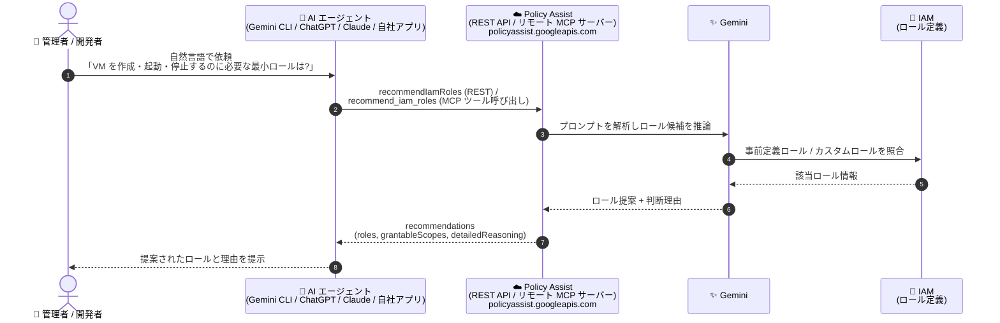

# IAM / Policy Intelligence: Policy Assist REST API と Policy Assist リモート MCP サーバー (Preview)

**リリース日**: 2026-09-09

**サービス**: Identity and Access Management (IAM) / Policy Intelligence

**機能**: Policy Assist REST API と Policy Assist リモート MCP サーバーによる Gemini ベースの IAM ロール提案

**ステータス**: Preview

📊 [このアップデートのインフォグラフィックを見る](https://takech9203.github.io/google-cloud-news-summary/20260909-policy-assist-api-mcp-server-preview.html)

## 概要

Google Cloud は、Gemini による IAM ロール提案をプログラムから利用できる **Policy Assist** を Preview として発表しました。今回のアップデートは、IAM と Policy Intelligence の両リリースノートで同日にアナウンスされた同一機能群で、(1) **Policy Assist REST API**、(2) **Policy Assist リモート MCP サーバー** の 2 つのインターフェースが提供されます。

Policy Assist は、自然言語で「実行したい操作」を記述すると、Gemini が適切な IAM 事前定義ロール (および API 経由ではカスタムロール) を提案する機能です。従来は Google Cloud コンソールの IAM ロールピッカーでのみ利用できた Gemini によるロール提案が、REST API の `recommendIamRoles` メソッドや、Model Context Protocol (MCP) 標準に準拠したリモート MCP サーバー経由で、外部の AI エージェントやアプリケーション (Gemini CLI、ChatGPT、Claude、自社開発アプリなど) からも呼び出せるようになりました。

対象ユーザーは、IAM 管理を自動化したいプラットフォームチーム、最小権限のロール選定を効率化したいセキュリティ管理者、そして IAM ロール選定機能を組み込みたい AI エージェント / アプリケーション開発者です。

**アップデート前の課題**

- Gemini による IAM ロール提案は Google Cloud コンソールの IAM ロールピッカーからのみ利用可能で、プログラムから呼び出す手段がなかった
- 適切な事前定義ロールを見つけるには、IAM ロールと権限のインデックスやコンソールの「ロール」ページを検索して調べる必要があった
- 外部の AI エージェントやアプリケーションが Google Cloud のロール提案機能を直接利用する標準的な方法がなかった

**アップデート後の改善**

- Policy Assist REST API (`recommendIamRoles`) により、自然言語プロンプトからロール提案をプログラムで取得できるようになった
- Policy Assist リモート MCP サーバーにより、Gemini CLI、ChatGPT、Claude などの外部 AI エージェント / アプリケーションが MCP 標準経由でロール提案ツール (`recommend_iam_roles`) を利用できるようになった
- コンソールの IAM ロールピッカーでは提案できないカスタムロールの提案も、Policy Assist API 経由で取得できるようになった

## アーキテクチャ図



クライアントや AI エージェントが REST API または MCP サーバー経由で Policy Assist を呼び出すと、Gemini が自然言語プロンプトの意図を解釈して IAM ロール定義と照合し、提案ロールと判断理由 (detailedReasoning) を返却するフローです。

## サービスアップデートの詳細

### 主要機能

1. **Policy Assist REST API (Preview)**
   - `recommendIamRoles` メソッドで、自然言語プロンプトから IAM ロール提案をプログラムで取得
   - エンドポイント: `POST https://policyassist.googleapis.com/v1/projects/PROJECT_ID/locations/global:recommendIamRoles`
   - レスポンスには提案ロール名、ロールタイプ、付与可能スコープ (`grantableScopes`)、詳細な判断理由 (`detailedReasoning`) が含まれる
   - コンソールの IAM ロールピッカーでは対応していないカスタムロールの提案にも対応

2. **Policy Assist リモート MCP サーバー (Preview)**
   - グローバル MCP エンドポイント: `https://policyassist.googleapis.com/mcp`
   - MCP ツール `recommend_iam_roles` を提供し、ユーザープロンプトの意図に基づいて IAM ロールを提案
   - Gemini CLI、ChatGPT、Claude、自社開発のカスタムアプリケーションなど、MCP クライアントを持つ外部 AI エージェントから接続可能
   - Google Cloud のサービスインフラ上で動作するリモート (HTTP エンドポイント) 型のマネージド MCP サーバーで、ローカルへのサーバー導入が不要
   - Policy Assist API を有効化すると、リモート MCP サーバーも利用可能になる

3. **Google Cloud リモート MCP サーバー共通の特長**
   - 一元化されたディスカバリとマネージドなグローバル / リージョナル HTTP エンドポイント
   - IAM によるきめ細かな認可
   - Model Armor によるプロンプト / レスポンス保護 (オプション)
   - 一元化された監査ログ

### 最小権限ロールの提案

デフォルトのロール提案は、サービス内の一般的なユーザージャーニー (Admin、Editor、Viewer ロールなど) をカバーするように設計されています。最も粒度の細かい最小権限ロールの提案を得たい場合は、プロンプトに「minimal」「least privileged」などのキーワードを明示的に含める必要があります。

## 技術仕様

### インターフェース比較

| 項目 | REST API | リモート MCP サーバー |
|------|----------|----------------------|
| エンドポイント | `https://policyassist.googleapis.com/v1/projects/PROJECT_ID/locations/global:recommendIamRoles` | `https://policyassist.googleapis.com/mcp` (グローバル) |
| 呼び出し方法 | HTTP POST (`recommendIamRoles`) | MCP ツール `recommend_iam_roles` |
| 主な利用者 | 自動化スクリプト、自社アプリケーション | AI エージェント (Gemini CLI、ChatGPT、Claude など) |
| 有効化 | Policy Assist API の有効化 | Policy Assist API の有効化で同時に利用可能 |
| ステータス | Preview | Preview |

### 必要なロール

| 操作 | 必要なロール |
|------|-------------|
| コンソール (IAM ロールピッカー) でロール提案を取得 | Project IAM Admin (`roles/resourcemanager.projectIamAdmin`) |
| API でカスタムロール提案を取得 | IAM Viewer (`roles/iam.viewer`) — `iam.roles.list` 権限 |
| MCP ツール呼び出し | MCP Tool User (`roles/mcp.toolUser`) — `mcp.tools.call` 権限 |

### REST API リクエスト / レスポンス例

リクエストボディ:

```json
{
  "prompt": {
    "userInstructions": "Suggest a role that lets me view storage buckets."
  }
}
```

レスポンス例:

```json
{
  "recommendations": [
    {
      "type": "RECOMMENDATION_TYPE_PREDEFINED_ROLES",
      "roles": [
        {
          "name": "roles/storage.objectViewer",
          "roleType": "ROLE_TYPE_PREDEFINED",
          "grantableScopes": ["Projects", "Buckets"]
        },
        {
          "name": "roles/storage.legacyBucketReader",
          "roleType": "ROLE_TYPE_PREDEFINED",
          "grantableScopes": ["Projects"]
        }
      ],
      "intro": "The following roles match your description:",
      "detailedReasoning": "The roles/storage.objectViewer role grants permissions to view objects and their metadata. ..."
    }
  ]
}
```

## 設定方法

### 前提条件

1. Google Cloud コンソールでプロジェクトの Policy Assist API を有効化する (REST API / MCP サーバー共通)
2. 利用者に必要なロール (MCP ツール呼び出しの場合は `roles/mcp.toolUser`、カスタムロール提案の場合は `roles/iam.viewer`) を付与する

### 手順

#### ステップ 1: REST API でロール提案を取得

```bash
# request.json を作成
cat > request.json << 'EOF'
{
  "prompt": {
    "userInstructions": "Suggest a role that lets me view storage buckets."
  }
}
EOF

curl -X POST \
  -H "Authorization: Bearer $(gcloud auth print-access-token)" \
  -H "Content-Type: application/json; charset=utf-8" \
  -d @request.json \
  "https://policyassist.googleapis.com/v1/projects/PROJECT_ID/locations/global:recommendIamRoles"
```

自然言語プロンプトを `userInstructions` に指定して `recommendIamRoles` を呼び出すと、提案ロールと判断理由が JSON で返却されます。

#### ステップ 2: MCP サーバーのツール一覧を確認

```bash
curl --location 'https://policyassist.googleapis.com/mcp' \
  --header 'content-type: application/json' \
  --header 'accept: application/json, text/event-stream' \
  --data '{
    "method": "tools/list",
    "jsonrpc": "2.0",
    "id": 1
  }'
```

`tools/list` メソッドで MCP サーバーが公開するツール仕様を確認できます (`tools/list` は認証不要)。ツール呼び出し自体には IAM による認可が必要です。

## メリット

### ビジネス面

- **IAM 管理の効率化**: ロールと権限のインデックスを手動で検索する代わりに、自然言語で必要な操作を記述するだけで適切なロール候補が得られる
- **最小権限の実現を支援**: 「minimal」「least privileged」などのキーワードを使うことで、最小権限のロール提案を取得でき、過剰な権限付与のリスク低減に役立つ

### 技術面

- **プログラマブルな統合**: REST API により、CI/CD パイプラインや社内ポータルなどにロール提案機能を組み込める
- **MCP 標準による相互運用性**: MCP に準拠しているため、Gemini CLI、ChatGPT、Claude など多様な AI エージェントから同一のツールを利用できる
- **マネージドなリモート MCP サーバー**: Google Cloud 側でホストされる HTTP エンドポイントのため、ローカル MCP サーバーの構築・運用が不要
- **ガバナンス機能**: IAM によるきめ細かな認可、一元化された監査ログ、オプションの Model Armor 保護が利用できる

## デメリット・制約事項

### 制限事項

- Preview 段階の機能であり、Pre-GA Offerings Terms が適用される (サポートが限定される場合がある)
- IAM ロールピッカー (コンソール) では、カスタムロールの提案、単一プロンプトでの複数プリンシパル向け提案、Google Workspace 製品 (Google Sheets、Google Docs など) のロール提案には対応していない (カスタムロール提案は Policy Assist API または Gemini Cloud Assist チャットパネル経由では取得可能)

### 考慮すべき点

- Gemini はもっともらしく見えても事実と異なる出力を生成する可能性があるため、提案されたロールは利用前に検証することが公式に推奨されている
- デフォルトの提案は Admin / Editor / Viewer などの一般的なロールに寄る傾向があるため、最小権限を求める場合はプロンプトでその旨を明示する必要がある
- MCP ツールを利用するエージェントには専用の ID を作成し、リソースへのアクセスを制御・監視することが推奨されている

## ユースケース

### ユースケース 1: AI エージェントによる IAM ロール選定の自動化

**シナリオ**: 開発者が Gemini CLI などの AI エージェントに「VM を作成・起動・停止するために必要な最小ロールは?」と尋ね、エージェントが Policy Assist MCP サーバーの `recommend_iam_roles` ツールを呼び出して回答する。

**実装例**:
```
プロンプト例:
- "What role is required to create, start, and stop VMs?"
- "What is the minimal role required to create, start, and stop VMs?"
- "What IAM role is required to run: gcloud compute instances create instance-1?"
```

**効果**: ドキュメント検索の手間を省き、エージェントとの対話の中で最小権限のロール選定まで完結できる。

### ユースケース 2: 社内セルフサービスポータルへのロール提案機能の組み込み

**シナリオ**: プラットフォームチームが社内のアクセス申請ポータルに Policy Assist REST API を組み込み、申請者が「BigQuery の特定データセットだけ読み取りたい」のように自然言語で記述すると、適切なロール候補と判断理由を自動提示する。

**効果**: 申請者・承認者双方のロール選定の負荷を軽減し、過剰権限の申請を抑制できる。

### ユースケース 3: 推移的な依存関係を含むロールの特定

**シナリオ**: 「CPU 使用率に基づいて Compute Engine インスタンスを自動スケーリングさせたい。サービスアカウントにどのロールを付与すべきか?」のように、複数サービスにまたがる依存関係を含むタスクに必要なロールを問い合わせる。

**効果**: サービス間の依存関係を考慮したロールの組み合わせを提案として得られ、設計工数を削減できる。

## 利用可能リージョン

Policy Assist リモート MCP サーバーはグローバルエンドポイント (`https://policyassist.googleapis.com/mcp`) で提供されます。REST API のリソースパスは `projects/PROJECT_ID/locations/global` を使用します。

## 関連サービス・機能

- **IAM ロールピッカー (Gemini アシスト)**: Google Cloud コンソールでの Gemini によるロール提案機能。今回のアップデートで同等の機能が API / MCP 経由でも利用可能になった
- **Gemini Cloud Assist**: コンソールのチャットパネルからカスタムロール提案を含む Gemini の支援を受けられる
- **Policy Troubleshooter / Policy Analyzer / IAM リモート MCP サーバー**: Policy Assist と同様に、IAM のトラブルシューティング・分析・管理を AI エージェントから行える Google Cloud のリモート MCP サーバー群
- **Model Armor**: Google Cloud リモート MCP サーバーのプロンプト / レスポンスをオプションで保護
- **Cloud Audit Logs**: リモート MCP サーバーの利用は一元化された監査ログの対象

## 参考リンク

- 📊 [インフォグラフィック](https://takech9203.github.io/google-cloud-news-summary/20260909-policy-assist-api-mcp-server-preview.html)
- [公式リリースノート (2026-09-09)](https://docs.cloud.google.com/release-notes#September_09_2026)
- [Gemini アシストによる事前定義ロール提案の取得](https://docs.cloud.google.com/iam/docs/role-picker-gemini)
- [Policy Assist リモート MCP サーバーの使用](https://docs.cloud.google.com/policy-intelligence/docs/use-policy-assist-mcp)
- [Policy Assist MCP リファレンス](https://docs.cloud.google.com/policy-intelligence/docs/reference/policyassist/mcp)
- [Policy Assist REST リファレンス](https://docs.cloud.google.com/policy-intelligence/docs/reference/policyassist/rest)
- [プロダクトのローンチステージ](https://cloud.google.com/products#product-launch-stages)

## まとめ

Policy Assist の REST API とリモート MCP サーバーの Preview 提供により、Gemini による IAM ロール提案がコンソールの外へ拡張され、自動化パイプラインや外部 AI エージェントから最小権限のロール選定を組み込めるようになりました。IAM 管理の自動化や AI エージェント連携を検討しているチームは、Policy Assist API を有効化して `recommendIamRoles` や MCP ツール `recommend_iam_roles` を試し、提案結果の検証プロセスとあわせて導入を評価することを推奨します。

---

**タグ**: IAM, Policy Intelligence, Policy Assist, Gemini, MCP, REST API, Preview, セキュリティ, 最小権限
