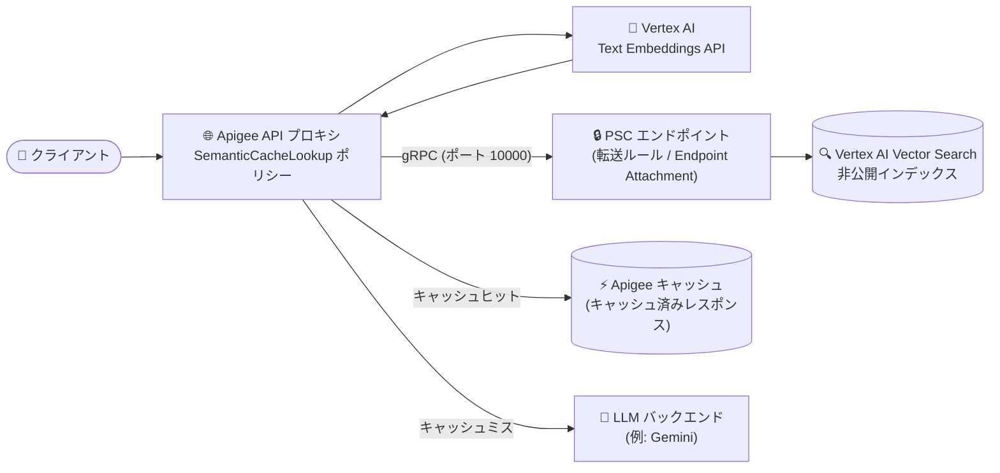

# Apigee X: SemanticCacheLookup ポリシーの Vertex AI Vector Search PSC エンドポイント非互換問題の修正

**リリース日**: 2026-09-10

**サービス**: Apigee X

**機能**: SemanticCacheLookup ポリシーと Vertex AI Vector Search Private Service Connect (PSC) エンドポイントの互換性修正

**ステータス**: Fixed (バグ修正 / 2026 年 8 月 27 日付リリースノート 1-18-0-apigee-4 への補遺)

📊 [このアップデートのインフォグラフィックを見る](https://takech9203.github.io/google-cloud-news-summary/20260910-apigee-x-semantic-cache-lookup-psc-fix.html)

## 概要

2026 年 9 月 10 日、Apigee X のリリースノートに、2026 年 8 月 27 日付リリース (1-18-0-apigee-4) への補遺としてバグ修正 (Bug ID: 502540992) が公開されました。SemanticCacheLookup ポリシーが Vertex AI Vector Search の Private Service Connect (PSC) エンドポイントと互換性がなかった問題が修正されています。

SemanticCacheLookup ポリシーは、LLM (大規模言語モデル) ワークロードのパフォーマンスを最適化するための高度なキャッシュポリシーです。Vertex AI Text Embeddings API でプロンプトの埋め込み (エンベディング) を生成し、Vertex AI Vector Search で意味的類似度に基づく類似プロンプト検索を行うことで、完全一致ではなくセマンティックな類似性でキャッシュヒットを判定します。SemanticCachePopulate ポリシーと組み合わせて使用し、LLM への呼び出し回数を削減してレスポンスタイムとコストを最適化します。

今回の修正により、Vector Search インデックスを PSC 経由の非公開エンドポイントにデプロイしている環境でも、SemanticCacheLookup ポリシーによるセマンティックキャッシュが正しく動作するようになりました。セキュリティ要件により Vector Search をインターネット非公開で運用する必要があるエンタープライズユーザーにとって重要な修正です。

**アップデート前の課題**

- SemanticCacheLookup ポリシーが Vertex AI Vector Search の PSC エンドポイントと互換性がなく、PSC 経由の非公開インデックスに対する類似検索が正常に動作しなかった
- PSC エンドポイントを利用できない場合、類似検索には公開エンドポイント (REST の `:findNeighbors`) を使用する必要があり、Vector Search インデックスをインターネット非公開で運用したいセキュリティ要件と両立しにくかった

**アップデート後の改善**

- SemanticCacheLookup ポリシーの `<SimilaritySearch>` で `<PrivateServiceConnect>` (`<GrpcEndpoint>`) を指定し、PSC エンドポイントにデプロイされた非公開 Vector Search インデックスに対して gRPC で類似検索を実行できるようになった
- VPC 内に閉じたネットワーク分離を維持したまま、LLM プロキシにセマンティックキャッシュを適用できるようになった

## アーキテクチャ図



Apigee の SemanticCacheLookup ポリシーがユーザープロンプトの埋め込みを生成し、PSC エンドポイント経由 (gRPC) で非公開の Vector Search インデックスに類似検索を実行するフローです。類似プロンプトが見つかればキャッシュ済みレスポンスを返却し、見つからなければ LLM バックエンドに転送します。

## サービスアップデートの詳細

### 主要機能

1. **PSC エンドポイントとの互換性修正 (Bug ID: 502540992)**
   - SemanticCacheLookup ポリシーが Vertex AI Vector Search の PSC エンドポイントと互換性がなかった問題を修正
   - 2026 年 8 月 27 日付の Apigee リリース (1-18-0-apigee-4) に対する補遺として公開

2. **`<PrivateServiceConnect>` 要素による非公開類似検索**
   - `<SimilaritySearch>` の子要素として `<URL>` (公開エンドポイント・REST) または `<PrivateServiceConnect>` (非公開エンドポイント・gRPC) のいずれかを指定
   - `<GrpcEndpoint>` に `grpc://{TARGET_HOST}:10000` 形式で PSC エンドポイントのアドレスを指定 (TARGET_HOST は Endpoint Attachment の IP アドレス、またはピアリングされた Cloud DNS ゾーンのプライベート DNS レコード)

3. **セマンティックキャッシュによる LLM 最適化 (前提となる機能)**
   - Vertex AI Text Embeddings API でプロンプトの埋め込みを生成し、Vector Search で意味的類似検索を実行
   - 類似プロンプトのキャッシュヒットにより LLM 呼び出しを削減し、レイテンシとコストを低減
   - SemanticCachePopulate ポリシーがレスポンスフローでキャッシュと Vector Search インデックスを更新

## 技術仕様

### PSC 経由の類似検索の仕様

| 項目 | 詳細 |
|------|------|
| 対象ポリシー | SemanticCacheLookup (Extensible ポリシー) |
| 接続方式 | gRPC (スキームは `grpc://` のみ。`grpcs://` (TLS) は本バージョンでは非対応) |
| ポート | 10000 (Vector Search PSC データプレーンエンドポイント) |
| セキュリティ | gRPC ホップは平文・非認証。ネットワーク分離によって保護される |
| インデックス要件 | `STREAM_UPDATE` 方式、埋め込みモデルと一致する次元数、ポリシーの `<DistanceMeasureType>` と一致する距離尺度 |
| projectAllowlist | PSC インデックスエンドポイントの許可リストに Apigee テナントプロジェクト (Organizations API の `apigeeProjectId`) を含める必要あり (作成後は変更不可) |
| 必要なロール | プロキシのデプロイに使用するサービスアカウントに AI Platform User (`roles/aiplatform.user`) |
| 対応環境タイプ | Intermediate または Comprehensive 環境のみ |

### ポリシー設定例 (PSC エンドポイント使用時)

```xml
<SemanticCacheLookup async="false" continueOnError="false" enabled="true" name="SCL-lookup">
  <DisplayName>SCL-lookup</DisplayName>
  <IgnoreUnresolvedVariables>false</IgnoreUnresolvedVariables>
  <UserPromptSource>{jsonPath('$.contents[-1].parts[-1].text',request.content,true)}</UserPromptSource>
  <Embeddings>
    <VertexAI>
      <URL>https://{LOCATION}-aiplatform.googleapis.com/v1/projects/{PROJECT_ID}/locations/{LOCATION}/publishers/google/models/{MODEL_ID}:predict</URL>
    </VertexAI>
  </Embeddings>
  <SimilaritySearch>
    <VertexAI>
      <PrivateServiceConnect>
        <GrpcEndpoint>grpc://{TARGET_HOST}:10000</GrpcEndpoint>
      </PrivateServiceConnect>
      <DeployedIndexID>{DEPLOYED_INDEX_ID}</DeployedIndexID>
      <Threshold>0.95</Threshold>
      <DistanceMeasureType>DOT_PRODUCT_DISTANCE</DistanceMeasureType>
    </VertexAI>
  </SimilaritySearch>
</SemanticCacheLookup>
```

## 設定方法

### 前提条件

1. Vertex AI Text Embeddings API を有効化・構成済みであること
2. Vector Search インデックス (`STREAM_UPDATE` 方式) を作成し、PSC 対応のインデックスエンドポイント (`enablePrivateServiceConnect: true`、`projectAllowlist` に Apigee テナントプロジェクトを含む) にデプロイ済みであること
3. Apigee インスタンスに Intermediate または Comprehensive 環境があること
4. プロキシのサービスアカウントに `roles/aiplatform.user` が付与されていること

### 手順

#### ステップ 1: サービスアタッチメントへの接続

```bash
# デプロイ済みインデックスエンドポイントのサービスアタッチメント URI を確認
gcloud ai index-endpoints list --region=$REGION | grep -i serviceAttachment:
```

Apigee からは Endpoint Attachment (またはピアリングされた Cloud DNS のプライベート DNS レコード) を通じてサービスアタッチメントに接続します。詳細は公式チュートリアル「[Semantic caching with a private (Private Service Connect) endpoint](https://docs.cloud.google.com/apigee/docs/api-platform/tutorials/using-semantic-caching-policies-psc)」を参照してください。

#### ステップ 2: SemanticCacheLookup / SemanticCachePopulate ポリシーの設定とプロキシのデプロイ

```bash
# プロキシのサービスアカウントに AI Platform User ロールを付与
gcloud projects add-iam-policy-binding $PROJECT_ID \
  --member="serviceAccount:SERVICE_ACCOUNT" \
  --role="roles/aiplatform.user"
```

`<SimilaritySearch>` に `<PrivateServiceConnect><GrpcEndpoint>` を設定した API プロキシバンドルをインポートし、サービスアカウントを指定してデプロイします。同じリクエストを 2 回送信し、デバッグセッションで `SemanticCacheLookup.{policy_name}.cache_hit` などのフロー変数を確認することで動作を検証できます。

## メリット

### ビジネス面

- **セキュリティ要件との両立**: Vector Search インデックスをインターネット非公開のまま運用しつつ、LLM API のセマンティックキャッシュによるコスト削減 (LLM 呼び出し回数の削減) を実現できる
- **エンタープライズ導入の障壁解消**: PSC を前提とするネットワーク設計を採用する組織でも、Apigee の AI 向けポリシーを採用可能になった

### 技術面

- **ネットワーク分離の維持**: PSC 経由の gRPC 接続により、類似検索トラフィックが VPC 内に閉じ、公開エンドポイントを経由しない
- **低レイテンシ**: キャッシュヒット時は LLM を呼び出さずにキャッシュ済みレスポンスを返却し、レスポンスタイムを短縮

## デメリット・制約事項

### 制限事項

- PSC 経由の gRPC 接続は `grpc://` (平文) のみ対応で、`grpcs://` (TLS) は本バージョンでは非対応 (ネットワーク分離により保護)
- セマンティックキャッシュポリシーは Intermediate または Comprehensive 環境でのみデプロイ可能
- PSC インデックスエンドポイントの `projectAllowlist` は作成後に変更できず、誤った場合はエンドポイントの再作成が必要
- SemanticCacheLookup は Extensible ポリシーであり、Apigee のライセンスによってはコストや利用量への影響がある

### 考慮すべき点

- インデックスの距離尺度 (`distanceMeasureType`) とポリシーの `<DistanceMeasureType>` を一致させる必要がある (不一致の値を指定するとデプロイが失敗、1-18-0-apigee-4 より前のバージョンでは要素が無視される)
- インデックスの次元数は使用する埋め込みモデルの出力次元 (例: gemini-embedding-001 はデフォルト 3072 次元) と一致させる必要がある
- 本修正は 1-18-0-apigee-4 リリースへの補遺であるため、利用するには該当リリース以降のランタイムが適用されている必要がある

## ユースケース

### ユースケース 1: 社内向け生成 AI ゲートウェイのセマンティックキャッシュ

**シナリオ**: 金融機関などセキュリティ要件の厳しい企業が、Apigee を生成 AI ゲートウェイとして利用し、Gemini などの LLM への社内 API を提供している。コンプライアンス上、Vector Search インデックスは公開エンドポイントに晒せない。

**実装例**:
```xml
<SimilaritySearch>
  <VertexAI>
    <PrivateServiceConnect>
      <GrpcEndpoint>grpc://10.0.1.10:10000</GrpcEndpoint>
    </PrivateServiceConnect>
    <DeployedIndexID>semantic_cache_deployed_index</DeployedIndexID>
    <Threshold>0.95</Threshold>
  </VertexAI>
</SimilaritySearch>
```

**効果**: ネットワーク分離を維持したまま、類似質問への回答をキャッシュから返却し、LLM の呼び出しコストとレイテンシを削減できる。

### ユースケース 2: FAQ ボット・カスタマーサポート API の応答最適化

**シナリオ**: 顧客からの問い合わせは表現が異なっても意味的に同じ質問が多い。完全一致キャッシュではヒット率が低く、LLM 呼び出しが頻発してコストが増大している。

**効果**: 意味的類似度 (しきい値例: 0.95) に基づくキャッシュヒットにより、言い回しの異なる同種の質問にもキャッシュ済みレスポンスを返却し、バックエンド LLM への呼び出し量を大幅に削減できる。

## 料金

本アップデートはバグ修正であり、料金体系の変更はありません。なお、SemanticCacheLookup は Extensible ポリシーに分類され、Apigee のライセンス (サブスクリプションまたは従量課金) によってコストや利用量への影響が異なります。また、Vertex AI Text Embeddings API、Vector Search、PSC (転送ルール) の利用にはそれぞれの料金が発生します。

- [Apigee の料金](https://cloud.google.com/apigee/pricing)
- [Vertex AI の料金](https://cloud.google.com/vertex-ai/pricing)

## 利用可能リージョン

Apigee X が利用可能なリージョンで適用されます。本修正は 1-18-0-apigee-4 リリースへの補遺として、ランタイムのロールアウトに従って適用されます。詳細は [Apigee のロケーション](https://cloud.google.com/apigee/docs/locations)を参照してください。

## 関連サービス・機能

- **Vertex AI Vector Search**: 類似プロンプト検索を担うベクトル検索サービス。本修正により PSC エンドポイントにデプロイした非公開インデックスとの連携が正常動作する
- **Private Service Connect (PSC)**: VPC 間でサービスを非公開に公開・消費する仕組み。サービスアタッチメントと転送ルール (Endpoint Attachment) により Apigee から Vector Search への非公開接続を実現する
- **Vertex AI Text Embeddings API**: ユーザープロンプトの埋め込み生成に使用 (例: gemini-embedding-001)
- **SemanticCachePopulate ポリシー**: レスポンスフローで Apigee キャッシュと Vector Search インデックス (upsertDatapoints) を更新する対のポリシー
- **DataCapture ポリシー**: SemanticCacheLookup のフロー変数 (`cache_hit` など) を収集し、キャッシュヒット率などのカスタム分析レポートを作成可能

## 参考リンク

- 📊 [インフォグラフィック](https://takech9203.github.io/google-cloud-news-summary/20260910-apigee-x-semantic-cache-lookup-psc-fix.html)
- [公式リリースノート](https://docs.cloud.google.com/release-notes#September_10_2026)
- [SemanticCacheLookup ポリシー リファレンス](https://docs.cloud.google.com/apigee/docs/api-platform/reference/policies/semantic-cache-lookup-policy)
- [チュートリアル: Semantic caching with a private (Private Service Connect) endpoint](https://docs.cloud.google.com/apigee/docs/api-platform/tutorials/using-semantic-caching-policies-psc)
- [チュートリアル: Get started with semantic caching policies](https://docs.cloud.google.com/apigee/docs/api-platform/tutorials/using-semantic-caching-policies)
- [Vertex AI Vector Search の概要](https://docs.cloud.google.com/vertex-ai/docs/vector-search/overview)
- [Private Service Connect](https://docs.cloud.google.com/vpc/docs/private-service-connect)
- [Apigee の料金](https://cloud.google.com/apigee/pricing)

## まとめ

本修正により、SemanticCacheLookup ポリシーが Vertex AI Vector Search の PSC エンドポイントと正しく連携できるようになり、ネットワーク分離要件のある環境でも LLM ワークロードのセマンティックキャッシュを適用できるようになりました。Vector Search を非公開で運用しつつ Apigee で AI ゲートウェイを構築しているユーザーは、1-18-0-apigee-4 以降のランタイムが適用されていることを確認のうえ、`<PrivateServiceConnect>` 構成での類似検索の動作を検証することを推奨します。

---

**タグ**: #ApigeeX #SemanticCache #VertexAI #VectorSearch #PrivateServiceConnect #LLM #バグ修正
