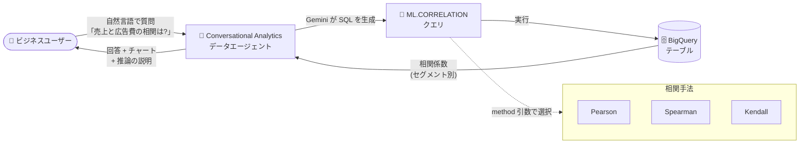

# BigQuery: Conversational Analytics が ML.CORRELATION 関数をサポート (Preview)

**リリース日**: 2026-09-10

**サービス**: BigQuery (Conversational Analytics)

**機能**: Conversational Analytics における ML.CORRELATION 関数のサポート

**ステータス**: Preview

📊 [このアップデートのインフォグラフィックを見る](https://takech9203.github.io/google-cloud-news-summary/20260910-bigquery-conversational-analytics-ml-correlation.html)

## 概要

BigQuery の Conversational Analytics (会話型分析) が、`ML.CORRELATION` 関数をサポートしました (Preview)。`ML.CORRELATION` は、テーブル内のターゲット列と 1 つ以上のメトリック列との間の統計的な相関係数を計算する関数です。今回のアップデートにより、データエージェントとの自然言語の対話の中で「体重はヒレの長さとどのように相関しているか?」のような質問をするだけで、エージェントが `ML.CORRELATION` を使った SQL を自動生成し、相関分析の結果を返せるようになりました。

`ML.CORRELATION` 関数自体も強力な機能を備えています。1 つのターゲット変数に対して複数のメトリック列を同時に相関計算できるマルチカラム対応、`GROUP BY CUBE` に類似したディメンション別の自動スライス計算、そして Pearson / Spearman / Kendall の 3 種類の相関手法のサポートです。これにより、SQL を書き慣れていないビジネスユーザーでも、会話を通じてセグメント別の相関分析まで実行できます。

対象ユーザーは、BigQuery 上のデータに対して自然言語で分析を行いたいデータアナリスト、ビジネスユーザー、およびデータエージェントを構築するデータサイエンティストです。

**アップデート前の課題**

- Conversational Analytics のデータエージェントは相関分析用の専用関数に対応しておらず、「A と B の相関を調べたい」という質問に対して統計的に適切な回答を生成することが難しかった
- 相関分析を行うには、ユーザー自身が `CORR` 関数などを使った SQL を記述する必要があり、ディメンション別に相関を計算するには `GROUP BY` を組み合わせた複雑なクエリが必要だった
- Spearman や Kendall といった順位相関を計算するには、標準関数では対応できず独自実装が必要だった

**アップデート後の改善**

- 自然言語の質問 (例: 「売上と広告費の相関を国別に分析して」) から、エージェントが `ML.CORRELATION` を使った SQL を自動生成できるようになった
- 1 回の関数呼び出しで、複数メトリックとの相関をディメンションの全組み合わせについて一括計算できるようになった
- Pearson に加えて Spearman、Kendall の相関手法を引数で選択できるようになった

## アーキテクチャ図



ユーザーが自然言語で相関に関する質問をすると、データエージェント (Gemini) が `ML.CORRELATION` を含む SQL を生成して BigQuery 上で実行し、セグメント別の相関係数を回答として返します。

## サービスアップデートの詳細

### 主要機能

1. **Conversational Analytics での相関分析**
   - データエージェントとの会話や検証済みクエリ (verified queries) の中で `ML.CORRELATION` が利用可能になった
   - 「How does body mass correlate with flipper length, culmen length, and culmen depth?」のようなワンショットの質問で相関分析を起動できる
   - `AI.FORECAST`、`AI.KEY_DRIVERS`、`ML.DESCRIBE_DATA` など、既にサポートされている AI/ML 関数群に相関分析が加わった

2. **マルチカラム相関マトリクス**
   - 1 つのターゲット変数 (`target_col`) に対して、複数のメトリック列 (`target_correlation_cols`) との相関を同時に計算
   - 結果は列ペアとデータセグメントごとに 1 行で返される

3. **ディメンションスライシング**
   - `dimension_cols` に指定した列 (最大 12 列) の全組み合わせについて相関を自動計算
   - `GROUP BY CUBE` 操作に類似した動作で、全体集計とセグメント別集計を一度に取得できる
   - 出力の `segment` 列により、グローバル集計による NULL とデータ欠損による NULL を区別可能

4. **柔軟な相関手法**
   - Pearson (デフォルト)、Spearman、Kendall の 3 手法を `method` 引数で選択可能

## 技術仕様

### ML.CORRELATION 関数の構文

```sql
ML.CORRELATION(
  { TABLE table_name | (query_statement) },
  target_col => target_col,
  target_correlation_cols => target_correlation_cols
  [, dimension_cols => dimension_cols ]
  [, method => method ]
);
```

### 引数

| 引数 | 詳細 |
|------|------|
| `TABLE_NAME` / `QUERY_STATEMENT` | 分析対象の BigQuery テーブル、または SQL クエリの結果 |
| `target_col` | 分析対象の主となる数値列の名前 (STRING) |
| `target_correlation_cols` | ターゲット列と相関を計算する 1 つ以上の数値列 (STRING または ARRAY&lt;STRING&gt;) |
| `dimension_cols` | データをスライスする列 (最大 12 列、グループ化可能な型のみ) |
| `method` | `PEARSON` (デフォルト) / `SPEARMAN` / `KENDALL` |

### 出力列

| 列 | 詳細 |
|------|------|
| `segment` | 各ディメンションのキーと値のペアを格納する ARRAY&lt;STRUCT&lt;dimension_col STRING, dimension_value JSON&gt;&gt; |
| `dimension_col` (各ディメンション列) | 指定したディメンションごとに 1 列。NULL はロールアップまたは実データの NULL を示す |
| `target_col` | 入力ターゲット列の名前 |
| `corr_col` | ターゲット列と相関を計算したメトリック列の名前 |
| `correlation` | 相関係数 (-1.0 〜 1.0 の FLOAT64) |
| `segment_size` | セグメントの相関計算に使用された行数 (INT64) |
| `segment_proportion` | 全行数に対するセグメントの割合 (FLOAT64) |

## 設定方法

### 前提条件

1. BigQuery が利用可能な Google Cloud プロジェクト
2. Conversational Analytics で生成 AI クエリを実行するための権限 (エンドユーザー認証情報での生成 AI クエリ実行権限)
3. Preview 機能のため、Pre-GA Offerings Terms が適用される点に留意

### 手順

#### ステップ 1: SQL で ML.CORRELATION を直接実行する

```sql
SELECT country, segment, correlation, segment_size
FROM ML.CORRELATION(
  TABLE my_dataset.marketing_sample,
  target_col => 'revenue',
  target_correlation_cols => 'ad_spend',
  dimension_cols => ['country']
);
```

`revenue` と `ad_spend` の Pearson 相関を、国別および全体集計で計算します。

#### ステップ 2: Conversational Analytics から利用する

Google Cloud コンソールの BigQuery で、Agent Catalog タブからデータエージェントを作成 (またはデータソースとの直接会話を開始) し、自然言語で質問します。

```text
例: 「体重はヒレの長さ、くちばしの長さ、くちばしの深さと
     どのように相関していますか?」
```

エージェントが `ML.CORRELATION` を使った SQL を生成し、結果と推論の説明を返します。検証済みクエリ (verified queries) に `ML.CORRELATION` を含めて、定型レポートを自動化することもできます。

## メリット

### ビジネス面

- **分析の民主化**: SQL や統計の専門知識がないビジネスユーザーでも、会話を通じてセグメント別の相関分析を実行できる
- **意思決定の高速化**: 「どの指標が売上に効いているか」といった問いに対して、アドホックな分析依頼なしにその場で回答を得られる

### 技術面

- **クエリの簡素化**: 従来は `CORR` + `GROUP BY` の組み合わせや UNION が必要だった多次元の相関分析が、1 つの関数呼び出しで完結する
- **順位相関のネイティブサポート**: Spearman / Kendall が組み込みで利用でき、外れ値に頑健な分析や非線形な単調関係の検出が可能
- **NULL の意味の判別**: `segment` 列により、ロールアップによる NULL と実データの NULL をプログラムで区別できる

## デメリット・制約事項

### 制限事項

- Preview 段階のため、Pre-GA Offerings Terms が適用され、サポートが限定される可能性がある
- `dimension_cols` に指定できる列は最大 12 列で、グループ化可能なデータ型に限られる
- `KENDALL` 法は計算量が多く、大規模データセットでは低速になる可能性がある (大規模テーブルでは `PEARSON` または `SPEARMAN` を推奨)

### 考慮すべき点

- Conversational Analytics は Gemini for Google Cloud を利用しており、もっともらしく見えるが事実と異なる出力を生成する可能性があるため、結果の検証が推奨される
- Gemini モデルの容量は Dynamic Shared Quota (DSQ) で管理されており、需要ピーク時には一時的な 429 エラーが発生する場合がある
- データエージェントが実行する BigQuery ジョブには `ca-bq-job` などのラベルが付与されるため、コスト分析や監査に活用できる (ジョブあたり 64 ラベルの上限にカウントされる)

## ユースケース

### ユースケース 1: マーケティング施策の効果分析

**シナリオ**: マーケティング担当者が、広告費・予算と売上の関係を国別・商品カテゴリ別に把握したい。

**実装例**:
```sql
SELECT *
FROM ML.CORRELATION(
  (SELECT * FROM my_dataset.marketing_sample WHERE country = 'USA'),
  target_col => 'revenue',
  target_correlation_cols => ['ad_spend', 'budget'],
  dimension_cols => ['city', 'product_category']
)
ORDER BY segment_size DESC, corr_col
LIMIT 5;
```

**効果**: 都市 x 商品カテゴリの全組み合わせについて、売上と広告費・予算の相関係数を一括で取得でき、投資効果の高いセグメントを特定できる。

### ユースケース 2: 会話型のデータ探索 (探索的データ分析)

**シナリオ**: データサイエンティストが、モデリングの前段階として特徴量とターゲット変数の関係を素早く確認したい。データエージェントに「ペンギンの体重はヒレの長さ、くちばしの長さ、くちばしの深さとどう相関している?」と質問する。

**効果**: SQL を書かずに複数特徴量との相関マトリクスを取得でき、特徴量選択やモデル設計の初期検討を高速化できる。検証済みクエリとして登録すれば、チーム全体で再利用可能な定型分析にできる。

## 料金

`ML.CORRELATION` は BigQuery の SQL 関数として実行されるため、通常の BigQuery クエリと同様にコンピュート料金 (オンデマンドまたは容量ベース) が発生します。Conversational Analytics の利用条件と課金の詳細は、公式の料金ページおよびドキュメントを参照してください。

- [BigQuery の料金](https://cloud.google.com/bigquery/pricing)
- [Gemini for Google Cloud の料金](https://cloud.google.com/products/gemini/pricing)

なお、データエージェントが実行したジョブには `ca-bq-job: true` などのラベルが付与されるため、請求レポートをラベルでフィルタリングしてエージェント由来のコストを把握できます。

## 利用可能リージョン

公式ドキュメントでリージョン別の対応状況を確認してください。

- [BigQuery のロケーション](https://cloud.google.com/bigquery/docs/locations)

## 関連サービス・機能

- **Gemini for Google Cloud**: Conversational Analytics の基盤となる生成 AI。自然言語の質問から SQL を生成する
- **Conversational Analytics API**: コンソールで作成したデータエージェントを API 経由で呼び出し、独自アプリケーションに組み込める
- **BigQuery ML の分析関数群**: `AI.KEY_DRIVERS` (要因分析)、`ML.DESCRIBE_DATA` (データプロファイリング)、`ML.DETECT_CHANGE_POINTS` (変化点検出) などと組み合わせて、会話型の高度な分析を実現できる
- **統計集計関数 `CORR`**: 従来からある Pearson 相関の集計関数。単一ペア・単一グループの相関計算であればこちらでも対応可能

## 参考リンク

- 📊 [インフォグラフィック](https://takech9203.github.io/google-cloud-news-summary/20260910-bigquery-conversational-analytics-ml-correlation.html)
- [公式リリースノート](https://docs.cloud.google.com/release-notes#September_10_2026)
- [ML.CORRELATION 関数のドキュメント](https://docs.cloud.google.com/bigquery/docs/reference/standard-sql/bigqueryml-syntax-correlation)
- [Conversational Analytics の概要](https://docs.cloud.google.com/bigquery/docs/conversational-analytics)
- [BigQuery の料金ページ](https://cloud.google.com/bigquery/pricing)

## まとめ

このアップデートにより、BigQuery の Conversational Analytics で自然言語による相関分析が可能になり、SQL を書けないユーザーでもセグメント別の統計的インサイトを得られるようになりました。マルチカラム・多次元スライス・3 種類の相関手法を備えた `ML.CORRELATION` は、探索的データ分析の強力なツールです。まずは SQL で関数の挙動を確認し、次にデータエージェントの検証済みクエリに組み込んで、チームの定型分析を会話型に移行することを推奨します。

---

**タグ**: #BigQuery #ConversationalAnalytics #BigQueryML #MLCorrelation #Gemini #Preview #DataAnalytics
