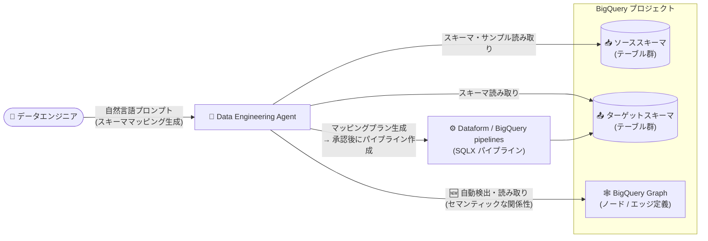

# BigQuery: Data Engineering Agent と BigQuery Graph の統合 (GA)

**リリース日**: 2026-09-10

**サービス**: BigQuery

**機能**: Data Engineering Agent の BigQuery Graph 統合によるスキーママッピング精度の向上

**ステータス**: 一般提供 (GA)

📊 [このアップデートのインフォグラフィックを見る](https://takech9203.github.io/google-cloud-news-summary/20260910-bigquery-data-engineering-agent-graph-integration.html)

## 概要

BigQuery の Data Engineering Agent が BigQuery Graph と統合され、一般提供 (GA) となりました。Data Engineering Agent は自然言語プロンプトでデータパイプラインの構築・変更・トラブルシューティングを行える AI エージェントです。今回の統合により、エージェントがプロジェクト内の BigQuery Graph (プロパティグラフ) を自動的に検出・読み取り、ソーススキーマとターゲット (デスティネーション) スキーマ間の追加コンテキストとして活用することで、データエンジニアリングパイプラインにおけるスキーママッピングの精度が向上します。

BigQuery Graph はノードとエッジでデータ間の関係をモデル化する機能であり、エージェントはこのグラフからソーステーブルとターゲットテーブル間のセマンティックな関係性を理解できます。これにより、複雑なデータセットの移行や変換の際に、より正確なマッピングを生成し、手動での介入を削減できます。

対象ユーザーは、Dataform や BigQuery pipelines を使ってスキーママッピングを伴うデータパイプライン (データ移行、データウェアハウスのモデル変換など) を構築するデータエンジニアです。

**アップデート前の課題**

- エージェントがスキーママッピングを生成する際、テーブルのスキーマやサンプルデータなどからマッピングを推論しており、テーブル間のセマンティックな関係性 (エンティティ間のつながり) を体系的に参照する仕組みがなかった
- 複雑なデータセットの移行・変換では、生成されたマッピングをユーザーが手動で修正・介入する必要があった

**アップデート後の改善**

- プロジェクト内に関連する BigQuery Graph が存在する場合、エージェントがデータセットを自動的にスキャンしてグラフを検出・読み取り、追加コンテキストとして利用するようになった
- グラフが表現するセマンティックな関係性 (プロパティグラフのエッジ定義) に基づいて結合パスをマッピングできるようになり、直積 (Cartesian) の爆発や型の不一致を回避しつつ、スキーママッピングの精度が向上した
- 複雑なデータセットの移行・変換における手動介入が削減された

## アーキテクチャ図



Data Engineering Agent がスキーママッピング生成時にソース/ターゲットスキーマに加えて BigQuery Graph を自動検出・読み取りし、テーブル間のセマンティックな関係性をコンテキストとして高精度なマッピングプランとパイプラインを生成するフローです。

## サービスアップデートの詳細

### 主要機能

1. **BigQuery Graph の自動検出と読み取り**
   - スキーママッピングの生成をエージェントにプロンプトすると、エージェントがデータセットを自動的にスキャンし、関連する BigQuery Graph が存在する場合はそれを利用する
   - ユーザーがグラフを明示的に指定する必要はない

2. **セマンティックな関係性に基づくスキーママッピング**
   - エージェントは BigQuery Graph を読み取り、ソーステーブルとターゲットテーブル間のセマンティックな関係性を理解する
   - プロパティグラフのエッジ定義に整合した結合パス (join-path) を直接マッピングし、直積の爆発や型の不一致を回避する (Join graph optimization)

3. **スキーママッピングのプラン生成**
   - エージェントは以下のステップでプランを生成する
     - **Anchor table selection**: 各ターゲットテーブルに対する主要なソーステーブルの決定
     - **Join graph optimization**: エッジ定義に整合した結合パスのマッピング
     - **Field-level gap analysis**: すべてのマッピングを Direct / Derived / Joined / Aggregated のいずれかに分類し、NOT NULL および REQUIRED 制約の整合性を検証
   - ユーザーはプランをレビュー・確認した後、そのスキーママッピングに基づくパイプライン作成をエージェントに指示できる

## 技術仕様

### Data Engineering Agent の主な特徴

| 項目 | 詳細 |
|------|------|
| 操作方法 | 自然言語プロンプト (BigQuery pipelines インターフェース、Dataform、VS Code 拡張機能、Data Engineering Agent API) |
| パイプラインコード | Dataform リポジトリ / ワークスペース内に SQLX として生成・整理 |
| マッピング分類 | Direct / Derived / Joined / Aggregated |
| 制約検証 | NOT NULL、REQUIRED 制約の整合性を検証 |
| Graph 利用条件 | プロジェクト内に関連する BigQuery Graph が存在する場合に自動検出・利用 |
| 処理リージョン | `us`、`eu`、`global` の管轄レベルのリージョン化に対応 (Dataform ワークスペースのロケーションに基づき自動割り当て) |

### スキーママッピングのプロンプト例

```text
Create a Dataform pipeline to map the tables from schema SOURCE_SCHEMA
to schema TARGET_SCHEMA. Give me the plan.
```

`SOURCE_SCHEMA` にソーステーブルのスキーマ名、`TARGET_SCHEMA` にターゲットテーブルのスキーマ名を指定します。エージェントがプランを生成するので、マッピングロジックを確認した上でパイプライン作成を指示します。

## メリット

### ビジネス面

- **移行・変換プロジェクトの工数削減**: 複雑なデータセットの移行や変換におけるスキーママッピングの手動介入が削減され、データエンジニアリングの生産性が向上する
- **既存のグラフ資産の活用**: 不正検知や顧客 360 分析などのために構築済みの BigQuery Graph を、パイプライン開発のコンテキストとしても再利用できる

### 技術面

- **マッピング精度の向上**: グラフのエッジ定義に整合した結合パスを利用することで、直積の爆発や型の不一致といった典型的なマッピングエラーを回避できる
- **自動検出による透過的な統合**: ユーザー側での追加設定は不要で、関連するグラフが存在すればエージェントが自動的に利用する
- **プランレビューによる統制**: マッピングロジックをプランとして事前にレビュー・承認でき、生成コードの品質を管理できる

## デメリット・制約事項

### 考慮すべき点

- 本機能の恩恵を受けるには、プロジェクト内にソース/ターゲットテーブルに関連する BigQuery Graph が定義されている必要がある
- BigQuery Graph は BigQuery エディションにより利用可否が異なる。GQL クエリの実行には Enterprise または Enterprise Plus エディションの予約が必要 (Standard エディションでは BigQuery Graph は利用不可。オンデマンド料金ではグラフ作成、GRAPH_EXPAND 関数、メジャーの利用が可能だが GQL クエリは非対応)
- Data Engineering Agent は Gemini in BigQuery の一部であり、生成された出力は利用前に検証することが推奨される
- BigQuery Graph へのアクセス制御とグラフ作成方法については公式ドキュメント ([Create and query BigQuery Graph](https://docs.cloud.google.com/bigquery/docs/graph-create)) を参照

## ユースケース

### ユースケース 1: 複雑なデータセットのデータウェアハウス移行

**シナリオ**: 多数のソーステーブルを持つ既存システムから、新しいターゲットスキーマ (データウェアハウスのモデル) へデータを移行する。テーブル間の関係が複雑で、手動でのマッピング設計に時間がかかっている。

**実装例**:
```text
Create a Dataform pipeline to map the tables from schema legacy_erp
to schema dwh_sales. Give me the plan.
```

**効果**: プロジェクト内の BigQuery Graph が表すエンティティ間の関係性をエージェントが自動的に参照し、アンカーテーブル選定・結合パス最適化・フィールドレベルのギャップ分析を含む高精度なマッピングプランを生成。レビュー後にそのままパイプライン化できる。

### ユースケース 2: グラフ資産を持つ組織でのパイプライン変換精度向上

**シナリオ**: 不正検知や顧客 360 分析のために BigQuery Graph を既に構築している組織が、同じデータセットに対する変換パイプラインを Data Engineering Agent で開発する。

**効果**: 既存のグラフ定義 (ノード/エッジ) がエージェントの追加コンテキストとして自動活用され、セマンティックな関係性を踏まえた正確なスキーママッピングが得られ、手動修正が減る。

## 料金

Data Engineering Agent の利用はトークンベースで課金されます (BigQuery 料金ページより)。

| 項目 | 料金 (USD) |
|------|-----------|
| 入力データ (Data Engineering Agent) | $3 / 100 万トークン |
| 出力データ (Data Engineering Agent) | $20 / 100 万トークン |

BigQuery Graph 自体は BigQuery の容量ベース (capacity-based) の料金モデルを使用します。GQL クエリの実行には Enterprise または Enterprise Plus エディションの予約が必要で、グラフクエリはスロット単位の容量コンピューティング料金で課金されます。ストレージはグラフ定義の基になるテーブルに対して 1 回のみ課金され、グラフモデルの数によらず標準の BigQuery ストレージ料金に従います。

詳細は [BigQuery の料金ページ](https://cloud.google.com/bigquery/pricing) および [Gemini for Google Cloud の料金ページ](https://cloud.google.com/products/gemini/pricing) を参照してください。

## 利用可能リージョン

Data Engineering Agent は `us`、`eu`、`global` の管轄レベルのリージョン化 (専用サービスエンドポイント) に対応しています。リージョンは関連付けられた Dataform ワークスペースのロケーションに基づいて自動的に割り当てられます。詳細は [Where Gemini in BigQuery processes your data](https://docs.cloud.google.com/bigquery/docs/gemini-locations) を参照してください。

## 関連サービス・機能

- **BigQuery Graph**: ノードとエッジでデータをモデル化し、ISO GQL 標準準拠のグラフクエリを実行できる BigQuery の機能。本アップデートでエージェントのコンテキストソースとなった
- **Dataform**: エージェントが生成するパイプラインコード (SQLX) の管理基盤。リポジトリ/ワークスペース内に直接コードが生成される
- **BigQuery pipelines**: BigQuery Studio 上でエージェントを利用してパイプラインを構築できるインターフェース
- **Knowledge Catalog**: エージェントが追加コンテキストとして統合しているメタデータカタログ。テーブル設定からのメタデータ自動生成にも対応
- **Spanner Graph**: BigQuery Graph と同じグラフスキーマ・クエリ言語を共有し、運用系グラフワークロードと分析系グラフワークロードを再モデル化なしで使い分けられる

## 参考リンク

- 📊 [インフォグラフィック](https://takech9203.github.io/google-cloud-news-summary/20260910-bigquery-data-engineering-agent-graph-integration.html)
- [公式リリースノート](https://docs.cloud.google.com/release-notes#September_10_2026)
- [Data Engineering Agent overview - Schema mapping with BigQuery Graph](https://docs.cloud.google.com/gemini/data-agents/data-engineering-agent/agent-overview#schema-mapping-with-graph)
- [BigQuery Graph overview](https://docs.cloud.google.com/bigquery/docs/graph-overview)
- [Create and query BigQuery Graph](https://docs.cloud.google.com/bigquery/docs/graph-create)
- [Data Engineering Agent でのパイプライン構築](https://docs.cloud.google.com/bigquery/docs/data-engineering-agent-pipelines)
- [BigQuery の料金](https://cloud.google.com/bigquery/pricing)

## まとめ

Data Engineering Agent と BigQuery Graph の統合が GA となり、グラフが表すセマンティックな関係性を活用した高精度なスキーママッピングが追加設定なしで利用できるようになりました。複雑なデータセットの移行・変換パイプラインを構築しているチームは、対象データセットに対する BigQuery Graph の整備を検討することで、エージェントによるマッピング生成の精度向上と手動介入の削減が期待できます。

---

**タグ**: #BigQuery #DataEngineeringAgent #BigQueryGraph #Dataform #GeminiInBigQuery #GA #データパイプライン
