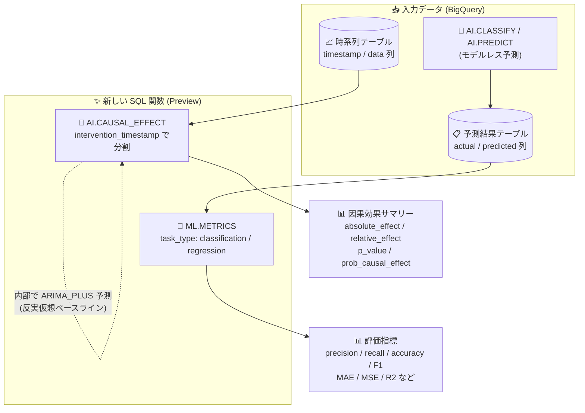

# BigQuery: ML.METRICS 関数と AI.CAUSAL_EFFECT 関数 (Preview)

**リリース日**: 2026-09-10

**サービス**: BigQuery (BigQuery ML / AI 関数)

**機能**: ML.METRICS 関数 (モデル不要の評価指標計算) / AI.CAUSAL_EFFECT 関数 (時系列の因果効果分析)

**ステータス**: Preview

📊 [このアップデートのインフォグラフィックを見る](https://takech9203.github.io/google-cloud-news-summary/20260910-bigquery-ml-metrics-ai-causal-effect-preview.html)

## 概要

BigQuery に、機械学習と時系列分析を SQL だけで完結させる 2 つの新しい関数が Preview として追加されました。1 つ目の **ML.METRICS 関数**は、実測値 (actual) と予測値 (predicted) を含む任意のテーブルまたはクエリに対して、分類タスクや回帰タスクの評価指標を直接計算できる関数です。従来のように BigQuery ML でモデルを作成・参照することなく、予測結果の品質を評価できます。

2 つ目の **AI.CAUSAL_EFFECT 関数**は、時系列データに対する特定の介入 (インターベンション) の影響を定量化する関数です。たとえば「特定の日に開始したマーケティングキャンペーンによって、売上が施策なしの場合と比べてどれだけ増加したか」を、介入後の実測値と反実仮想 (counterfactual) の予測値を比較することで統計的に測定できます。

どちらの関数も、データサイエンティストやアナリストが BigQuery の外部ツール (Python の scikit-learn や CausalImpact ライブラリなど) にデータを持ち出すことなく、SQL のみで評価・効果検証のワークフローを完結できるようにするアップデートです。

**アップデート前の課題**

- BigQuery ML で評価指標 (precision、recall、RMSE など) を計算するには、`ML.EVALUATE` などの評価関数を使う必要があり、BigQuery ML 上に保存されたモデルの作成または参照が必須だった
- 外部システムで生成した予測値や、`AI.CLASSIFY` などのモデルレスな AI 関数の出力を評価するには、データを外部の Python 環境などにエクスポートして scikit-learn 等で計算する必要があった
- 施策 (キャンペーン、価格変更など) の因果効果を時系列データから推定するには、CausalImpact などの外部ライブラリや独自の分析パイプラインを構築する必要があった

**アップデート後の改善**

- ML.METRICS により、実測値と予測値の列を持つ任意のテーブル/クエリに対して、モデルを一切作成・参照せずに SQL 1 文で評価指標を計算できるようになった
- `AI.CLASSIFY` や `AI.PREDICT` などモデルレス AI 関数の予測結果、外部モデルの予測結果も BigQuery 内でそのまま評価できるようになった
- AI.CAUSAL_EFFECT により、介入時点を指定するだけで、ARIMA_PLUS 予測に基づく反実仮想ベースラインとの比較 (絶対効果・相対効果・p 値) を SQL で取得できるようになった
- `id_cols` 引数により複数の時系列を 1 回の呼び出しで並列に因果分析できるようになった

## アーキテクチャ図



モデルを作成せずに、予測結果テーブルは ML.METRICS で評価指標へ、時系列テーブルは AI.CAUSAL_EFFECT で介入効果の統計値へ、それぞれ SQL 1 文で変換できます。

## サービスアップデートの詳細

### 主要機能

1. **ML.METRICS: モデル不要の評価指標計算**
   - 実測値列と予測値列を含む任意のテーブルまたはクエリ結果に対して評価指標を計算
   - `task_type => 'classification'` で precision / recall / accuracy / f1_score を返す
   - `task_type => 'regression'` で mean_absolute_error / mean_squared_error / mean_squared_log_error / median_absolute_error / r2_score / explained_variance を返す
   - BOOL 型ラベルは二値分類 (陽性 = TRUE クラスの指標)、STRING 型ラベルは多クラス分類 (マクロ平均) として扱われる

2. **AI.CAUSAL_EFFECT: 時系列への介入効果の定量化**
   - `intervention_timestamp` を境にデータを介入前/介入後に分割し、絶対効果・相対効果・統計的有意性を計算
   - 介入前データから ARIMA_PLUS による単変量時系列予測で反実仮想ベースラインを構築するため、コントロール系列や外部共変量が不要 (実験のスピルオーバーによるバイアスを防止)
   - `id_cols` の指定により複数の時系列を 1 回の呼び出しで並列分析可能

3. **柔軟な出力制御 (AI.CAUSAL_EFFECT)**
   - デフォルトでは時系列ごとに 1 行のサマリー (p_value、prob_causal_effect、absolute_effect、relative_effect、status) を返す
   - `output_time_series => TRUE` でタイムスタンプごとの実測値・予測値・予測区間 (lower_bound / upper_bound) を含む詳細ビューを返す
   - `num_post_intervention_points` で分析対象とする介入後のデータポイント数を制限可能

## 技術仕様

### ML.METRICS 関数

| 項目 | 詳細 |
|------|------|
| 構文 | `ML.METRICS({TABLE \| (query)}, predicted_col => ..., actual_col => ..., task_type => ...)` |
| task_type | `classification` または `regression` (大文字小文字を区別しない) |
| 回帰の入力型 | INT64、FLOAT64、NUMERIC、BIGNUMERIC |
| 分類の入力型 | STRING、BOOL (predicted_col と actual_col は同じデータ型が必要) |
| NULL の扱い | NULL を含む行は指標計算から除外。全行が除外された場合は全指標 NULL の 1 行を返す |
| 分類指標の計算 | BOOL: 二値分類 (TRUE クラス基準) / STRING: 多クラス分類 (マクロ平均) |
| ステータス | Preview (Pre-GA Offerings Terms 適用) |

### AI.CAUSAL_EFFECT 関数

| 項目 | 詳細 |
|------|------|
| 構文 | `AI.CAUSAL_EFFECT({TABLE \| (query)}, data_col => ..., timestamp_col => ..., intervention_timestamp => ... [, id_cols] [, confidence_level] [, output_time_series] [, num_post_intervention_points])` |
| data_col の型 | INT64、NUMERIC、BIGNUMERIC、FLOAT64 |
| timestamp_col の型 | TIMESTAMP、DATE、DATETIME |
| id_cols の型 | ARRAY&lt;STRING&gt; (対象列は STRING / INT64) |
| confidence_level | [0, 1) の FLOAT64。デフォルト 0.95 |
| 予測モデル | ARIMA_PLUS による単変量予測で反実仮想ベースラインを生成 |
| 主な出力 | p_value、prob_causal_effect (= 1 - p_value)、absolute_effect (実測 - 予測の合計)、relative_effect、status |
| 最小データ量 | 予測生成には少なくとも 3 データポイントの履歴が必要 (不足時は "The time series data is too short" エラー) |
| ステータス | Preview (Pre-GA Offerings Terms 適用) |

## 設定方法

### 前提条件

1. BigQuery が有効な Google Cloud プロジェクト
2. 対象テーブル/クエリへの読み取り権限とクエリ実行権限 (例: `roles/bigquery.jobUser` + データ閲覧権限)
3. ML.METRICS: 実測値列と予測値列 (同一データ型) を含むテーブルまたはクエリ
4. AI.CAUSAL_EFFECT: 介入前後の両期間を含む時系列データ

### 手順

#### ステップ 1: ML.METRICS で予測結果を評価する

```sql
-- AI.CLASSIFY の分類結果を実測ラベルと比較して評価
SELECT *
FROM ML.METRICS(
  (
    SELECT
      category,
      AI.CLASSIFY(
        body,
        categories => ['business', 'entertainment', 'politics', 'sport', 'tech']
      ) AS predicted_category
    FROM `bigquery-public-data.bbc_news.fulltext`
    LIMIT 100
  ),
  predicted_col => 'predicted_category',
  actual_col => 'actual_category' /* 実際の列名に合わせる */,
  task_type => 'classification');
```

precision / recall / accuracy / f1_score が 1 行で返されます。回帰タスクの場合は `task_type => 'regression'` を指定します。

#### ステップ 2: AI.CAUSAL_EFFECT で介入効果を分析する

```sql
-- COVID-19 パンデミック宣言が NYC タクシー利用数に与えた影響を分析
SELECT pickup_date, trip_count, predicted_trip_count, lower_bound, upper_bound
FROM AI.CAUSAL_EFFECT(
  (
    SELECT DATE(pickup_datetime) AS pickup_date, COUNT(*) AS trip_count
    FROM `bigquery-public-data.new_york_taxi_trips.tlc_yellow_trips_2020`
    WHERE EXTRACT(YEAR FROM pickup_datetime) = 2020
    GROUP BY pickup_date
  ),
  data_col => 'trip_count',
  timestamp_col => 'pickup_date',
  intervention_timestamp => '2020-03-11',  -- WHO のパンデミック宣言日
  num_post_intervention_points => 120,
  output_time_series => TRUE);
```

`output_time_series => TRUE` により、タイムスタンプごとの実測値・反実仮想予測値・予測区間が返され、BigQuery の Visualize タブでそのまま可視化できます。

## メリット

### ビジネス面

- **施策効果の定量化を民主化**: マーケティングキャンペーン、価格変更、機能リリースなどの効果を、統計の専門知識や外部ツールなしに SQL で検証でき、データドリブンな意思決定を加速できる
- **評価ワークフローの内製化・高速化**: 予測品質の評価をデータのある場所 (BigQuery) で完結でき、外部環境へのデータ移動に伴うコスト・ガバナンスリスクを削減できる

### 技術面

- **モデル管理が不要**: ML.METRICS は保存済みモデルへの依存がないため、外部モデルの予測結果、モデルレス AI 関数 (AI.CLASSIFY、AI.PREDICT など) の出力、過去にテーブル保存した予測など、あらゆる予測結果を統一的に評価できる
- **コントロール群不要の因果分析**: AI.CAUSAL_EFFECT は ARIMA_PLUS による単変量予測を反実仮想ベースラインとするため、コントロール系列や外部共変量の準備が不要で、実験のスピルオーバー効果によるバイアスも回避できる
- **スケーラブルな並列分析**: id_cols による複数時系列の一括分析で、商品別・店舗別・ページ別など大量のセグメントに対する効果検証を 1 クエリで実行できる

## デメリット・制約事項

### 制限事項

- 両関数とも Preview であり、Pre-GA Offerings Terms が適用される (サポートが限定される可能性があり、本番利用は非推奨)
- ML.METRICS: predicted_col と actual_col は同一データ型である必要があり、NULL を含む行は計算から除外される
- ML.METRICS の分類指標は STRING ラベルの場合マクロ平均のみで、クラス別の内訳や混同行列は返さない (モデルベースの `ML.CONFUSION_MATRIX` 等とは役割が異なる)
- AI.CAUSAL_EFFECT: 時系列に最低 3 データポイントの履歴が必要。不足すると status 列にエラーが返る

### 考慮すべき点

- AI.CAUSAL_EFFECT の p 値は ARIMA_PLUS の標準誤差に基づいて計算されるため、効果推定は保守的 (偽陽性が少ない) になる傾向がある
- AI.CAUSAL_EFFECT は単変量モデルであり、介入と同時期に発生した他の要因 (季節イベント、競合の動きなど) の影響を分離できない点は解釈時に注意が必要
- フィードバックや機能サポートの窓口は bqml-feedback@google.com とされており、通常のサポートチャネルと異なる

## ユースケース

### ユースケース 1: LLM ベース分類の品質モニタリング

**シナリオ**: AI.CLASSIFY を使って問い合わせチケットをカテゴリ分類しているチームが、人手でラベル付けした正解データと突き合わせて分類精度を定期的に監視したい。

**実装例**:
```sql
SELECT *
FROM ML.METRICS(
  TABLE `mydataset.ticket_predictions`,   -- actual_category / predicted_category を含む
  predicted_col => 'predicted_category',
  actual_col => 'actual_category',
  task_type => 'classification');
```

**効果**: モデルの作成・登録なしに、スケジュールクエリで precision / recall / accuracy / F1 を継続監視でき、分類品質の劣化を早期に検知できる。

### ユースケース 2: マーケティングキャンペーンの増分効果測定

**シナリオ**: 特定日に開始した広告キャンペーンについて、店舗別の売上時系列に対する増分効果 (インクリメンタリティ) を検証したい。

**実装例**:
```sql
SELECT *
FROM AI.CAUSAL_EFFECT(
  TABLE `mydataset.daily_sales_by_store`,
  data_col => 'sales',
  timestamp_col => 'sales_date',
  intervention_timestamp => '2026-09-01',
  id_cols => ['store_id']);
```

**効果**: 店舗ごとに absolute_effect / relative_effect / p_value が 1 行ずつ返り、統計的に有意な効果があった店舗を SQL だけで特定できる。

### ユースケース 3: 外部モデルの予測結果のベンチマーク

**シナリオ**: Vertex AI やオンプレミスで学習したモデルの予測結果を BigQuery に取り込み、複数モデルの回帰精度 (RMSE、R2 など) を同一基準で比較したい。

**効果**: モデルを BigQuery ML に移植することなく、予測結果テーブルさえあれば ML.METRICS で統一的な評価指標を算出でき、モデル選定を効率化できる。

## 料金

両関数の個別の料金体系は Release Notes およびドキュメントに明記されていません。BigQuery のクエリとして実行されるため、BigQuery の分析料金 (オンデマンドまたはエディション) が適用されると考えられます。最新の料金は公式料金ページを確認してください。

- [BigQuery の料金](https://cloud.google.com/bigquery/pricing)

## 利用可能リージョン

公式ドキュメントにリージョン固有の記載は確認できませんでした。詳細は各関数のドキュメントおよび [BigQuery のロケーション](https://cloud.google.com/bigquery/docs/locations) を参照してください。

## 関連サービス・機能

- **ML.EVALUATE / ML.CONFUSION_MATRIX / ML.ROC_CURVE**: BigQuery ML の保存済みモデルに対する従来の評価関数。ML.METRICS はモデル不要という点でこれらを補完する
- **AI.CLASSIFY / AI.PREDICT / AI.EVALUATE**: モデルレスの AI 関数群。AI.CLASSIFY や AI.PREDICT の出力を ML.METRICS で評価でき、TimesFM / TabFM モデルの予測と評価を 1 ステップで行う場合は AI.EVALUATE を利用する
- **ARIMA_PLUS (BigQuery ML 時系列予測)**: AI.CAUSAL_EFFECT が反実仮想ベースラインの生成に内部で利用する時系列予測モデル
- **BigQuery 異常検知 / 予測 (forecasting)**: 時系列分析の関連機能。介入効果分析と組み合わせて時系列データの変化を多面的に把握できる

## 参考リンク

- 📊 [インフォグラフィック](https://takech9203.github.io/google-cloud-news-summary/20260910-bigquery-ml-metrics-ai-causal-effect-preview.html)
- [公式リリースノート (2026-09-10)](https://docs.cloud.google.com/release-notes#September_10_2026)
- [ML.METRICS 関数のドキュメント](https://docs.cloud.google.com/bigquery/docs/reference/standard-sql/bigqueryml-syntax-metrics)
- [AI.CAUSAL_EFFECT 関数のドキュメント](https://docs.cloud.google.com/bigquery/docs/reference/standard-sql/bigqueryml-syntax-causal-effect)
- [BigQuery ML モデル評価の概要](https://docs.cloud.google.com/bigquery/docs/evaluate-overview)
- [BigQuery の料金ページ](https://cloud.google.com/bigquery/pricing)

## まとめ

今回の 2 つの Preview 関数により、「予測結果の評価」と「施策の因果効果検証」という、これまで外部ツールに依存しがちだった分析ワークフローが BigQuery の SQL だけで完結するようになりました。AI.CLASSIFY などのモデルレス AI 関数と組み合わせることで、分類・予測から品質評価までのループを BigQuery 内で高速に回せます。まずは公開データセットを使った公式ドキュメントの例で動作を確認し、Preview である点に留意しつつ社内の効果検証・評価パイプラインへの適用を検討することをおすすめします。

---

**タグ**: BigQuery, BigQuery ML, ML.METRICS, AI.CAUSAL_EFFECT, 機械学習, モデル評価, 因果推論, 時系列分析, Preview
