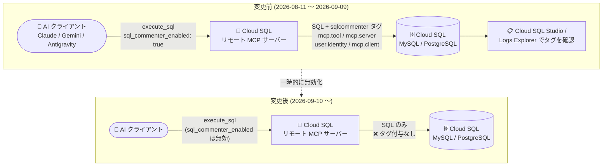

# Cloud SQL for MySQL / PostgreSQL: リモート MCP サーバーの sqlcommenter タグ付与が一時的に無効化

**リリース日**: 2026-09-10

**サービス**: Cloud SQL for MySQL / Cloud SQL for PostgreSQL

**機能**: Cloud SQL リモート MCP サーバーにおける sqlcommenter タグ付与 (`sql_commenter_enabled` パラメータ)

**ステータス**: Breaking (破壊的変更・一時的な機能無効化)

📊 [このアップデートのインフォグラフィックを見る](https://takech9203.github.io/google-cloud-news-summary/20260910-cloud-sql-mcp-sqlcommenter-disabled.html)

## 概要

Cloud SQL リモート MCP サーバーで SQL クエリを実行する際に、`sql_commenter_enabled` パラメータを使用して sqlcommenter タグを付与する機能が、**すべての Cloud SQL インスタンスで一時的に無効化** されました。この変更は Cloud SQL for MySQL と Cloud SQL for PostgreSQL の両方に同一内容で発表された Breaking Change です。

sqlcommenter タグ付与機能は 2026 年 8 月 11 日に発表されたばかりの機能で、`execute_sql` または `execute_sql_readonly` ツールでクエリを実行する際に `sql_commenter_enabled` パラメータを `true` に設定すると、SQL ステートメントに可観測性・テレメトリ用のコメントタグ (`mcp.tool`、`mcp.server`、`user.identity`、`mcp.client`) を自動付与するものでした。付与されたタグは Cloud SQL Studio や Logs Explorer のデータベースクエリログ・監査ログで確認できました。

AI エージェント (Claude、Gemini、Antigravity など) が発行した SQL クエリの発行元を追跡する手段としてこの機能に依存していたユーザーは、一時的に代替の監査手段 (IAM データベース認証ユーザー単位の監査ログなど) を利用する必要があります。公式ドキュメントには一時的 (temporarily) と明記されており、恒久的な廃止ではありません。

**アップデート前の状態 (2026 年 8 月 11 日〜)**

- `execute_sql` / `execute_sql_readonly` ツールで `sql_commenter_enabled: true` を指定すると、SQL ステートメントに sqlcommenter タグが自動付与されていた
- `mcp.tool` (呼び出された MCP ツール名)、`mcp.server` (リモート MCP サーバーの識別子)、`user.identity` (クエリを実行した認証済みデータベース/IAM ユーザー)、`mcp.client` (AI クライアント名) の 4 タグでクエリの発行元を追跡できた
- Cloud SQL Studio や Logs Explorer で、どの AI エージェントがどのクエリを実行したかを可視化できた

**アップデート後の変更**

- すべての Cloud SQL インスタンスで、`sql_commenter_enabled` パラメータによる sqlcommenter タグの付与が一時的に無効化された
- MCP サーバー経由のクエリに対する sqlcommenter タグベースの可観測性・テレメトリが一時的に利用できなくなった
- 機能の無効化は一時的なものであり、恒久的な廃止のアナウンスではない

## アーキテクチャ図



変更前は MCP サーバーが SQL ステートメントに sqlcommenter タグを付与してログで追跡できましたが、変更後はタグ付与が一時的に行われなくなります。

## サービスアップデートの詳細

### 変更内容

1. **`sql_commenter_enabled` パラメータの一時的な無効化**
   - `execute_sql` / `execute_sql_readonly` ツール実行時に `sql_commenter_enabled` を `true` に設定しても、sqlcommenter タグが SQL ステートメントに付与されなくなった
   - 対象は **すべての Cloud SQL インスタンス** (Cloud SQL for MySQL / Cloud SQL for PostgreSQL)

2. **無効化されたタグの内容**
   - `mcp.tool`: 呼び出された MCP ツールの名前
   - `mcp.server`: リモート MCP サーバーの識別子 (Remote MCP Server)
   - `user.identity`: クエリを実行した認証済みデータベースユーザーまたは IAM ユーザーの ID
   - `mcp.client`: 識別された AI クライアントまたはアプリケーションエージェント (Claude、Gemini、Antigravity など)

3. **一時的な措置であることの明示**
   - 公式ドキュメントには「temporarily disabled (一時的に無効化)」と明記されており、機能自体の説明は削除されていない
   - 恒久的な廃止ではなく、将来的な再有効化が想定される

## 技術仕様

### 影響を受ける機能の仕様

| 項目 | 詳細 |
|------|------|
| 対象サービス | Cloud SQL for MySQL、Cloud SQL for PostgreSQL |
| 対象コンポーネント | Cloud SQL リモート MCP サーバー |
| 対象ツール | `execute_sql`、`execute_sql_readonly` |
| 対象パラメータ | `sql_commenter_enabled` (オプション、boolean) |
| 影響範囲 | すべての Cloud SQL インスタンス |
| 措置の性質 | 一時的な無効化 (temporarily disabled) |
| 機能の初回リリース | 2026 年 8 月 11 日 |

### 参考: 従来のタグ付与イメージ

sqlcommenter タグが有効だった期間には、以下のようなコメントが SQL ステートメントに付与され、クエリログ・監査ログで確認できました (デフォルトの 4 タグのみサポートされ、カスタムタグの追加は不可)。

```sql
SELECT * FROM products
/* mcp.tool='execute_sql_readonly',
   mcp.server='Remote MCP Server',
   user.identity='agent-user@example-project.iam',
   mcp.client='Claude' */
```

## 影響と対応方法

### 影響を受けるユーザー

1. Cloud SQL リモート MCP サーバー経由で `sql_commenter_enabled: true` を指定して SQL を実行しているユーザー
2. sqlcommenter タグ (`mcp.client`、`user.identity` など) を利用して、AI エージェント発行クエリの監査・可観測性を実現しているユーザー
3. Cloud SQL Studio や Logs Explorer でタグベースのクエリ分析を行っているユーザー

### 推奨される対応

1. **ログ分析への影響確認**: sqlcommenter タグを前提としたログクエリ・ダッシュボード・アラートがある場合、タグが付与されなくなったことによる影響を確認する
2. **代替の監査手段の利用**: MCP サーバーのクエリ実行は IAM データベース認証ユーザーで行われるため、データベース監査ログや Cloud Audit Logs によるユーザー単位の追跡を代替手段として利用する
3. **再有効化のウォッチ**: 一時的な措置であるため、[Cloud SQL リリースノート](https://docs.cloud.google.com/sql/docs/release-notes)と公式ドキュメントの更新を継続的に確認する

## デメリット・制約事項

### 制限事項

- `sql_commenter_enabled` パラメータを `true` に設定しても sqlcommenter タグは付与されない (エラーになるかどうかは明示されていないため、動作は実環境で確認が必要)
- 無効化の理由と再有効化の時期は、リリースノート・ドキュメント上では公表されていない

### 考慮すべき点

- MCP サーバー経由の SQL 実行自体 (`execute_sql` / `execute_sql_readonly`) は引き続き利用可能で、無効化されたのはタグ付与機能のみ
- AI エージェント発行クエリのクライアント識別 (`mcp.client` タグ) に依存した運用をしている場合、一時的に発行元 AI クライアントの識別ができなくなる
- 2026 年 8 月 11 日の機能リリースから約 1 か月での無効化であり、本機能を本番運用の監査要件に組み込んでいた場合は早急な代替策の検討が必要

## 関連サービス・機能

- **Cloud SQL リモート MCP サーバー**: 本変更の対象。自然言語でのインスタンス管理・SQL 実行を可能にする MCP サーバーで、タグ付与以外の機能 (toolsets、free trial インスタンス作成など) は影響を受けない
- **IAM データベース認証**: MCP サーバーの `execute_sql` ツールは IAM データベース認証ユーザーで実行されるため、代替の監査手段として IAM ユーザー単位の追跡が可能
- **Cloud Logging (Logs Explorer)**: sqlcommenter タグの確認先だったサービス。データベースクエリログ・監査ログ自体は引き続き利用可能
- **Cloud SQL Studio**: 実行されたクエリの確認先。タグは表示されなくなるがクエリの確認は可能
- **sqlcommenter (OSS)**: SQL にアプリケーションコンテキストをコメントとして付与するオープンソースライブラリ。アプリケーション側で直接組み込む方式は本変更の影響を受けない

## 参考リンク

- 📊 [インフォグラフィック](https://takech9203.github.io/google-cloud-news-summary/20260910-cloud-sql-mcp-sqlcommenter-disabled.html)
- [公式リリースノート (2026 年 9 月 10 日)](https://docs.cloud.google.com/release-notes#September_10_2026)
- [ドキュメント: sqlcommenter タグ (Cloud SQL for MySQL)](https://docs.cloud.google.com/sql/docs/mysql/use-cloudsql-mcp#sqlcommenter)
- [ドキュメント: sqlcommenter タグ (Cloud SQL for PostgreSQL)](https://docs.cloud.google.com/sql/docs/postgres/use-cloudsql-mcp#sqlcommenter)
- [Cloud SQL リリースノート](https://docs.cloud.google.com/sql/docs/release-notes)

## まとめ

Cloud SQL リモート MCP サーバーの sqlcommenter タグ付与機能 (`sql_commenter_enabled`) が、すべての Cloud SQL for MySQL / PostgreSQL インスタンスで一時的に無効化されました。AI エージェント発行クエリの追跡にこのタグを利用していた場合は、IAM データベース認証ユーザーベースの監査ログなど代替手段への切り替えを検討し、再有効化に備えてリリースノートを継続的に確認することを推奨します。

---

**タグ**: Cloud SQL, MySQL, PostgreSQL, MCP, sqlcommenter, Breaking Change, 可観測性, AI エージェント
