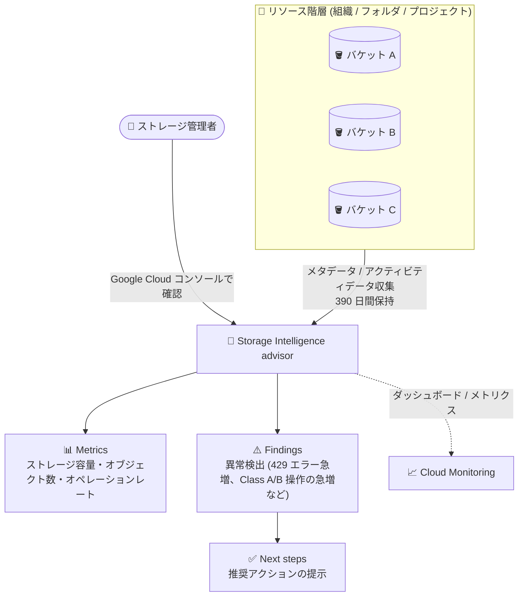

# Cloud Storage: Storage Intelligence advisor が一般提供 (GA) に

**リリース日**: 2026-09-10

**サービス**: Cloud Storage

**機能**: Storage Intelligence advisor

**ステータス**: GA (一般提供)

📊 [このアップデートのインフォグラフィックを見る](https://takech9203.github.io/google-cloud-news-summary/20260910-cloud-storage-storage-intelligence-advisor-ga.html)

## 概要

Cloud Storage の **Storage Intelligence advisor** が一般提供 (GA) になりました。Storage Intelligence advisor は、組織 (Organization)、フォルダ、プロジェクトをまたいで Cloud Storage 環境を大規模に監視・管理できる機能です。ストレージ利用パターンのトレンドと異常 (アノマリー) を可視化し、使用量の最適化やパフォーマンスボトルネックの解消に向けた組み込みの推奨アクション (Next steps) を提示します。

Storage Intelligence advisor は Cloud Storage の有料サブスクリプション機能である Storage Intelligence の分析機能の 1 つで、組織・フォルダ・プロジェクトの任意のレベルで構成できます。集計されたバケットのメタデータとアクティビティデータを 390 日間保持し、環境全体のヒストリカルビューを提供します。

多数のプロジェクトやバケットを運用する組織のストレージ管理者、FinOps チーム、SRE にとって、カスタムのレポーティング基盤を構築・維持することなく、単一のインターフェースからストレージ環境全体の健全性を評価できるようになる点が主要な価値です。

**アップデート前の課題**

- Cloud Storage 環境全体のメトリクスを追跡するには、カスタムのデータ処理パイプライン、BigQuery スクリプト、外部の可視化ツールを構築・維持する必要があった
- プロジェクト・フォルダ・組織にまたがるストレージ環境の健全性を評価するには、さまざまなログやリソースに対して手動でクエリを実行する必要があった
- Coldline / Archive ストレージへの頻繁なアクセスや 429 エラーの急増といった問題を、体系的に検出して対処する仕組みがなかった

**アップデート後の改善**

- 組織・フォルダ・プロジェクトの任意のスコープで、単一のインターフェースからストレージ環境全体を監視できるようになった
- ストレージパターンの異常 (Findings) が自動検出され、各 Finding に解決のための推奨アクション (Next steps) が提示されるようになった
- 一般提供 (GA) となり、本番環境での利用に適したステータスになった

## アーキテクチャ図



Storage Intelligence advisor は、組織・フォルダ・プロジェクト配下のバケットからメトリクスを収集し、「Metrics (メトリクス) → Findings (異常検出) → Next steps (推奨アクション)」という構造化された階層でインサイトを提示します。

## サービスアップデートの詳細

### 主要機能

1. **At a glance (環境スナップショット)**
   - 選択したリソース (プロジェクト / フォルダ / 組織) のストレージ環境の日次スナップショットを表示
   - ストレージクラス別の合計ストレージサイズ、オブジェクトを含むバケット数、合計オブジェクト数、平均オブジェクトサイズなどの主要メトリクスを確認可能

2. **Findings (異常検出)**
   - メトリクスから検出された、対応が必要な異常を表示
   - 例: 「Coldline / Archive データに対する Class A / B オペレーションの急増」(ストレージクラスの不整合)、「429 エラーの急増」(レート制限)、「トレンドを上回るストレージ消費」、「クロスリージョン Egress」など

3. **Next steps (推奨アクション)**
   - 各 Finding に対して、問題を解決するための推奨手順を提示
   - 例: 頻繁にアクセスされる Coldline / Archive データを Standard / Nearline などのアクセス頻度に適したストレージクラスへ移行する、I/O パターンを最適化して 429 エラーを軽減する、など

4. **ヒストリカルデータ (390 日間)**
   - 集計されたバケットメタデータとアクティビティデータを 390 日間保持
   - 削除済みバケットのデータも含まれるため、すでに存在しないリソースの情報が表示される場合がある

5. **VPC Service Controls サポート**
   - サービス境界内のプロジェクトで有効化すると、Storage Intelligence advisor API が VPC Service Controls で保護される

## 技術仕様

### Storage Intelligence advisor の構造

| 構成要素 | 説明 |
|------|------|
| Metrics | Cloud Storage 環境から収集されるデータポイント (ストレージ容量、オブジェクト数、オペレーションレートなど) |
| Findings | メトリクスから検出された、対応が必要な異常 (エラーの急増、非効率なストレージ利用など) |
| Next steps | 各 Finding に付随する、問題解決のための推奨アクション |

### 必要な IAM ロール・権限

Storage Intelligence advisor の表示には、対象のプロジェクト・フォルダ・組織に対する **Storage 管理者** (`roles/storage.admin`) ロールが必要です。主な必要権限は以下のとおりです。

| 操作 | 必要な権限 |
|------|------|
| Findings サマリーの表示 | `storage.intelligenceConfig.get` |
| advisor / Findings / バケットドリルダウンの表示 | `storage.buckets.viewIntelligenceDetails` |
| Cloud Monitoring のダッシュボード / メトリクス表示 | `monitoring.dashboards.*`、`monitoring.timeSeries.*` など |
| Gemini によるトラブルシューティング | `cloudaicompanion.instances.completeTask` |

### エディション構成

Storage Intelligence の構成は、リソース (組織 / フォルダ / プロジェクト) ごとに以下のいずれかを設定します。

| エディション | 説明 |
|------|------|
| `INHERIT` | 親リソースの構成を継承 |
| `STANDARD` | すべての Storage Intelligence 機能を含む標準エディション (構成時のデフォルト) |
| `DISABLED` | 指定リソースで Storage Intelligence を無効化 (子リソースは無効状態を継承) |
| `TRIAL` | 30 日間の導入トライアル |

## 設定方法

### 前提条件

1. Storage Intelligence advisor を表示するには、事前に Storage Intelligence を構成 (有効化) しておく必要がある
2. 対象リソースに対する Storage 管理者 (`roles/storage.admin`) ロールが付与されている

### 手順

#### ステップ 1: Storage Intelligence を構成する

```bash
# プロジェクト単位で有効化
gcloud storage intelligence-configs enable --project=PROJECT_ID

# フォルダ単位で有効化
gcloud storage intelligence-configs enable --sub-folder=FOLDER_ID

# 組織単位で有効化
gcloud storage intelligence-configs enable --organization=ORGANIZATION_ID
```

`--include-bucket-regexes` / `--exclude-bucket-regexes` で対象バケットを名前 (正規表現) でフィルタリングでき、`--include-locations` / `--exclude-locations` でロケーションによるフィルタリングも可能です。

```bash
# 例: 名前に colddata を含むバケットを除外して組織単位で有効化
gcloud storage intelligence-configs enable --organization=ORGANIZATION_ID \
    --exclude-bucket-regexes=colddata.*
```

#### ステップ 2: 構成を確認する

```bash
gcloud storage intelligence-configs describe --project=PROJECT_ID
```

#### ステップ 3: Storage Intelligence advisor を表示する

1. Google Cloud コンソールで「Storage Intelligence Advisor」ページに移動する
2. リソースピッカーでプロジェクト・フォルダ・組織を選択する
3. 「At a glance」セクションで主要メトリクスを確認する
4. 「Top findings」セクションで異常を調査し、各 Finding の詳細と推奨アクション (Next steps) を確認する

## メリット

### ビジネス面

- **カスタムレポーティングの削減**: カスタムのデータ処理パイプライン、BigQuery スクリプト、外部可視化ツールを維持することなく、Cloud Storage 環境全体のメトリクスを追跡できる
- **コスト最適化の機会を発見**: Coldline / Archive データへの頻繁なアクセスなど、ストレージクラスとアクセスパターンの不整合を検出し、適切なストレージクラスへの移行を提案する

### 技術面

- **一元的な監視**: プロジェクト・フォルダ・組織をまたぐストレージ環境の健全性を、手動クエリなしで単一のインターフェースから評価できる
- **パフォーマンス問題の解決**: 429 エラー (レート制限) の急増や予期しないオペレーションの急増などを検出し、I/O パターンの最適化によりアプリケーションの信頼性を向上できる
- **長期のヒストリカルビュー**: 390 日間のデータ保持により、長期的なトレンド分析が可能

## デメリット・制約事項

### 制限事項

- Storage Intelligence advisor の利用には Storage Intelligence の構成 (サブスクリプション) が必要
- VPC Service Controls はフォルダレベル・組織レベルのリソースをサービス境界に追加できないため、保護されるのはプロジェクトレベルのリソースのみ (フォルダ / 組織レベルの管理には IAM を使用する)
- 削除済みバケットのデータも含まれるため、すでにアクティブでないリソースの情報が表示される場合がある

### 考慮すべき点

- Storage Intelligence の料金は構成した機能 (capabilities) に基づいて課金されるため、有効化前に料金体系の確認が必要
- 30 日間の導入トライアル (`TRIAL`) は組織・フォルダ・プロジェクトごとに 1 回のみ有効化でき、トライアル期間終了後に無効化しない場合は自動的に `STANDARD` エディションへ移行して課金が発生する

## ユースケース

### ユースケース 1: 組織全体のストレージ環境の一元監視

**シナリオ**: 多数のプロジェクトとバケットを持つ企業で、ストレージ管理チームが環境全体の健全性を定期的に評価したい。

**実装例**:
```bash
gcloud storage intelligence-configs enable --organization=ORGANIZATION_ID
```
組織レベルで Storage Intelligence を有効化し、コンソールの Storage Intelligence Advisor ページで組織全体の「At a glance」メトリクスと Top findings を確認する。

**効果**: 手動クエリやカスタムダッシュボードなしで、組織全体のストレージサイズ・バケット数・異常を単一画面で把握できる。

### ユースケース 2: ストレージクラスの最適化によるコスト削減

**シナリオ**: Coldline / Archive ストレージに保存したデータへのアクセスが増加し、想定外のオペレーション料金が発生している。

**効果**: 「Spike in Class A or B operations on Coldline or Archive data」という Finding により頻繁にアクセスされているコールドデータを特定し、Standard / Nearline などアクセス頻度に適したストレージクラスへ移行することでコストを最適化できる。

### ユースケース 3: レート制限によるパフォーマンス問題の解消

**シナリオ**: アプリケーションで Cloud Storage への書き込み・読み取りが断続的に失敗しており、原因を特定したい。

**効果**: 「Spike in 429 errors」の Finding からリクエストスロットリングの発生を特定し、推奨アクションに沿って I/O パターンを最適化することでアプリケーションの信頼性を向上できる。

## 料金

Storage Intelligence advisor は Storage Intelligence サブスクリプションの一部として提供され、料金は構成した機能 (capabilities) に基づいて課金されます。30 日間の導入トライアルでは、トライアルスコープ内のオブジェクトに対する Storage Intelligence のオブジェクト管理料金は課金されません (ストレージ料金とクエリ料金は別途発生)。

詳細は [Storage Intelligence の料金ページ](https://docs.cloud.google.com/storage/pricing#storage-intelligence) を参照してください。

## 関連サービス・機能

- **Storage Insights datasets**: バケット・オブジェクトのメタデータとアクティビティデータを BigQuery のリンクされたデータセットとして提供する Storage Intelligence の分析機能。advisor よりも詳細なカスタム分析に利用できる
- **Cloud Monitoring**: advisor のダッシュボードとメトリクスの表示に Cloud Monitoring の権限が使用される
- **Gemini Cloud Assist**: Storage Insights datasets と組み合わせて、自然言語でストレージ環境について質問できる AI アシスタンス機能
- **バケット再配置 (Bucket relocation) / ストレージバッチオペレーション**: advisor の分析結果に基づいてアクションを実行できる Storage Intelligence のアクション機能
- **VPC Service Controls**: プロジェクトレベルで Storage Intelligence advisor API をサービス境界で保護可能
- **オブジェクトライフサイクル管理 / ストレージクラス**: Finding で特定した最適化 (ストレージクラス移行など) の実行手段

## 参考リンク

- 📊 [インフォグラフィック](https://takech9203.github.io/google-cloud-news-summary/20260910-cloud-storage-storage-intelligence-advisor-ga.html)
- [公式リリースノート](https://docs.cloud.google.com/release-notes#September_10_2026)
- [About Storage Intelligence advisor](https://docs.cloud.google.com/storage/docs/storage-intelligence/advisor-overview)
- [View Storage Intelligence advisor](https://docs.cloud.google.com/storage/docs/storage-intelligence/view-advisor)
- [Storage Intelligence の概要](https://docs.cloud.google.com/storage/docs/storage-intelligence/overview)
- [Storage Intelligence の構成と管理](https://docs.cloud.google.com/storage/docs/storage-intelligence/configure-and-manage-storage-intelligence)
- [料金ページ](https://docs.cloud.google.com/storage/pricing#storage-intelligence)

## まとめ

Storage Intelligence advisor の GA により、組織・フォルダ・プロジェクトをまたぐ Cloud Storage 環境の監視と最適化を、カスタムレポーティング基盤なしで実現できるようになりました。多数のバケットを運用している組織は、まず 30 日間の導入トライアルで advisor の Findings と推奨アクションを評価し、ストレージクラスの最適化やパフォーマンス改善の機会を確認することを推奨します。

---

**タグ**: Cloud Storage, Storage Intelligence, GA, コスト最適化, モニタリング, ストレージ管理
