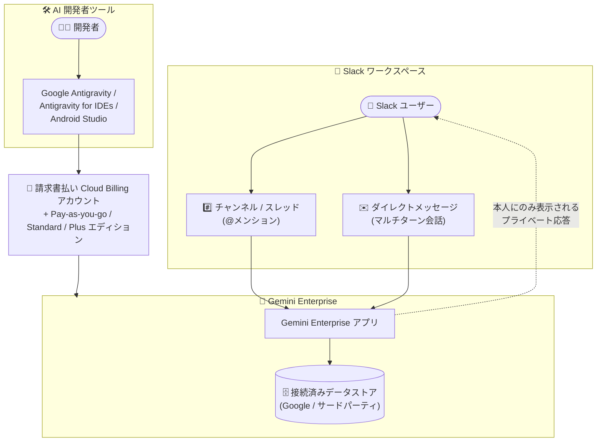

# Gemini Enterprise: Pay-as-you-go エディション / AI 開発者ツールの提供拡大と Slack アプリの会話機能強化

**リリース日**: 2026-09-10

**サービス**: Gemini Enterprise

**機能**: Pay-as-you-go エディションと AI 開発者ツールの全請求書払いアカウントへの開放、Slack アプリのチャンネルメンション・マルチターン会話対応

**ステータス**: 一般提供 (GA)

📊 [このアップデートのインフォグラフィックを見る](https://takech9203.github.io/google-cloud-news-summary/20260910-gemini-enterprise-paygo-and-chat-app-enhancements.html)

## 概要

2026 年 9 月 10 日、Gemini Enterprise に関する 2 つの関連アップデートが発表されました。1 つ目は提供範囲の拡大で、Gemini Enterprise **Pay-as-you-go エディションへのサブスクライブ**と **AI 開発者ツール** (Google Antigravity、Antigravity for IDEs、Android Studio) へのアクセスが、**請求書払い (invoiced) の Cloud Billing アカウントにリンクされたすべてのプロジェクト**で利用可能になりました。従来は、件名「[Billing Update] New Gemini Enterprise overage billing controls launching Aug 17, 2026」のメールを受け取った顧客のみが AI 開発者ツールにアクセスできましたが、この制限が撤廃されました。

2 つ目は Gemini Enterprise アプリの Slack 連携の機能強化で、**チャンネルメンション**と**マルチターン会話**のサポートが一般提供 (GA) になりました。Slack のチャンネルやスレッド内で Gemini Enterprise アプリを @メンションして質問でき、ダイレクトメッセージではセッションのコンテキストを保持したフォローアップ質問が可能になります。

対象ユーザーは、座席数コミットなしで従量課金型の Gemini Enterprise を利用したい組織、Antigravity などの AI 開発者ツールを導入したい開発チーム、そして Slack を日常のコラボレーション基盤として利用するナレッジワーカーです。

**アップデート前の課題**

- Pay-as-you-go エディションのサブスクライブと AI 開発者ツールへのアクセスは、Google からの特定の通知メール ([Billing Update] 件名のメール) を受け取った顧客に限定されており、一般の顧客は利用できなかった
- Slack の Gemini Enterprise アプリはチャンネルやスレッド内での @メンションに対応しておらず、チャンネルの文脈を踏まえた質問ができなかった
- ダイレクトメッセージでの会話はセッションのコンテキストを保持せず、フォローアップ質問や以前の回答の改善指示ができなかった

**アップデート後の改善**

- 請求書払いの Cloud Billing アカウントにリンクされたすべてのプロジェクトで、Pay-as-you-go エディションのサブスクライブと AI 開発者ツールの利用が可能になった (通知メールの受領は不要)
- Slack のチャンネルやスレッド内で Gemini Enterprise アプリを @メンションでき、応答は「自分にのみ表示」のプライベートメッセージとして返るため、内容を確認してから共有するかを選択できるようになった
- ダイレクトメッセージでマルチターン会話がサポートされ、現在のセッションのコンテキストを記憶してフォローアップ質問や回答の改善が可能になった (「New chat」でコンテキストをクリアして最初からやり直すことも可能)

## アーキテクチャ図



Slack ユーザーはチャンネルの @メンションまたはマルチターン対応のダイレクトメッセージから Gemini Enterprise アプリに質問し、接続済みデータストアを踏まえた応答をプライベートに受け取ります。また、請求書払いの Cloud Billing アカウントにリンクされたプロジェクトであれば、Pay-as-you-go エディションのサブスクライブと Antigravity などの AI 開発者ツールの利用が可能になりました。

## サービスアップデートの詳細

### 主要機能

1. **Pay-as-you-go エディションと AI 開発者ツールの提供範囲拡大**
   - 請求書払い (invoiced) の Cloud Billing アカウントにリンクされたすべてのプロジェクトで、Pay-as-you-go エディションのサブスクライブと AI 開発者ツールへのアクセスが可能になった
   - 従来必要だった「[Billing Update] New Gemini Enterprise overage billing controls launching Aug 17, 2026」メールの受領という条件は撤廃された

2. **AI 開発者ツール**
   - **Google Antigravity**: 自律型 AI エージェントによるアプリケーション開発環境 (Antigravity 2.0 と Antigravity CLI をサポート)
   - **Antigravity for IDEs**: 自律型 AI エージェント機能を既存の IDE ワークフローに組み込む拡張機能
   - **Android Studio**: Android 開発向けの AI 機能 (最新の Canary 版をサポート)
   - コードレビューの自動化、デバッグと根本原因分析の高速化、機能開発・リファクタリングのエージェントへの委譲などのユースケースに対応

3. **Slack アプリのチャンネルメンション (GA)**
   - Slack のチャンネルや会話スレッド内で Gemini Enterprise アプリを直接 @メンションできる (例: `@Gemini Enterprise summarize this thread`)
   - アプリはプロンプト受領の確認として 👀 リアクションを付け、応答は「Only visible to you」のプライベートメッセージとして返す
   - ユーザーは応答内容を確認してから、チャンネルやスレッドに共有するかを選択できる

4. **Slack アプリのマルチターン会話 (GA)**
   - ダイレクトメッセージで現在のセッションのコンテキストを記憶し、フォローアップ質問や以前の応答の改善指示が可能
   - 「New chat」をクリックするとコンテキストをクリアして新しいセッションを開始できる

## 技術仕様

### Pay-as-you-go エディションの特徴 (エディション比較より)

| 項目 | 内容 |
|------|------|
| 座席数 | 最低 1 シートから開始可能 |
| ストレージ / データインデックス | 従量課金 (Pay-as-you-go) |
| データコネクタ | フルのデータコネクタエコシステムにアクセス可能 |
| 最新 Gemini モデル | 優先アクセスあり |
| AI 開発者ツール | 利用可能 (Standard / Plus / Pay-as-you-go エディション) |
| Gemini Notebook Enterprise | 非対応 (ノートブックのチャット・作成・公開は不可) |
| Gemini Code Assist Standard | 非対応 (Standard / Plus エディションのみ) |
| 使用量の表示 | ライセンスベースのプールクォータではなく、プロジェクトが消費した実際の使用量を表示 |

### AI 開発者ツールの利用要件

| 要件 | 内容 |
|------|------|
| 対応エディション | Gemini Enterprise Standard / Plus / Standard Emerging Market / Pay-as-you-go |
| 課金アカウント | 請求書払い (invoiced) の Cloud Billing アカウントが必要 |
| 管理用ロール | Gemini Enterprise Admin (`roles/discoveryengine.agentspaceAdmin`): 設定とメトリクス閲覧に必要 |
| 利用用ロール | Gemini Enterprise User (`roles/discoveryengine.agentspaceUser`): ツールの利用に必要 (Admin ロールだけではツールを利用できない) |
| クォータリセット | AI 開発者ツールのクォータは、最初のプロンプト送信時点から 7 日ごとにリセット (他機能は毎日太平洋時間の深夜にリセット) |

### Slack アプリの前提条件

| 要件 | 内容 |
|------|------|
| Slack 側 | Slack AI アドオンへのアクセス、Slack ワークスペース ID |
| Gemini Enterprise 側 | Google Identity を ID プロバイダとして構成した Gemini Enterprise アプリ (Workforce Identity Federation は非対応) |
| 認証情報 | Google Cloud OAuth 2.0 クライアント ID / シークレット (リダイレクト URI: `https://vertexaisearch.cloud.google.com/slack/oauth_callback`) |
| IAM ロール | Google Cloud プロジェクトの Project IAM Admin (`roles/resourcemanager.projectIamAdmin`) |

## 設定方法

### 新しい Slack アプリ機能を有効化する手順

#### ステップ 1: Slack 管理者によるアプリの再インストール

チャンネルメンションとマルチターン会話を有効にするには、Slack 管理者が Gemini Enterprise アプリを **再インストール** する必要があります。Workspace Owner または Workspace Admin ロールがあれば、Slack ワークスペース設定の Manage > Installed Apps でインストール状態を確認できます。

#### ステップ 2: エンドユーザーによる Slack コネクタの認可

管理者がアプリを再インストールした後、各エンドユーザーは Slack コネクタを再認可する必要があります。この認可はユーザーごとに個別に行います。

**注意**: 再インストールと再認可を行わない場合、Slack ワークスペースは従来 (レガシー) の動作のままとなり、新機能は利用できません。

### Pay-as-you-go エディション / AI 開発者ツールの利用開始

1. プロジェクトが、毎月の請求書を受け取っている請求書払い (invoiced) の Cloud Billing アカウントにリンクされていることを確認する
2. 必要な API を有効化してから (ライセンス購入前に有効化しないとプロビジョニングが失敗する場合があるため、約 5 分待って反映させる)、サブスクリプションを購入する
3. AI 開発者ツールを利用するユーザーに Gemini Enterprise User ロール (`roles/discoveryengine.agentspaceUser`) を付与する

## メリット

### ビジネス面

- **導入障壁の低減**: 特定の通知メール受領という条件が撤廃され、請求書払いアカウントを持つすべての組織が Pay-as-you-go エディションと AI 開発者ツールを利用開始できる
- **コミットメント不要の従量課金**: Pay-as-you-go エディションは最低 1 シートから開始でき、実際の使用量に基づいて課金されるため、スモールスタートに適している
- **Slack 内での生産性向上**: 普段のコラボレーションの場である Slack のチャンネルやスレッドから離れることなく、社内データに基づいた AI の回答を得られる

### 技術面

- **エージェント型開発ワークフロー**: Antigravity や Android Studio を通じて、コードレビュー・デバッグ・リファクタリングなどの多段階タスクを自律型 AI エージェントに委譲できる
- **プライベート応答による安全な共有**: チャンネルメンションへの応答は本人にのみ表示されるため、内容を確認してから共有でき、意図しない情報公開を防げる
- **コンテキストを保持した対話**: マルチターン会話により、1 回のプロンプトで完結しない調査や回答の段階的な改善が可能

## デメリット・制約事項

### 制限事項

- Pay-as-you-go エディションと AI 開発者ツールの利用には、毎月の請求書を受け取っている請求書払い (invoiced) の Cloud Billing アカウントが必要 (セルフサービス (クレジットカード) アカウントは対象外)
- Pay-as-you-go エディションでは Gemini Notebook Enterprise (ノートブックのチャット・作成・公開) と Gemini Code Assist Standard は利用できない
- Slack アプリは Gemini Enterprise 検索のみをサポートし、データストアアクション (メッセージ送信など) はサポートされない
- Slack アプリは Workforce Identity Federation に非対応で、Google Identity での構成が必要
- Android Studio はサードパーティ ID プロバイダに非対応 (サードパーティ IdP が構成されたロケーションのライセンスを持つユーザーは Android Studio で AI 開発者ツール機能を利用できない)
- Gemini Enterprise の Antigravity は AXT、FedRAMP (Moderate / High)、IL4 / IL5、ISO 27001 / 42001、ITAR、SOC 1 / 2 / 3 などのコンプライアンス認証・セキュリティ管理に非対応

### 考慮すべき点

- Slack の新機能 (チャンネルメンション・マルチターン会話) を使うには、管理者によるアプリの再インストールと全エンドユーザーによるコネクタの再認可が必要。実施しない場合はレガシー動作のまま
- Gemini Enterprise Admin ロールだけでは AI 開発者ツールにアクセスできないため、管理者自身が利用する場合も Gemini Enterprise User ロールの明示的な付与が必要。逆にアクセスを制限したい場合は AI 開発者ツールの権限を含まないカスタムロールの利用を検討する
- AI 開発者ツールを初めて構成する際、作業フォルダ外へのファイルアクセスポリシーのデフォルトが「Deny」になっているため、確認を挟みたい場合は「Always ask」への明示的な変更が必要
- Antigravity はバックグラウンドタスクに Gemini Flash Lite、画像生成に Gemini 3 Pro Image を使用し、これらの利用は課金対象となる

## ユースケース

### ユースケース 1: Slack スレッドの要約と社内ナレッジ検索

**シナリオ**: 長いインシデント対応スレッドに途中から参加したメンバーが、経緯を素早く把握したい。

**実装例**:
```
@Gemini Enterprise summarize this thread
```

**効果**: アプリが 👀 リアクションで受領を確認し、スレッドの要約を本人にのみ表示されるメッセージで返す。内容を確認したうえでチャンネルに共有でき、接続済みデータストア (社内ドキュメントなど) を踏まえた回答も得られる。

### ユースケース 2: コミットメントなしでのエージェント型開発の試験導入

**シナリオ**: 開発チームが Antigravity による自律エージェント開発を評価したいが、大規模なライセンス契約はまだ結びたくない。

**効果**: 請求書払いアカウントにリンクしたプロジェクトで Pay-as-you-go エディションにサブスクライブすれば、最低 1 シートから使用量ベースで Antigravity / Antigravity for IDEs / Android Studio を評価できる。コードレビュー自動化やテスト失敗の根本原因分析などを実際のワークフローで検証可能。

## 料金

Gemini Enterprise Pay-as-you-go エディションは、前払いのコミットメントや基本サブスクリプション料金なしで利用でき、チームが消費したコンピュートとトークンに対して標準のモデル API レートで課金されます (Google Cloud 公式 FAQ より)。ストレージとデータインデックスも従量課金です。

Antigravity はバックグラウンドタスクに Gemini Flash Lite を、画像生成に Gemini 3 Pro Image を使用し、これらのモデル利用は課金対象になります。

詳細な料金と使用量の確認方法は以下を参照してください。

- [Compare editions of Gemini Enterprise](https://docs.cloud.google.com/gemini/enterprise/docs/editions)
- [Quotas and overages](https://docs.cloud.google.com/gemini/enterprise/docs/quotas-and-overages)

## 関連サービス・機能

- **Cloud Billing**: Pay-as-you-go エディションと AI 開発者ツールの利用には請求書払い (invoiced) アカウントが必要。アカウント種別は [Cloud Billing account types](https://docs.cloud.google.com/billing/docs/concepts#billing_account_types) を参照
- **Slack データコネクタ**: Gemini Enterprise アプリ for Slack とは別に構成するコネクタで、Slack ワークスペースの会話・ファイル・メッセージの検索やメッセージ送信などのアクションを提供 (global / us / eu ロケーションをサポート)
- **Google Antigravity / Android Studio**: AI 開発者ツールとして提供されるエージェント型開発環境と IDE
- **Identity and Access Management (IAM)**: `roles/discoveryengine.agentspaceAdmin` / `roles/discoveryengine.agentspaceUser` によるアクセス制御、カスタムロールによる AI 開発者ツールへのアクセス制限

## 参考リンク

- 📊 [インフォグラフィック](https://takech9203.github.io/google-cloud-news-summary/20260910-gemini-enterprise-paygo-and-chat-app-enhancements.html)
- [公式リリースノート](https://docs.cloud.google.com/release-notes#September_10_2026)
- [Compare editions of Gemini Enterprise](https://docs.cloud.google.com/gemini/enterprise/docs/editions)
- [AI developer tools overview](https://docs.cloud.google.com/gemini/enterprise/docs/ai-developer-tools-overview)
- [Configure the Gemini Enterprise app for Slack](https://docs.cloud.google.com/gemini/enterprise/docs/configure-slack-app)
- [User authorization (Slack コネクタの認可)](https://docs.cloud.google.com/gemini/enterprise/docs/connectors/connect-existing-data-store#user_authorization)
- [Cloud Billing account types](https://docs.cloud.google.com/billing/docs/concepts#billing_account_types)

## まとめ

Pay-as-you-go エディションと AI 開発者ツールの開放により、請求書払いアカウントを持つすべての組織がコミットメントなしで Gemini Enterprise とエージェント型開発ツールを試せるようになり、同時に Slack アプリのチャンネルメンションとマルチターン会話の GA によって日常のコラボレーション環境での AI 活用が大きく前進しました。Slack を利用中の組織は管理者によるアプリの再インストールとユーザーの再認可を計画し、開発チームは Pay-as-you-go エディションでの AI 開発者ツール評価を検討することを推奨します。

---

**タグ**: #GeminiEnterprise #PayAsYouGo #AIDeveloperTools #Antigravity #Slack #GA #GoogleCloud
