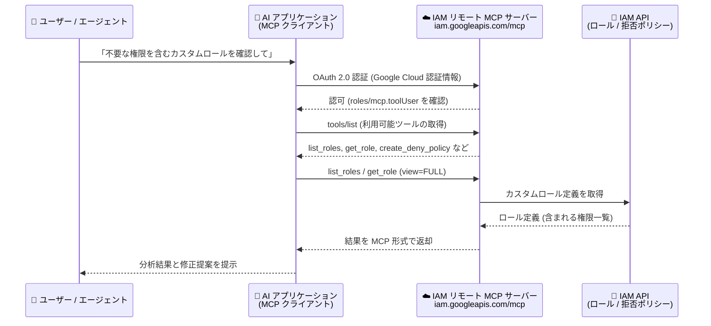

# Identity and Access Management: IAM リモート MCP サーバーが一般提供 (GA) に

**リリース日**: 2026-09-10

**サービス**: Identity and Access Management (IAM)

**機能**: IAM リモート Model Context Protocol (MCP) サーバー

**ステータス**: 一般提供 (GA)

📊 [このアップデートのインフォグラフィックを見る](https://takech9203.github.io/google-cloud-news-summary/20260910-iam-mcp-server-ga.html)

## 概要

Identity and Access Management (IAM) の Model Context Protocol (MCP) サーバーが一般提供 (GA) になりました。Gemini CLI、ChatGPT、Claude などの AI アプリケーションや自作のエージェントから IAM リモート MCP サーバーに接続し、リソース全体のカスタムロールと拒否ポリシー (deny policy) を検査・管理できます。

MCP は、LLM や AI アプリケーション (エージェント) が外部データソースに接続する方法を標準化するプロトコルです。IAM リモート MCP サーバーは Google Cloud のインフラストラクチャ上で動作するリモート MCP サーバーで、グローバルな HTTP エンドポイント (`https://iam.googleapis.com/mcp`) を提供します。IAM API を有効化すると自動的に利用可能になり、追加のサーバー構築は不要です。

Google / Google Cloud のリモート MCP サーバーは、一元化されたディスカバリ、マネージドなエンドポイント、きめ細かな認可、Model Armor によるプロンプト・レスポンス保護 (オプション)、一元化された監査ロギングといった特長を備えています。IAM 管理者や、IAM 運用を AI エージェントで自動化したいプラットフォームチームが主な対象ユーザーです。

**アップデート前の課題**

- AI アプリケーションから IAM のカスタムロールや拒否ポリシーを操作するには、gcloud CLI や REST API を呼び出す独自のツール連携を個別に実装する必要があった
- ローカル MCP サーバーを利用する場合、各利用者のマシン上でのセットアップ・運用が必要だった

**アップデート後の改善**

- IAM API を有効化するだけで、マネージドなグローバルエンドポイント経由で AI アプリケーションから IAM のカスタムロール・拒否ポリシーを検査・管理できるようになった
- GA となり、本番環境での利用を前提としたサポートレベルで、標準化された MCP ツール群 (ロール管理 6 種、拒否ポリシー管理 6 種) を利用できるようになった
- OAuth 2.0 + IAM による認証・認可、Model Armor 連携、監査ロギングなど、Google Cloud の統制の下でエージェントに IAM 操作を委任できるようになった

## アーキテクチャ図



AI アプリケーション内の MCP クライアントが OAuth 2.0 で認証したうえで IAM リモート MCP サーバーのグローバルエンドポイントに接続し、公開されている MCP ツールを介して IAM API のカスタムロール・拒否ポリシーを操作するフローです。拒否ポリシーの作成・更新・削除は非同期 (長時間実行オペレーション) で、`get_deny_policy_status` で完了を確認します。

## サービスアップデートの詳細

### 主要機能

1. **カスタムロール管理ツール (6 種)**
   - `list_roles`: プロジェクトに定義されたカスタムロールを一覧表示 (事前定義ロールは対象外。`view=BASIC/FULL`、ページサイズはデフォルト 300、最大 1,000)
   - `get_role`: ロールのタイトル、説明、リリースステージ、含まれる権限の詳細を取得
   - `create_role` / `update_role`: カスタムロールの作成・更新 (タイトル、説明、権限リスト、ステージを指定)
   - `delete_role` / `undelete_role`: ロールの削除と、削除後 7 日以内の復元

2. **拒否ポリシー管理ツール (6 種)**
   - `list_deny_policies` / `get_deny_policy`: プロジェクトにアタッチされた拒否ポリシーの一覧・詳細 (拒否対象プリンシパル、除外プリンシパル、拒否権限) を取得
   - `create_deny_policy` / `update_deny_policy` / `delete_deny_policy`: 拒否ポリシーの作成・更新・削除。いずれも非同期で長時間実行オペレーションを返す。更新時は etag による楽観的同時実行制御 (read-modify-write) を使用
   - `get_deny_policy_status`: 非同期オペレーションの完了状態 (`done: true`) やエラーを確認

3. **マネージドなリモート MCP サーバー基盤**
   - IAM API の有効化のみで利用可能 (サーバーの構築・運用が不要)
   - 一元化されたディスカバリ、グローバル HTTP エンドポイント、きめ細かな認可、監査ロギング
   - Model Armor の floor settings と統合し、MCP ツール呼び出し・レスポンスの検査/ブロック (`INSPECT_AND_BLOCK`) が可能

## 技術仕様

### エンドポイントと認証

| 項目 | 詳細 |
|------|------|
| エンドポイント | `https://iam.googleapis.com/mcp` (グローバル) |
| トランスポート | HTTP (リモート MCP サーバー) |
| 認証 | OAuth 2.0 + IAM (すべての Google Cloud ID をサポート。API キーは非サポート) |
| OAuth スコープ | `https://www.googleapis.com/auth/cloud-platform`、`https://www.googleapis.com/auth/iam` |
| 有効化 | IAM API の有効化により自動的に利用可能 |
| 対応クライアント例 | Gemini CLI、ChatGPT、Claude、カスタム AI アプリケーション |

### 必要な IAM ロール

| 操作 | 必要なロール | 付与先 |
|------|--------------|--------|
| MCP ツール呼び出し (`mcp.tools.call`) | MCP Tool User (`roles/mcp.toolUser`) | プロジェクト |
| カスタムロール管理 | Role Administrator (`roles/iam.roleAdmin`) | プロジェクト |
| 拒否ポリシー管理 | Deny Admin (`roles/iam.denyAdmin`) | 組織 |

### ツール仕様の取得例

```bash
curl --location 'https://iam.googleapis.com/mcp' \
  --header 'content-type: application/json' \
  --header 'accept: application/json, text/event-stream' \
  --data '{
    "method": "tools/list",
    "jsonrpc": "2.0",
    "id": 1
  }'
```

## 設定方法

### 前提条件

1. IAM API が有効化されていること (有効化すると IAM リモート MCP サーバーが利用可能になる)
2. 利用するプリンシパルに `roles/mcp.toolUser` (プロジェクト) と、操作対象に応じて `roles/iam.roleAdmin` (プロジェクト) または `roles/iam.denyAdmin` (組織) が付与されていること

### 手順

#### ステップ 1: MCP クライアントの設定

AI アプリケーションのリモート MCP サーバー接続設定に、以下の情報を登録します。

- サーバー URL / エンドポイント: `https://iam.googleapis.com/mcp`
- トランスポート: HTTP
- 認証情報: Google Cloud の認証情報 (OAuth クライアント ID / シークレット、またはエージェント ID と認証情報)

アプリケーションごとの具体的な接続手順は [Configure MCP in an AI application](https://docs.cloud.google.com/mcp/configure-mcp-ai-application) を参照してください。

#### ステップ 2: (オプション) Model Armor による保護の有効化

```bash
gcloud model-armor floorsettings update \
  --full-uri='projects/PROJECT_ID/locations/global/floorSetting' \
  --enable-floor-setting-enforcement=TRUE \
  --add-integrated-services=GOOGLE_MCP_SERVER \
  --google-mcp-server-enforcement-type=INSPECT_AND_BLOCK \
  --enable-google-mcp-server-cloud-logging \
  --malicious-uri-filter-settings-enforcement=ENABLED
```

プロジェクトの floor settings で MCP サニタイズを有効にすると、MCP ツール呼び出しとレスポンスに一貫したセキュリティフィルタが適用されます。エージェントと MCP サーバーが別プロジェクトの場合は、両方のプロジェクトで floor settings を作成できます (Model Armor が 2 回起動)。

## メリット

### ビジネス面

- **IAM 運用の効率化**: 自然言語での指示から、カスタムロールの棚卸しや拒否ポリシーの整備といった IAM 運用タスクを AI エージェント経由で実行できる
- **統制の維持**: OAuth 2.0 + IAM による認可、監査ロギング、Model Armor 連携により、エージェントによる IAM 操作にも組織のガバナンスを適用できる

### 技術面

- **マネージドエンドポイント**: サーバーの構築・運用不要で、IAM API 有効化のみで利用開始できる
- **標準プロトコル**: MCP 標準に準拠しており、Gemini CLI、ChatGPT、Claude など複数の AI アプリケーションから同じエンドポイントに接続できる
- **安全な変更操作**: 拒否ポリシー更新での etag による楽観的同時実行制御、削除ロールの 7 日以内の復元 (`undelete_role`) など、変更操作の安全性に配慮した設計

## デメリット・制約事項

### 制限事項

- カスタムロール管理ツールはプロジェクトのみをサポート (組織レベルのカスタムロールは非サポート)
- 拒否ポリシー管理ツールもプロジェクトのみをサポート (組織・フォルダへのアタッチは非サポート)
- `list_roles` / `get_role` は事前定義ロールを対象としない (カスタムロールのみ)
- API キーによる認証は非サポート

### 考慮すべき点

- 拒否ポリシーの作成・更新・削除は非同期処理のため、`get_deny_policy_status` での完了確認をエージェントのワークフローに組み込む必要がある
- MCP ツールで実行できる操作は幅広いため、エージェント用に専用の ID を作成し、最小権限の原則に基づいてアクセスを制御・監視することが推奨されている
- Model Armor でロギングを有効にするとペイロード全体が記録されるため、ログへの機密情報露出に注意が必要
- 拒否ポリシーの管理には組織レベルの `roles/iam.denyAdmin` が必要であり、エージェントへの付与は慎重に判断すべき

## ユースケース

### ユースケース 1: カスタムロールの棚卸しと最小権限化

**シナリオ**: プロジェクトに多数のカスタムロールが蓄積しており、過剰な権限を含むロールを特定・修正したい。

**実装例**:
```
AI エージェントへの指示:
「プロジェクト my-project のカスタムロールを一覧し、
 各ロールに含まれる権限を確認して、admin 系権限を含むロールを報告して」

エージェントの動作:
1. list_roles(parent="projects/my-project", view="FULL")
2. 各ロールの included_permissions を分析
3. 必要に応じて update_role で権限リストを修正
```

**効果**: 手作業でのロール定義の確認・修正作業を対話的に実行でき、最小権限の維持が容易になる。

### ユースケース 2: 拒否ポリシーによるガードレールの整備

**シナリオ**: 特定の危険な権限 (例: 削除系操作) をプロジェクトの一般ユーザーに対して明示的に禁止するガードレールを、AI エージェント経由で整備・点検したい。

**効果**: `list_deny_policies` / `get_deny_policy` で既存の拒否ルール・対象プリンシパル・除外設定を点検し、`create_deny_policy` / `update_deny_policy` で不足しているガードレールを追加できる。拒否ポリシーは許可ポリシー (継承分を含む) をオーバーライドするため、確実なアクセス禁止を実現できる。

## 利用可能リージョン

IAM リモート MCP サーバーはグローバルエンドポイント (`https://iam.googleapis.com/mcp`) として提供されます。

## 関連サービス・機能

- **Policy Assist リモート MCP サーバー (Preview)**: 前日 (2026-09-09) に発表された、AI エージェントから IAM ロールの提案を取得できる MCP サーバー。IAM MCP サーバーと組み合わせて権限設計から適用までを支援
- **Cloud CLI リモート MCP サーバー (Preview)**: gcloud / bq コマンドを AI アプリケーションから実行できる MCP サーバー
- **Model Armor**: MCP ツール呼び出しとレスポンスのセキュリティ検査・ブロックを提供
- **Cloud Audit Logs**: Google Cloud リモート MCP サーバーの一元化された監査ロギングを提供
- **IAM 拒否ポリシー / カスタムロール**: 本 MCP サーバーの操作対象となる IAM の中核機能

## 参考リンク

- 📊 [インフォグラフィック](https://takech9203.github.io/google-cloud-news-summary/20260910-iam-mcp-server-ga.html)
- [公式リリースノート](https://docs.cloud.google.com/release-notes#September_10_2026)
- [Use the IAM remote MCP server](https://docs.cloud.google.com/iam/docs/use-iam-mcp)
- [IAM MCP reference](https://docs.cloud.google.com/iam/docs/reference/mcp)
- [Google Cloud MCP servers overview](https://docs.cloud.google.com/mcp/overview)
- [Authenticate to MCP servers](https://docs.cloud.google.com/mcp/authenticate-mcp)

## まとめ

IAM リモート MCP サーバーの GA により、カスタムロールと拒否ポリシーの管理を AI エージェントに安全に委任するための標準的な経路が本番利用可能になりました。IAM 運用の自動化を検討しているチームは、まず `roles/mcp.toolUser` を付与した専用のエージェント ID を用意し、読み取り系ツール (`list_roles`、`list_deny_policies`) から段階的に導入することを推奨します。変更系操作を委任する場合は、Model Armor と監査ロギングの有効化を併せて検討してください。

---

**タグ**: `IAM`, `MCP`, `Model Context Protocol`, `AI エージェント`, `セキュリティ`, `カスタムロール`, `拒否ポリシー`, `GA`
