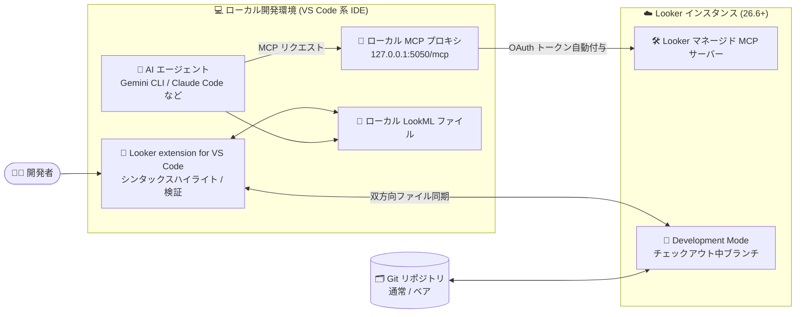

# Looker: VS Code 拡張機能が一般提供 (GA) 開始

**リリース日**: 2026-09-10

**サービス**: Looker

**機能**: Looker extension for VS Code (ローカル LookML 開発 + AI 支援開発)

**ステータス**: GA (一般提供)

📊 [このアップデートのインフォグラフィックを見る](https://takech9203.github.io/google-cloud-news-summary/20260910-looker-vscode-extension-ga.html)

## 概要

Looker extension for VS Code が一般提供 (GA) になりました。この拡張機能により、LookML 開発をローカルのデスクトップ環境 (VS Code およびその派生 IDE) で行えるようになります。リッチなシンタックスハイライト、Looker インスタンスとの双方向ファイル同期に加え、Model Context Protocol (MCP) を介した AI コーディングエージェントとの統合による AI 支援開発 (いわゆる「vibe coding」) をサポートします。

今回の GA では、インタラクティブなオンボーディングウォークスルー、ベアリポジトリ (bare repository) からのワークスペース作成 (Populate Workspace)、ローカル Git ブランチと Looker Development Mode 間の同期強化が導入されました。さらに、Kiro IDE での OAuth 認証サポートと、API クライアントシークレットのより安全な保存方式も追加されています。

対象ユーザーは LookML を開発するデータエンジニア・アナリティクスエンジニアで、Looker の Web IDE から離れて、使い慣れたローカル IDE と AI エージェント (Gemini CLI、Claude Code、Cursor など) を組み合わせたモダンな開発体験を求めるチームに特に有用です。

**アップデート前の課題**

- LookML の開発は主に Looker 内蔵の Web IDE で行う必要があり、ローカル IDE の拡張機能・AI エージェント・キーボード操作などの開発体験を活用しにくかった
- AI コーディングエージェントが Looker のセマンティックモデルやデータベーススキーマを直接参照できず、LookML の生成・検証を自動化しにくかった
- ベアリポジトリ構成の LookML プロジェクトは、リモート Git リポジトリのクローンができないため、ローカル環境にプロジェクトファイルを取り込む手段が限られていた
- API クライアントシークレットを設定ファイル (`looker.clientSecret`) に平文で保存する方式には、セキュリティ上の懸念があった

**アップデート後の改善**

- 拡張機能が GA となり、VS Code / Claude Code / Codex / Cursor / Kiro / Windsurf / Zed といった VS Code ベースの IDE で、本番用途の LookML ローカル開発が可能になった
- Looker マネージド MCP サーバーとローカル MCP プロキシ (デフォルト `http://127.0.0.1:5050/mcp`) を介して、AI エージェントがスキーマ参照・LookML 検証・コード修正を行う「vibe coding」ワークフローが利用可能になった
- インタラクティブなオンボーディングウォークスルー (`Looker: Show Onboarding Walkthrough`) により、初期設定 (インスタンス URL、認証、プロジェクト選択) がガイド付きで完了できるようになった
- ベアリポジトリ構成のプロジェクトでも「Populate Workspace」で空のローカルフォルダにプロジェクトファイルを展開できるようになった
- ローカル Git ブランチと Looker インスタンスの Development Mode でチェックアウト中のブランチとの同期が強化された
- Kiro IDE で OAuth 認証がサポートされ、API クライアントシークレットはオンボーディングウォークスルー経由で安全に保存されるようになった (`looker.clientSecret` 設定は非推奨化)

## アーキテクチャ図



拡張機能はローカル LookML ファイルと Looker Development Mode を双方向同期しつつ、ローカル MCP プロキシが AI エージェントのリクエストに OAuth トークンを自動付与して Looker マネージド MCP サーバーへ転送します。プロキシはローカルファイルの同期完了までツールリクエストをバッファリングするため、AI エージェントが古いコードを検証してしまうことを防ぎます。

## サービスアップデートの詳細

### 主要機能

1. **ローカル LookML 開発 (GA)**
   - リッチなシンタックスハイライト、オートコンプリート、統合された LookML 検証をローカル IDE で利用可能
   - Looker インスタンスとの双方向ファイル同期により、ローカルでの編集内容が Development Mode に自動反映される
   - VS Code ベースの IDE (VS Code、Claude Code、Codex、Cursor、Kiro、Windsurf、Zed) をサポート。IntelliJ や Eclipse など VS Code フォークでない IDE は非サポート

2. **MCP による AI 支援開発 (vibe coding)**
   - 拡張機能がローカルリバースプロキシ (デフォルト `http://127.0.0.1:5050/mcp`) を起動し、Looker 内蔵のマネージド MCP サーバー (`LOOKER_INSTANCE_URL/mcp`) へ接続
   - プロキシが OAuth ベアラートークンを自動注入し、ローカルファイル同期の完了までエージェントのツールリクエストをバッファリング
   - AI エージェントはローカル LookML の読み取り、MCP 経由でのデータベーススキーマ参照、コード変更の提案・適用、コミット前の LookML 検証による自己修正が可能
   - 事前構築済みのスキルファイル (コーディング標準やプロジェクト固有の指示) を拡張機能が自動インストール・更新 (`Looker: Install Skills in this Workspace` / `Looker: Install Skills Globally` コマンドでも導入可能)
   - MCP Toolbox for Databases などのカスタム / セルフホスト MCP サーバーへの接続にも対応 (`looker.mcpServerUrl` で指定)

3. **インタラクティブなオンボーディングウォークスルー**
   - `Looker: Show Onboarding Walkthrough` コマンドで、インスタンス URL の設定、認証、プロジェクト選択までをガイド付きで実施
   - 設定は `settings.json` の手動編集でも可能だが、ウォークスルーの利用が推奨されている

4. **ベアリポジトリからのワークスペース作成**
   - ベアリポジトリ構成の LookML プロジェクトでも、空のローカルフォルダに対して「Populate Workspace」でプロジェクトファイルを展開可能
   - 展開後は、Looker インスタンスの Development Mode でチェックアウト中のブランチとローカルフォルダの同期が自動的に開始される

5. **認証・セキュリティの強化**
   - Kiro IDE での OAuth 認証をサポート
   - API クライアントシークレットの保存がより安全な方式に変更され、`looker.clientSecret` 設定は非推奨化 (オンボーディングウォークスルー経由での資格情報設定を推奨)

## 技術仕様

### 前提条件

| 項目 | 詳細 |
|------|------|
| Looker インスタンス | Looker 26.6 以降 |
| Looker 権限 | 編集対象モデルに対する `develop` 権限 |
| プロジェクト構成 | Looker 上のプロジェクト (ベアリポジトリ構成、または Git 連携済み構成) |
| 対応 IDE | VS Code およびそのフォーク (Claude Code、Codex、Cursor、Kiro、Windsurf、Zed) |
| 認証 | OAuth (推奨、要 OAuth Client ID) または API キー |
| Git (任意) | リポジトリをクローンする場合はローカルに Git のインストールが必要 |
| MCP サーバー (任意・推奨) | AI 支援開発を行う場合は Looker マネージド MCP サーバーへの接続 |

### 主な拡張機能設定 (settings.json)

| 設定 | 説明 | デフォルト |
|------|------|-----------|
| `looker.instanceURL` | Looker インスタンスのベース URL | - |
| `looker.oauthClientId` | Looker OAuth Client ID (OAuth 認証に必須) | - |
| `looker.clientId` | Looker API Client ID (API キー認証に必須) | - |
| `looker.clientSecret` | API Client Secret。**非推奨** (ウォークスルーでの設定を推奨) | - |
| `looker.projectId` | LookML プロジェクト ID | - |
| `looker.mcpServerUrl` | プロキシの転送先 MCP サーバー URL (カスタム MCP 使用時のみ設定) | `looker.instanceURL/mcp` |
| `looker.askBeforeOverwritingRemote` | 競合検出時にリモート上書き前に必ず確認する | `false` |

`looker.*` の設定はすべて VS Code の `settings.json` に定義する必要があります。AI エージェントの MCP 設定ファイル (`.agents/mcp_config.json` など) に定義しても拡張機能では機能しません。ワークスペースレベル (`.vscode/settings.json`) での設定が推奨されています。

### MCP クライアント設定例 (Claude Code の場合)

```json
{
  "mcpServers": {
    "Looker": {
      "type": "http",
      "url": "http://127.0.0.1:5050/mcp"
    }
  }
}
```

Cursor (`.cursor/mcp.json`)、Cline、Windsurf、VS Code Copilot (`.agents/mcp_config.json`) でも同様に、拡張機能のローカルプロキシ `http://127.0.0.1:5050/mcp` を指定します。

## 設定方法

### 前提条件

1. Looker 26.6 以降のインスタンスと、対象モデルに対する `develop` 権限
2. VS Code Marketplace から「Looker by Google Cloud」拡張機能をインストール
3. OAuth 認証を使う場合は、Looker 管理者から OAuth Client ID を取得

### 手順

#### ステップ 1: オンボーディングウォークスルーで初期設定

```
Command Palette (Ctrl+Shift+P / Cmd+Shift+P)
> Looker: Show Onboarding Walkthrough
```

インスタンス URL、認証方式、対象プロジェクトの選択までガイドに従って設定します。

#### ステップ 2: OAuth でサインイン

```
Command Palette
> Looker: Sign In (OAuth)
```

ブラウザが開き、拡張機能の Looker アカウントへのアクセスを承認すると IDE にリダイレクトされ、「Successfully signed in to Looker!」と表示されます。

#### ステップ 3: LookML プロジェクトの取り込み

Git 連携済みプロジェクトの場合:

```
Command Palette
> Git: Clone
# リモートリポジトリの URL を入力してローカルフォルダにクローン
```

ベアリポジトリ構成の場合:

```
1. 空のローカルフォルダを作成して開く
2. Looker: Show Onboarding Walkthrough を実行
3. 「Select Project」で対象プロジェクトを選択
4. 「Populate Workspace」をクリックしてファイルを展開
```

取り込み完了後、ローカルフォルダと Development Mode のチェックアウト中ブランチの同期が自動的に開始されます。

#### ステップ 4 (任意): AI エージェントの MCP 接続

AI 支援開発を行う場合は、使用する AI エージェントの MCP 設定ファイルにローカルプロキシ `http://127.0.0.1:5050/mcp` を登録します (前掲の設定例を参照)。

## メリット

### ビジネス面

- **開発生産性の向上**: 使い慣れたローカル IDE と AI エージェントの組み合わせにより、LookML の生成・修正・検証のサイクルが高速化される
- **オンボーディングの簡素化**: ガイド付きウォークスルーにより、新規開発者のセットアップコストが低減する
- **GA による本番採用**: 一般提供となったことで、エンタープライズの標準開発ワークフローとして採用しやすくなった

### 技術面

- **エージェントの自己修正ループ**: AI エージェントが MCP 経由でスキーマを参照し、LookML 検証を実行して自ら修正できるため、コミット前の品質が向上する
- **同期の整合性保証**: MCP プロキシがローカルファイル同期の完了までツールリクエストをバッファリングし、サーバー側で古いコードが検証されることを防ぐ
- **セキュアな認証**: OAuth 認証 (Kiro を含む) と、API クライアントシークレットの安全な保存により、資格情報の平文管理を回避できる
- **柔軟な MCP 構成**: Looker マネージド MCP サーバーだけでなく、MCP Toolbox for Databases などのカスタム MCP サーバーにも接続できる

## デメリット・制約事項

### 制限事項

- Looker インスタンスは Looker 26.6 以降である必要がある
- VS Code ベースの IDE のみサポート。IntelliJ や Eclipse など VS Code フォークでない IDE は利用できない
- 編集対象モデルに対する `develop` 権限が必要
- `looker.*` 設定は VS Code の `settings.json` に定義する必要があり、AI エージェント側の MCP 設定ファイルへの定義では動作しない

### 考慮すべき点

- OAuth 認証 (推奨) を利用するには、Looker 管理者による OAuth Client ID の発行が必要
- Looker マネージド MCP サーバーの利用には、Looker 管理者によるインスタンス側の設定が必要
- `looker.acceptSelfSignedCertificates` (自己署名証明書の許容) の有効化は推奨されていない
- `looker.clientSecret` 設定は非推奨のため、既存利用者はオンボーディングウォークスルー経由の資格情報設定へ移行することが望ましい

## ユースケース

### ユースケース 1: AI エージェントによる LookML の生成と検証 (vibe coding)

**シナリオ**: アナリティクスエンジニアが、新しいデータマート用の view / explore を自然言語の指示で作成したい。

**実装例**:
```
1. Looker 拡張機能をセットアップし、OAuth でサインイン
2. AI エージェント (例: Claude Code) の .mcp.json にローカルプロキシを登録
3. エージェントに指示: 「orders テーブルのスキーマを確認して、
   売上分析用の view と explore を作成し、LookML 検証まで実行して」
4. エージェントが MCP 経由でスキーマを参照 → LookML を生成 →
   検証を実行して自己修正 → ローカルファイルに適用
5. 拡張機能が Development Mode に自動同期し、Looker 上で動作確認
```

**効果**: スキーマ確認から LookML 作成・検証までを AI エージェントが一貫して行い、開発リードタイムを大幅に短縮できる。

### ユースケース 2: ベアリポジトリ構成プロジェクトのローカル開発

**シナリオ**: 外部 Git リポジトリを持たないベアリポジトリ構成の LookML プロジェクトを、ローカル IDE で編集したい。

**効果**: 「Populate Workspace」により、リモートリポジトリのクローンなしで空のローカルフォルダにプロジェクトファイルを展開でき、以降は Development Mode のブランチと自動同期しながらローカル開発ができる。

### ユースケース 3: チーム標準のセットアップ手順の統一

**シナリオ**: 複数の開発者が参加するプロジェクトで、拡張機能のセットアップ手順を標準化したい。

**効果**: オンボーディングウォークスルーとワークスペースレベルの `.vscode/settings.json` (インスタンス URL、プロジェクト ID) を組み合わせることで、開発者ごとの設定ばらつきを抑え、立ち上げを迅速化できる。

## 料金

Looker extension for VS Code は VS Code Marketplace から入手できる拡張機能で、利用には Looker インスタンス (Looker 26.6 以降) が必要です。Looker 本体の料金については料金ページを参照してください。

- [Looker 料金ページ](https://cloud.google.com/looker/pricing)

## 関連サービス・機能

- **Looker マネージド MCP サーバー**: Looker インスタンスに組み込まれた MCP サーバー。AI エージェントが LookML モデルやデータベーススキーマにアクセスするための標準インターフェース
- **MCP Toolbox for Databases**: セルフホスト型の MCP サーバー。カスタム MCP サーバーとして拡張機能から接続可能
- **Gemini CLI / Claude Code / Cursor などの AI エージェント**: 拡張機能のローカル MCP プロキシを介して Looker と連携し、LookML の生成・検証を行う
- **Looker Development Mode / Git 連携**: ローカル Git ブランチと Development Mode のブランチが双方向同期され、既存の Git ワークフロー (Pull Request ベースのレビューなど) と統合できる

## 参考リンク

- 📊 [インフォグラフィック](https://takech9203.github.io/google-cloud-news-summary/20260910-looker-vscode-extension-ga.html)
- [公式リリースノート](https://docs.cloud.google.com/release-notes#September_10_2026)
- [Getting started with the Looker extension for VS Code](https://docs.cloud.google.com/looker/docs/getting-started-vscode-extension)
- [AI-assisted development (vibe coding) with Looker](https://docs.cloud.google.com/looker/docs/ai-assisted-development-vscode)
- [Looker-managed MCP server](https://docs.cloud.google.com/looker/docs/mcp)
- [Looker by Google Cloud (VS Code Marketplace)](https://marketplace.visualstudio.com/items?itemName=Google.vscode-looker-official)
- [Looker 料金ページ](https://cloud.google.com/looker/pricing)

## まとめ

Looker extension for VS Code の GA により、LookML 開発はローカル IDE と AI エージェントを中心としたモダンな開発ワークフローへ本格的に移行できるようになりました。MCP によるスキーマ参照と検証の自己修正ループは、AI 支援開発の実用性を大きく高めます。LookML 開発チームは、Looker インスタンスを 26.6 以降へ更新のうえ、OAuth Client ID の発行とマネージド MCP サーバーの設定を管理者に依頼し、オンボーディングウォークスルーから導入を始めることを推奨します。

---

**タグ**: #Looker #VSCode #LookML #MCP #AIAssisted #VibeCoding #GA #DeveloperTools
