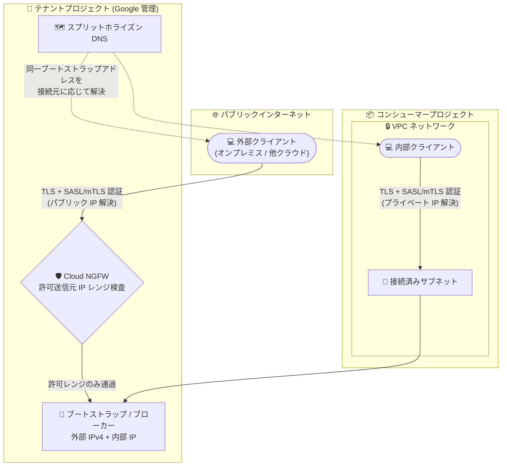

# Google Cloud Managed Service for Apache Kafka: パブリッククラスタ構成によるインターネット経由のクライアント接続

**リリース日**: 2026-09-10

**サービス**: Google Cloud Managed Service for Apache Kafka

**機能**: パブリッククラスタ (Public Cluster) 構成

**ステータス**: 一般提供 (GA)

📊 [このアップデートのインフォグラフィックを見る](https://takech9203.github.io/google-cloud-news-summary/20260910-managed-kafka-public-cluster.html)

## 概要

Google Cloud Managed Service for Apache Kafka のクラスタを「パブリッククラスタ」として構成し、クライアントアプリケーションがパブリックインターネット経由で接続できるようになりました。パブリッククラスタを有効化すると、サービスがクラスタのブローカーとブートストラップエンドポイントに外部 IPv4 アドレスをプロビジョニングし、クラスタの DNS エントリをパブリックに名前解決可能にします。これにより、VPC の外部にあるクライアントも、VPC 内のクライアントと同じブートストラップアドレスを使用してブローカーを検出し、接続を確立できます。

この機能は、オンプレミス環境、他のクラウド、SaaS パートナーなど、Google Cloud の VPC ネットワークに接続されていないクライアントから Kafka クラスタへアクセスしたいユーザーに価値があります。アクセスは許可された送信元 IP レンジ (allowed source IP ranges) に限定され、Cloud Next Generation Firewall (Cloud NGFW) によってアクセス制御が実施されます。すべての接続は TLS で暗号化され、SASL (IAM アイデンティティ) または mTLS (クライアント証明書) による認証が必須で、匿名アクセスは許可されません。

なお、2026 年 9 月 9 日リリースの Cloud SDK 584.0.0 では、`gcloud managed-kafka clusters create` / `update` の `--public-cluster` および `--allowed-source-ip-ranges` フラグが GA に昇格しています。

**アップデート前の課題**

- クライアントは Google Cloud プロジェクト内の VPC ネットワークからクラスタに接続する必要があり、VPC 外 (オンプレミスや他クラウドなど) のクライアントが直接接続する手段がなかった
- VPC 外のクライアントを接続するには、VPN や Interconnect などのプライベート接続の構成が前提となっていた

**アップデート後の改善**

- クラスタをパブリッククラスタとして構成することで、信頼できる外部 IP レンジからパブリックインターネット経由で Kafka 操作 (メッセージの送受信を含む) を実行できるようになった
- ブローカーとブートストラップエンドポイントに外部 IPv4 アドレスが自動プロビジョニングされ、スプリットホライズン DNS により VPC 内クライアントはプライベートエンドポイント、外部クライアントはパブリックエンドポイントを同一のブートストラップアドレスで解決できるようになった
- Cloud NGFW による送信元 IP レンジ制限、TLS 必須、SASL/mTLS 認証必須という多層防御が組み込まれており、追加のセキュリティ構築なしに安全な公開が可能になった

## アーキテクチャ図



パブリッククラスタでは、外部クライアントは Cloud NGFW による送信元 IP レンジ検査を経てパブリックエンドポイントに接続し、VPC 内クライアントは従来どおり接続済みサブネット経由でプライベートエンドポイントに接続します。スプリットホライズン DNS により、両者は同一のブートストラップアドレスを使用できます。

## サービスアップデートの詳細

### 主要機能

1. **パブリックインターネット経由のクライアント接続**
   - パブリッククラスタを有効化すると、ブローカーとブートストラップエンドポイントに外部 IPv4 アドレスがプロビジョニングされる
   - クラスタの DNS エントリがパブリックに名前解決可能になり、外部クライアントは VPC 内クライアントと同じブートストラップアドレスで接続できる
   - パブリッククラスタ機能を有効化しても、コンシューマープロジェクトに追加リソースは作成されない

2. **スプリットホライズン DNS による透過的なエンドポイント解決**
   - 接続済みサブネットを含む VPC 内のクライアントは引き続きプライベートエンドポイントを解決する
   - それ以外のネットワークのクライアントはパブリックエンドポイントを解決する

3. **Cloud NGFW による送信元 IP レンジ制限**
   - 有効化時に 1 つ以上の許可送信元 IP レンジ (IPv4 CIDR) の指定が必須
   - Cloud Next Generation Firewall がパブリッククラスタへのアクセスを制限する
   - 許可レンジはクラスタ更新でいつでも追加・削除できる (削除は新規接続にのみ適用)

4. **必須のセキュリティ保護**
   - すべての接続は TLS で暗号化され、認証が必須 (SASL による IAM アイデンティティ、または mTLS によるクライアント証明書)。匿名アクセスは不可
   - セキュリティ管理者はカスタム組織ポリシー制約でプロジェクト内のパブリッククラスタを禁止できる

5. **外部ファイアウォール構成のためのディスカバリ DNS レコード**
   - クラスタの外部 IPv4 アドレス一覧は API、gcloud、Terraform で取得可能
   - 全外部 IPv4 アドレスを含むディスカバリ DNS レコード (A レコード) が提供され、Cloud NGFW などの FQDN ベースの Egress ファイアウォールに利用できる (1 レコードあたり最大 30 IP アドレス)

## 技術仕様

### 許可送信元 IP レンジのルール

| 項目 | 詳細 |
|------|------|
| 表記 | IPv4 CIDR 表記 (例: `203.0.113.0/24`、`198.51.100.5/32`) |
| CIDR サブネットサイズ | `/16` から `/32` の範囲 |
| 重複 | CIDR レンジ同士の重複は不可 |
| ルーティング可能性 | パブリックにルーティング可能なレンジのみ (RFC 1918 などのプライベートレンジは拒否) |
| 最大数 | 500 レンジ |
| IPv6 | 非サポート |

### 接続要件

| 項目 | 詳細 |
|------|------|
| 接続済みサブネット | パブリッククラスタでも最低 1 つの接続済みサブネットが必要 (トラフィックを流す必要はない) |
| 暗号化 | すべての接続で TLS 必須 |
| 認証 | SASL (IAM アイデンティティ) または mTLS (クライアント証明書)。匿名アクセス不可 |
| Egress ファイアウォールのポート | TCP 9092 (SASL)、TCP 9192 (mTLS) |
| 外部 IP アドレスの変化 | クラスタのスケールアップで増加する場合がある。パブリッククラスタ機能をオフ→オンすると新しい外部 IPv4 アドレスセットが割り当てられる |

## 設定方法

### 前提条件

1. Managed Service for Apache Kafka クラスタが存在し、最低 1 つのサブネットが接続されていること
2. クラスタ更新には `roles/managedkafka.clusterEditor` ロール (`managedkafka.clusters.update` 権限) が必要
3. 許可する送信元 IP レンジ (パブリックにルーティング可能な IPv4 CIDR) を決定していること

### 手順

#### ステップ 1: 既存クラスタでパブリックアクセスを有効化

```bash
gcloud managed-kafka clusters update CLUSTER_ID \
  --location=LOCATION \
  --public-cluster \
  --allowed-source-ip-ranges=ALLOWED_SOURCE_IP_RANGES
```

`ALLOWED_SOURCE_IP_RANGES` には、パブリッククラスタへのアクセスを許可する IPv4 CIDR レンジを指定します。`--async` フラグを付けると、更新完了を待たずにレスポンスが返ります。

#### ステップ 2: パブリックアクセスの無効化 (必要な場合)

```bash
gcloud managed-kafka clusters update CLUSTER_ID \
  --location=LOCATION \
  --no-public-cluster
```

パブリックアクセスを無効化するには `--no-public-cluster` フラグを使用します。なお、再度有効化すると新しい外部 IPv4 アドレスセットが割り当てられる点に注意してください。

## メリット

### ビジネス面

- **ハイブリッド / マルチクラウド統合の簡素化**: オンプレミスや他クラウドのアプリケーションから、VPN や Interconnect を構築せずに Kafka クラスタへ接続でき、導入のリードタイムとコストを抑えられる
- **パートナー・外部システム連携**: 信頼できる外部 IP レンジを許可することで、社外システムとのイベントデータ連携を実現できる

### 技術面

- **同一ブートストラップアドレスでの接続**: スプリットホライズン DNS により、内部・外部クライアントで接続設定 (ブートストラップアドレス) を共通化できる
- **組み込みの多層防御**: Cloud NGFW による IP レンジ制限、TLS 必須、SASL/mTLS 認証必須が標準で適用され、追加のゲートウェイ構築が不要
- **ガバナンス制御**: カスタム組織ポリシー制約により、組織としてパブリッククラスタの利用を禁止することも可能

## デメリット・制約事項

### 制限事項

- パブリックアクセスを有効化する場合でも、最低 1 つの接続済みサブネットが必要
- 許可送信元 IP レンジは IPv4 CIDR のみで、サブネットサイズは `/16`〜`/32`、重複不可、最大 500 レンジ。IPv6 は非サポート
- プライベート IP レンジ (RFC 1918 など) は許可レンジとして指定できない
- ディスカバリ DNS レコードは FQDN ベースの Egress ファイアウォール構成専用であり、Kafka クライアントの接続先には使用しない (クライアントはブートストラップアドレスに接続する)

### 考慮すべき点

- 信頼できる外部 IP レンジのみを許可し、信頼できないレンジにクラスタを公開しないこと (公式ドキュメントで注意喚起されている)
- 許可送信元 IP レンジの削除は新規接続にのみ適用され、既存の確立済み接続には影響しない
- クラスタの外部 IPv4 アドレス一覧はスケールアップや機能のオフ→オンで変化しうるため、外部側の Egress ファイアウォール構成はディスカバリ DNS レコードの利用や自動化で追随させる必要がある
- 外部ネットワーク側の Egress ファイアウォールでは TCP 9092 (SASL) と TCP 9192 (mTLS) への接続を許可する必要がある

## ユースケース

### ユースケース 1: オンプレミスアプリケーションからのイベント送信

**シナリオ**: オンプレミスのデータセンターで稼働する業務アプリケーションから、Google Cloud 上の Managed Kafka クラスタへイベントを送信したいが、VPN や Interconnect をまだ整備していない。

**実装例**:
```bash
# データセンターの固定グローバル IP レンジのみを許可してパブリックアクセスを有効化
gcloud managed-kafka clusters update my-cluster \
  --location=us-central1 \
  --public-cluster \
  --allowed-source-ip-ranges=203.0.113.0/24
```

**効果**: プライベート接続の構築を待たずに、TLS + SASL/mTLS 認証で保護された経路でイベントストリーミング基盤への接続を開始できる。

### ユースケース 2: マルチクラウド構成でのデータ連携

**シナリオ**: 他クラウドで稼働するコンシューマーアプリケーションが、Google Cloud 上の Kafka クラスタのトピックを購読する。

**効果**: 他クラウド側の送信元グローバル IP レンジを許可レンジに登録するだけで接続でき、内部クライアントと同じブートストラップアドレスを設定に使用できるため、環境間で接続設定を共通化しやすい。

## 料金

このアップデートに固有の料金情報はリリースノートに記載されていません。Managed Service for Apache Kafka の料金の詳細は、[料金ページ](https://cloud.google.com/managed-service-for-apache-kafka/pricing)を参照してください。

## 利用可能リージョン

リージョンの詳細は[公式ドキュメント](https://docs.cloud.google.com/managed-service-for-apache-kafka/docs/locations)を参照してください。

## 関連サービス・機能

- **Cloud Next Generation Firewall (Cloud NGFW)**: パブリッククラスタへのアクセス制限 (許可送信元 IP レンジの適用) に使用される。FQDN オブジェクトを使った Egress ファイアウォール構成にはディスカバリ DNS レコードを利用できる
- **IAM / SASL 認証**: パブリック接続を含むすべての接続で、IAM アイデンティティによる SASL 認証またはクライアント証明書による mTLS 認証が必須
- **組織ポリシー (カスタム制約)**: プロジェクトでのパブリッククラスタ作成を組織として禁止できる
- **VPC ネットワーク**: パブリッククラスタでも最低 1 つの接続済みサブネットが必要。VPC 内クライアントは従来どおりプライベートエンドポイントで接続する

## 参考リンク

- 📊 [インフォグラフィック](https://takech9203.github.io/google-cloud-news-summary/20260910-managed-kafka-public-cluster.html)
- [公式リリースノート](https://docs.cloud.google.com/release-notes#September_10_2026)
- [ドキュメント: Connect clients to a public cluster](https://docs.cloud.google.com/managed-service-for-apache-kafka/docs/networking-kafka#connect-clients-to-a-public-cluster)
- [ドキュメント: Public clusters (クラスタ作成時の構成)](https://docs.cloud.google.com/managed-service-for-apache-kafka/docs/create-cluster#public-cluster)
- [ドキュメント: Update a cluster](https://docs.cloud.google.com/managed-service-for-apache-kafka/docs/update-cluster)
- [ドキュメント: Authentication types for Kafka brokers](https://docs.cloud.google.com/managed-service-for-apache-kafka/docs/authn-types-kafka)
- [料金ページ](https://cloud.google.com/managed-service-for-apache-kafka/pricing)

## まとめ

Managed Service for Apache Kafka のパブリッククラスタ構成により、VPN や Interconnect を構築せずに、オンプレミスや他クラウドのクライアントからインターネット経由で Kafka クラスタへ安全に接続できるようになりました。Cloud NGFW による送信元 IP レンジ制限、TLS 必須、SASL/mTLS 認証必須という多層防御が組み込まれています。ハイブリッド / マルチクラウドでのイベントストリーミング連携を検討しているチームは、許可する送信元 IP レンジの管理方針と組織ポリシーによるガバナンスを整理したうえで、`gcloud managed-kafka clusters update --public-cluster` での有効化を検討してください。

---

**タグ**: `Managed Service for Apache Kafka`, `ネットワーキング`, `セキュリティ`, `Cloud NGFW`, `パブリッククラスタ`, `GA`
