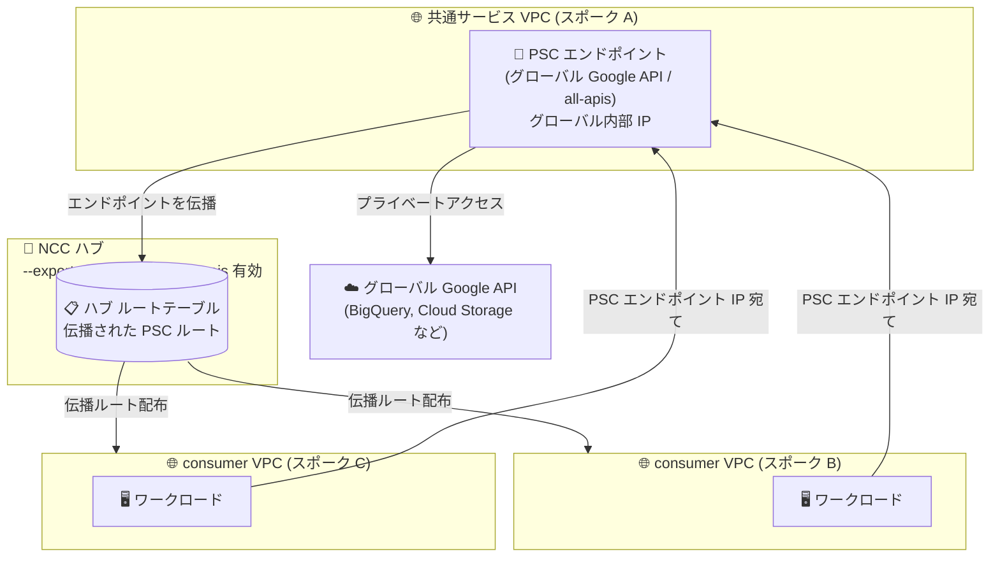

# Network Connectivity Center / VPC: グローバル Google API 向け Private Service Connect エンドポイントの伝播 (Preview)

**リリース日**: 2026-09-10

**サービス**: Network Connectivity Center / Virtual Private Cloud

**機能**: グローバル Google API 向け Private Service Connect エンドポイントの NCC ハブ経由伝播 (Propagated Connections)

**ステータス**: Preview

📊 [このアップデートのインフォグラフィックを見る](https://takech9203.github.io/google-cloud-news-summary/20260910-ncc-vpc-propagated-connections-global-google-apis.html)

## 概要

Network Connectivity Center (NCC) のエンドポイント伝播 (Propagated Connections) 機能が、グローバル Google API へアクセスする Private Service Connect (PSC) エンドポイントに対応しました (Preview)。ある consumer VPC スポーク内に作成されたグローバル Google API 用 PSC エンドポイントを、同じ NCC ハブに接続された他の consumer VPC スポークからプライベートにアクセスできるようになります。あわせて、伝播されるグローバル Google API エンドポイント数を制限する新しいクォータが導入されました。

これまで NCC の PSC 接続伝播は、公開サービス (published services) 向けエンドポイントとリージョナル Google API 向けエンドポイントのみをサポートしていました。今回のアップデートにより、`all-apis` などのグローバル Google API バンドルへアクセスする PSC エンドポイントも伝播対象となり、共通サービス VPC に集約した 1 つの Google API エンドポイントを、ハブ配下のすべての VPC スポークから共有利用する構成が可能になります。

マルチ VPC 構成 (ハブアンドスポーク型ネットワーク) を運用するエンタープライズのネットワーク管理者や、Google API へのプライベートアクセスを一元管理したい組織に有用なアップデートです。

**アップデート前の課題**

- NCC の PSC 接続伝播は公開サービスとリージョナル Google API 向けエンドポイントのみが対象で、グローバル Google API 向け PSC エンドポイントは伝播されなかった
- グローバル Google API にプライベートアクセスするには、VPC スポークごとに個別に PSC エンドポイント (グローバル IP アドレス + 転送ルール) を作成・管理する必要があった
- PSC 接続は VPC スポーク間で推移的 (transitive) に到達できないため、共通サービス VPC に Google API エンドポイントを集約する構成が取れなかった

**アップデート後の改善**

- グローバル Google API 向け PSC エンドポイントを NCC ハブ経由で他の VPC スポークへ伝播できるようになり、1 つのエンドポイントをハブ配下の全スポークで共有可能になった
- ハブの `--export-psc-global-google-apis` フラグを有効化するだけで、除外範囲外のすべてのグローバル Google API エンドポイントが全 VPC スポークに伝播される
- 除外フィルタにエンドポイントの /32 IP アドレスを追加することで、特定のエンドポイントを伝播対象から除外する制御も可能
- 伝播されるグローバル Google API エンドポイント数を管理する新クォータ「PSC global GAPI routes per route table」が導入された

## アーキテクチャ図



共通サービス VPC (スポーク A) に作成したグローバル Google API 向け PSC エンドポイントが NCC ハブ経由で他の VPC スポークへ伝播され、スポーク B / C のワークロードは同一エンドポイントの IP アドレス宛てにトラフィックを送るだけで Google API にプライベートアクセスできます。

## サービスアップデートの詳細

### 主要機能

1. **グローバル Google API 向け PSC エンドポイントの伝播 (Preview)**
   - VPC スポークは、グローバル Google API へアクセスする PSC エンドポイントをハブ内の他のスポークへエクスポート可能
   - 伝播を有効化すると、除外範囲に含まれないすべてのグローバル Google API 用 PSC エンドポイントが、NCC ハブのすべての VPC スポークへ伝播される
   - 他の VPC スポークは、伝播されたエンドポイントの IP アドレス宛てにトラフィックを送信することで Google API サービスにアクセスできる

2. **ハブレベルでの独立した伝播制御**
   - ハブの `--export-psc-global-google-apis` フラグで有効化 (`gcloud beta network-connectivity hubs update`)
   - グローバル Google API の伝播と、公開サービス / リージョナル Google API の伝播 (`--export-psc`) は独立して構成可能で、ハブ管理者はそれぞれを個別に有効化・無効化できる
   - 除外フィルタに PSC エンドポイントの /32 IP アドレスを追加することで、特定エンドポイントを伝播対象から除外可能

3. **新クォータ「PSC global GAPI routes per route table」**
   - 同一 NCC ハブに接続する VPC スポークへ伝播できるグローバル Google API 用 PSC エンドポイント数の上限
   - クォータ名: `PerProjectPerHubPerRouteTablePscGlobalGoogleApiRoutes` (プロジェクト・ハブ・ルートテーブルごと、グローバル)
   - 伝播されるエンドポイントは、伝播先のスポーク数に関係なく 1 エンドポイントにつき 1 カウント

## 技術仕様

### 伝播対象と要件

| 項目 | 詳細 |
|------|------|
| 対象エンドポイント | グローバル Google API (`all-apis` / `vpc-sc` バンドル) へアクセスする PSC エンドポイント |
| 作成日の条件 | 2026 年 9 月 1 日より後に作成されたエンドポイントのみ伝播対象 (それ以前に作成されたものは伝播されない) |
| 有効化方法 | NCC ハブで `--export-psc-global-google-apis` フラグを設定 |
| 除外制御 | エンドポイントの /32 IP アドレスを exclude filter に追加 |
| 伝播の反映 | 非同期で伝播され、最大 24 時間かかる場合がある |
| 適用クォータ | PSC global GAPI routes per route table (プロジェクト・ハブ・ルートテーブルごと) |
| ステータス | Preview (Pre-GA Offerings Terms が適用) |

### 既存の伝播機能との比較

| 伝播対象 | ステータス | 制御フラグ |
|----------|-----------|-----------|
| 公開サービス (published services) 向けエンドポイント | GA | `--export-psc` |
| リージョナル Google API 向けエンドポイント | GA | `--export-psc` |
| グローバル Google API 向けエンドポイント | **Preview (今回追加)** | `--export-psc-global-google-apis` |

## 設定方法

### 前提条件

1. NCC ハブが作成済みで、対象の VPC ネットワークが VPC スポークとしてハブに接続されていること
2. PSC エンドポイントが 2026 年 9 月 1 日より後に作成されていること
3. Preview 機能のため `gcloud beta` コンポーネントを使用すること

### 手順

#### ステップ 1: NCC ハブと VPC スポークの作成

```bash
# NCC ハブを作成
gcloud network-connectivity hubs create my-hub

# VPC ネットワークをスポークとしてハブに接続
gcloud network-connectivity spokes linked-vpc-network create my-spoke \
    --hub=my-hub \
    --vpc-network=projects/PROJECT_ID/global/networks/my-vpc \
    --global
```

#### ステップ 2: グローバル Google API 用 PSC エンドポイントの作成

```bash
# PSC 用のグローバル内部 IP アドレスを作成
gcloud compute addresses create psc-gapi-address \
    --global \
    --purpose=PRIVATE_SERVICE_CONNECT \
    --addresses=10.100.0.2 \
    --network=my-vpc

# グローバル Google API エンドポイント (転送ルール) を作成
gcloud compute forwarding-rules create pscgapiendpoint \
    --global \
    --network=my-vpc \
    --address=psc-gapi-address \
    --target-google-apis-bundle=all-apis
```

#### ステップ 3: ハブでグローバル Google API 伝播を有効化

```bash
# ハブを更新してグローバル Google API エンドポイントの伝播を有効化
gcloud beta network-connectivity hubs update my-hub \
    --export-psc-global-google-apis
```

有効化すると、除外範囲に含まれないすべてのグローバル Google API 用 PSC エンドポイントが、ハブ配下のすべての VPC スポークへ伝播されます。伝播は非同期で行われ、反映まで最大 24 時間かかる場合があります。

## メリット

### ビジネス面

- **運用コストの削減**: VPC スポークごとに Google API 用 PSC エンドポイントを個別作成・管理する必要がなくなり、共通サービス VPC での一元管理により運用負荷を削減できる
- **ガバナンスの向上**: Google API へのプライベートアクセス経路を共通サービス VPC に集約することで、アクセス経路の統制・監査が容易になる

### 技術面

- **推移的アクセスの実現**: 本来推移的でない PSC 接続を NCC ハブのルートテーブル経由で他スポークから到達可能にし、ハブアンドスポーク構成でのプライベート API アクセスをシンプル化
- **柔軟な伝播制御**: グローバル Google API の伝播は公開サービス / リージョナル Google API の伝播とは独立して制御でき、/32 除外フィルタで特定エンドポイントの除外も可能
- **IP アドレス空間の節約**: 各スポークにエンドポイント用のグローバル内部 IP を確保する必要がなく、共有エンドポイント 1 つで済む

## デメリット・制約事項

### 制限事項

- 2026 年 9 月 1 日以前に作成された PSC エンドポイントは伝播されない
- IPv6 アドレスを使用するエンドポイントは伝播接続をサポートしない
- ハイブリッドスポーク (VPN / Interconnect / Router アプライアンス) および Producer VPC スポークには伝播接続は作成されない
- グローバル Google API の伝播を有効にしたスポークでエンドポイントを削除すると、同一スポーク内の他のグローバル Google API エンドポイントへのクロススポークトラフィックが中断される既知の問題がある (回避策はドキュメント参照)

### 考慮すべき点

- Preview 機能のため Pre-GA Offerings Terms が適用され、サポートが限定される可能性がある。本番環境への適用は GA を待つか慎重に検討する
- 接続の伝播は非同期で、反映に最大 24 時間かかる場合がある
- 新クォータ「PSC global GAPI routes per route table」により、同一ハブへ伝播できるグローバル Google API エンドポイント数に上限がある
- デフォルトでは伝播された接続へは同一リージョン・同一 VPC のワークロードからアクセス可能。他リージョンからのアクセスにはエンドポイントのグローバルアクセス構成を確認する

## ユースケース

### ユースケース 1: 共通サービス VPC による Google API アクセスの集約

**シナリオ**: 数十の VPC スポークを NCC ハブに接続している企業が、各 VPC から BigQuery や Cloud Storage などの Google API へのプライベートアクセスを提供したい。従来はスポークごとに PSC エンドポイントを作成していたため、IP 設計と運用が煩雑だった。

**実装例**:
```bash
# 共通サービス VPC にのみグローバル Google API エンドポイントを作成し、
# ハブで伝播を有効化
gcloud beta network-connectivity hubs update shared-hub \
    --export-psc-global-google-apis
```

**効果**: 共通サービス VPC の 1 つのエンドポイントを全スポークで共有でき、エンドポイントの作成・管理コストと IP アドレス消費を大幅に削減できる。

### ユースケース 2: 特定エンドポイントの伝播除外によるアクセス制御

**シナリオ**: セキュリティ要件により、特定チーム専用の Google API エンドポイント (VPC Service Controls 用の `vpc-sc` バンドルなど) は他のスポークへ公開したくない。

**効果**: 対象エンドポイントの /32 IP アドレスを exclude filter に追加することで、そのエンドポイントのみ伝播対象から除外し、ローカル VPC 専用に保てる。

## 料金

今回の Release Notes および関連ドキュメントでは、本機能固有の追加料金に関する記載は確認できませんでした。NCC ハブ / スポークおよび PSC の標準料金については以下の公式料金ページを参照してください。

- [Network Connectivity Center の料金](https://cloud.google.com/network-connectivity/docs/network-connectivity-center/pricing)
- [Private Service Connect の料金](https://cloud.google.com/vpc/pricing#psc-pricing)

## 利用可能リージョン

グローバル Google API 向け PSC エンドポイントおよび NCC ハブはグローバルリソースです。リージョン単位の提供制限に関する記載は確認できませんでした。詳細は公式ドキュメントを参照してください。

## 関連サービス・機能

- **Private Service Connect**: 本機能の基盤。VPC 内から Google API や公開サービスへのプライベートアクセスを提供する
- **Network Connectivity Center (VPC スポーク)**: ハブアンドスポーク型で VPC 間接続を管理し、伝播接続のルート配布を担う
- **VPC Service Controls**: `vpc-sc` バンドルのエンドポイントと組み合わせることで、データ流出防止境界内での API アクセスを構成可能
- **Cloud DNS**: PSC エンドポイント経由で Google API にアクセスする際、`googleapis.com` 系ドメインをエンドポイント IP に解決するプライベート DNS 構成と併用することが多い
- **VPC Flow Logs**: 伝播された PSC 接続のトラフィック可視化に利用可能

## 参考リンク

- 📊 [インフォグラフィック](https://takech9203.github.io/google-cloud-news-summary/20260910-ncc-vpc-propagated-connections-global-google-apis.html)
- [公式リリースノート (2026 年 9 月 10 日)](https://docs.cloud.google.com/release-notes#September_10_2026)
- [PSC propagated connection の概要 (グローバル Google API へのアクセス)](https://docs.cloud.google.com/network-connectivity/docs/network-connectivity-center/concepts/psc-propagated-connection-overview#access-gapi-through-psc)
- [NCC のクォータと上限](https://docs.cloud.google.com/network-connectivity/docs/network-connectivity-center/quotas#general-ncc-quotas)
- [About propagated connections (VPC)](https://docs.cloud.google.com/vpc/docs/about-propagated-connections)
- [グローバル Google API へのアクセス (PSC エンドポイント)](https://docs.cloud.google.com/vpc/docs/about-accessing-google-apis-endpoints)
- [Network Connectivity Center の料金](https://cloud.google.com/network-connectivity/docs/network-connectivity-center/pricing)

## まとめ

NCC のエンドポイント伝播がグローバル Google API 向け PSC エンドポイントに対応したことで、ハブアンドスポーク構成における Google API プライベートアクセスの設計が大きくシンプルになります。マルチ VPC 環境で PSC エンドポイントをスポークごとに管理している場合は、共通サービス VPC への集約を検討する価値があります。ただし Preview 段階であり、2026 年 9 月 1 日以前作成のエンドポイントは対象外である点、エンドポイント削除時の既知の問題や新クォータに注意して評価を進めてください。

---

**タグ**: Network Connectivity Center, Virtual Private Cloud, Private Service Connect, Propagated Connections, Google APIs, ネットワーキング, Preview
