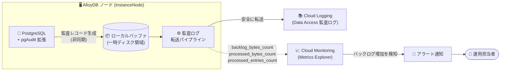

# AlloyDB for PostgreSQL: 監査ログパイプラインのモニタリング

**リリース日**: 2026-09-11

**サービス**: AlloyDB for PostgreSQL

**機能**: 監査ログパイプラインのステータス・スループット・バックログのモニタリング

**ステータス**: Feature (一般提供)

📊 [このアップデートのインフォグラフィックを見る](https://takech9203.github.io/google-cloud-news-summary/20260911-alloydb-audit-log-pipeline-monitoring.html)

## 概要

AlloyDB for PostgreSQL のインスタンスおよびノードにおいて、監査ログ (pgAudit) パイプラインのステータス、スループット、バックログを Cloud Monitoring でモニタリングできるようになりました。`alloydb.googleapis.com/InstanceNode` モニタリング対象リソースに 3 つの新しいメトリクスが追加され、Metrics Explorer から確認できます。

AlloyDB は、ユーザーが生成した監査ログを非同期のマネージドパイプラインで処理し、Cloud Logging に安全に転送します。ログレコードはインスタンスのローカルストレージに一時的にバッファリングされるため、高パフォーマンスなロギングが実現される一方で、ログ生成レートがプラットフォームの取り込み容量を超えるとバックプレッシャーが発生する可能性があります。今回のアップデートにより、このパイプラインの健全性を定量的に把握できるようになりました。

pgAudit を利用して政府機関・金融・ISO 認証などのコンプライアンス要件を満たしている組織にとって、監査ログの欠落や遅延はコンプライアンス上の重大なリスクです。本機能は、そのようなリスクを早期に検知するための可観測性を提供します。

**アップデート前の課題**

- 監査ログの処理は非同期であり、Cloud Logging に監査レコードが反映されるまでの遅延の程度を把握する手段がなかった
- 監査ログパイプラインにバックプレッシャーが発生しているかどうかを確認できず、ローカルディスク領域の枯渇によるインスタンスの再起動・クラッシュや監査証跡の欠落を事前に予測することが困難だった
- 監査ログが実際にどの程度のスループットで Cloud Logging に転送されているかを定量的に確認できなかった

**アップデート後の改善**

- `backlog_bytes_count` メトリクスにより、ノード上で処理待ちの監査ログバックログサイズを監視でき、値の持続的な上昇からバックプレッシャーを早期に検知できるようになった
- `processed_bytes_count` / `processed_entries_count` メトリクスにより、Cloud Logging へ転送された監査ログのスループット (バイト数・エントリ数) を定量的に把握できるようになった
- Cloud Monitoring のアラートポリシーと組み合わせることで、監査ログ遅延やディスク枯渇リスクをプロアクティブに検知・対応できるようになった

## アーキテクチャ図



pgAudit が生成した監査レコードはノード上のローカルバッファに一時保存され、非同期パイプラインで Cloud Logging に転送されます。今回追加された 3 つのメトリクスにより、このパイプラインのバックログとスループットを Cloud Monitoring で監視し、バックプレッシャーをアラートで検知できます。

## サービスアップデートの詳細

### 主要機能

1. **監査ログバックログサイズの監視 (`backlog_bytes_count`)**
   - ノード上で処理・Cloud Logging へのアップロード待ちとなっている監査ログバックログのサイズ (バイト) を GAUGE メトリクスとして提供
   - 値が持続的に高い、または増加し続けている場合は、監査ログ転送パイプラインにバックプレッシャーが発生していることを示す

2. **処理済み監査ログバイト数の監視 (`processed_bytes_count`)**
   - ノードから Cloud Logging へ正常に処理・転送された監査ログデータの合計バイト数を DELTA メトリクスとして提供
   - 監査ログパイプラインの実効スループットをバイト単位で把握できる

3. **処理済み監査ログエントリ数の監視 (`processed_entries_count`)**
   - ノードから Cloud Logging へ正常に処理・転送された監査ログエントリの合計数を DELTA メトリクスとして提供
   - ワークロードごとの監査ログ生成量の傾向分析に活用できる

## 技術仕様

### 新規メトリクス一覧

モニタリング対象リソース: `alloydb.googleapis.com/InstanceNode`

| メトリクス名 | 表示名 | 種別 / 値型 | 単位 | 説明 |
|------|------|------|------|------|
| `alloydb.googleapis.com/node/database/logging/audit/backlog_bytes_count` | Audit log backlog size | GAUGE / INT64 | Bytes (By) | 処理・アップロード待ちの監査ログバックログサイズ。持続的な高値・増加はバックプレッシャーを示す |
| `alloydb.googleapis.com/node/database/logging/audit/processed_bytes_count` | Processed audit log bytes | DELTA / INT64 | Bytes (By) | Cloud Logging へ正常に転送された監査ログの合計バイト数 |
| `alloydb.googleapis.com/node/database/logging/audit/processed_entries_count` | Processed audit log entries | DELTA / INT64 | Count (1) | Cloud Logging へ正常に転送された監査ログエントリの合計数 |

### 監査ログパイプラインの制約 (公式ドキュメントより)

| 項目 | 詳細 |
|------|------|
| 処理方式 | 非同期 (ローカルストレージに一時バッファリング後、Cloud Logging へ転送) |
| 最大ログ取り込みレート | 90 MiB/秒 |
| 単一監査レコードの最大サイズ | 1 MB |
| バックプレッシャー持続時の影響 | Cloud Logging への反映遅延の増大、ローカルディスク枯渇によるインスタンスの再起動・クラッシュ、監査証跡の断続的な欠落 |

## 設定方法

### 前提条件

1. AlloyDB for PostgreSQL インスタンスで pgAudit 拡張が有効化・構成されていること
2. 監査ログの閲覧には、プロジェクトで Data Access 監査ログが有効であり、`roles/logging.privateLogViewer` ロールが付与されていること
3. メトリクスの閲覧には Cloud Monitoring へのアクセス権 (例: `roles/monitoring.viewer`) があること

### 手順

#### ステップ 1: Metrics Explorer でメトリクスを確認

```text
Google Cloud コンソール → Monitoring → Metrics Explorer
リソースタイプ: AlloyDB InstanceNode (alloydb.googleapis.com/InstanceNode)
メトリクス: node/database/logging/audit/backlog_bytes_count など
```

Metrics Explorer で対象リソースとメトリクスを選択し、ノードごとのバックログサイズやスループットを可視化します。

#### ステップ 2: バックログ増加に対するアラートポリシーを作成

```bash
# 例: バックログサイズに対するアラートポリシーの作成 (gcloud)
gcloud alpha monitoring policies create \
  --display-name="AlloyDB Audit Log Backlog Alert" \
  --condition-display-name="Audit log backlog sustained high" \
  --condition-filter='resource.type="alloydb.googleapis.com/InstanceNode" AND metric.type="alloydb.googleapis.com/node/database/logging/audit/backlog_bytes_count"' \
  --condition-threshold-value=1073741824 \
  --condition-threshold-comparison=COMPARISON_GT \
  --condition-threshold-duration=600s \
  --notification-channels=CHANNEL_ID
```

バックログサイズが一定値 (例: 1 GiB) を 10 分以上超過した場合に通知するアラートを設定し、バックプレッシャーを早期に検知します。しきい値はワークロードのログ生成量に応じて調整してください。

## メリット

### ビジネス面

- **コンプライアンスリスクの低減**: 監査証跡の欠落や遅延の予兆を早期に検知でき、政府機関・金融・ISO 認証などの監査要件への準拠を維持しやすくなる
- **障害の未然防止**: ローカルディスク枯渇によるインスタンスの再起動・クラッシュを、バックログ監視により事前に回避できる

### 技術面

- **可観測性の向上**: これまでブラックボックスだった監査ログ転送パイプラインの内部状態 (バックログ・スループット) を定量的に把握できる
- **標準ツールとの統合**: Cloud Monitoring の Metrics Explorer、ダッシュボード、アラートポリシーといった既存の運用ツールをそのまま活用できる
- **ノード単位の粒度**: `InstanceNode` リソースに対するメトリクスのため、プライマリ・リードプールなどノード単位で状態を把握できる

## デメリット・制約事項

### 制限事項

- 監査レコードの作成・処理は引き続き非同期であり、Cloud Logging に反映されるまでの遅延自体がなくなるわけではない (遅延の程度を可視化する機能である)
- パイプラインの最大ログ取り込みレートは 90 MiB/秒、単一監査レコードの最大サイズは 1 MB という制約は変わらない

### 考慮すべき点

- バックプレッシャーを検知した場合の根本対応 (pgAudit の記録対象の絞り込み、ワークロードの見直しなど) は利用者側で行う必要がある
- pgAudit の設定によっては監査ログ生成量が大きくなり、ローカルディスクの一時領域を消費する点に引き続き注意が必要

## ユースケース

### ユースケース 1: 金融システムにおける監査証跡の完全性監視

**シナリオ**: 金融機関が AlloyDB 上の勘定系データベースに pgAudit を適用し、すべての READ/WRITE 操作を記録している。監査証跡の欠落は規制違反につながるため、パイプラインの健全性を常時監視したい。

**実装例**:
```text
1. Metrics Explorer で backlog_bytes_count のダッシュボードを作成
2. バックログが 10 分間しきい値を超えた場合のアラートポリシーを設定
3. アラート発報時は pgaudit.log の記録対象を確認し、ログ生成レートを調整
```

**効果**: バックプレッシャーの持続による監査証跡の欠落・インスタンス障害を未然に防ぎ、規制対応の信頼性を高める。

### ユースケース 2: 監査ログ遅延を考慮したセキュリティ調査

**シナリオ**: セキュリティチームが Cloud Logging 上の pgAudit ログを SIEM に連携してリアルタイム分析を行っているが、非同期パイプラインの遅延によりイベントの検知が遅れる可能性がある。

**効果**: `backlog_bytes_count` を監視することで現在の転送遅延の程度を推定でき、SIEM 側の検知ロジックやインシデント調査時のタイムラインの解釈精度が向上する。

## 料金

今回追加されたメトリクスは Google Cloud の システムメトリクス (`alloydb.googleapis.com`) として提供されます。詳細な課金条件は Cloud Monitoring の料金ページを参照してください。

- [Cloud Monitoring 料金](https://cloud.google.com/stackdriver/pricing)
- [AlloyDB for PostgreSQL 料金](https://cloud.google.com/alloydb/pricing)

## 利用可能リージョン

リージョン制限に関する記載は Release Notes およびドキュメントに確認できませんでした。AlloyDB for PostgreSQL が利用可能なリージョンについては [公式ドキュメント](https://docs.cloud.google.com/alloydb/docs/locations) を参照してください。

## 関連サービス・機能

- **Cloud Monitoring**: 本アップデートのメトリクスの提供基盤。Metrics Explorer、ダッシュボード、アラートポリシーで監査ログパイプラインを監視
- **Cloud Logging**: pgAudit の監査ログの転送先。Data Access 監査ログとして Logs Explorer で閲覧可能
- **pgAudit 拡張**: AlloyDB におけるデータベース監査の中核機能。SESSION/OBJECT 監査により実行された SQL を選択的に記録
- **AlloyDB System Insights**: AlloyDB のシステムメトリクスを一元的に確認できる機能。新メトリクスもメトリクスリファレンスに含まれる

## 参考リンク

- 📊 [インフォグラフィック](https://takech9203.github.io/google-cloud-news-summary/20260911-alloydb-audit-log-pipeline-monitoring.html)
- [公式リリースノート](https://docs.cloud.google.com/release-notes#September_11_2026)
- [ドキュメント: 監査ログパイプラインステータスのモニタリング](https://docs.cloud.google.com/alloydb/docs/pgaudit/view-audit-log#monitor-audit-log-pipeline-status)
- [ドキュメント: pgAudit について (制限事項)](https://docs.cloud.google.com/alloydb/docs/pgaudit/about)
- [ドキュメント: System insights メトリクスリファレンス](https://docs.cloud.google.com/alloydb/docs/reference/system-insights-metrics)
- [料金ページ (Cloud Monitoring)](https://cloud.google.com/stackdriver/pricing)

## まとめ

AlloyDB の監査ログパイプラインの内部状態が Cloud Monitoring のメトリクスとして公開され、バックログ・スループットの可視化とアラート設定が可能になりました。pgAudit をコンプライアンス目的で利用している場合、監査証跡の欠落やディスク枯渇による障害を未然に防ぐため、`backlog_bytes_count` に対するアラートポリシーの設定を推奨します。

---

**タグ**: AlloyDB, PostgreSQL, pgAudit, Cloud Monitoring, Cloud Logging, 監査ログ, 可観測性, コンプライアンス
