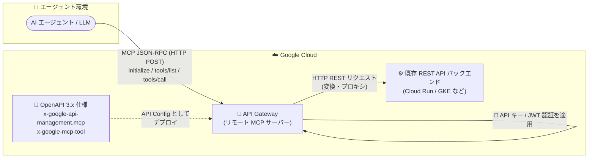

# API Gateway: Model Context Protocol (MCP) サーバー機能

**リリース日**: 2026-09-11

**サービス**: API Gateway

**機能**: リモート Model Context Protocol (MCP) サーバーとしての構成

**ステータス**: Public Preview

📊 [このアップデートのインフォグラフィックを見る](https://takech9203.github.io/google-cloud-news-summary/20260911-api-gateway-mcp-server.html)

## 概要

API Gateway をリモート Model Context Protocol (MCP) サーバーとして構成できるようになりました (Public Preview)。この機能により、既存の REST API をバックエンドサービスの変更なしに、AI エージェントや LLM に対して「ツール」として公開できます。

MCP は、AI エージェントが外部のツールや API を発見・呼び出すためのオープン標準プロトコルです。従来はツールや API ごとにカスタム統合コードを書く必要がありましたが、MCP により AI モデルが機能を発見・呼び出すための標準的な方法が提供されます。MCP サーバーとして構成された API Gateway はプロキシとして動作し、エージェントシステムから送信される MCP の JSON-RPC プロトコルメッセージを、既存バックエンドへの標準的な HTTP REST リクエストに変換します。

有効化は、OpenAPI 3.x 仕様に Google 独自の拡張 (`x-google-api-management.mcp` および `x-google-mcp-tool`) をアノテーションとして追加するだけで完了します。既存の API Gateway のセキュリティポリシー (API キーや JWT 認証) を MCP エンドポイントにもそのまま適用できるため、エージェント向けのツール公開を安全に始めたい組織に適しています。

**アップデート前の課題**

- 既存の REST API を AI エージェントから利用させるには、エージェントごと・API ごとにカスタム統合コード (ツール定義やラッパー) を実装する必要があった
- MCP 対応のツールサーバーを提供するには、専用の MCP サーバーを自前で構築・運用するか、バックエンドサービス自体を改修する必要があった
- エージェント向けに公開する API の認証・認可を、既存の API 管理基盤とは別に設計する必要があった

**アップデート後の改善**

- OpenAPI 3.x 仕様へのアノテーション追加のみで、既存 REST API を MCP ツールとして公開できるようになった (バックエンドのコード変更不要)
- API Gateway が MCP の JSON-RPC メッセージを HTTP REST リクエストに自動変換するため、専用 MCP サーバーの構築・運用が不要になった
- ツール呼び出し (`tools/call`) には対象オペレーションの既存認証ポリシー (API キー / JWT) がそのまま適用され、`tools/list` にも JWT 認証を設定できるようになった
- オペレーション単位でツールとして公開する API を選択でき、エージェントに見せるツールサーフェスを明示的に管理できるようになった

## アーキテクチャ図



AI エージェントからの MCP JSON-RPC リクエストを API Gateway が受け取り、OpenAPI 仕様のアノテーションに基づいて既存 REST バックエンドへの HTTP リクエストに変換します。バックエンドサービスの変更は不要です。

## サービスアップデートの詳細

### 主要機能

1. **リモート MCP サーバー**
   - API Gateway が HTTP (POST) 経由で MCP リクエストを受信するリモートサーバーとして動作
   - MCP の JSON-RPC メッセージを既存バックエンドへの標準 HTTP REST リクエストに変換するプロキシとして機能

2. **OpenAPI 3.x 統合**
   - MCP 構成は OpenAPI 3.x 仕様から Google 独自拡張を使って直接導出される
   - `x-google-api-management.mcp: true` でグローバル有効化、`x-google-mcp-tool` でオペレーション単位の制御が可能
   - ツール名はデフォルトで `operationId`、説明は `description` または `summary` から自動生成

3. **MCP ライフサイクルメソッドのサポート**
   - `initialize`: プロトコルバージョンと機能のネゴシエーション
   - `notifications/initialized`: ハンドシェイクの確認
   - `tools/list`: 利用可能なツールとスキーマの発見
   - `tools/call`: 引数付きのツール呼び出し
   - 上記以外のメソッド (`resources/*`、`prompts/*` など) は JSON-RPC エラーコード `-32601` を返す

4. **既存セキュリティポリシーの適用**
   - `tools/call` は対象オペレーションに定義済みの認証ポリシー (API キー / JWT) をそのまま強制
   - `tools/list` はデフォルトでは未認証だが、`tools-list.security` で JWT 認証を設定可能 (推奨)

## 技術仕様

### MCP メソッドと認証モデル

| MCP メソッド | 用途 | 認証 |
|------|------|------|
| `initialize` | プロトコルバージョン・機能の確立 | 認証なし |
| `notifications/initialized` | ハンドシェイクの確認 | 認証なし |
| `tools/list` | ツールの発見 | デフォルト認証なし (JWT 認証の設定を強く推奨。API キーは非対応) |
| `tools/call` | ツールの呼び出し | 対象オペレーションの既存認証ポリシー (API キー / JWT) を適用 |

### 構成のバリデーションルール

| 項目 | 詳細 |
|------|------|
| 拡張の配置場所 | `x-google-mcp-tool` は個々のオペレーションレベルにのみ指定可能 |
| HTTP メソッド | GET / POST / PUT / PATCH / DELETE のみ MCP ツールとして公開可能 |
| ツール名 | `[A-Za-z0-9_.-]{1,128}` に一致し、仕様全体で一意であること |
| 説明 | すべてのツールは空でない説明を持つ必要がある (description / summary / オーバーライドから解決) |
| `tools/list` のセキュリティ | `components.securitySchemes` に定義された JWT スキームを 1 つだけ指定可能 |

### `x-google-mcp-tool` 拡張のフィールド

| フィールド | 型 | 必須 | デフォルト | 説明 |
|------|------|------|------|------|
| `name` | string | いいえ | オペレーションの `operationId` | MCP ツール名 |
| `description` | string | いいえ | オペレーションの `description` (なければ `summary`) | MCP ツールの説明。LLM がツール選択に使う主要なシグナル |

## 設定方法

### 前提条件

1. API の有効な OpenAPI 3.x 仕様があること (OpenAPI 2.0 は非対応)
2. API Gateway の基本 (API、API Config、Gateway の関係) を理解していること
3. 各オペレーションにバックエンド (`x-google-backend` またはグローバルデフォルト) が構成されていること

### 手順

#### ステップ 1: 公開するオペレーションの特定

OpenAPI 仕様を確認し、AI エージェントに公開すべきオペレーションを決定します。

#### ステップ 2: OpenAPI 仕様の更新 (グローバル有効化)

```yaml
openapi: 3.0.3
info:
  title: Bookstore API
  version: 1.0.0
x-google-api-management:
  mcp: true
  backends:
    bookstore-backend:
      address: https://bookstore-backend-12345678.us-central1.run.app
```

グローバル有効化すると、対象となるすべてのオペレーション (HTTP メソッドとパスに基づく) が MCP ツールとして公開されます。

#### ステップ 3: オペレーション単位の設定 (任意)

```yaml
paths:
  /v1/shelves/{shelf}:
    delete:
      operationId: deleteShelf
      summary: Delete a shelf.
      x-google-backend: bookstore-backend
      x-google-mcp-tool:
        name: delete_shelf
        description: "Permanently delete a shelf and every book on it."
```

`x-google-mcp-tool: false` を設定すると、グローバル有効化時でも特定のオペレーションを除外できます。

#### ステップ 4: tools/list の認証設定 (推奨)

```yaml
x-google-api-management:
  mcp:
    tools-list:
      security:
        myJWT: []
```

`mcp` をオブジェクト形式で構成した場合も、すべての対象オペレーションで MCP がグローバルに有効化される点に注意してください。

#### ステップ 5: API Config の作成とデプロイ

アノテーションを追加した仕様から API Config を作成し、通常のフローで Gateway にデプロイします。

```bash
gcloud api-gateway api-configs create CONFIG_ID \
  --api=API_ID \
  --openapi-spec=openapi-spec.yaml \
  --project=PROJECT_ID

gcloud api-gateway gateways create GATEWAY_ID \
  --api=API_ID \
  --api-config=CONFIG_ID \
  --location=REGION \
  --project=PROJECT_ID
```

## メリット

### ビジネス面

- **AI エージェント対応の高速化**: 既存 API 資産をコード変更なしでエージェント向けツール化でき、エージェント活用の立ち上げ期間を短縮できる
- **開発・運用コストの削減**: 専用 MCP サーバーの構築・運用や、エージェントごとのカスタム統合コード開発が不要になる

### 技術面

- **宣言的な構成**: OpenAPI 仕様へのアノテーションのみで構成が完結し、Infrastructure as Code として管理しやすい
- **既存セキュリティの継承**: API キーや JWT といった既存の API Gateway 認証ポリシーが `tools/call` にそのまま適用される
- **ツールサーフェスの明示的管理**: オペレーション単位で公開/非公開を制御でき、エージェントに公開する機能を最小限に絞れる

## デメリット・制約事項

### 制限事項

- Public Preview であり、Pre-GA Offerings Terms が適用される (サポートが限定される可能性あり)
- MCP の Resources (`resources/*`) と Prompts (`prompts/*`) は非対応 (JSON-RPC エラー `-32601` を返す)
- Stdio トランスポートは非対応 (HTTP POST のみ)
- OpenAPI 2.0 (Swagger) は非対応。OpenAPI 3.x 仕様が必須
- ストリーミングおよび長時間実行のツール呼び出しは非対応
- MCP と Model Routing は同一 API 構成内で併用不可 (`x-google-api-management.mcp` を有効にすると `x-google-model-router` は使用不可)
- `tools/list` の認証に API キーは使用できない (JWT のみ)

### 考慮すべき点

- `tools/list` はデフォルトで未認証のため、本番利用では JWT 認証の設定 (`tools-list.security`) を強く推奨
- ツールの `description` は LLM がツール選択に使う主要なシグナルであるため、エージェントが正しく理解できる明確な記述が必要
- ツールとして公開可能なのは GET / POST / PUT / PATCH / DELETE オペレーションのみ
- API Gateway 自体のペイロードサイズ上限 (リクエスト/レスポンス各 32 MB) などの既存クォータも適用される

## ユースケース

### ユースケース 1: 既存 REST API の AI エージェントツール化

**シナリオ**: Cloud Run 上で稼働する既存の在庫管理 REST API を、社内の AI エージェントから在庫照会・更新ツールとして利用させたい。バックエンドの改修は避けたい。

**実装例**:
```yaml
openapi: 3.0.3
info:
  title: Inventory API
  version: 1.0.0
x-google-api-management:
  mcp: true
  backends:
    inventory-backend:
      address: https://inventory-api-12345678.us-central1.run.app
paths:
  /v1/items/{itemId}:
    get:
      operationId: getItem
      description: 指定した商品 ID の在庫情報を取得する
      x-google-backend: inventory-backend
      x-google-mcp-tool:
        name: get_inventory_item
        description: "商品 ID を指定して在庫数量と保管場所を取得する"
```

**効果**: バックエンドのコード変更なしで、AI エージェントが `tools/list` で在庫照会ツールを発見し、`tools/call` で呼び出せるようになる。

### ユースケース 2: エージェントに公開するツールサーフェスの限定とセキュリティ適用

**シナリオ**: 多数のオペレーションを持つ API のうち、参照系のオペレーションのみをエージェントに公開し、削除系は除外したい。ツール一覧の漏えいも防ぎたい。

**効果**: `x-google-mcp-tool: false` で削除系オペレーションを除外し、`tools-list.security` に JWT スキームを設定することで、認可されたエージェントのみがツールを発見・呼び出しできる安全な構成を実現できる。

## 料金

API Gateway の料金は API 呼び出し数に基づく従量課金で、MCP 機能に固有の追加料金は現時点で案内されていません。

### 料金例 (API 呼び出し)

| 月間 API 呼び出し数 (課金アカウントごと) | 100 万回あたりの料金 |
|--------|-----------------|
| 0 - 200 万回 | 無料 ($0.00) |
| 200 万 - 10 億回 | $3.00 |
| 10 億回超 | $1.50 |

このほか、バックエンドへのデータ転送などネットワーク料金が別途発生します。詳細は[料金ページ](https://cloud.google.com/api-gateway/pricing)を参照してください。

## 利用可能リージョン

リージョン別の提供状況は公式ドキュメントで確認してください: [API Gateway ドキュメント](https://docs.cloud.google.com/api-gateway/docs)

## 関連サービス・機能

- **Cloud Run / GKE / App Engine / Cloud Functions**: API Gateway のバックエンドとして動作し、MCP ツールの実体となる REST API をホストする
- **Apigee**: Google Cloud のフル機能 API 管理サービス。Apigee でも MCP Discovery Proxy による MCP 対応が提供されており、より高度な API 管理要件がある場合の選択肢となる
- **Vertex AI Agent Builder / ADK**: MCP クライアントとして API Gateway が公開するツールを利用する AI エージェントの構築基盤
- **Cloud Monitoring / Cloud Logging**: API Gateway 経由のツール呼び出しのモニタリングとロギング

## 参考リンク

- 📊 [インフォグラフィック](https://takech9203.github.io/google-cloud-news-summary/20260911-api-gateway-mcp-server.html)
- [公式リリースノート](https://docs.cloud.google.com/release-notes#September_11_2026)
- [Model Context Protocol overview (API Gateway)](https://docs.cloud.google.com/api-gateway/docs/mcp-overview)
- [Configure Model Context Protocol (API Gateway)](https://docs.cloud.google.com/api-gateway/docs/mcp-configure)
- [OpenAPI 3.x extensions リファレンス](https://docs.cloud.google.com/api-gateway/docs/oasv3-extensions)
- [料金ページ](https://cloud.google.com/api-gateway/pricing)

## まとめ

API Gateway が MCP サーバーとして動作することで、既存の REST API 資産をコード変更なしで AI エージェントのツールとして公開できるようになりました。エージェント活用を進める組織は、まず参照系 API を対象に OpenAPI 3.x 仕様へアノテーションを追加して試し、`tools/list` への JWT 認証設定などセキュリティのベストプラクティスを併せて適用することを推奨します。

---

**タグ**: API Gateway, MCP, Model Context Protocol, AI エージェント, OpenAPI, Public Preview, API 管理
