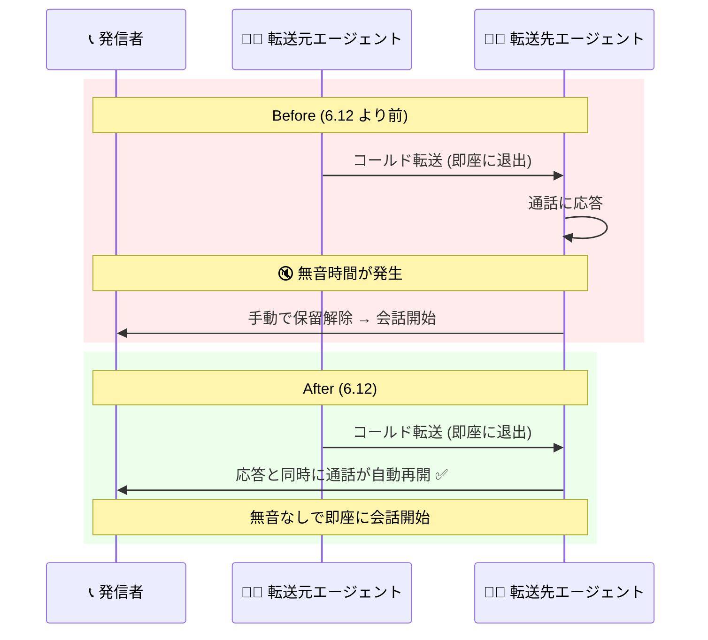

# Google Cloud Contact Center as a Service (CCaaS): バージョン 6.12 リリース (新機能まとめ)

**リリース日**: 2026-09-11

**サービス**: Google Cloud Contact Center as a Service (CCaaS)

**機能**: バージョン 6.12 リリース (コールド転送の自動再開、HubSpot Do Not Call の電話番号単位設定、エージェントデスクトップのネットワーク診断ツール / ポータルからの起動)

**ステータス**: Announcement / Feature (バージョン 6.12)

📊 [このアップデートのインフォグラフィックを見る](https://takech9203.github.io/google-cloud-news-summary/20260911-ccaas-6-12-features.html)

## 概要

Google Cloud Contact Center as a Service (CCaaS) のバージョン 6.12 がリリースされました。この日に公開されたリリースノートはすべてバージョン 6.12 の一部であり、各インスタンスへの適用タイミングは、インスタンスごとに選択している[デプロイスケジュール](https://docs.cloud.google.com/contact-center/ccai-platform/docs/deployment-schedules) (Rapid / Regular / Critical) に依存します。

バージョン 6.12 では、通話体験とエージェント業務を改善する 4 つの新機能が追加されました。(1) コールド転送時に転送先エージェントの応答と同時に通話が自動再開される改善、(2) HubSpot 連携における Do Not Call (架電禁止) 設定の電話番号単位化、(3) エージェントデスクトップの新しいネットワーク診断ツール、(4) CCaaS ポータルの Apps メニューからのエージェントデスクトップ起動です。コンタクトセンターの管理者、エージェント、HubSpot を CRM として利用する組織に幅広く関係するアップデートです。

なお、同日のリリースノートには多数のバグ修正も含まれていますが、それらは関連レポート「[CCaaS: 2026 年 9 月バグ修正リリース](./2026-09-11-ccaas-bug-fixes-september.md)」で扱っているため、本レポートでは新機能のみを解説します。

**アップデート前の課題**

- コールド転送では、転送先エージェントが通話に応答した後、手動で保留を解除するまで発信者との会話が始まらず、応答から保留解除までの間に無音時間が発生していた
- HubSpot 連携の Do Not Call は、連絡先 (Contact) や会社 (Company) のレコード全体に対して設定する必要があり、特定の電話番号だけを架電禁止にすることができなかった。また、オプトアウト値のマッチングが大文字・小文字を区別していた
- エージェントデスクトップにはネットワーク状態を確認する組み込みツールがなく、通話品質の問題や接続トラブルの切り分けにはデスクトップ外部の診断ツールに頼る必要があった
- エージェントデスクトップを開くための導線が CCaaS ポータルのメニューに統合されていなかった

**アップデート後の改善**

- コールド転送で転送先エージェントが応答した瞬間に通話が自動的に再開されるようになり、保留解除の手動操作が不要になった。これにより応答〜保留解除間の無音が解消された
- HubSpot 連携で、レコード全体ではなく特定の電話番号 (電話番号 / 携帯電話番号のフィールド単位) に対して Do Not Call を構成できるようになった。オプトアウト値のマッチングは大文字・小文字を区別しなくなった。設定は Settings > Developer Settings (HubSpot 選択時) の CRM ペインに新設された「Do Not Call Configuration」セクションで行う
- エージェントデスクトップのナビゲーションメニューに、ネットワーク強度と診断情報を表示する新しいネットワーク診断ツールが追加され、ネットワークの健全性評価と接続問題のトラブルシューティングが可能になった
- CCaaS ポータルの新しい Apps メニュー (Apps > Agent Desktop) から、ポータルのセッションを終了することなく新しいブラウザタブでエージェントデスクトップを開けるようになった

## アーキテクチャ図

コールド転送のフロー比較です。6.12 では転送先エージェントの応答と同時に通話が自動再開されるため、従来発生していた「応答から手動保留解除までの無音時間」が解消されます。

## サービスアップデートの詳細

### 主要機能

1. **コールド転送の自動再開**
   - エージェントがコールド転送 (転送元エージェントが次のエージェントへの引き継ぎを待たずに即座に退出する転送) を行った際、転送先エージェントが通話に応答した瞬間に通話が再開されるようになった
   - 転送先エージェントが発信者の保留を手動で解除する必要がなくなり、応答から保留解除までの間に発生していた無音が解消された
   - コールド転送はエージェントまたはリーフキューにのみ送信可能。ブランチキュー、サードパーティ、サードパーティへ自動転送するキューへのコールド転送は非対応 (従来どおり)

2. **HubSpot 連携: 電話番号単位の Do Not Call 設定**
   - 従来は連絡先または会社のレコード全体に対してだった Do Not Call を、特定の電話番号 (電話番号 phone / 携帯電話番号 mobilephone のタイプ単位) に対して構成できるようになった
   - 同一レコード内でも、ある電話番号は Do Not Call 警告をトリガーし、別の電話番号はトリガーしないという設定が可能
   - オプトアウト値のマッチングが大文字・小文字を区別しなくなった
   - 設定場所: CCaaS ポータルの Settings > Developer Settings (Agent Platform で HubSpot を選択) の CRM ペインに新設された「Do Not Call Configuration」セクション
   - Do Not Call は手動発信および HubSpot のクリックトゥコールによるアウトバウンドコールが対象で、キャンペーンコールには適用されない

3. **エージェントデスクトップ: 新しいネットワーク診断ツール**
   - エージェントデスクトップのナビゲーションメニューに「Diagnostics」が追加され、クリックするとネットワーク強度と診断情報が表示される
   - エージェント自身がネットワークの健全性を評価し、通話品質や接続の問題をトラブルシューティングできる

4. **エージェントデスクトップ: CCaaS ポータルからの起動**
   - CCaaS ポータルに新しい Apps メニューが追加され、Apps > Agent Desktop からエージェントデスクトップを開けるようになった
   - エージェントデスクトップは新しいブラウザタブで開くため、ポータルのセッションを終了する必要がない

## 技術仕様

### バージョン 6.12 の適用タイミング (デプロイスケジュール)

インスタンスへの 6.12 の適用タイミングは、選択しているデプロイスケジュールに依存します。

| スケジュール | 適用タイミング | 推奨環境 |
|------|------|------|
| Rapid | 可能な限り早期に適用 | 開発・テストなどの非本番環境 |
| Regular | Rapid での提供開始から最低 2 日後に適用 | - |
| Critical | ピーク営業時間外に適用 (Rapid の全インスタンス更新後、通常 1 週間以内) | 本番環境 |

セキュリティパッチは Regular / Critical でも遅延されず即時適用されます。デプロイスケジュールは Google Cloud コンソールの CCAI Platform インスタンス編集画面 (Configure deployments) で確認・変更できます。

### HubSpot Do Not Call 構成の項目

「Do Not Call Configuration」セクションで作成する各構成は、以下の項目で定義します。

| 項目 | 内容 |
|------|------|
| Object Type | Do Not Call を構成するオブジェクトタイプ (プライマリ / セカンダリのルックアップオブジェクトとして構成済みのものが選択可能) |
| Phone Number Field | 電話番号タイプ (電話番号 phone / 携帯電話番号 mobilephone) |
| Do-Not-Call CRM Field | 対象オブジェクトで Do Not Call を示すフィールド |
| Opt-out Value | Do Not Call を意味する 1 つ以上の値 (マッチングは大文字・小文字を区別しない) |

発信時、CCAI Platform は HubSpot アカウントルックアップの結果に対して各構成をチェックし、Object Type、Phone Number Field、Do-Not-Call CRM Field、Opt-out Value のすべてが一致した場合に「This number is on the Do Not Call list」の警告をコールアダプターに表示します。エージェントは会社ポリシーに応じて発信を中止するか、必要であれば発信を続行できます (続行した場合はその旨が HubSpot に記録されます)。

## 設定方法

### HubSpot Do Not Call を電話番号単位で構成する

**前提条件**

1. HubSpot と CCaaS インスタンスの統合が完了していること
2. Do Not Call 情報をチェックする連絡先 / 会社オブジェクトに対して HubSpot アカウントルックアップが構成済みであること
3. HubSpot 側で、営業・マーケティングコールのオプトアウトを示す連絡先 / 会社プロパティが 1 つ以上構成されていること

**手順**

1. CCaaS ポータルで Settings > Developer Settings を開く
2. CRM ペインで Do-not-call Configuration トグルをオンにする
3. Add をクリックし、Object Type / Phone Number Field / Do-Not-Call CRM Field / Opt-out Value を指定して Add configuration をクリックする
4. 必要に応じて構成を追加し、Save をクリックする

### エージェントデスクトップのネットワーク診断を確認する

1. CCaaS ポータルで Apps > Agent Desktop をクリックし、新しいブラウザタブでエージェントデスクトップを開く
2. ナビゲーションメニューで Diagnostics をクリックすると、ネットワーク診断情報が表示される

なお、エージェントデスクトップを利用するには、Google Cloud コンソールの CCAI Platform インスタンス設定 (Edit > Configure extensions) で Agent desktop 拡張が有効になっている必要があります。

## メリット

### ビジネス面

- **顧客体験の向上**: コールド転送時の無音時間が解消され、発信者が「切断されたのでは」と不安になる時間がなくなる。転送の多い大規模コンタクトセンターほど効果が大きい
- **コンプライアンス精度の向上**: Do Not Call を電話番号単位で管理できるため、「会社の代表番号には架電可、担当者の携帯には架電不可」といった実務に即したオプトアウト管理が可能になり、過剰な架電制限や意図しない架電のリスクを低減できる

### 技術面

- **エージェント操作の削減**: コールド転送の保留解除操作が不要になり、エージェントのハンドリング手順がシンプルになる
- **トラブルシューティングの迅速化**: エージェント自身がデスクトップ内でネットワーク診断情報を確認できるため、通話品質問題の一次切り分けが容易になる
- **マッチングの堅牢化**: Do Not Call のオプトアウト値マッチングが大文字・小文字を区別しなくなり、CRM 側の値表記ゆれによる検出漏れを防げる

## デメリット・制約事項

### 制限事項

- コールド転送は従来どおりエージェントまたはリーフキューにのみ送信可能。ブランチキュー、サードパーティ、サードパーティへ自動転送するキューへのコールド転送は非対応
- HubSpot の Do Not Call は手動発信とクリックトゥコールのアウトバウンドコールが対象で、キャンペーンコールには適用されない
- HubSpot のアカウントルックアップが失敗した場合、Do Not Call 警告は表示されず発信は通常どおり行われる

### 考慮すべき点

- 6.12 の適用タイミングはデプロイスケジュールに依存するため、本番インスタンス (Critical 推奨) では新機能が利用可能になるまで Rapid 環境より時間差がある。動作変更 (特にコールド転送の自動再開) をエージェントに事前周知しておくとよい
- コールド転送の自動再開により、転送先エージェントは応答した瞬間から発信者と会話が始まる。応答前の準備を前提とした運用フローがある場合は手順の見直しが必要
- 既存の Do Not Call 構成をレコード単位から電話番号単位に移行する場合は、HubSpot 側のプロパティ設計 (どのフィールドをどの電話番号タイプに対応させるか) を整理してから構成する

## ユースケース

### ユースケース 1: 一次受付から専門部署へのコールド転送

**シナリオ**: 混雑する一次受付チームが、問い合わせ内容に応じて専門キューへコールド転送する。従来は転送先エージェントが応答後に保留解除を忘れ、発信者が無音のまま待たされるケースがあった。

**効果**: 6.12 では転送先エージェントの応答と同時に通話が自動再開されるため、保留解除忘れによる無音・放棄呼のリスクがなくなり、転送品質が安定する。

### ユースケース 2: HubSpot を使ったアウトバウンド営業でのオプトアウト管理

**シナリオ**: 営業チームが HubSpot の連絡先に手動発信する。連絡先によっては「携帯電話への架電は拒否、固定電話は許可」というオプトアウト希望がある。

**実装例**:

| Object Type | Phone Number Field | Do-Not-Call CRM Field | Opt-out Value |
|------|------|------|------|
| Contact | Mobile Phone Number (mobilephone) | Do not call | true |
| Contact | Phone Number (phone) | TPS Status | Opted out |

**効果**: 携帯電話番号への発信時のみ Do Not Call 警告が表示され、固定電話への発信は通常どおり行える。顧客の希望に沿ったきめ細かなオプトアウト管理が実現する。

### ユースケース 3: 在宅エージェントの通話品質トラブルシューティング

**シナリオ**: 在宅勤務のエージェントから「通話が途切れる」という報告があった。

**効果**: エージェント自身がエージェントデスクトップのナビゲーションメニューから Diagnostics を開き、ネットワーク強度と診断情報を確認して管理者に共有することで、自宅ネットワーク起因かプラットフォーム起因かの一次切り分けが迅速に行える。

## 関連サービス・機能

- **HubSpot 連携 (CRM 統合)**: CCaaS は HubSpot をエージェントプラットフォームとして統合でき、アカウントルックアップ、レコード作成、Do Not Call チェックなどを提供する。今回のアップデートは Do Not Call の粒度を強化するもの
- **エージェントデスクトップ**: エージェントがセッション処理に必要な情報とツールにアクセスできるカスタマイズ可能なインターフェース。今回のアップデートでネットワーク診断とポータルからの起動導線が追加された
- **デプロイスケジュール**: インスタンスへの自動アップデートの適用タイミングを Rapid / Regular / Critical から選択できる機能。6.12 の適用タイミングを左右する
- **転送履歴の表示 (Operation Management)**: 転送時にエージェントアダプターに転送元・転送先キュー情報や転送履歴を表示する設定。転送の多い運用でコールド転送改善と併用すると効果的

## 参考リンク

- 📊 [インフォグラフィック](https://takech9203.github.io/google-cloud-news-summary/20260911-ccaas-6-12-features.html)
- [公式リリースノート (2026 年 9 月 11 日)](https://docs.cloud.google.com/release-notes#September_11_2026)
- [デプロイスケジュール](https://docs.cloud.google.com/contact-center/ccai-platform/docs/deployment-schedules)
- [通話の転送 (コールド転送)](https://docs.cloud.google.com/contact-center/ccai-platform/docs/call-adapter-transfer#cold-transfer)
- [HubSpot の Do Not Call 構成](https://docs.cloud.google.com/contact-center/ccai-platform/docs/hubspot-do-not-call)
- [エージェントデスクトップの使用 (ネットワーク診断)](https://docs.cloud.google.com/contact-center/ccai-platform/docs/agent-desktop-use-agent-desktop#get-network-diagnostic-information)
- [エージェントデスクトップの使用 (起動方法)](https://docs.cloud.google.com/contact-center/ccai-platform/docs/agent-desktop-use-agent-desktop#open-agent-desktop)
- 関連レポート: [CCaaS: 2026 年 9 月バグ修正リリース](./2026-09-11-ccaas-bug-fixes-september.md)

## まとめ

CCaaS 6.12 は、コールド転送の無音解消という顧客体験の直接的な改善に加え、HubSpot Do Not Call の電話番号単位化によるコンプライアンス管理の精緻化、エージェントデスクトップの診断ツールと起動導線の追加という運用性の向上をもたらすリリースです。CCaaS を運用する組織は、自インスタンスのデプロイスケジュールを確認して 6.12 の適用タイミングを把握し、コールド転送の動作変更をエージェントへ周知するとともに、HubSpot 利用組織は Do Not Call 構成の見直しを検討することを推奨します。

---

**タグ**: #CCaaS #ContactCenter #CCAIPlatform #HubSpot #AgentDesktop #ColdTransfer #DoNotCall
