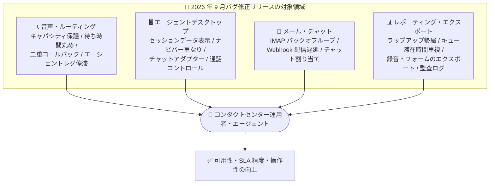

# Google Cloud Contact Center as a Service (CCaaS): 2026 年 9 月バグ修正リリース

**リリース日**: 2026-09-11

**サービス**: Google Cloud Contact Center as a Service (CCaaS)

**機能**: バグ修正リリース (音声・チャット・メール・レポーティング・エージェントデスクトップの安定性改善)

**ステータス**: Fixed (バグ修正)

📊 [このアップデートのインフォグラフィックを見る](https://takech9203.github.io/google-cloud-news-summary/20260911-ccaas-bug-fixes-september.html)

## 概要

Google Cloud Contact Center as a Service (CCaaS) において、多数の不具合を修正する大規模なバグ修正リリースが公開されました。今回のリリースでは、音声通話のルーティング・キャパシティ管理、エージェントデスクトップ (コールアダプター / チャットアダプター)、メールチャネル (IMAP 接続)、レポーティング・データエクスポート、Web SDK まで、コンタクトセンター運用のほぼ全領域にわたる 40 件近くの問題が解消されています。

特に影響が大きい修正として、IMAP 接続拒否によりメール取得ワーカーが長時間のバックオフループに入り数時間のメールボックスダウンタイムが発生していた問題、コールボリュームの急増時にチームのキャパシティ保護が迂回されエージェント可用性が設定した最小値を下回っていた問題、1 分未満の推定待ち時間がゼロに切り捨てられオーバーキャパシティアクションが正しくトリガーされなかった問題などが挙げられます。コンタクトセンターの可用性・SLA 管理・レポーティング精度に直結する修正が多く、CCaaS を運用する組織の管理者や Solutions Architect は内容を把握しておくことが推奨されます。

**アップデート前の課題**

このリリース以前には、以下のような問題が存在していました。

- 通話が写真・動画アップロード完了前に終了すると、SmartAction のステータスが誤って「failed」と記録されていた
- 大規模チームとカスタムロールを持つ組織で、アウトバウンド番号リストの読み込みがタイムアウトまたは大幅に遅延していた
- 1 分未満の推定待ち時間がゼロに切り捨てられ、オーバーキャパシティアクションが正確にトリガーされなかった
- コールボリュームの急増がチームのキャパシティ保護を迂回し、エージェント可用性が設定した最小値を下回っていた
- 断続的な IMAP 接続拒否によりメール取得ワーカーが長時間のバックオフループに入り、数時間のメールボックスダウンタイムが発生していた
- 手動ラップアップセッションが、無関係な直近の通話に誤って紐付けられ、Agent Activity Timeline と Raw データエクスポートの精度が低下していた
- 完了したコール転送がキュー滞在時間レコードを重複生成し、キューボリュームと SLA メトリクスが過大に報告されていた

**アップデート後の改善**

- SmartAction のステータス、ラップアップの帰属、キュー滞在時間などの記録が正確になり、レポーティングと SLA メトリクスの信頼性が向上した
- 推定待ち時間の丸め処理とキャパシティ保護が修正され、オーバーキャパシティアクションが設計どおりに機能するようになった
- IMAP 接続、Twilio ICE トークン取得、チャット Webhook 配信などの一時的な接続エラーに対する耐性が改善され、チャネル全体の可用性が向上した
- エージェントデスクトップの表示不具合 (ネストされたカスタムデータの `[object Object]` 表示、ナビゲーションバーの重なり、チャットトランスクリプトの読み込み表示など) が解消され、エージェントの操作性が改善した
- 非効率なデータベースクエリによる高 CPU 使用率が解消され、全コミュニケーションチャネルのパフォーマンスが改善した

## アーキテクチャ図

今回の修正は音声ルーティング、エージェントデスクトップ、メール・チャットチャネル、レポーティングの 4 領域に大別され、いずれもコンタクトセンターの可用性と SLA メトリクスの精度向上に寄与します。

## サービスアップデートの詳細

### 主要な修正内容

Release Notes に記載された修正のうち、主要なものを領域別に整理します。

1. **音声通話・ルーティング・キャパシティ管理**
   - 1 分未満の推定待ち時間がゼロに切り捨てられ、オーバーキャパシティアクションが正確にトリガーされない問題を修正
   - コールボリュームの急増がチームのキャパシティ保護を迂回し、エージェント可用性が設定した最小値を下回る問題を修正
   - 応答済みの音声通話が、エンドユーザーの切断後に要求していない 2 回目のコールバックをトリガーする問題を修正
   - 通話の「エージェントレグ」が接続中状態のままタイムアウトまで停滞し、サイレントに失敗してエージェントが対応可能ステータスに戻る問題を修正
   - オーバーキャパシティ時の電話デフレクションがエージェント直接着信で作動せず、エラーメッセージ表示や無期限の待機が発生する問題を修正
   - プライマリキューが最小可用性しきい値を下回っている場合でも、セカンダリキューの通話がエージェントに割り当てられる問題を修正
   - クロスランゲージ転送後、オーバーキャパシティデフレクションの音声が転送先キューではなく転送元キューの言語で再生される問題を修正
   - 高キャパシティリダイレクト中にボイスメールが保存されない問題を修正
   - Twilio ICE トークン取得時の一時的な接続エラーにより、エージェントの通話セットアップが失敗または遅延する問題を修正
   - 通話・チャットの DAP ルックアップ中の一時的なネットワーク接続障害により、着信がデフォルトキューにルーティングされたり、チャットセッションが開始できなかったりする問題を修正

2. **エージェントデスクトップ・アダプター**
   - カスタムデータ内のネストされたオブジェクト値が、セッションデータフィードで `[object Object]` と表示される問題を修正
   - コールアダプターの「Previous Interactions」ページで、ナビゲーションバーがサマリーテキストに重なり、スクロール時に固定されない問題を修正
   - チャットセッション割り当て時に、チャットアダプターがトランスクリプトではなく読み込みインジケーターを表示し続ける問題を修正
   - 切断された通話後に、必須ディスポジションが設定されていてもディスポジションプロンプトが表示されない問題を修正
   - 接続中にエージェントがキャンセルしたアウトバウンドコールが、エージェントキャンセルではなく不明な失敗として記録される問題を修正
   - ボイスメールページの巻き戻し・早送りボタンをクリックすると、ボイスメールが最初から再生される問題を修正
   - 設定が不完全な場合に通話コントロールボタンが更新・描画されない問題を修正
   - 通話開始時にセンチメントバナーが即座に表示されない問題を修正
   - フランス語 (カナダ) の通話履歴でキュー名が英語表示される問題を修正

3. **メール・チャットチャネル**
   - 断続的な IMAP 接続拒否によりメール取得ワーカーが長時間のバックオフループに入り、数時間のメールボックスダウンタイムが発生する問題を修正
   - チャット Webhook 配信中の一時的な接続断による不要な遅延を修正
   - チーム所属の更新や直接キュー割り当てによってキューの対応資格を得たエージェントに、待機中のチャットが即座に提供されない問題を修正
   - Web SDK のチャットウィジェット内で、静的な非インタラクティブテキストがキーボードフォーカスを受け取り、キーボード・スクリーンリーダーユーザーのナビゲーションを妨げる問題を修正
   - デプロイ中の一時的なアセットエラーが CDN にキャッシュされ、Web SDK の初期化が失敗する問題を修正

4. **レポーティング・データエクスポート・監査**
   - 手動ラップアップセッションが Agent Activity Timeline と Raw データエクスポートで無関係な直近の通話に誤って帰属される問題を修正
   - 完了したコール転送がキュー滞在時間レコードを重複生成し、キューボリュームと SLA メトリクスが過大報告される問題を修正
   - 仮想エージェントから人間へのエスカレーションがキャンセルされた場合に、チャットセッションデータとレポートで負のキュー滞在時間や不正確な SLA メトリクスが報告される問題を修正
   - 仮想エージェントのエスカレーションがオーバーキャパシティによりボイスメールにデフレクトされた場合、インバウンド通話の録音が外部ストレージにエクスポートされない問題を修正
   - 外部 CRM 統合のないインスタンスで、カスタムフォームの回答が外部ストレージにエクスポートされない問題を修正
   - ブラウザ由来の HTTP リクエスト以外 (API クライアントやバックグラウンドジョブ) からの変更で監査ログレコードが生成されない問題を修正
   - レポーティングメトリクスで作業時間と待機時間の期間が重複する問題を修正

5. **管理ポータル・その他**
   - SmartAction のステータスが、写真・動画アップロード完了前に通話が終了した場合に誤って「failed」と記録される問題を修正
   - 大規模チームとカスタムロールを持つ組織で、アウトバウンド番号リストの読み込みがタイムアウトまたは大幅に遅延する問題を修正
   - 「SLA thresholds for queues」ダイアログで保存したキュー名が保持されない問題を修正
   - 「Languages」ダイアログの「Upload audio recording for Language Selection」オプションが保存後に保持されず、Text-to-speech に切り替わる問題を修正
   - キューの作成・更新が失敗しタイムアウトエラーが返される問題を修正
   - 仮想エージェントの音声通話がラップアップ中にセッションエラーをトリガーする問題を修正
   - Vonage BYOC 通話で Agent Assist のリアルタイム文字起こしが開始されない問題を修正
   - 非効率なデータベースクエリによる高 CPU 使用率と、全コミュニケーションチャネルにわたるパフォーマンス低下を修正

修正の全リストは[公式リリースノート](https://docs.cloud.google.com/release-notes#September_11_2026)を参照してください。

## メリット

### ビジネス面

- **SLA・レポーティングの信頼性向上**: キュー滞在時間の重複記録、負のキュー滞在時間、ラップアップの誤帰属、作業時間と待機時間の重複が解消され、SLA メトリクスやエージェント生産性レポートに基づく意思決定の精度が向上する
- **顧客体験の改善**: 不要な二重コールバック、無期限の待機、ボイスメール未保存、多言語環境での誤った言語アナウンスなどが解消され、エンドユーザー体験が改善する
- **メールチャネルの可用性向上**: IMAP 接続問題による数時間規模のメールボックスダウンタイムが解消され、メールチャネルの SLA 遵守が容易になる

### 技術面

- **一時的な障害への耐性強化**: IMAP、Twilio ICE トークン取得、チャット Webhook、DAP ルックアップなど、一時的な接続エラーへのハンドリングが改善され、リトライ・フォールバック動作が安定した
- **キャパシティ保護の正常化**: 待ち時間の丸め処理修正とスパイク時の保護迂回の修正により、オーバーキャパシティアクションと最小可用性しきい値が設計どおりに機能する
- **コンプライアンス対応の強化**: API クライアントやバックグラウンドジョブ経由の変更でも監査ログが生成されるようになり、監査証跡の網羅性が向上した
- **アクセシビリティ改善**: Web SDK チャットウィジェットのキーボードフォーカス問題が修正され、スクリーンリーダーユーザーのナビゲーションが改善した

## デメリット・制約事項

### 考慮すべき点

- 本リリースはマネージドサービス側で適用されるため、ユーザー側での適用作業は不要だが、修正された動作 (オーバーキャパシティアクションのトリガー条件、キュー割り当てロジックなど) が従来の回避策と干渉しないか確認することが望ましい
- キュー滞在時間の重複記録や負の値が修正されたことにより、修正前後でレポーティングメトリクス (キューボリューム、SLA) の値に不連続が生じる可能性がある。過去データとのトレンド比較時には注意が必要
- 個別の修正の適用タイミングや詳細な技術的背景は Release Notes に記載されていないため、影響が疑われる場合はサポートへの確認を推奨

## ユースケース

### ユースケース 1: SLA レポートの再検証

**シナリオ**: コール転送を多用するコンタクトセンターで、キューボリュームと SLA メトリクスが実感より高く報告されていた。

**効果**: 完了した転送によるキュー滞在時間レコードの重複生成が修正されたため、レポートが実態を正しく反映するようになる。修正日以降のデータで SLA しきい値やスタッフィング計画を再検証することで、過大報告に基づいていた運用判断を是正できる。

### ユースケース 2: メールチャネルの安定運用

**シナリオ**: IMAP ベースのメール連携で、断続的な接続拒否をきっかけに数時間メールが取得されない障害が発生していた。

**効果**: メール取得ワーカーの過剰なバックオフループが修正され、一時的な IMAP 接続拒否から迅速に回復するようになる。メールチャネルのダウンタイム監視アラートの誤検知・実障害の双方が減少する。

## 料金

本リリースはバグ修正であり、料金体系への変更はありません。CCaaS の料金の詳細は[料金ページ](https://cloud.google.com/solutions/contact-center-ai-platform/pricing)を参照してください。

## 関連サービス・機能

- **CCAI Platform (Agent Desktop)**: 今回多数の修正が入ったエージェント向けインターフェース。コールアダプター、チャットアダプター、セッションデータフィードなどのパネルで構成される
- **Agent Assist**: Vonage BYOC 通話でのリアルタイム文字起こし開始の問題が修正され、BYOC 環境でのエージェント支援が安定化
- **Dialogflow / 仮想エージェント**: 仮想エージェントから人間エージェントへのエスカレーションに関する SLA メトリクスやラップアップ時のセッションエラーが修正された
- **Cloud Audit Logs**: API クライアントやバックグラウンドジョブ経由の変更でも監査ログレコードが生成されるようになった

## 参考リンク

- 📊 [インフォグラフィック](https://takech9203.github.io/google-cloud-news-summary/20260911-ccaas-bug-fixes-september.html)
- [公式リリースノート](https://docs.cloud.google.com/release-notes#September_11_2026)
- [CCAI Platform ドキュメント](https://docs.cloud.google.com/contact-center/ccai-platform/docs)
- [Agent Desktop の概要](https://docs.cloud.google.com/contact-center/ccai-platform/docs/agent-desktop-overview)
- [料金ページ](https://cloud.google.com/solutions/contact-center-ai-platform/pricing)

## まとめ

今回の CCaaS バグ修正リリースは、音声ルーティング・キャパシティ管理・エージェントデスクトップ・メールチャネル・レポーティングにわたる約 40 件の問題を一括で解消する大規模なものです。特にキュー滞在時間の重複記録や負の値の修正はレポーティング値に不連続を生む可能性があるため、SLA レポートやダッシュボードを運用しているチームは修正日以降のデータを基準に指標を再確認することを推奨します。また、これまで回避策を講じていた問題 (二重コールバック、IMAP ダウンタイムなど) については、回避策の撤去可否を検討してください。

---

**タグ**: #CCaaS #ContactCenter #CCAIPlatform #BugFix #AgentDesktop #SLA #Reporting
