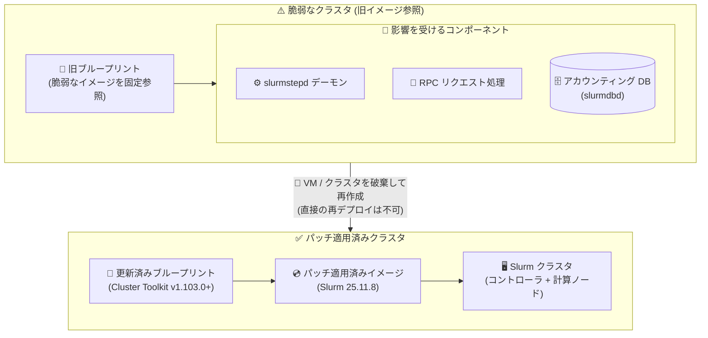

# Cluster Toolkit: Slurm の複数の脆弱性への対応 (セキュリティ情報 GCP-2026-062)

**リリース日**: 2026-09-11

**サービス**: Cluster Toolkit

**機能**: Slurm セキュリティ脆弱性の修正 (セキュリティ情報 GCP-2026-062)

**ステータス**: Security (重要度: High)

📊 [このアップデートのインフォグラフィックを見る](https://takech9203.github.io/google-cloud-news-summary/20260911-cluster-toolkit-slurm-security-gcp-2026-062.html)

## 概要

Google は、Cluster Toolkit に影響する Slurm の複数のセキュリティ脆弱性に対応しました。詳細はセキュリティ情報 (Security Bulletin) **GCP-2026-062** として公開されています。今回の脆弱性は、特定のイメージバージョンを参照する Cluster Toolkit のブループリントに影響し、Slurm の `slurmstepd` デーモン、RPC リクエスト処理、およびアカウンティングデータベースに関連する問題が含まれます。重要度は **High** と評価されています。

対処方法として、**Cluster Toolkit バージョン v1.103.0 以降**へのアップグレードが提供されています。このバージョンでは Slurm が **25.11.8** にアップグレードされ、ブループリント内で固定 (ピン留め) されているイメージ参照が更新されています。修正される脆弱性は CVE-2026-65107、CVE-2026-65108、CVE-2026-65109、CVE-2026-65138、CVE-2026-65139、CVE-2026-65140、CVE-2026-65165、CVE-2026-65168 の 8 件です。

Cluster Toolkit を利用して HPC / AI クラスタを Slurm で運用しているすべてのユーザーが対象です。特に既存デプロイメントでは、稼働中のクラスタへの再デプロイだけでは実行中の VM が更新されないため、**VM またはクラスタの破棄と再作成が必要**である点に注意が必要です。

**アップデート前の課題**

- 特定のイメージバージョンを参照するブループリントでデプロイされたクラスタは、`slurmstepd` デーモン、RPC リクエスト処理、アカウンティングデータベースに関する複数の Slurm 脆弱性 (重要度: High) の影響を受けていた
- 旧バージョンの Cluster Toolkit ブループリントは、脆弱性を含む Slurm イメージへの固定参照を保持していた
- 稼働中のクラスタに直接再デプロイしても実行中の VM は更新されず、バージョン不整合が発生する可能性があった

**アップデート後の改善**

- Cluster Toolkit v1.103.0 以降で Slurm 25.11.8 へのアップグレードと固定イメージ参照の更新が行われ、8 件の CVE が解消された
- 更新済みブループリントを使用する新規デプロイメントは、自動的にパッチ適用済みのイメージバージョンを使用する
- セキュリティ情報 (GCP-2026-062) により、影響範囲と対処手順 (破棄・再作成) が明確化された

## アーキテクチャ図



旧イメージを参照するクラスタでは `slurmstepd`、RPC 処理、アカウンティングデータベースがセキュリティ境界上のリスクとなるため、v1.103.0 以降の更新済みブループリントで VM またはクラスタを破棄・再作成し、Slurm 25.11.8 のパッチ適用済みイメージへ移行する流れを示しています。

## サービスアップデートの詳細

### 主要機能 (修正内容)

1. **Slurm 25.11.8 へのアップグレード**
   - Cluster Toolkit v1.103.0 以降に含まれる
   - `slurmstepd` デーモン、RPC リクエスト処理、アカウンティングデータベースに影響する複数の脆弱性を修正
   - 詳細は SchedMD の Slurm 25.11 リリースノートを参照

2. **固定イメージ参照の更新**
   - ブループリント内でピン留めされているイメージ参照がパッチ適用済みバージョンに更新された
   - 更新済みブループリントを使用する新規デプロイメントは自動的にパッチ適用済みイメージを使用する

3. **修正対象の CVE (8 件、重要度: High)**
   - CVE-2026-65107、CVE-2026-65108、CVE-2026-65109
   - CVE-2026-65138、CVE-2026-65139、CVE-2026-65140
   - CVE-2026-65165、CVE-2026-65168

## 技術仕様

### 脆弱性の概要

| 項目 | 詳細 |
|------|------|
| セキュリティ情報 ID | GCP-2026-062 |
| 公開日 | 2026-09-11 |
| 重要度 | High |
| 影響コンポーネント | `slurmstepd` デーモン、RPC リクエスト処理、アカウンティングデータベース |
| 影響範囲 | 特定のイメージバージョンを参照する Cluster Toolkit ブループリント |
| 修正バージョン | Cluster Toolkit v1.103.0 以降 (Slurm 25.11.8) |
| CVE | CVE-2026-65107 / 65108 / 65109 / 65138 / 65139 / 65140 / 65165 / 65168 |

### 対処方法のポイント

| デプロイメント種別 | 対処方法 |
|-------------------|---------|
| 新規デプロイメント | 更新済みブループリントを使用すれば自動的にパッチ適用済みイメージが使用される |
| 既存デプロイメント | 更新済みブループリントを使用して VM またはクラスタを破棄・再作成する必要がある |
| 注意事項 | 稼働中のクラスタへの直接再デプロイでは実行中の VM は更新されず、バージョン不整合の原因となる |

## 設定方法

### 前提条件

1. Cluster Toolkit (`gcluster`) の実行環境が構成されていること
2. 既存クラスタを破棄・再作成できること (ジョブの退避、データのバックアップなどの事前準備)

### 手順

#### ステップ 1: Cluster Toolkit を v1.103.0 以降に更新

```bash
# Cluster Toolkit リポジトリを最新化してビルド
cd cluster-toolkit
git checkout main && git pull
make
./gcluster --version  # v1.103.0 以降であることを確認
```

Cluster Toolkit を v1.103.0 以降に更新すると、ブループリントの固定イメージ参照がパッチ適用済みバージョンになります。

#### ステップ 2: 既存クラスタの破棄

```bash
# 静的ノードをドレインして電源オフ (Slurm コントローラ上で実行)
scontrol update NodeName=NODES_TO_UPDATE State=POWER_DOWN_ASAP

# 既存デプロイメントを破棄
./gcluster destroy DEPLOYMENT_FOLDER_NAME --auto-approve
```

稼働中のクラスタへの直接再デプロイでは実行中の VM が更新されないため、必ず破棄・再作成を行います。

#### ステップ 3: 更新済みブループリントで再デプロイ

```bash
# 更新済みブループリントからデプロイメントフォルダを再作成
./gcluster create BLUEPRINT_NAME -w

# 新しいクラスタをデプロイ
./gcluster deploy DEPLOYMENT_FOLDER_NAME
```

新しいデプロイメントは Slurm 25.11.8 を含むパッチ適用済みイメージを自動的に使用します。

## メリット

### ビジネス面

- **セキュリティリスクの低減**: 重要度 High の 8 件の CVE に一括で対処でき、HPC / AI 基盤のコンプライアンス要件を維持できる
- **明確な対処手順**: セキュリティ情報として影響範囲と手順が公開されており、対応計画を立てやすい

### 技術面

- **パッチ適用の自動化**: 更新済みブループリントを使う新規デプロイメントは自動的にパッチ適用済みイメージを使用する
- **バージョン整合性の確保**: Slurm 本体とイメージ参照が同時に更新されるため、コンポーネント間のバージョン不整合を防止できる

## デメリット・制約事項

### 制限事項

- 既存デプロイメントは、稼働中クラスタへの再デプロイだけではパッチが適用されない (実行中の VM は更新されない)
- パッチ適用には VM またはクラスタの破棄・再作成が必須であり、クラスタの停止時間が発生する

### 考慮すべき点

- クラスタ破棄前に実行中のジョブを完了または退避させる必要がある
- `./gcluster destroy` は不可逆的な操作のため、再作成に必要なブループリントやデータ (Filestore など) の保全を事前に確認する
- カスタムイメージを使用している場合は、パッチ適用済みのベースイメージで再ビルドが必要になる可能性がある

## ユースケース

### ユースケース 1: 稼働中の HPC クラスタの計画的なパッチ適用

**シナリオ**: Slurm ベースの HPC クラスタで研究計算ワークロードを常時実行している組織が、重要度 High の脆弱性に対応する必要がある。

**実装例**:
```bash
# 1. ジョブの新規受付を停止しドレイン
scontrol update NodeName=ALL State=DRAIN Reason="GCP-2026-062 patching"

# 2. メンテナンスウィンドウでクラスタを破棄・再作成
./gcluster destroy my-hpc-deployment --auto-approve
./gcluster create my-hpc-blueprint.yaml -w
./gcluster deploy my-hpc-deployment
```

**効果**: 計画的なメンテナンスウィンドウ内で 8 件の CVE を解消し、Slurm 25.11.8 ベースの安全なクラスタへ移行できる。

### ユースケース 2: 新規 AI トレーニングクラスタの安全なデプロイ

**シナリオ**: GPU クラスタを Cluster Toolkit で新規構築する予定のチームが、脆弱なイメージバージョンの使用を避けたい。

**効果**: Cluster Toolkit v1.103.0 以降の更新済みブループリントを使用するだけで、自動的にパッチ適用済みイメージが選択され、脆弱な構成のデプロイを防止できる。

## 料金

Cluster Toolkit 自体はオープンソースのツールであり、無料で利用できます。このセキュリティ修正に伴う追加料金はありません。ただし、クラスタの再作成時にデプロイされる Compute Engine、Filestore などのリソースには通常の料金が適用されます。

- [Compute Engine の料金](https://cloud.google.com/compute/pricing)

## 利用可能リージョン

このセキュリティ修正は特定リージョンに限定されず、Cluster Toolkit でデプロイされたすべての Slurm クラスタが対象です。

## 関連サービス・機能

- **Compute Engine**: Slurm クラスタのコントローラ、ログイン、計算ノードを構成する VM 基盤。パッチ適用には VM の再作成が必要
- **Slurm (SchedMD)**: Cluster Toolkit がデプロイする HPC ジョブスケジューラ。今回の脆弱性の修正対象 (25.11.8 で修正)
- **Filestore**: クラスタの共有ファイルシステム。クラスタ破棄・再作成時に削除保護設定の確認が必要
- **AI Hypercomputer**: A4X / A4 / A3 などの GPU クラスタのデプロイでも Cluster Toolkit と Slurm ブループリントが使用される

## 参考リンク

- 📊 [インフォグラフィック](https://takech9203.github.io/google-cloud-news-summary/20260911-cluster-toolkit-slurm-security-gcp-2026-062.html)
- [公式リリースノート](https://docs.cloud.google.com/release-notes#September_11_2026)
- [セキュリティ情報 GCP-2026-062](https://docs.cloud.google.com/cluster-toolkit/docs/security-bulletins#gcp-2026-062)
- [クラスタの再構成・再デプロイ手順](https://docs.cloud.google.com/cluster-toolkit/docs/setup/update-cluster-toolkit)
- [Cluster Toolkit ドキュメント](https://docs.cloud.google.com/cluster-toolkit/docs)

## まとめ

GCP-2026-062 は、Cluster Toolkit でデプロイされた Slurm クラスタの `slurmstepd`、RPC 処理、アカウンティングデータベースに影響する重要度 High の脆弱性 (CVE 8 件) を修正するセキュリティ情報です。稼働中のクラスタへの再デプロイだけではパッチが適用されないため、Cluster Toolkit v1.103.0 以降の更新済みブループリントを使用して、速やかに VM またはクラスタの破棄・再作成を計画してください。

---

**タグ**: #GoogleCloud #ClusterToolkit #Slurm #Security #CVE #HPC #GCP-2026-062
