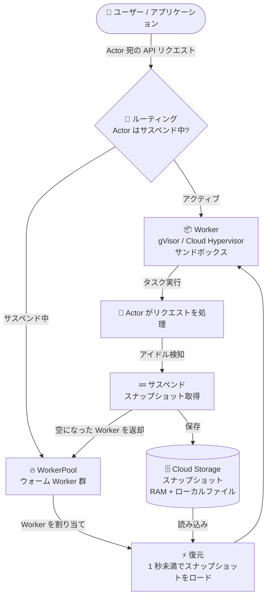

# Google Kubernetes Engine (GKE): Agent Substrate が評価・非本番利用向けに提供開始

**リリース日**: 2026-09-11

**サービス**: Google Kubernetes Engine (GKE)

**機能**: Agent Substrate on GKE

**ステータス**: 評価・非本番利用向けに一般提供 (本番サポートは許可リスト制の限定 GA プログラム)

📊 [このアップデートのインフォグラフィックを見る](https://takech9203.github.io/google-cloud-news-summary/20260911-gke-agent-substrate.html)

## 概要

Agent Substrate on GKE が、すべての Google Cloud ユーザー向けに評価・非本番用途で利用可能になりました。本番ワークロードのサポートは、許可リスト (allowlist) ベースの限定 GA プログラムとして提供され、申請フォームから利用申請できます。Agent Substrate は、GKE クラスタ上でエージェント型 (agentic) ワークロードを大規模に実行するためのオープンソースシステムで、GKE Standard クラスタに直接デプロイして使用します。

Agent Substrate が解決するのは、対話型エージェント特有のリソース非効率の問題です。パーソナルアシスタントやコーディングエージェントなどの対話型エージェントは、実行時間の大半をユーザー入力や外部トリガーの待機に費やします。Agent Substrate はアイドル状態のエージェントをサスペンドし、エージェントのアクティブメモリ (RAM) とローカルファイルのスナップショットを取得することで、待機中のエージェントが CPU とメモリを占有し続けることを防ぎます。サスペンドされたエージェントがトリガーされると、システムは 1 秒未満のレイテンシで利用可能なサンドボックスにエージェントの状態を復元します。

既存の Agent Sandbox の機能をベースにしつつ、標準の Kubernetes コントロールプレーンのボトルネックをバイパスすることで、1 マシンあたりの同時実行エージェント数を大幅に増やし、エージェントの起動時間を劇的に短縮しています。数十から数百万規模の同時実行エージェントまでスケールできる設計です。

**アップデート前の課題**

Agent Sandbox を含む標準的な Kubernetes デプロイメントには、以下の課題がありました。

- 各エージェントワークロードが専用の Pod に紐付くため、Pod のスケジューリングスループットと起動レイテンシがスケーラビリティの制約になっていた
- Kubernetes は Pod のハイバネーション (休止) をサポートしておらず、数百万のアイドルエージェントをクラスタに保持すると Pod 数の上限とコントロールプレーンのメモリを使い果たしてしまう
- アイドル状態のコンピュートコストを避けるには、Pod をシャットダウンしてエージェントの状態を外部ストレージで自前管理する必要があった

**アップデート後の改善**

- エージェントの状態を Pod から分離 (デカップリング) し、数百万のサスペンド済みエージェントスナップショットをストレージに保存、共有のウォーム Worker プールにオンデマンドで復元できるようになった
- アイドルエージェントのサスペンドにより、エージェントがタスクを処理しているときだけコンピュート費用を支払うモデルが実現した
- エージェントの作業メモリとファイルがセッションをまたいで保持され、一時停止した時点から正確に再開できるようになった
- サスペンドされたエージェントを 1 秒未満で復元でき、リアルタイム応答が可能になった

## アーキテクチャ図



Agent Substrate のエージェントライフサイクルを示した図です。リクエストがサスペンド中の Actor 宛の場合、WorkerPool からウォーム Worker を確保して Cloud Storage 上のスナップショットを 1 秒未満で復元し、処理完了後は再びスナップショットを保存して Worker をプールに返却します。

## サービスアップデートの詳細

### 主要機能

1. **アイドルエージェントのサスペンドとサブ秒での復元**
   - アイドル状態のエージェントのアクティブメモリ (RAM) とローカルファイルのスナップショットを取得し、Cloud Storage に保存
   - サスペンドされたエージェントがトリガーされると、1 秒未満で利用可能なサンドボックスに状態を復元
   - オープンなネットワーク接続 (データベースセッションや MCP サーバーへの接続など) は保持されないため、エージェント側で再接続処理が必要

2. **エージェント状態と Pod のデカップリングによる大規模スケール**
   - 標準 Kubernetes (Agent Sandbox を含む) の「1 エージェント = 1 専用 Pod」モデルの制約を回避
   - 数百万のサスペンド済みスナップショットをストレージに保持し、共有のウォーム Worker プールにオンデマンドで復元
   - Kubernetes コントロールプレーンのボトルネックをバイパスし、1 マシンあたりの同時実行エージェント数を大幅に向上

3. **カーネルレベル分離による安全な信頼できないコードの実行**
   - gVisor または Cloud Hypervisor により、各ワークロードをホストカーネルから分離するサンドボックスで実行
   - Worker 用の gVisor ランタイムがインストールに含まれるため、基盤の GKE ノードで GKE Sandbox を別途構成する必要がない
   - microVM ランタイムを使用する場合は、ネストされた仮想化を有効にしたノードプールへの手動デプロイが必要

4. **オープンソースと GKE 最適化ツールの提供**
   - コアプロジェクトはオープンソースの Agent Substrate リポジトリで開発
   - Google は対象顧客向けに GKE 最適化されたデプロイツールとスクリプトを substrate-gke リポジトリで提供
   - インタラクティブなインストーラーがクラスタ作成、Cloud Storage バケット、IAM、Cloud Monitoring ダッシュボードまでセットアップ

### コアコンセプト

| 概念 | 説明 |
|------|------|
| Actor | 実行中のエージェントの単一インスタンス |
| ActorTemplate | Actor を生成するための構成ブループリント (コンテナイメージ、環境変数、コンピュートリソースを定義) |
| Worker | アクティブな Actor が実行されるセキュアなサンドボックス |
| WorkerPool | Actor を受け入れる準備ができた、事前起動済みのアイドル Worker のグループ |

## 技術仕様

### エージェントライフサイクル

| フェーズ | 動作 |
|----------|------|
| Routing | アプリケーションからの各 API リクエストが対象の Actor を指定 |
| Resuming | サスペンド中の Actor 宛のリクエストの場合、WorkerPool からウォーム Worker を確保し、Actor のスナップショットを復元 |
| Executing | 新たにアクティブになった Worker にリクエストをルーティングし、Actor がタスクを処理 |
| Suspending | Actor がアイドルになると、メモリとファイルの最新スナップショットを取得してストレージに保存し、空になった Worker をプールに返却 |

### 要件と制限事項

| 項目 | 詳細 |
|------|------|
| クラスタモード | GKE Standard クラスタのみ (Autopilot 非対応) |
| クラスタバージョン | 1.36 (ベータフラグ有効) または 1.37 以降 |
| ベータ API | `podcertificaterequests` と `clustertrustbundles` をクラスタ作成時に有効化する必要あり (既存クラスタでの後付け有効化は不可) |
| 認証 | Workload Identity Federation for GKE が必須 (スナップショット保存用の Cloud Storage への認証に使用) |
| マシンタイプ | 混在 CPU アーキテクチャのマシンシリーズ (E2 など) は非対応。1 つの ActorTemplate 内で VM タイプを混在させることも不可 |
| GPU | Actor コンテナへの GPU デバイスパススルーは非対応。gVisor はライブ CUDA コンテキストのスナップショットを取得できない |
| ネットワーク | EgressPolicy ルール (デフォルト拒否、ホスト名ベースルール、認証情報インジェクション) は非対応 |
| ストレージ | エージェントスナップショットの保存に Cloud Storage が必要 |
| インストール環境 | Cloud Shell からのインストール不可 (5 GB のディスク容量が不足するため、ローカルマシンまたは十分なディスク容量のある VM から実行) |

## 設定方法

### 前提条件

1. Google Cloud プロジェクト (課金有効)
2. GKE Standard クラスタ (バージョン 1.37 以降推奨、Workload Identity Federation for GKE 有効、ベータ API をクラスタ作成時に有効化) — またはインストーラーに新規クラスタを作成させる
3. 十分なディスク容量のあるローカルワークステーションまたは VM (Cloud Shell 不可)

### 手順

#### ステップ 1: インストーラーの実行

```bash
curl -sSL https://raw.githubusercontent.com/ai-on-gke/substrate-gke/main/install.sh | bash
```

インタラクティブなインストーラーが、プロジェクト ID、クラスタ (新規作成 or 既存クラスタ)、スナップショット用 Cloud Storage バケット (省略時は `ate-snapshots-<project>-<zone>` を自動作成)、コンテナイメージのソース (ビルド済みイメージ or ソースからビルド) を質問します。

#### ステップ 2: インストーラーが行う構成の確認

インストーラーは以下を自動で実行します。

- 必要な Google Cloud API の有効化
- GKE Standard クラスタの作成 (Workload Identity Federation、GKE Dataplane V2、証明書 API、Managed OpenTelemetry を構成)
- スナップショット用 Cloud Storage バケットの作成と IAM 設定
- ルーティングレイテンシ、スナップショットサイズ、gRPC トラフィックを可視化する Cloud Monitoring ダッシュボードの作成
- クラスタへの ActorTemplate / WorkerPool などのカスタムリソースの追加、mTLS 用の認証局のセットアップ
- Agent Substrate コンポーネント (`ate-system`、`podcertificate-controller-system` 名前空間) と、Actor / Worker の状態を追跡する PostgreSQL データベースのデプロイ

インストールが途中で失敗した場合は、コマンドを再実行すると既存リソースを保持したまま中断箇所から再開します。

## メリット

### ビジネス面

- **コンピュートコストの削減**: アイドルエージェントがサスペンドされ CPU / メモリを消費しないため、エージェントがタスクを能動的に処理しているときだけコンピュート費用を支払う。全エージェントで Worker サンドボックスのプールを共有することで、より少ないマシンでより多くのエージェントを実行できる
- **追加料金なし**: Agent Substrate 自体は GKE で追加料金なしで提供され、作成したリソースに対する GKE の通常料金のみが適用される
- **大規模エージェントサービスの実現**: 数十から数百万の同時実行エージェントまで対応する設計により、大規模なエージェントサービスの構築が現実的になる

### 技術面

- **ステートフルな長時間実行エージェント**: エージェントの作業メモリとファイルがセッションをまたいで保持され、一時停止した正確な時点から再開できる
- **サブ秒のリアルタイム応答**: サスペンド中のエージェントへのリクエストでも 1 秒未満で状態が復元されるため、対話型ユースケースの体験を損なわない
- **信頼できないコードの安全な実行**: カーネル / ネットワーク分離が強制されるため、AI 生成コードを広範なインフラをリスクに晒すことなく実行できる
- **Kubernetes 知識が不要な抽象化**: Actor / ActorTemplate / Worker / WorkerPool というシンプルな概念で操作でき、Kubernetes の深い理解を必要としない

## デメリット・制約事項

### 制限事項

- GKE Standard クラスタ専用で、Autopilot クラスタは非対応
- ベータ API (`podcertificaterequests`、`clustertrustbundles`) はクラスタ作成時にしか有効化できないため、既存クラスタへの導入はバージョンと API の事前有効化状況に依存する
- GPU デバイスの Actor コンテナへのパススルーは非対応 (gVisor がライブ CUDA コンテキストをスナップショットできないため)
- E2 など混在 CPU アーキテクチャのマシンシリーズは非対応
- EgressPolicy によるホスト名 / IP ベースのネットワーク制御 (デフォルト拒否、認証情報インジェクションを含む) は非対応

### 考慮すべき点

- 本番利用には許可リスト制の限定 GA プログラムへの申請が必要 (申請フォーム提出後 48 時間以内にフォローアップ)
- サスペンド時にオープンなネットワーク接続 (DB セッション、MCP サーバー接続など) は保持されないため、エージェントコード側で再開時の再接続処理を実装する必要がある
- Managed OpenTelemetry for GKE は Preview であり、コレクタコネクタ非対応、TLS 非対応などの制限がある
- オープンソースシステムを自分のクラスタにデプロイするモデルであり、マネージドサービスとは運用責任の範囲が異なる

## ユースケース

### ユースケース 1: 長期間コンテキストを維持する生産性エージェント

**シナリオ**: 数週間にわたりユーザーごとのコンテキストを維持するバックグラウンドアシスタントを大規模に提供する。アシスタントは時間の大半をトリガー待ちに費やす。

**効果**: 未使用時にワークロードがサスペンドされるためコンピュートコストを大幅に削減しつつ、ユーザーが戻ってきた際には 1 秒未満で以前の状態 (メモリ、ファイル) から正確に再開できる。

### ユースケース 2: コーディングエージェント

**シナリオ**: 開発者とリアルタイムに対話しながらコードの作成・ビルド・テストを行う AI アシスタント。エージェントはサンドボックス内でターミナルコマンドを実行しファイルを編集する。

**効果**: 開発者が次のプロンプトを送るまでの間エージェントをサスペンドしてリソースを解放。作業ディレクトリの状態やプロセスのメモリが保持されるため、開発セッションの継続性が損なわれない。

### ユースケース 3: 使い捨てのエフェメラルサンドボックス

**シナリオ**: 信頼できない LLM 生成コードの実行、ツール呼び出し、データ分析のために、オンデマンドで分離された環境を提供する。

**効果**: サンドボックスが 1 秒未満で復元されるため、短時間タスク向けの使い捨て環境を即座に提供し、実行終了後はリソースを解放できる。

## 料金

Agent Substrate は GKE で追加料金なしで提供されます。作成したリソース (クラスタのノード、Cloud Storage のスナップショット保存など) に対して、通常の [GKE 料金](https://cloud.google.com/kubernetes-engine/pricing) が適用されます。

アイドルエージェントはサスペンドされ CPU / メモリを消費しないため、エージェントがアクティブにタスクを処理している間のコンピュートに対してのみ支払いが発生するのが特徴です。

## 関連サービス・機能

- **GKE Agent Sandbox**: Agent Substrate のベースとなる機能。分離されたステートフルなシングルレプリカワークロードを Sandbox CRD / SandboxClaim / SandboxWarmPool で管理する GKE マネージドアドオン。Agent Substrate はこの「1 エージェント = 1 Pod」モデルの制約を Kubernetes コントロールプレーンのバイパスにより克服する
- **GKE Sandbox (gVisor)**: ワークロードをホストカーネルから分離するサンドボックス技術。Agent Substrate は Worker 用の gVisor ランタイムを同梱するため、別途 GKE Sandbox の構成は不要
- **Cloud Storage**: サスペンドされたエージェントのスナップショット (RAM + ローカルファイル) の保存先として必須
- **Workload Identity Federation for GKE**: Agent Substrate が Cloud Storage などの Google Cloud API に認証するために必須
- **Cloud Monitoring / Managed OpenTelemetry for GKE**: インストーラーがルーティングレイテンシ、スナップショットサイズ、gRPC トラフィックのダッシュボードを自動作成し、メトリクスとトレースを収集
- **GKE Dataplane V2**: エージェントへの受信リクエストのルーティングに必要なネットワーキングを担当

## 参考リンク

- 📊 [インフォグラフィック](https://takech9203.github.io/google-cloud-news-summary/20260911-gke-agent-substrate.html)
- [公式リリースノート](https://docs.cloud.google.com/release-notes#September_11_2026)
- [About Agent Substrate (公式ドキュメント)](https://docs.cloud.google.com/kubernetes-engine/ai-ml/about-agent-substrate)
- [Agent Substrate のインストール概要](https://docs.cloud.google.com/kubernetes-engine/ai-ml/install-overview-substrate)
- [About GKE Agent Sandbox](https://docs.cloud.google.com/kubernetes-engine/docs/concepts/machine-learning/agent-sandbox)
- [Agent Substrate リポジトリ (オープンソース)](https://github.com/agent-substrate/substrate)
- [substrate-gke リポジトリ (GKE 向けデプロイツール)](https://github.com/ai-on-gke/substrate-gke)
- [GKE 料金ページ](https://cloud.google.com/kubernetes-engine/pricing)

## まとめ

Agent Substrate on GKE は、「1 エージェント = 1 Pod」という Kubernetes の構造的制約を、サスペンド / スナップショット / サブ秒復元というアプローチで克服し、数百万規模の同時実行エージェントとアクティブ時のみの課金モデルを実現する重要なアップデートです。対話型 AI エージェントを大規模に運用する予定がある場合は、まず評価・非本番用途でインストーラーを試し、本番利用に向けて限定 GA プログラムへの申請を検討することを推奨します。GKE Standard 専用でクラスタ作成時のベータ API 有効化が必要な点は、導入計画時に注意が必要です。

---

**タグ**: #GKE #AgentSubstrate #AgentSandbox #AIエージェント #gVisor #Kubernetes #サンドボックス #スナップショット #限定GA
