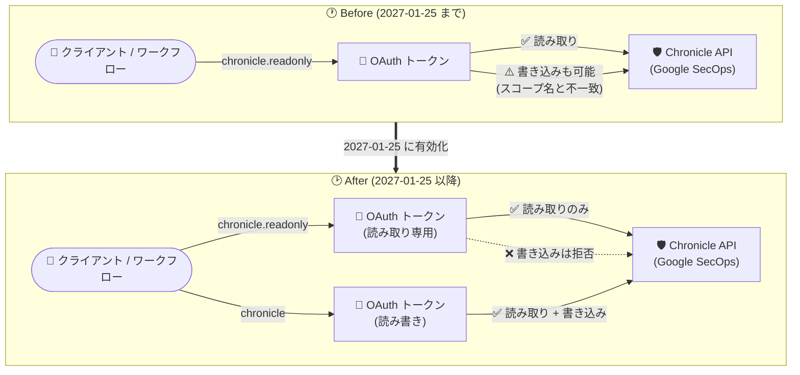

# Google SecOps / Google SecOps SIEM: chronicle.readonly OAuth スコープからの書き込み権限の廃止

**リリース日**: 2026-09-11

**サービス**: Google SecOps / Google SecOps SIEM

**機能**: chronicle.readonly OAuth スコープからの書き込み権限の削除 (読み取り専用への厳格化)

**ステータス**: Deprecated (2027 年 1 月 25 日に有効化)

📊 [このアップデートのインフォグラフィックを見る](https://takech9203.github.io/google-cloud-news-summary/20260911-google-secops-chronicle-readonly-scope-deprecation.html)

## 概要

Google SecOps および Google SecOps SIEM において、`chronicle.readonly` OAuth スコープからの書き込み権限の廃止が発表されました。**2027 年 1 月 25 日**以降、`chronicle.readonly` スコープは名前のとおり読み取り操作のみに厳格に制限され、これまで例外的に許可されていた書き込み操作は実行できなくなります。

このアップデートは、Chronicle API (Google SecOps API) を OAuth 2.0 認証で利用しているすべてのユーザー・アプリケーションが対象です。読み取り操作については、引き続き `chronicle.readonly` スコープをそのまま使用できるため対応は不要です。一方、`chronicle.readonly` スコープを使用しながら書き込み操作 (作成・更新・削除など) を行っているワークフロー、自動化スクリプト、SOAR 連携、カスタムインテグレーションは、期限までに `chronicle` OAuth スコープへ移行する必要があります。

この変更は、OAuth スコープの動作をその名前が示す意図 (readonly = 読み取り専用) と一致させるものであり、最小権限の原則に沿ったセキュリティ強化と位置づけられます。SIEM プラットフォームという機密性の高いセキュリティデータを扱うサービスにおいて、意図しない書き込みアクセスの経路を塞ぐ重要な変更です。

**アップデート前の課題**

- `chronicle.readonly` スコープは「読み取り専用」という名前にもかかわらず、実際には書き込み操作も許可されており、スコープ名と実際の権限範囲が一致していなかった
- 読み取り専用のつもりで `chronicle.readonly` を付与したトークンでも書き込みが可能なため、最小権限の原則が徹底できず、意図しないデータ変更のリスクがあった
- スコープによるアクセス制御を前提としたセキュリティレビューや監査で、実際の権限範囲を正確に評価しにくかった

**アップデート後の改善**

- 2027 年 1 月 25 日以降、`chronicle.readonly` スコープは読み取り操作のみに厳格化され、スコープ名と実際の権限が一致する
- 読み取り専用アクセスを付与したいケースで、`chronicle.readonly` を安心して利用できるようになり、最小権限の原則を OAuth スコープレベルで担保できる
- 書き込みが必要なワークフローは `chronicle` スコープへ明示的に移行することで、権限の意図が構成上明確になる

## アーキテクチャ図



2027 年 1 月 25 日を境に `chronicle.readonly` スコープの書き込み権限が削除され、書き込みが必要なワークフローは `chronicle` スコープへの移行が必須になります。

## サービスアップデートの詳細

### 主要機能

1. **`chronicle.readonly` スコープの読み取り専用への厳格化**
   - 2027 年 1 月 25 日以降、`chronicle.readonly` OAuth スコープから書き込み権限が削除される
   - 同スコープのトークンで実行される書き込み操作 (作成・更新・削除など) は失敗するようになる

2. **読み取り操作への影響なし**
   - 読み取り操作 (検索、一覧取得、詳細取得など) は、引き続き `chronicle.readonly` スコープで実行可能
   - 読み取り専用のワークフローは変更不要

3. **書き込みワークフローの移行パス**
   - 書き込み操作を行うワークフローは、`chronicle` OAuth スコープを使用するように更新が必要
   - `chronicle` スコープは読み取りと書き込みの両方をカバーする

## 技術仕様

### 対象 OAuth スコープ

| 項目 | 詳細 |
|------|------|
| 対象サービス | Google SecOps / Google SecOps SIEM (Chronicle API) |
| 廃止対象 | `https://www.googleapis.com/auth/chronicle.readonly` スコープの書き込み権限 |
| 移行先スコープ | `https://www.googleapis.com/auth/chronicle` (読み書き可能) |
| 有効化日 | 2027 年 1 月 25 日 |
| 読み取り操作への影響 | なし (`chronicle.readonly` で継続利用可能) |
| 書き込み操作への影響 | `chronicle.readonly` では実行不可となり、`chronicle` スコープが必須 |

### スコープ指定の変更例 (Python クライアント)

```python
# Before: 書き込みも行うワークフローで readonly スコープを使用していた場合
SCOPES = ["https://www.googleapis.com/auth/chronicle.readonly"]

# After: 書き込み操作を行うワークフローは chronicle スコープへ変更
SCOPES = ["https://www.googleapis.com/auth/chronicle"]

# 読み取り専用ワークフローはそのままで OK
SCOPES = ["https://www.googleapis.com/auth/chronicle.readonly"]
```

## 設定方法

### 前提条件

1. Google SecOps / Google SecOps SIEM を利用しており、Chronicle API を OAuth 2.0 認証で呼び出していること
2. 自組織のワークフロー・スクリプト・インテグレーションで使用している OAuth スコープを確認できること

### 手順

#### ステップ 1: `chronicle.readonly` スコープの利用箇所を棚卸しする

```bash
# コードベース内でスコープの利用箇所を検索する例
grep -rn "chronicle.readonly" /path/to/your/integrations/
```

自動化スクリプト、SOAR プレイブック、カスタムアプリケーションなど、Chronicle API を呼び出すすべてのコンポーネントで使用スコープを確認します。

#### ステップ 2: 書き込み操作の有無を確認する

```bash
# POST / PATCH / DELETE などの書き込み系リクエストの有無を確認する例
grep -rnE "\.(post|patch|delete|create|update)\(" /path/to/your/integrations/
```

`chronicle.readonly` スコープのトークンで作成・更新・削除などの書き込み操作を行っている箇所を特定します。

#### ステップ 3: 書き込みワークフローのスコープを `chronicle` に変更する

```python
# 書き込みを行うワークフローのスコープ定義を更新
SCOPES = ["https://www.googleapis.com/auth/chronicle"]
```

変更後、書き込み操作が正常に動作することをテスト環境などで確認します。2027 年 1 月 25 日の有効化前に移行を完了してください。

## メリット

### ビジネス面

- **監査・コンプライアンス対応の明確化**: スコープ名と実際の権限が一致することで、セキュリティ監査時に OAuth スコープベースでのアクセス権限評価が正確に行える
- **意図しないデータ変更リスクの低減**: 読み取り専用のつもりで払い出したトークンが SIEM のデータやルールを変更してしまうリスクがなくなる

### 技術面

- **最小権限の原則の徹底**: 読み取り専用アクセスを OAuth スコープレベルで強制でき、クレデンシャル漏洩時の影響範囲 (ブラスト半径) を縮小できる
- **権限意図の明示化**: 書き込みが必要なワークフローは `chronicle` スコープの明示的な指定が必要になるため、構成から権限の意図が読み取れるようになる

## デメリット・制約事項

### 制限事項

- 2027 年 1 月 25 日以降、`chronicle.readonly` スコープのトークンによる書き込み操作は失敗する
- 移行期限までに対応しない場合、`chronicle.readonly` を使用した書き込みワークフロー (自動化、SOAR 連携など) が停止する

### 考慮すべき点

- サードパーティ製インテグレーションやコミュニティ製スクリプトを利用している場合、それらが内部で使用しているスコープも確認が必要
- スコープを `chronicle` に変更するとトークンの権限が読み書き可能に広がるため、本当に書き込みが必要なワークフローに限定して移行し、読み取り専用のものは `chronicle.readonly` を維持することが望ましい

## ユースケース

### ユースケース 1: SOAR / 自動化ワークフローの移行

**シナリオ**: セキュリティ運用チームが、`chronicle.readonly` スコープのサービスアカウントを使って、検知ルールの更新やリファレンスリストへの IOC 追加を自動化している。

**実装例**:
```python
# 書き込みを行う自動化のスコープを chronicle へ変更
SCOPES = ["https://www.googleapis.com/auth/chronicle"]
credentials = service_account.Credentials.from_service_account_file(
    SERVICE_ACCOUNT_FILE, scopes=SCOPES
)
```

**効果**: 2027 年 1 月 25 日の有効化後も、IOC 追加やルール更新などの書き込み自動化が停止せずに継続できる。

### ユースケース 2: 読み取り専用ダッシュボード・レポーティング

**シナリオ**: BI ツールや社内ダッシュボードが `chronicle.readonly` スコープで SecOps のアラートや検知結果を取得・可視化している。

**効果**: 読み取り操作のみのため対応不要。さらに、スコープが真の読み取り専用になることで、ダッシュボード基盤のクレデンシャルが漏洩しても SIEM データを変更されるリスクがなくなる。

## 料金

このアップデートは OAuth スコープの権限変更であり、追加料金は発生しません。Google SecOps の料金については公式ページを参照してください。

- [Google Security Operations の料金](https://cloud.google.com/security/products/security-operations)

## 利用可能リージョン

このアップデートは、Google SecOps / Google SecOps SIEM が提供されるすべてのリージョンに適用されます。

## 関連サービス・機能

- **Chronicle API (Google SecOps API)**: 今回のスコープ変更の対象となる API。SIEM の検索、検知ルール、リファレンスリストなどをプログラムから操作する
- **Identity and Access Management (IAM)**: OAuth スコープと組み合わせて実際のアクセス権限を決定する。スコープ変更後も IAM ロールによる権限管理は引き続き有効
- **Google SecOps SOAR**: Chronicle API と連携するプレイブックや自動化を利用している場合、使用スコープの確認が必要

## 参考リンク

- 📊 [インフォグラフィック](https://takech9203.github.io/google-cloud-news-summary/20260911-google-secops-chronicle-readonly-scope-deprecation.html)
- [公式リリースノート](https://docs.cloud.google.com/release-notes#September_11_2026)
- [Chronicle API 認証ドキュメント](https://docs.cloud.google.com/chronicle/docs/reference/authentication)
- [Chronicle API リファレンス](https://docs.cloud.google.com/chronicle/docs/reference/rest)
- [Google SecOps の非推奨情報](https://docs.cloud.google.com/chronicle/docs/deprecations)

## まとめ

`chronicle.readonly` OAuth スコープが 2027 年 1 月 25 日に読み取り専用へ厳格化され、スコープ名と実際の権限が一致するセキュリティ強化が行われます。Google SecOps の API 連携を運用しているチームは、`chronicle.readonly` を使用した書き込みワークフローの有無を早めに棚卸しし、該当するものは期限までに `chronicle` スコープへ移行してください。読み取り専用のワークフローは対応不要です。

---

**タグ**: #GoogleSecOps #GoogleSecOpsSIEM #Chronicle #OAuth #セキュリティ #Deprecated #SIEM
