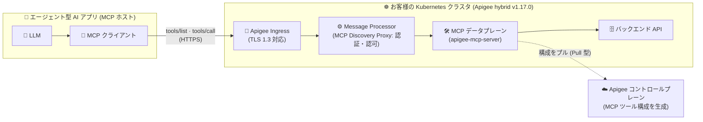

# Apigee hybrid: v1.17.0 リリース — MCP サポート、ルート CA ローテーション、TLS 1.3 対応

**リリース日**: 2026-09-14

**サービス**: Apigee hybrid

**機能**: v1.17.0 リリース (MCP サポート、ルート CA ローテーション、TLS 1.3 対応ほか)

**ステータス**: GA (マイナーリリース)

📊 [このアップデートのインフォグラフィックを見る](https://takech9203.github.io/google-cloud-news-summary/20260914-apigee-hybrid-v1-17-0.html)

## 概要

2026 年 9 月 14 日、Apigee hybrid の新バージョン v1.17.0 がリリースされました。本リリースの最大の目玉は Model Context Protocol (MCP) のサポートです。MCP は Anthropic が開発したオープンプロトコルで、エージェント型 AI アプリケーションが外部のデータソースやツールに接続する方法を標準化します。v1.17.0 以降、Apigee hybrid のマネージド MCP エンドポイントを通じて、既存の API をエージェント型 AI アプリケーションの「ツール」として公開できるようになりました。MCP ツール呼び出しのルーティング・認可・保護は他の API と同じ仕組みで管理されるため、独自の MCP サーバーを構築・運用する必要がありません。

セキュリティ・運用面の強化も充実しています。ランタイムコンポーネント間の TLS 通信の信頼の起点となるルート CA 証明書を、ダウンタイムなしで有効期限前にローテーションできるようになりました。また、TLS 1.3 のサポートにより、より高速なハンドシェイクとより強力なセキュリティが利用可能になっています。さらに、AI ポリシー (Model Armor、セマンティックキャッシュ) のフォワードプロキシ対応と Private Service Connect (PSC) 対応、サービスアカウント権限の最小化、各種セキュリティ / CVE 修正も含まれます。

本リリースはマイナーリリースであり、コンテナイメージは Helm チャートに統合されているため、Helm チャート経由でのアップグレードでイメージも自動的に更新されます。自社の Kubernetes クラスタ上で Apigee ランタイムを運用しているプラットフォームチーム、および AI エージェントとの API 連携を検討している組織にとって重要なアップデートです。

**アップデート前の課題**

- エージェント型 AI アプリケーションに API をツールとして公開するには、独自に MCP サーバーを構築・運用する必要があり、認証・認可・監視も API 管理基盤とは別に整備する必要があった
- Apigee hybrid の内部通信を支えるルート CA 証明書 (有効期間 10 年) を顧客側でローテーションする手順が提供されておらず、期限切れが近づいた際の対応が課題だった
- Ingress ゲートウェイの TLS は 1.3 に対応しておらず、最新のセキュリティ要件 (高速ハンドシェイク、強化された暗号スイート) に応えられなかった
- Model Armor やセマンティックキャッシュなどの AI ポリシーからのアウトバウンド通信は HTTP フォワードプロキシを経由できず、プロキシ必須のネットワーク環境で利用しづらかった
- Cloud Storage を使用するサービスアカウントに広範な Storage Admin (`roles/storage.admin`) ロールが必要で、Cassandra コンポーネントは `privileged: true` セキュリティコンテキストで動作していた

**アップデート後の改善**

- MCP サポートにより、既存の Apigee API をマネージド MCP エンドポイント経由でエージェント型 AI アプリのツールとして公開可能に。MCP サーバーの自前運用が不要になり、MCP トラフィックはクラスタ内で完結する
- ルート CA 証明書のローテーションが顧客主導・ゼロダウンタイムで実行可能に (`certRotation.phase` を 4 フェーズで進める方式)
- TLS 1.3 対応により、Ingress ゲートウェイでより高速・安全な TLS 通信が可能に
- AI ポリシーのアウトバウンド呼び出しを HTTP フォワードプロキシ経由でルーティング可能に。セマンティックキャッシュは PSC エンドポイント経由でバックエンドに到達でき、トラフィックをプライベートネットワーク内に維持できる
- Cloud Storage の必要権限が `storage.objects.get` と `storage.objects.create` の 2 つに削減され、Cassandra コンポーネントの特権コンテキストも不要になり、最小権限の原則に沿った運用が可能に

## アーキテクチャ図



エージェント型 AI アプリからの MCP ツール呼び出しは、既存の Apigee Ingress → Message Processor → クラスタ内 MCP データプレーンと流れ、MCP リクエストはクラスタの外に出ません。ツール構成はコントロールプレーンからクラスタ側がプルする方式で、コントロールプレーンからクラスタへの接続は発生しません。

## サービスアップデートの詳細

### 主要機能

1. **Model Context Protocol (MCP) サポート**
   - エージェント型 AI アプリケーションが、マネージド MCP エンドポイントを通じて Apigee で管理された API をツールとして利用可能
   - `tools/list` (ツール発見) と `tools/call` (ツール実行) の JSON-RPC メソッドをサポート
   - MCP データプレーンはお客様のクラスタ内で動作し、MCP リクエスト / レスポンスはリクエスト時に Google Cloud との境界を越えない
   - オプトイン機能であり、デフォルトでは無効。`overrides.yaml` で明示的に有効化が必要
   - API hub との統合により、MCP 対応 API のフィルタリングやセマンティック検索によるツール発見が可能

2. **ルート CA 証明書ローテーション**
   - ランタイムコンポーネント間の TLS 通信 (mTLS および Webhook 用サーバーサイド TLS) の信頼の起点となるルート CA を、有効期限前にダウンタイムなしで交換可能
   - `certRotation.phase` を `CREATE_NEW_CA` → `CREATE_NEW_LEAF` → `HIDE_OLD_CA` → `CLEANUP` の 4 フェーズで進める顧客主導の方式
   - `CLEANUP` 以前の各フェーズはロールバック可能。独自 CA の持ち込み (BYO CA) にも対応
   - Ingress ゲートウェイの TLS 証明書とは別物であり、ローテーションは Ingress 証明書に影響しない

3. **TLS 1.3 サポート**
   - より高速なコネクションハンドシェイクと、従来の TLS バージョンより強力なセキュリティを提供
   - Ingress ゲートウェイの TLS / mTLS 構成で設定可能

4. **AI ポリシーのフォワードプロキシ対応**
   - Model Armor ポリシーやセマンティックキャッシュポリシーからのアウトバウンド呼び出しを HTTP フォワードプロキシ経由でルーティング可能

5. **セマンティックキャッシュの PSC 対応と距離測定方式の追加**
   - セマンティックキャッシュポリシーが Private Service Connect エンドポイント経由でバッキングサービスに到達可能になり、トラフィックをプライベートネットワークに維持
   - `SemanticCacheLookup` ポリシーに `<DistanceMeasureType>` 要素が追加され、`DOT_PRODUCT_DISTANCE` (デフォルト) に加えて `COSINE_DISTANCE`、`SQUARED_L2_DISTANCE`、`L1_DISTANCE` を選択可能 (非デフォルト測定方式の宣言時は `<Threshold>` の再チューニングが必要)

6. **サービスアカウント権限の削減**
   - Cloud Storage を使用するサービスアカウントに必要な権限が `storage.objects.get` と `storage.objects.create` のみに縮小 (従来は `roles/storage.admin`)
   - Cassandra コンポーネントが `privileged: true` セキュリティコンテキストなしで動作可能に

7. **セキュリティ修正**
   - 各種セキュリティおよび CVE の修正を含む

## 技術仕様

### MCP サポートの主な仕様

| 項目 | 詳細 |
|------|------|
| 有効化方法 | `overrides.yaml` のトップレベルに `enableMcpServer: true` を追加し、`apigee-operator` → `apigee-org` の順に `helm upgrade` |
| デフォルト構成 | MCP データプレーン 2 レプリカ、CPU 使用率 70% で最大 10 までオートスケール |
| リソース (デフォルト) | requests: 500m CPU / 512Mi、limits: 2000m CPU / 1Gi |
| ターゲットエンドポイント | `https://ORG_NAME.mcp.apigee.internal/mcp` (推奨) — クラスタ内 MCP Service に解決 |
| 対応メソッド | `tools/list`、`tools/call` (JSON-RPC) |
| 認証 | Message Processor 上の MCP プロキシで OAuth 2.1 / OIDC 認証ポリシーを適用 (MCP データプレーン自体は 1.17.0 では呼び出し元を独立に認証しない) |
| 構成の取得 | クラスタ内サイドカーが `apigee.googleapis.com` と `storage.googleapis.com` から Pull 型で取得 (両方のエグレス許可が必要) |
| サービスアカウント | 既存の `apigee-watcher` の ID (`roles/apigee.runtimeAgent`) を再利用可能 |

### ルート CA ローテーションのフェーズ

| フェーズ (`certRotation.phase`) | 内容 | ロールバック |
|------|------|------|
| 1. `CREATE_NEW_CA` | 新ルート CA (`apigee-ca-2`) を作成し全コンポーネントのトラストストアに追加 | 可 |
| 2. `CREATE_NEW_LEAF` | 新ルート CA で署名されたリーフ証明書を発行 (新旧両 CA を信頼) | 可 |
| 3. `HIDE_OLD_CA` | 旧ルート CA をアクティブな信頼構成から除去 | 可 |
| 4. `CLEANUP` | 旧ルート CA と issuer を削除し、新 CA をクラスタのルート CA に昇格 | **不可 (不可逆)** |

### MCP を有効化する overrides.yaml の例

```yaml
instanceID: "my-hybrid-instance"
namespace: apigee
gcp:
  region: us-central1
  projectID: my-hybrid-project
  workloadIdentity:
    enabled: true
    gsa: apigee-non-prod@my-hybrid-project.iam.gserviceaccount.com
org: my-org
envs:
  - name: my-env
# ---- MCP: 最小限の必須設定 (トップレベルのキー) ----
enableMcpServer: true
```

## 設定方法

### 前提条件

1. Apigee hybrid v1.17.0 以降 (ローカルの `apigee-operator/`、`apigee-org/` チャートが 1.17.0 以降であること)
2. `kubectl` と `helm` コマンドラインツール
3. クラスタが健全であること (各 `helm upgrade` は全 ApigeeDeployment の running 状態を検証)
4. MCP の場合: クラスタのエグレスで `apigee.googleapis.com` と `storage.googleapis.com` の両方を許可

### 手順

#### ステップ 1: v1.17.0 へのアップグレード

```bash
# アップグレードガイドに従い Helm チャートを v1.17 に更新
# https://docs.cloud.google.com/apigee/docs/hybrid/v1.17/upgrade
```

マイナーリリースのため、Helm チャート経由のアップグレードでコンテナイメージも自動的に更新されます。

#### ステップ 2: MCP の有効化 (オプトイン)

```bash
# overrides.yaml に enableMcpServer: true を追加後、operator チャートを先にアップグレード
helm upgrade APIGEE_OPERATOR_RELEASE_NAME apigee-operator/ \
  --namespace APIGEE_NAMESPACE --atomic -f overrides.yaml

# operator のロールアウト完了を確認
kubectl rollout status deploy -n APIGEE_NAMESPACE apigee-controller-manager --timeout=2m

# 続いて org チャートをアップグレード
helm upgrade APIGEE_ORG_RELEASE_NAME apigee-org/ \
  --namespace APIGEE_NAMESPACE --atomic -f overrides.yaml
```

operator チャートが MCP リソースのスキーマを所有するため、必ず operator → org の順にアップグレードします。順序を誤ると `helm upgrade` は成功するのに MCP Pod が作成されません。同一環境グループを提供するすべてのクラスタで MCP を一律に有効化する必要があります (一部のみ有効の場合、無効なクラスタにルーティングされた MCP リクエストは 503 になります)。

#### ステップ 3: ルート CA ローテーション (期限前に計画的に実施)

```bash
# 現在のルート CA の有効期限を確認
kubectl get certificate apigee-ca -n cert-manager -o jsonpath='{.status.notAfter}'

# overrides.yaml に certRotation.phase を設定し、フェーズごとに operator チャートを upgrade
# (CREATE_NEW_CA → CREATE_NEW_LEAF → HIDE_OLD_CA → CLEANUP の順に 1 フェーズずつ)
helm upgrade APIGEE_OPERATOR_RELEASE_NAME apigee-operator/ \
  --namespace APIGEE_NAMESPACE --atomic -f overrides.yaml
```

マルチリージョン構成では、すべてのリージョンが同じ新ルート CA に収束するよう、各リージョンでフェーズごとに実行します。

## メリット

### ビジネス面

- **AI エージェント連携の迅速な実現**: 既存の API 資産を MCP ツールとして公開でき、エージェント型 AI アプリとの連携を追加インフラなしで開始できる
- **コンプライアンス対応**: MCP トラフィックがクラスタ内で完結するため、データ主権やネットワーク分離の要件が厳しい環境 (金融、公共など) でも AI エージェント連携を採用しやすい
- **運用リスクの低減**: ルート CA の期限切れによる内部通信断のリスクを、計画的なゼロダウンタイムローテーションで回避できる

### 技術面

- **既存ガバナンスの再利用**: MCP ツール呼び出しにも OAuth 2.1 / OIDC 認証、きめ細かな認可ポリシー、Analytics など既存の API 管理機能をそのまま適用できる
- **セキュリティ強化**: TLS 1.3、サービスアカウント権限の最小化、Cassandra の非特権化、CVE 修正により、セキュリティポスチャが総合的に向上
- **プライベートネットワーク対応**: フォワードプロキシと PSC 対応により、制約の厳しいネットワーク環境でも AI ポリシー (Model Armor、セマンティックキャッシュ) を利用可能

## デメリット・制約事項

### 制限事項

- MCP はデフォルト無効のオプトイン機能であり、`overrides.yaml` での明示的な有効化と operator → org の順序どおりのチャートアップグレードが必要
- v1.17.0 では MCP データプレーンは呼び出し元を独立に認証せず、Message Processor 側の Apigee プロキシによる認証を信頼する。本番環境では NetworkPolicy 等で `app=apigee-runtime` の Pod のみが MCP Service (TCP 443) に到達できるよう Ingress 制御を適用すべき
- MCP サイドカーの構成取得には `apigee.googleapis.com` と `storage.googleapis.com` 両方へのエグレス許可が必要。片方のみ許可した場合、MCP データプレーンは健全に見えるが新しい構成を取得できないという検知しづらい障害モードになる
- ルート CA ローテーションの `CLEANUP` フェーズは不可逆であり、全リージョンの健全性を確認してから適用する必要がある

### 考慮すべき点

- 同一環境グループを提供する複数クラスタでは、MCP をすべてのクラスタで一律に有効化しないと一部のリクエストが 503 になる
- `SemanticCacheLookup` ポリシーで非デフォルトの距離測定方式を宣言する場合、同じ編集で `<Threshold>` の再チューニングが必要
- ルート CA ローテーションは顧客主導であり、`apigee-ca` 証明書の有効期限の追跡とローテーション計画は利用者の責任となる

## ユースケース

### ユースケース 1: 社内 API を AI エージェントのツールとして公開

**シナリオ**: 規制業種の企業が、社内の注文管理 API を AI エージェント (社内チャットアシスタント) から利用させたい。ただし、API トラフィックは自社の Kubernetes クラスタ外に出せない。

**実装例**:
```yaml
# overrides.yaml (抜粋)
enableMcpServer: true
```
MCP Discovery Proxy に OAuth 認可ポリシーを設定し、既知のクライアント ID を持つエージェントのみが注文管理ツールを呼び出せるように制限します。

**効果**: MCP サーバーを自前で構築・運用することなく、既存の Apigee の認証・認可・監視の枠組みの中で AI エージェント連携を実現。MCP リクエストはクラスタ内で完結し、データ主権要件を満たせる。

### ユースケース 2: ルート CA 期限切れ前の計画的ローテーション

**シナリオ**: 数年前に構築した Apigee hybrid 環境のルート CA の有効期限が近づいており、内部通信の停止を避けたい。

**効果**: 4 フェーズのローテーションを保守ウィンドウ内で段階的に進めることで、ダウンタイムなしでルート CA を更新。各フェーズ (CLEANUP を除く) でロールバック可能なため、安全に作業を進められる。

## 料金

Apigee hybrid v1.17.0 へのアップグレード自体に追加料金はありません。Apigee の料金は Subscription または Pay-as-you-go モデルに基づきます。MCP は Subscription、Pay-as-you-go、Evaluation の各組織 (データレジデンシー有効組織を含む) で利用可能です。なお、MCP データプレーンの Pod はお客様のクラスタ上で動作するため、そのコンピュートリソース (デフォルトで 2〜10 レプリカ) はクラスタ側のコストとして発生します。

詳細は [Apigee 料金ページ](https://cloud.google.com/apigee/pricing) を参照してください。

## 利用可能リージョン

Apigee hybrid はお客様が管理する Kubernetes クラスタ上で動作するため、ランタイムのリージョンはクラスタの配置に依存します。データレジデンシー有効組織では、MCP サイドカーはリージョナルなコントロールプレーンエンドポイント (`CONTROL_PLANE_LOCATION-apigee.googleapis.com`) を使用します。サポートされるプラットフォームは [サポート対象プラットフォーム](https://docs.cloud.google.com/apigee/docs/hybrid/supported-platforms) を参照してください。

## 関連サービス・機能

- **Apigee API hub**: MCP Discovery Proxy のデプロイ時に OpenAPI 仕様を自動取り込みし、MCP API スタイルの付与とツールへのマッピングを実施。セマンティック検索でのツール発見が可能
- **Model Armor**: AI ポリシーとして Apigee から利用可能。v1.17.0 でフォワードプロキシ経由のアウトバウンド呼び出しに対応
- **Vertex AI Vector Search**: セマンティックキャッシュのバッキングサービス。新しい `<DistanceMeasureType>` で距離測定方式を選択可能
- **Private Service Connect**: セマンティックキャッシュのトラフィックをプライベートネットワーク内に維持するためのエンドポイントとして利用
- **cert-manager**: ルート CA (`apigee-ca`) を管理する Kubernetes コンポーネント。ローテーションの各世代 (`apigee-ca-2` など) もここで管理される
- **Cloud IAM**: v1.17.0 でサービスアカウントの必要権限が削減され、最小権限での運用が可能に

## 参考リンク

- 📊 [インフォグラフィック](https://takech9203.github.io/google-cloud-news-summary/20260914-apigee-hybrid-v1-17-0.html)
- [公式リリースノート](https://docs.cloud.google.com/release-notes#September_14_2026)
- [Apigee hybrid v1.17 へのアップグレード](https://docs.cloud.google.com/apigee/docs/hybrid/v1.17/upgrade)
- [Model Context Protocol (MCP) の概要](https://docs.cloud.google.com/apigee/docs/api-platform/apigee-mcp/apigee-mcp-overview)
- [Apigee hybrid で MCP を有効化する](https://docs.cloud.google.com/apigee/docs/api-platform/apigee-mcp/enable-mcp)
- [MCP クイックスタート](https://docs.cloud.google.com/apigee/docs/api-platform/apigee-mcp/apigee-mcp-quickstart)
- [ルート CA のローテーション](https://docs.cloud.google.com/apigee/docs/hybrid/v1.17/rotate-root-ca)
- [Ingress ゲートウェイの TLS / mTLS 構成](https://docs.cloud.google.com/apigee/docs/hybrid/v1.17/ingress-tls)
- [フォワードプロキシの構成](https://docs.cloud.google.com/apigee/docs/hybrid/v1.17/forward-proxy)
- [SemanticCacheLookup ポリシー](https://docs.cloud.google.com/apigee/docs/api-platform/reference/policies/semantic-cache-lookup-policy)
- [料金ページ](https://cloud.google.com/apigee/pricing)

## まとめ

Apigee hybrid v1.17.0 は、MCP サポートによりセルフホスト環境の API をエージェント型 AI アプリのツールとして安全に公開できるようにする、AI 時代の API 管理に向けた重要なリリースです。あわせてルート CA ローテーション、TLS 1.3、権限最小化などセキュリティ・運用基盤の強化も充実しています。まずは v1.17 へのアップグレードを計画し、AI エージェント連携の要件がある場合は検証環境で `enableMcpServer: true` による MCP の有効化と NetworkPolicy による Ingress 制御を試すことを推奨します。

---

**タグ**: #ApigeeHybrid #MCP #ModelContextProtocol #AgenticAI #APIManagement #TLS13 #Security #Kubernetes
