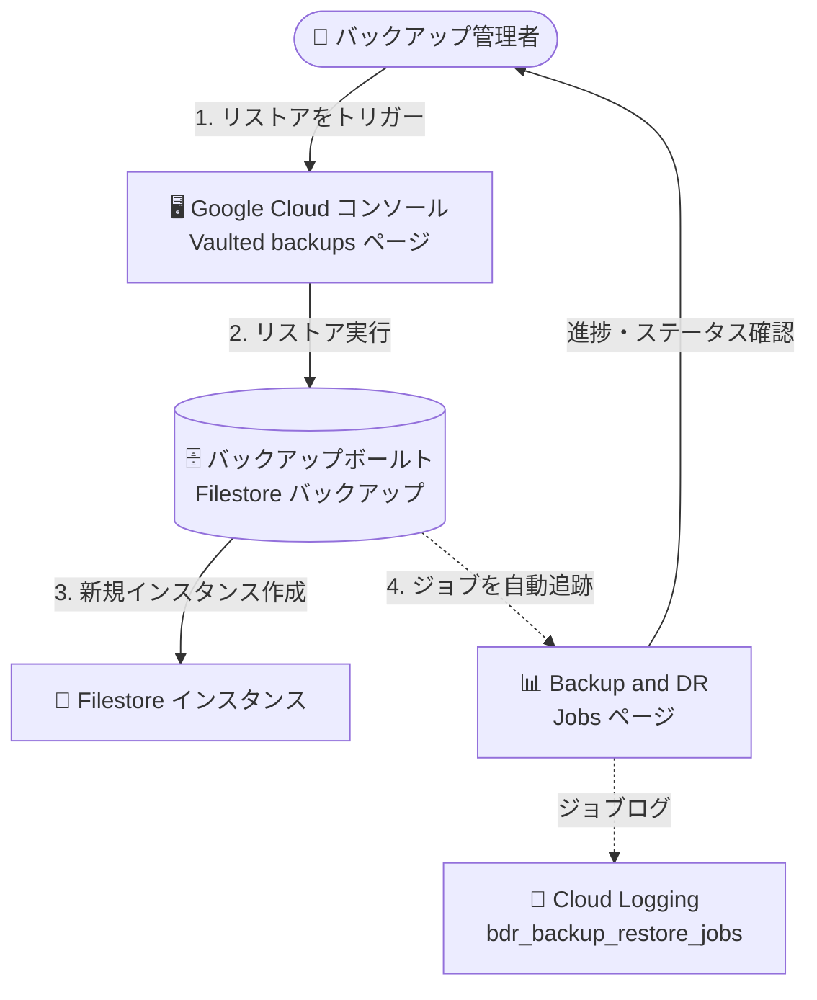

# Backup and DR: Filestore インスタンスのリストアジョブモニタリング

**リリース日**: 2026-09-14

**サービス**: Backup and DR Service

**機能**: Filestore インスタンスのリストアジョブモニタリング

**ステータス**: Feature

📊 [このアップデートのインフォグラフィックを見る](https://takech9203.github.io/google-cloud-news-summary/20260914-backup-dr-filestore-restore-job-monitoring.html)

## 概要

Google Cloud コンソールの Backup and DR「Jobs」ページから、Filestore インスタンスのリストアジョブを直接モニタリングできるようになりました。Filestore インスタンスのリストアをトリガーすると、Backup and DR が自動的にジョブを追跡し、進捗とステータスを Jobs ページに表示します。

Backup and DR の Jobs 機能は、Compute Engine インスタンスや Cloud SQL インスタンスなどのリソースについて、バックアップ・リストアジョブのステータス (成功、失敗、スキップ、実行中) を集約表示するダッシュボードです。今回のアップデートにより、バックアップボールト (Backup Vault) からの Filestore インスタンスのリストアジョブもこのダッシュボードの追跡対象に加わり、他のリソースと同じ画面で一元的にジョブを監視できるようになりました。

Filestore を Backup and DR のバックアップボールトで保護している運用チームやバックアップ管理者にとって、リストア作業の可視性が向上し、障害復旧 (DR) オペレーションの状況確認が容易になるアップデートです。

**アップデート前の課題**

- Filestore インスタンスのリストアジョブの進捗・ステータスを Backup and DR の Jobs ページで確認する手段がなく、リストア先の Filestore インスタンスの状態を個別に確認する必要があった
- リストアオペレーションの完了・失敗を、他のリソース (Compute Engine、Cloud SQL など) のジョブと同じダッシュボードで一元的に把握できなかった

**アップデート後の改善**

- Filestore インスタンスのリストアをトリガーすると、Backup and DR が自動的にジョブを追跡し、Jobs ページで進捗とステータスを確認できるようになった
- Jobs ページで「Resource type = Filestore」「Job category = Restore」でジョブを特定し、ジョブ ID、開始・終了時刻、所要時間、エラー情報などの詳細を確認できるようになった
- リストアジョブのログを、バックアップが保存されているバックアップボールトプロジェクトの Cloud Logging で参照できるようになった

## アーキテクチャ図



バックアップボールトから Filestore インスタンスのリストアをトリガーすると、Backup and DR がジョブを自動追跡し、Jobs ページと Cloud Logging で進捗・ステータスを確認できます。

## サービスアップデートの詳細

### 主要機能

1. **リストアジョブの自動追跡**
   - Filestore インスタンスのリストアをトリガーすると、Backup and DR が自動的にジョブを追跡する
   - ユーザー側での追加設定は不要で、リストア実行後すぐに Jobs ページで進捗とステータスを確認できる

2. **Jobs ページでの一元モニタリング**
   - Google Cloud コンソールの Backup and DR「Jobs」ページで、「Resource type = Filestore」「Job category = Restore」のジョブとして表示される
   - Compute Engine や Cloud SQL など他のリソースのバックアップ・リストアジョブと同じダッシュボードで一元管理できる
   - デフォルトでは過去 24 時間のジョブが表示され、表示期間は 1 時間、6 時間、12 時間、7 日、14 日に変更できる

3. **Cloud Logging によるジョブログの確認**
   - リストアジョブのログは、バックアップが保存されているバックアップボールトプロジェクトで確認できる
   - `gcloud logging read 'logName=~"bdr_backup_restore_jobs"'` でジョブログを取得でき、ログベースのアラート設定にも活用できる

## 技術仕様

### Jobs ページで確認できる主な項目

| 項目 | 詳細 |
|------|------|
| Job ID | ジョブに関連付けられた ID |
| Job category | ジョブの種類 (リストアジョブの場合は Restore) |
| Job status | 成功 / 失敗 / スキップ / 実行中 |
| Resource name / Resource type | 保護対象リソースの名前と種類 (Filestore) |
| Backup name | リストアに使用したバックアップの名前 |
| Restore project name | バックアップのリストア先プロジェクト名 |
| Restore resource name | リストア成功後に作成されるリソースの名前 |
| Start time / End time / Duration | ジョブの開始・終了時刻 (UTC) と所要時間 |
| Error type / Error message / Error code | 失敗時のエラー種別・メッセージ・コード |

### リストアに必要な IAM ロール

| ロール | 付与対象 |
|--------|----------|
| Backup and DR Restore User (`roles/backupdr.restoreUser`) | バックアップボールトプロジェクト |
| Filestore Editor (`roles/file.editor`) | リストア先 (ターゲット) プロジェクト |

リストア実行には、バックアップリソースに対する `backupdr.bvbackups.useReadOnlyForFilestoreInstance` 権限と、リストア先プロジェクトに対する `file.instances.create` 権限が必要です。

## 設定方法

### 前提条件

1. Filestore インスタンスがバックアップボールトで保護されており、バックアップが存在すること
2. リストアを実行するユーザーに前述の IAM ロールが付与されていること

### 手順

#### ステップ 1: Filestore インスタンスのリストアを実行

1. Google Cloud コンソールで「Vaulted backups」ページに移動する (バックアップボールトで保護された Filestore インスタンスが一覧表示される)
2. リストアするインスタンスを選択し、アクションアイコンから「Restore」を選択する
3. 「Backup」フィールドで「Browse」をクリックし、リストア元のバックアップを選択する
4. リストア先プロジェクトを確認 (必要に応じて変更) し、「Continue」をクリックする
5. 新しいインスタンスのプロパティを確認・変更し、「Restore」をクリックする

gcloud CLI からリストアする場合は、Filestore サービス側のコマンドを使用します。

```bash
gcloud filestore instances create INSTANCE_NAME \
  --file-share="capacity=CAPACITY,name=SHARE_NAME,source-backupdr-backup=BACKUPDR_BACKUP_FULL_PATH" \
  --network="name=default" \
  --location=LOCATION \
  --project=PROJECT_NAME \
  --tier=TIER
```

#### ステップ 2: Jobs ページでリストアジョブをモニタリング

1. Google Cloud コンソールで Backup and DR の「Jobs」ページに移動する
2. 「Resource type = Filestore」「Job category = Restore」のジョブを探し、進捗とステータスを確認する

gcloud CLI でジョブログを確認する場合は次のコマンドを使用します。

```bash
gcloud logging read 'logName=~"bdr_backup_restore_jobs"' --project=PROJECT_ID
```

1 日より前のジョブを確認する場合は `--freshness` フラグを追加します。

## メリット

### ビジネス面

- **DR オペレーションの可視性向上**: 障害復旧時に、Filestore リストアの進捗・完了状況をコンソールから即座に把握でき、復旧作業の状況報告や RTO 管理がしやすくなる
- **運用負荷の軽減**: リストア先インスタンスの状態を個別に確認する手間が減り、他のリソースと同じダッシュボードで一元的に監視できる

### 技術面

- **自動追跡**: リストアをトリガーするだけで Backup and DR がジョブを自動追跡するため、追加の設定や計装が不要
- **Cloud Logging 連携**: ジョブログが Cloud Logging に記録されるため、ログベースのアラートを構成してリストア失敗時の通知を自動化できる
- **詳細なジョブ情報**: エラー種別・エラーコードを含む詳細情報を確認でき、失敗時のトラブルシューティングが容易

## デメリット・制約事項

### 制限事項

- **クロスプロジェクトリストアのモニタリング非対応**: Filestore バックアップを別プロジェクトにリストアした場合、リストア自体は実行されるが、その進捗・完了ステータスはボールトプロジェクトの Jobs ページに表示されない。クロスプロジェクトリストアの状況は、リストア先プロジェクトで Filestore インスタンスの状態を確認する必要がある
- **リージョンの制約**: リストアジョブのモニタリングは、Filestore と Backup and DR の両方が利用可能なリージョンでのみ利用できる

### 考慮すべき点

- Jobs ページに表示されるのは、Google Cloud コンソールで保護されたリソースのジョブのみ。アプライアンスベースのバックアップテンプレートを使用するリソースのジョブは、アプライアンス管理コンソールの Jobs ページで確認する
- リストアジョブのログはバックアップが保存されているバックアップボールトプロジェクト側で参照する
- CMEK 対応バックアップボールトを使用している場合、ボールトプロジェクトの Backup and DR サービスエージェントから KMS 鍵の暗号化 / 復号ロールを取り消すとリストアできなくなる点に注意

## ユースケース

### ユースケース 1: DR 訓練でのリストア完了確認

**シナリオ**: 定期的な DR 訓練で Filestore インスタンスをバックアップボールトからリストアし、復旧手順と所要時間を検証する。

**実装例**:
```
1. Vaulted backups ページから対象インスタンスのリストアを実行
2. Backup and DR Jobs ページで Resource type = Filestore、Job category = Restore のジョブを確認
3. Start time / End time / Duration からリストア所要時間を記録し、RTO 目標と比較
```

**効果**: リストアの進捗と所要時間をコンソールで直接確認でき、DR 訓練の実測データ収集と RTO 検証が容易になる。

### ユースケース 2: リストア失敗の検知とトラブルシューティング

**シナリオ**: ファイルサーバーの復旧作業中にリストアジョブが失敗した場合、迅速に原因を特定して再実行したい。

**効果**: Jobs ページの Error type / Error message / Error code (例: `PERMISSION_DENIED`) から失敗原因を即座に特定できる。さらに Cloud Logging のジョブログにログベースのアラートを構成すれば、失敗時の自動通知も実現できる。

## 料金

リストアジョブモニタリング機能自体に関する個別の料金情報は公式ドキュメントに記載されていません。Backup and DR の料金 (バックアップボールトのストレージ料金など) については料金ページを参照してください。

- [Backup and DR の料金](https://cloud.google.com/backup-disaster-recovery/pricing)

## 利用可能リージョン

リストアジョブのモニタリングは、Filestore と Backup and DR の両方が利用可能なリージョンで利用できます。詳細は各サービスのロケーションドキュメントを参照してください。

## 関連サービス・機能

- **Filestore**: 保護対象のマネージド NFS ファイルストレージサービス。バックアップボールトからのリストアで新しいインスタンスが作成される
- **Cloud Logging**: リストアジョブのログ (`bdr_backup_restore_jobs`) が記録され、ログベースのアラート構成に利用できる
- **Backup for GKE**: Backup and DR の Jobs ページには Backup for GKE のジョブも同じダッシュボードに表示される
- **Cloud KMS**: CMEK 対応バックアップボールトを使用する場合、リストアにはサービスエージェントへの鍵アクセス権限が必要

## 参考リンク

- 📊 [インフォグラフィック](https://takech9203.github.io/google-cloud-news-summary/20260914-backup-dr-filestore-restore-job-monitoring.html)
- [公式リリースノート](https://docs.cloud.google.com/release-notes#September_14_2026)
- [ドキュメント: Filestore インスタンスをバックアップボールトからリストアする](https://docs.cloud.google.com/backup-disaster-recovery/docs/cloud-console/filestore/filestore-instance-restore)
- [ドキュメント: Google Cloud コンソールでバックアップ・リストアジョブをモニタリングする](https://docs.cloud.google.com/backup-disaster-recovery/docs/monitor-reports/monitor-jobs-console)
- [料金ページ](https://cloud.google.com/backup-disaster-recovery/pricing)

## まとめ

Filestore インスタンスのリストアジョブが Backup and DR の Jobs ページで自動追跡されるようになり、他のリソースと同じダッシュボードでリストアの進捗・ステータスを一元的に確認できるようになりました。Filestore をバックアップボールトで保護している場合は、DR 手順書のリストア確認ステップを Jobs ページベースに更新し、あわせて Cloud Logging のログベースアラートでリストア失敗時の通知を構成することを推奨します。クロスプロジェクトリストアはモニタリング対象外である点に注意してください。

---

**タグ**: Backup and DR, Filestore, リストア, ジョブモニタリング, 災害復旧, Cloud Logging
