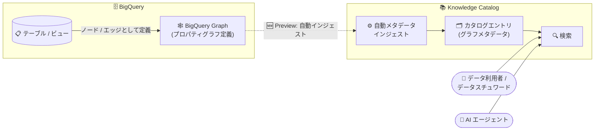

# BigQuery / Knowledge Catalog: BigQuery Graph メタデータの自動インジェストと検索対応 (Preview)

**リリース日**: 2026-09-14

**サービス**: BigQuery / Knowledge Catalog

**機能**: BigQuery Graph メタデータの Knowledge Catalog への自動インジェストと検索

**ステータス**: Preview

📊 [このアップデートのインフォグラフィックを見る](https://takech9203.github.io/google-cloud-news-summary/20260914-bigquery-graph-knowledge-catalog-metadata.html)

## 概要

BigQuery Graph のメタデータが Knowledge Catalog (旧 Dataplex Universal Catalog) に自動的にインジェストされ、検索可能になりました (Preview)。本アップデートは BigQuery と Knowledge Catalog の両方の Release Notes に掲載されており、Knowledge Catalog が自動インジェストする BigQuery アセットタイプ (データセット、テーブル、ビュー、モデル、ルーティン、接続、リンクされたデータセット) に、新たにグラフ (プロパティグラフ) が加わった形です。

BigQuery Graph は、既存のテーブルやビューからノードテーブルとエッジテーブルを定義し、ISO GQL 標準および ISO SQL/PGQ 標準に準拠したグラフクエリで大規模なグラフ分析を実行できる機能です。不正検知、レコメンデーション、ナレッジグラフ、サプライチェーン分析などのワークロードで利用が広がっており、組織内に作成されるプロパティグラフの数も増加しています。今回のアップデートにより、これらのグラフ定義がデータカタログの管理対象となり、他の BigQuery アセットと同様に組織横断で発見・検索できるようになりました。

対象ユーザーは、BigQuery Graph を利用するデータエンジニア・データサイエンティストに加え、データガバナンスを担当するデータスチュワードや、Knowledge Catalog をコンテキストグラフとして利用する AI エージェントの開発者です。

**アップデート前の課題**

- Knowledge Catalog の BigQuery 自動インジェスト対象はデータセット、テーブル、ビュー、モデル、ルーティンなどに限られており、プロパティグラフの定義はカタログに登録されなかった
- 組織内にどのようなグラフが定義されているかをカタログ検索で発見できず、BigQuery 側で個別に確認する必要があった
- グラフアセットに対して、カタログ上でのアスペクト付与などのメタデータ管理を他のアセットと同じ枠組みで行えなかった

**アップデート後の改善**

- BigQuery Graph のメタデータが Knowledge Catalog に自動的にインジェストされ、手動での登録作業なしにカタログエントリとして管理されるようになった
- Knowledge Catalog の検索でグラフアセットを発見できるようになり、組織横断でのグラフ資産の可視化が可能になった
- テーブルやビューと同じカタログの枠組みでグラフを扱えるため、データディスカバリとガバナンスの対象範囲がグラフ分析ワークロードまで拡大した

## アーキテクチャ図



BigQuery Graph のプロパティグラフ定義のメタデータが Knowledge Catalog に自動インジェストされ、カタログエントリとして登録されます。データ利用者や AI エージェントは、テーブルなど他の BigQuery アセットと同様にカタログ検索でグラフを発見できます。

## サービスアップデートの詳細

### 主要機能

1. **BigQuery Graph メタデータの自動インジェスト**
   - Knowledge Catalog が BigQuery のプロパティグラフのテクニカルメタデータを自動的に検出・インデックス化する
   - 手動でのエントリ作成や登録パイプラインの構築は不要
   - 既存の自動インジェスト対象 (データセット、テーブル、ビュー、モデル、ルーティン、接続、リンクされたデータセット) にグラフが追加された

2. **カタログ検索によるグラフの発見**
   - インジェストされたグラフのメタデータは Knowledge Catalog の検索対象となる
   - Google Cloud コンソールのカタログ検索や検索 API からグラフアセットを発見できる
   - 検索 API の呼び出しとコンソールでの検索クエリは無料

3. **既存のカタログ機能との統合**
   - グラフのエントリは他の BigQuery アセットと同じカタログのデータモデル (エントリ、アスペクト) で管理される
   - Knowledge Catalog は BigQuery アセットについて Pub/Sub によるメタデータ変更フィードや準リアルタイムのインジェストをサポートしており、カタログを起点とした下流システムへの連携基盤に組み込める

## 技術仕様

### アップデートの概要

| 項目 | 詳細 |
|------|------|
| 対象アセット | BigQuery Graph (プロパティグラフ) のメタデータ |
| インジェスト方式 | Knowledge Catalog による自動インジェスト (設定不要) |
| 検索 | Knowledge Catalog の検索 (コンソール / API) に対応 |
| リリースステージ | Preview |
| 掲載 Release Notes | BigQuery および Knowledge Catalog (同内容) |

### BigQuery Graph の前提

| 項目 | 詳細 |
|------|------|
| グラフ定義 | `CREATE PROPERTY GRAPH` 文で既存のテーブル / ビューからノード・エッジを定義 |
| クエリ言語 | ISO GQL 標準および ISO SQL/PGQ 標準に準拠 |
| GQL クエリの実行要件 | Enterprise または Enterprise Plus エディションの予約が必要 (オンデマンドでは GRAPH_EXPAND 関数を利用) |
| Spanner Graph との関係 | 同一のグラフスキーマ・クエリ言語を共有 |

## メリット

### ビジネス面

- **グラフ資産の可視化**: 組織内に散在するプロパティグラフの定義をカタログで一元的に把握でき、重複作成の防止や再利用の促進につながる
- **ガバナンス範囲の拡大**: グラフ分析ワークロードもテーブルと同じデータガバナンスの枠組みに載せられ、データ資産管理の抜け漏れを減らせる

### 技術面

- **運用負荷ゼロのインジェスト**: 自動インジェストのため、グラフをカタログに登録するためのカスタムパイプラインや手動運用が不要
- **統一されたディスカバリ体験**: テーブル、ビュー、モデルなどと同じ検索インターフェースでグラフを発見でき、データ利用者の学習コストが低い
- **AI エージェントからの発見**: Knowledge Catalog は AI エージェントのコンテキストグラフや MCP サーバー経由のアクセスをサポートしており、グラフアセットもエージェントによるデータ発見の対象に含められる

## デメリット・制約事項

### 制限事項

- Preview 段階の機能であり、GA 前に仕様が変更される可能性がある
- BigQuery Graph 自体、特定の BigQuery エディションで作成された予約では利用できない場合がある (GQL クエリの実行には Enterprise または Enterprise Plus エディションが必要)

### 考慮すべき点

- Preview 機能のため、本番のガバナンスプロセスに組み込む場合は GA までの仕様変更リスクを考慮する
- カタログにインジェストされるのはメタデータであり、グラフデータ本体へのアクセス制御は従来どおり BigQuery の IAM で管理される

## ユースケース

### ユースケース 1: 組織横断でのグラフ資産のディスカバリ

**シナリオ**: 複数のチームが不正検知や顧客 360 分析のために BigQuery Graph でプロパティグラフを作成している。新規プロジェクトのチームが、既存のグラフを再利用できるか調べたい。

**実装例**:
```
1. Google Cloud コンソールで Knowledge Catalog の検索を開く
2. グラフ名やキーワードで検索し、インジェストされたグラフのエントリを確認
3. エントリから所属プロジェクト・データセットなどのテクニカルメタデータを確認し、再利用可否を判断
```

**効果**: グラフ定義の重複作成を防ぎ、既存資産の再利用によって開発工数を削減できる。

### ユースケース 2: データガバナンス対象へのグラフの組み込み

**シナリオ**: データスチュワードが組織のデータ資産インベントリを Knowledge Catalog で管理しており、グラフ分析ワークロードの拡大に伴い、プロパティグラフも管理対象に含めたい。

**効果**: グラフのメタデータが自動的にカタログに反映されるため、インベントリの網羅性が向上し、棚卸しやオーナーシップ管理をテーブルと同じプロセスで実施できる。

## 料金

今回のメタデータ自動インジェスト機能自体に固有の追加料金は発表されていません。Knowledge Catalog はメタデータストレージ量に基づく課金で、検索 API の呼び出しとコンソールでの検索クエリは無料です。

| 項目 | 料金 (USD) |
|------|-----------|
| メタデータストレージ (無料枠) | 月間平均 1 MiB まで無料 |
| メタデータストレージ (超過分) | $2 / GiB / 月〜 |
| 検索 API 呼び出し・コンソール検索 | 無料 |

BigQuery Graph 側は BigQuery の容量ベース料金 (スロット) とストレージ料金に従います。詳細は各料金ページを参照してください。

- [Knowledge Catalog 料金](https://cloud.google.com/dataplex/pricing)
- [BigQuery 料金](https://cloud.google.com/bigquery/pricing)

## 利用可能リージョン

リージョン単位の提供状況は Release Notes に明記されていません。詳細は [Knowledge Catalog のドキュメント](https://docs.cloud.google.com/dataplex/docs/introduction) を参照してください。

## 関連サービス・機能

- **BigQuery Graph**: 今回カタログ対象となったプロパティグラフ機能。ISO GQL / SQL/PGQ に準拠し、既存テーブルからグラフ分析を実行できる
- **Knowledge Catalog (旧 Dataplex Universal Catalog)**: BigQuery をはじめとする Google Cloud サービスのメタデータを自動インジェストし、検索・ガバナンス・AI エージェント向けコンテキスト提供を担うカタログサービス
- **Spanner Graph**: BigQuery Graph と同一のグラフスキーマ・クエリ言語を共有する運用系グラフデータベース機能
- **Pub/Sub (メタデータ変更フィード)**: Knowledge Catalog のエントリ変更イベントを準リアルタイムで下流システムに通知する仕組み

## 参考リンク

- 📊 [インフォグラフィック](https://takech9203.github.io/google-cloud-news-summary/20260914-bigquery-graph-knowledge-catalog-metadata.html)
- [公式リリースノート (2026 年 9 月 14 日)](https://docs.cloud.google.com/release-notes#September_14_2026)
- [BigQuery Graph の概要](https://docs.cloud.google.com/bigquery/docs/graph-overview)
- [Use Knowledge Catalog with BigQuery](https://docs.cloud.google.com/bigquery/docs/use-knowledge-catalog)
- [Knowledge Catalog の概要 (インジェスト)](https://docs.cloud.google.com/dataplex/docs/introduction#ingestions)
- [Knowledge Catalog 料金ページ](https://cloud.google.com/dataplex/pricing)

## まとめ

BigQuery Graph のメタデータが Knowledge Catalog に自動インジェストされ、プロパティグラフもテーブルなどと同じ枠組みでディスカバリ・ガバナンスの対象になりました。BigQuery Graph を利用している組織は、追加設定なしでカタログ検索からグラフ資産を確認できるため、まずコンソールの Knowledge Catalog 検索で自組織のグラフエントリを確認することを推奨します。Preview 段階のため、本番ガバナンスプロセスへの本格的な組み込みは GA を見据えて計画するとよいでしょう。

---

**タグ**: BigQuery, Knowledge Catalog, BigQuery Graph, Dataplex, メタデータ管理, データカタログ, データガバナンス, Preview
