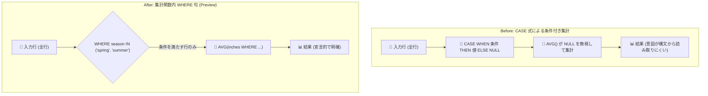

# BigQuery: 集計関数呼び出し内での WHERE 句サポート (Preview)

**リリース日**: 2026-09-14

**サービス**: BigQuery

**機能**: 集計関数呼び出し内での WHERE 句による入力フィルタリング

**ステータス**: Preview

📊 [このアップデートのインフォグラフィックを見る](https://takech9203.github.io/google-cloud-news-summary/20260914-bigquery-where-clause-aggregate-functions.html)

## 概要

BigQuery の GoogleSQL において、集計関数呼び出しの内部に WHERE 句を記述し、ブール式で集計対象の入力行をフィルタリングできる機能が Preview として発表されました。`AVG(inches WHERE season IN ('spring', 'summer'))` のように、集計関数の引数に続けて WHERE 句を書くだけで、その集計関数に渡される行だけを条件で絞り込めます。

従来、1 つのクエリ内で「条件ごとに異なる集計」を行うには、`CASE WHEN` や `IF` を使った条件式の埋め込み、`COUNTIF` などの専用関数、あるいはサブクエリの分割が必要でした。今回のアップデートにより、条件付き集計を宣言的かつ簡潔に表現できるようになり、SQL の可読性と保守性が大きく向上します。

対象ユーザーは、BigQuery でレポーティングや分析クエリを作成するデータアナリスト、データエンジニア全般です。特に、同一テーブルに対して複数のセグメント別集計 (ピボット的な集計) を 1 つの SELECT 句で行うケースで効果を発揮します。

**アップデート前の課題**

- 条件付き集計を行うには `AVG(CASE WHEN season IN ('spring', 'summer') THEN inches END)` のように CASE 式を集計関数の引数に埋め込む必要があり、条件が複雑になるほど可読性が低下していた
- 条件付きカウントには `COUNTIF` が使えるものの、`AVG` や `SUM`、`ARRAY_AGG` など他の集計関数には同等の専用関数がなく、書き方が関数ごとに不統一だった
- 条件ごとに集計対象を分ける場合、サブクエリや CTE で行を分割してから集計する構成になり、クエリが冗長になっていた

**アップデート後の改善**

- 集計関数呼び出しの中に `WHERE boolean_expression` を直接記述でき、どの集計関数でも統一的な構文で入力行をフィルタリングできるようになった
- CASE 式や NULL の扱いを意識したワークアラウンドが不要になり、「何を集計しているか」が構文上明確になった
- 1 つの SELECT 句で条件の異なる複数の集計 (例: 雨季平均と乾季平均) を簡潔に並べられるようになった

## アーキテクチャ図



従来は CASE 式で非対象行を NULL 化して集計関数の NULL 無視に依存していたのに対し、新構文では集計関数への入力行そのものを WHERE 句で宣言的にフィルタリングできます。

## サービスアップデートの詳細

### 主要機能

1. **集計関数内の WHERE 句 (Preview)**
   - 構文: `AGGREGATE_FUNCTION(expression WHERE boolean_expression)`
   - ブール式が TRUE と評価された行のみが集計関数の入力になる
   - `AVG`、`SUM`、`COUNT`、`ARRAY_AGG` など、集計関数呼び出し構文の共通修飾子として提供される

2. **他の集計関数句との組み合わせ**
   - `DISTINCT`、`IGNORE NULLS` / `RESPECT NULLS`、`HAVING MAX` / `HAVING MIN`、`ORDER BY`、`LIMIT` などの既存の集計関数句と同じ構文体系に統合されている
   - 句の適用順序が明確に定義されており、WHERE 句は `HAVING MAX` / `HAVING MIN` や `GROUP BY` (マルチレベル集計)、`IGNORE NULLS`、`DISTINCT` より先に適用される

3. **公式ドキュメントのサンプル (降水量の季節別平均)**

   ```sql
   WITH Precipitation AS (
     SELECT 2001 AS year, 'spring' AS season, 9 AS inches UNION ALL
     SELECT 2001, 'winter', 1 UNION ALL
     SELECT 2000, 'fall', 3 UNION ALL
     SELECT 2000, 'summer', 5 UNION ALL
     SELECT 2000, 'spring', 7 UNION ALL
     SELECT 2000, 'winter', 2
   )
   SELECT
     AVG(inches WHERE season IN ('spring', 'summer')) AS wet_seasons_avg,
     AVG(inches WHERE season IN ('fall', 'winter'))   AS dry_seasons_avg
   FROM Precipitation;

   /*-----------------+------------------+
    | wet_seasons_avg | dry_seasons_avg  |
    +-----------------+------------------+
    | 7               | 2                |
    +-----------------+------------------*/
   ```

## 技術仕様

### 集計関数呼び出し内の句の適用順序

集計関数呼び出しに複数の句を指定した場合、以下の順序で適用されます。

| 順序 | 句 |
|------|-----|
| 1 | `OVER` |
| 2 | `WHERE` (今回の新機能・Preview) |
| 3 | `HAVING MAX` / `HAVING MIN`、または `GROUP BY` と `HAVING` |
| 4 | `IGNORE NULLS` / `RESPECT NULLS` |
| 5 | `DISTINCT` |
| 6 | `ORDER BY` |
| 7 | `LIMIT` |

### Before / After のクエリ比較

**Before (CASE 式によるワークアラウンド):**

```sql
SELECT
  AVG(CASE WHEN season IN ('spring', 'summer') THEN inches END) AS wet_seasons_avg,
  AVG(CASE WHEN season IN ('fall', 'winter')   THEN inches END) AS dry_seasons_avg
FROM Precipitation;
```

**After (集計関数内 WHERE 句):**

```sql
SELECT
  AVG(inches WHERE season IN ('spring', 'summer')) AS wet_seasons_avg,
  AVG(inches WHERE season IN ('fall', 'winter'))   AS dry_seasons_avg
FROM Precipitation;
```

CASE 式で非対象行を暗黙的に NULL 化するのではなく、フィルタ条件を構文として明示できるため、クエリの意図がそのまま SQL に表現されます。

## メリット

### ビジネス面

- **分析クエリの開発速度向上**: セグメント別 KPI (例: チャネル別売上、地域別平均) を 1 クエリで簡潔に記述でき、レポート開発の工数を削減できる
- **保守性の向上**: 条件付き集計の意図が構文上明確になるため、クエリのレビューや引き継ぎが容易になる

### 技術面

- **統一的な構文**: `COUNTIF` のような関数ごとの専用実装に依存せず、任意の集計関数に同じ WHERE 句構文を適用できる
- **NULL ハンドリングの簡素化**: CASE 式による NULL 化と集計関数の NULL 無視動作の組み合わせという暗黙的な挙動に頼らずに済む
- **既存句との整合性**: `HAVING MAX/MIN` やマルチレベル集計 (`GROUP BY`) など既存の集計関数句と適用順序が明確に定義されており、組み合わせて使用できる

## デメリット・制約事項

### 制限事項

- 本機能は Preview であり、Pre-GA Offerings Terms が適用される。サポートが限定される可能性があるため、本番の重要ワークロードへの適用は慎重に判断する必要がある
- WHERE 句に指定できるのはブール式のみ

### 考慮すべき点

- Preview 段階では仕様が変更される可能性があるため、共有ライブラリ的な SQL (ビュー、UDF、dbt モデルなど) への組み込みは GA を待つ判断もあり得る
- 他のデータベース (PostgreSQL などの `FILTER (WHERE ...)` 構文) とは記法が異なるため、マルチエンジン環境では SQL の移植性に注意が必要
- 既存の `COUNTIF` や CASE 式ベースのクエリを書き換える必要はなく、それらは引き続き動作する

## ユースケース

### ユースケース 1: セグメント別 KPI を 1 クエリで算出

**シナリオ**: EC サイトの注文テーブルから、モバイル経由とデスクトップ経由の平均注文額、およびキャンセルを除いた注文件数を 1 つのダッシュボード用クエリで算出したい。

**実装例**:
```sql
SELECT
  order_date,
  AVG(amount WHERE device = 'mobile')   AS avg_amount_mobile,
  AVG(amount WHERE device = 'desktop')  AS avg_amount_desktop,
  COUNT(* WHERE status != 'cancelled')  AS valid_orders
FROM `project.dataset.orders`
GROUP BY order_date;
```

**効果**: サブクエリや CASE 式を使わずにセグメント別集計を並記でき、ダッシュボード用クエリの可読性と保守性が向上する。

### ユースケース 2: 条件付き ARRAY_AGG による対象データの絞り込み

**シナリオ**: ユーザーごとのイベントログから、エラーイベントのみを配列として集約し、障害調査用のサマリーを作成したい。従来は CASE 式で NULL 化すると配列に NULL 混入の考慮が必要だった。

**効果**: `ARRAY_AGG(event WHERE severity = 'ERROR')` のように記述でき、NULL の扱いを意識せずに対象イベントだけを集約できる。

## 料金

本アップデートは SQL 構文の拡張であり、追加料金は発生しません。クエリの実行には通常の BigQuery の料金 (オンデマンドのスキャン量課金、または Editions のスロット課金) が適用されます。

詳細は [BigQuery の料金ページ](https://cloud.google.com/bigquery/pricing) を参照してください。

## 利用可能リージョン

リリースノートおよびドキュメントにリージョン制限の記載はありません。最新の状況は [公式ドキュメント](https://docs.cloud.google.com/bigquery/docs/reference/standard-sql/aggregate-function-calls) を参照してください。

## 関連サービス・機能

- **マルチレベル集計 (Preview)**: 集計関数内の `GROUP BY` 句により、集計関数の引数に別の集計関数を指定できる機能。今回の WHERE 句と同じく集計関数呼び出し構文の拡張として提供されている
- **HAVING MAX / HAVING MIN 句**: 集計対象を最大値・最小値を持つ行に制限する既存の集計関数句。WHERE 句より後に適用される
- **COUNTIF 関数**: 条件付きカウントの既存手段。WHERE 句の導入により、カウント以外の集計関数でも同等の条件付き集計が可能になった

## 参考リンク

- 📊 [インフォグラフィック](https://takech9203.github.io/google-cloud-news-summary/20260914-bigquery-where-clause-aggregate-functions.html)
- [公式リリースノート](https://docs.cloud.google.com/release-notes#September_14_2026)
- [ドキュメント: Aggregate function calls](https://docs.cloud.google.com/bigquery/docs/reference/standard-sql/aggregate-function-calls)
- [料金ページ](https://cloud.google.com/bigquery/pricing)

## まとめ

集計関数内の WHERE 句は、これまで CASE 式や COUNTIF に頼っていた条件付き集計を、あらゆる集計関数で統一的かつ宣言的に記述できるようにする構文拡張です。追加コストなしでクエリの可読性と保守性を改善できるため、まずは開発・分析用途のクエリで試し、Preview の仕様変更リスクを踏まえつつ GA 後の標準的な書き方として採用を検討することを推奨します。

なお、同日のリリースノートでは Simba ODBC driver for BigQuery の更新版の提供も発表されています。

---

**タグ**: #BigQuery #GoogleSQL #集計関数 #WHERE句 #SQL #Preview #データ分析
