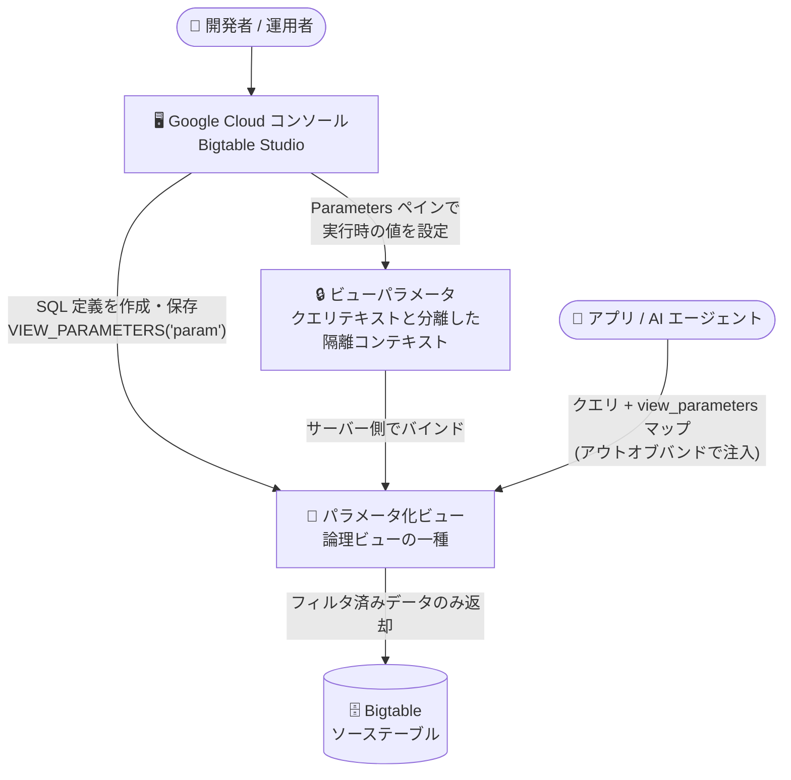

# Bigtable: パラメータ化ビューの Google Cloud コンソール対応 (GA)

**リリース日**: 2026-09-14

**サービス**: Bigtable

**機能**: パラメータ化ビュー (Parameterized Views) の Google Cloud コンソール / Bigtable Studio 対応

**ステータス**: GA (一般提供)

📊 [このアップデートのインフォグラフィックを見る](https://takech9203.github.io/google-cloud-news-summary/20260914-bigtable-parameterized-views-console-ga.html)

## 概要

Google Cloud コンソールを使用して、Bigtable インスタンスのパラメータ化ビュー (Parameterized Views) を作成・一覧表示・クエリできるようになりました。あわせて、Bigtable Studio 上でビューパラメータの設定とクエリの実行が可能になっています。この機能は一般提供 (GA) です。

パラメータ化ビューは、論理ビュー (Logical View) をベースに、アプリケーションコンテキスト (ユーザー ID やテナント ID など) に応じてデータ範囲を動的にフィルタリングできる仮想テーブルです。ビュー定義内の `VIEW_PARAMETERS()` 関数で参照されるパラメータ値は、SQL クエリテキストとは分離されたコンテキストとしてリクエストと一緒に渡され、サーバー側でバインドされます。このため、ユーザーや AI エージェントがクエリパラメータを操作できず、SQL インジェクションの緩和やユーザーレベルのデータスコーピングに有効です。パラメータ化ビュー自体は 2026 年 8 月 12 日に GA となっており、今回のアップデートでコンソール / Bigtable Studio からの操作が GA として利用可能になりました。

**アップデート前の課題**

- パラメータ化ビューの作成・管理は Google Cloud CLI (`gcloud bigtable logical-views` コマンド) を用いる必要があった
- パラメータ化ビューに対するクエリの動作確認には、ビューパラメータを含むリクエストをクライアントライブラリ経由で組み立てる必要があり、GUI で手軽に検証する手段がなかった

**アップデート後の改善**

- Google Cloud コンソールの Bigtable Studio のクエリエディタから、SQL を記述してパラメータ化ビューを作成・保存できるようになった
- Explorer ペインの「Logical Views」リストに、パラメータ化ビューが専用アイコン付きで一覧表示され、通常の論理ビューと区別できるようになった
- 「Query view」メニューからパラメータ入力用の Parameters ペインが開き、ビューパラメータの実行時の値を GUI で設定してクエリを実行できるようになった
- クエリエディタのタブごとにパラメータ値が保持され、セッション中に Bigtable Studio から離れて戻っても、開いていたタブ・クエリ・結果・設定済みパラメータが維持される

## アーキテクチャ図



Bigtable Studio からパラメータ化ビューの作成・パラメータ設定・クエリ実行が GUI で完結します。ビューパラメータはクエリテキストと分離された隔離コンテキストとしてサーバー側でバインドされるため、ユーザーや AI エージェントはフィルタ条件を改変できません。

## サービスアップデートの詳細

### 主要機能

1. **コンソール (Bigtable Studio) でのパラメータ化ビュー作成**
   - Bigtable Studio のクエリエディタで、`VIEW_PARAMETERS()` 関数を呼び出す SQL SELECT 文を記述し、「Save as logical view」で保存するとパラメータ化ビューとして作成される
   - 例: `SELECT * FROM TABLE_ID WHERE STARTS_WITH(_key, CAST(VIEW_PARAMETERS('PARAM_NAME') AS BYTES))`
   - SQL が有効な場合は「Valid」メッセージが表示され、「Format」で SQL スタイルへの整形も可能

2. **一覧表示とアイコンによる識別**
   - Explorer ペインの「Logical Views」を展開すると、パラメータ化ビューが専用のアイコン (variable_add) 付きで表示され、標準の論理ビューと区別できる
   - インスタンスに 10 個を超えるビューがある場合は「Show more」で次の 10 個を読み込み

3. **Parameters ペインによるクエリ実行**
   - ビューの「View actions」メニューから「Query view」をクリックすると、ビューパラメータ名があらかじめ入力された Parameters ペインが開く
   - 各パラメータの実行時の値 (Value) を入力して保存し、クエリエディタで「Run」を実行すると結果が表示される
   - 必須のビューパラメータを指定せずに実行した場合はエラーメッセージと「Edit parameters」ボタンが表示され、不足パラメータをその場で入力できる
   - パラメータ値はクエリエディタのタブごとに設定され、セッション中はタブ・クエリ・結果・パラメータが保持される

4. **構造化行キーのセグメントに対するフィルタ**
   - テーブルが構造化行キー (row key schema) を使用している場合、行キーの特定セグメント (例: `user_id`) に対してフィルタするパラメータ化ビューを Bigtable Studio から作成できる

## 技術仕様

### パラメータ化ビューの仕様

| 項目 | 詳細 |
|------|------|
| ベースとなるリソース | 論理ビュー (Logical View)。パラメータ化ビューは論理ビューからのみ作成可能で、既存の論理ビューを変更するのではなく新規作成する |
| パラメータ参照 | ビュー定義内で `VIEW_PARAMETERS('key')` 関数を使用。列修飾子のパラメータ化にも利用可能 |
| パラメータの型 | STRING 型のみサポート。別の型として扱う場合はビュー定義内でキャストする (例: `CAST(VIEW_PARAMETERS('param') AS INT64)`) |
| フェイルクローズ動作 | ビュー定義が参照するパラメータ値がリクエストの view_parameters マップに含まれない場合、クエリは即座に「missing parameter」エラーで失敗し、意図しないデータ露出を防止 |
| 標準クエリパラメータとの違い | `@param` 構文はビュー定義内では宣言不可。`VIEW_PARAMETERS('key')` は任意のクエリ・ビューコンテキストで呼び出し可能 |
| ビュー ID | 最大 128 文字。インスタンス内のテーブル ID・ビュー ID と重複不可 |
| セキュリティモデル | 論理ビューは定義者権限 (definer's rights) モデルで動作。ビューをクエリすると、実行ユーザーではなく定義ユーザーの権限で実行される |

### 必要なロール・権限

パラメータ化ビューの作成・管理には、インスタンスに対する Bigtable 管理者 (`roles/bigtable.admin`) ロール、または以下のインスタンスレベル権限が必要です。

| 操作 | 権限 |
|------|------|
| 作成 | `bigtable.logicalViews.create` |
| 更新 | `bigtable.logicalViews.update` |
| 削除 | `bigtable.logicalViews.delete` |
| 一覧表示 | `bigtable.logicalViews.list` |

また、パラメータ化ビューを作成するには、ソーステーブルに対する `bigtable.tables.readRows` 権限も必要です。

## 設定方法

### 前提条件

1. Bigtable インスタンスと、ビューのベースとなるソーステーブルが存在すること
2. 上記の必要なロール・権限が付与されていること
3. [パラメータ化ビューの概要](https://docs.cloud.google.com/bigtable/docs/parameterized-views-overview)を理解していること

### 手順

#### ステップ 1: コンソールでパラメータ化ビューを作成する

1. Google Cloud コンソールで Bigtable インスタンスの一覧を開き、インスタンスを選択
2. ナビゲーションペインで「Bigtable Studio」をクリック
3. 新しいタブを開き、「Editor」を選択
4. クエリエディタで `VIEW_PARAMETERS()` 関数を呼び出す SQL クエリを記述

```sql
SELECT * FROM TABLE_ID
WHERE STARTS_WITH(_key, CAST(VIEW_PARAMETERS('PARAM_NAME') AS BYTES))
```

5. 「Save」→「Save as logical view」を選択し、ビュー名を入力して保存

#### ステップ 2: コンソールでパラメータ化ビューをクエリする

1. Explorer ペインで「Logical Views」を展開
2. 対象のパラメータ化ビューの「View actions」メニューから「Query view」をクリック
3. Parameters ペインの「View parameters」で各パラメータの実行時の値を入力して保存 (値は文字列として渡す)
4. クエリエディタで「Run」をクリックして結果を確認

#### 参考: gcloud CLI での作成

```bash
gcloud bigtable logical-views create VIEW \
  --instance=INSTANCE \
  --query="SELECT * FROM TABLE_ID WHERE STARTS_WITH(_key, CAST(VIEW_PARAMETERS('PARAM_NAME') AS BYTES))"
```

削除保護を有効にする場合は `--deletion-protection` フラグを追加します。

## メリット

### ビジネス面

- **セキュリティ機能の導入障壁の低下**: SQL インジェクション緩和やテナント分離に有効なパラメータ化ビューを、CLI に不慣れなメンバーでも GUI から作成・検証でき、マルチテナントアプリケーションのセキュリティ強化を進めやすくなる
- **開発・検証サイクルの短縮**: ビュー定義の SQL 検証 (Valid 表示)、パラメータ値の設定、クエリ実行、結果確認までを Bigtable Studio 内で完結でき、動作確認のためのクライアントコード作成が不要になる

### 技術面

- **サーバーサイドのパラメータバインド**: パラメータ値はクエリ構造のパース後にサーバー側でバインドされるため、攻撃者が制御する値がクエリ構造を変更できず、SQL インジェクションを防止できる
- **フェイルクローズ設計**: 必須パラメータが未指定の場合はクエリが即座に失敗するため、設定ミスによる意図しないデータ露出を防げる
- **ユーザー管理の簡素化**: ユーザーごとに個別のデータベースロールを用意する代わりに、単一のロールとビューパラメータの組み合わせでユーザーレベルのデータスコーピングを実現できる

## デメリット・制約事項

### 制限事項

- パラメータ化ビューは論理ビューからのみ作成できる (既存の論理ビューを変更してパラメータ化することはできず、新規に作成する)
- ビューパラメータは STRING 型の値のみサポート。他の型として扱う場合はビュー定義内で `CAST()` する必要がある

### 考慮すべき点

- 論理ビューは定義者権限モデルで動作するため、最小権限の原則に従い、アプリケーションのサービスアカウントにはビューのみへのアクセス権を付与し、ベーステーブルへの権限は付与しない (必要に応じて IAM 拒否ポリシーで明示的に拒否する) ことが推奨される
- 信頼できないユーザーや LLM がパラメータ化ビューを参照する SQL を生成する場合は、多層防御として Model Armor や Agent Development Kit (ADK) の関数ツールによる事前定義クエリテンプレートなどの追加のセキュリティ対策を講じることが推奨される

## ユースケース

### ユースケース 1: マルチテナントアプリケーションのユーザーレベルデータスコーピング

**シナリオ**: 患者の医療記録 (コレステロール値など) を保存するヘルストラッキングアプリケーションで、各患者が自分のデータのみをクエリできるようにしたい。悪意のある、または挙動が不安定なエージェントが他の患者のレコードを取得しようとするリスクを防ぐ。

**実装例**:
```sql
CREATE VIEW patient_health_pv AS
(SELECT * FROM patient_health_records
 WHERE patient_id = CAST(VIEW_PARAMETERS('patient_id') AS BYTES))
```

クライアントは以下のようにビューをクエリし、`patient_id` は view_parameters マップとしてアウトオブバンドで渡します。

```sql
SELECT readings['value'], readings['date']
FROM patient_health_pv
WHERE readings['test_name'] = 'cholesterol'
```

**効果**: Bigtable が隔離されたパラメータマップから `patient_id` を自動的にバインドして適用するため、LLM やエンドユーザーはこのフィルタを変更・除去できず、データベースレベルで患者ごとの分離を強制できる。

### ユースケース 2: AI エージェント (ADK) からの安全なデータアクセス

**シナリオ**: 自然言語クエリを SQL に変換する AI エージェントアプリケーションで、ユーザー認証情報やテナント境界を LLM から隠蔽したまま Bigtable にクエリしたい。

**実装例**: ADK の `BigtableToolset` に `view_parameter_names=["user_id", "tenant_id"]` を指定すると、`execute_sql_parameterized` ツールが実行時に `ToolContext` からパラメータを自動抽出し、view_parameters としてクエリに注入する。

**効果**: セキュリティパラメータがアウトオブバンドで注入され、言語モデルによる操作から完全に隠蔽された状態で、認証済みユーザー・テナント境界内のデータのみを返せる。

### ユースケース 3: コンソールでのビュー定義の検証・トラブルシューティング

**シナリオ**: 運用担当者が本番前にパラメータ化ビューの定義とフィルタ動作を検証したい。

**効果**: Bigtable Studio の Parameters ペインでさまざまなパラメータ値を設定してクエリを実行し、フィルタ結果を GUI で即座に確認できる。タブごとにパラメータが保持されるため、複数の検証パターンを並行して試せる。

## 料金

このアップデート (コンソール対応) に固有の追加料金に関する記載はリリースノートおよびドキュメントにありません。Bigtable の料金体系については公式の料金ページを参照してください。

- [Bigtable の料金](https://cloud.google.com/bigtable/pricing)

## 関連サービス・機能

- **Bigtable 論理ビュー (Logical Views)**: パラメータ化ビューのベースとなる機能。作成・更新・削除・一覧表示の操作方法は論理ビューと共通
- **Bigtable Studio**: コンソール上のクエリエディタ。今回のアップデートでパラメータ化ビューの作成・パラメータ設定・クエリ実行に対応
- **Agent Development Kit (ADK)**: `BigtableToolset` と `ToolContext` により、エージェントアプリケーションでビューパラメータをアウトオブバンドで注入できる
- **Model Armor**: 信頼できないユーザーや LLM が SQL を生成する場合の多層防御として推奨されるセキュリティ製品
- **IAM (拒否ポリシー・IAM 条件)**: 定義者権限モデルのもとで最小権限を実現するため、`bigtable.logicalViews.readRows` 権限を特定ビューに限定する IAM 条件や、ベーステーブルへのアクセスを明示的に拒否する IAM 拒否ポリシーを利用
- **Cloud SQL for PostgreSQL のパラメータ化セキュアビュー**: PostgreSQL 向けに同様のコンセプト (アプリケーションレベルのセキュリティに基づく行アクセス制御) を提供する類似機能

## 参考リンク

- 📊 [インフォグラフィック](https://takech9203.github.io/google-cloud-news-summary/20260914-bigtable-parameterized-views-console-ga.html)
- [公式リリースノート](https://docs.cloud.google.com/release-notes#September_14_2026)
- [パラメータ化ビューの概要](https://docs.cloud.google.com/bigtable/docs/parameterized-views-overview)
- [パラメータ化ビューの作成と管理](https://docs.cloud.google.com/bigtable/docs/create-manage-parameterized-views)
- [エージェントアプリケーションでのパラメータ化ビューの使用](https://docs.cloud.google.com/bigtable/docs/use-parameterized-views)
- [料金ページ](https://cloud.google.com/bigtable/pricing)

## まとめ

Bigtable のパラメータ化ビューが Google Cloud コンソール / Bigtable Studio から作成・一覧表示・クエリできるようになり、SQL インジェクション緩和とテナント分離を担う重要なセキュリティ機能の導入・検証が GUI で完結するようになりました。マルチテナントアプリケーションや AI エージェントから Bigtable にアクセスしているチームは、まず Bigtable Studio でパラメータ化ビューを作成してフィルタ動作を検証し、定義者権限モデルを踏まえた IAM 設計 (ビューのみへの権限付与とベーステーブルへの拒否ポリシー) とあわせて本番導入を検討することを推奨します。

---

**タグ**: #Bigtable #ParameterizedViews #BigtableStudio #GA #セキュリティ #SQLインジェクション対策 #マルチテナント #NoSQL
