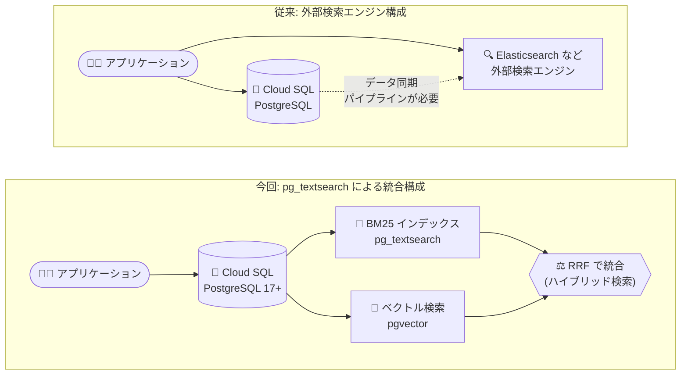

# Cloud SQL for PostgreSQL: pg_textsearch 拡張機能による BM25 全文検索

**リリース日**: 2026-09-14

**サービス**: Cloud SQL for PostgreSQL

**機能**: pg_textsearch 拡張機能 (BM25 スコアリングによる全文検索)

**ステータス**: Feature (一般提供)

📊 [このアップデートのインフォグラフィックを見る](https://takech9203.github.io/google-cloud-news-summary/20260914-cloud-sql-postgresql-pg-textsearch-bm25.html)

## 概要

Cloud SQL for PostgreSQL で `pg_textsearch` 拡張機能が利用可能になりました。この拡張機能は、業界標準の BM25 (Best Matching 25) スコアリングアルゴリズムを用いた全文検索を PostgreSQL 内で直接実行できるようにするもので、Timescale が開発するオープンソースプロジェクトとして GitHub で公開されています。

BM25 は、逆文書頻度 (IDF)、単語頻度の飽和 (term frequency saturation)、文書長の正規化 (document length normalization) を考慮した確率的ランキングアルゴリズムであり、PostgreSQL 組み込みの `ts_rank` 関数よりも関連性の高い検索結果を返すことができます。Elasticsearch などの外部検索エンジンで広く使われているアルゴリズムと同等の関連性スコアリングを、PostgreSQL の標準ストレージページ上で直接実現するため、外部エンジンの導入や二重クラスタの運用・データ同期が不要になります。

検索機能を持つ Web アプリケーションや SaaS を Cloud SQL 上で運用している開発者、および pgvector と組み合わせたハイブリッド検索 (キーワード検索 + セマンティック検索) で RAG などの AI アプリケーションを構築したいユーザーが主な対象です。利用には PostgreSQL 17 以降が必要で、PostgreSQL リリース R20260712.01_06 以降でサポートされます。

**アップデート前の課題**

- PostgreSQL 組み込みの全文検索 (`tsvector` / `ts_rank`) は IDF や文書長正規化を考慮しないため、関連性スコアリングの精度に限界があった
- BM25 相当の高精度な関連性ランキングが必要な場合、Elasticsearch や OpenSearch などの外部検索エンジンを別途構築し、データベースとの間でデータ同期パイプラインを維持する必要があった
- 検索エンジンとデータベースの二重クラスタ運用により、運用コストと整合性管理の負担が発生していた

**アップデート後の改善**

- Cloud SQL for PostgreSQL 内で BM25 スコアリングによる高精度な全文検索が `CREATE EXTENSION` だけで利用可能になった
- 外部検索エンジンの構築・データ同期が不要になり、PostgreSQL エコシステム内で完結する検索体験を構築できるようになった
- `<@>` 演算子による BM25 スコア計算を SQL クエリに直接組み込めるため、pgvector のベクトル検索と組み合わせた RRF (Reciprocal Rank Fusion) ベースのハイブリッド検索も単一のデータベースで実現できるようになった

## アーキテクチャ図



従来は BM25 相当の関連性スコアリングに外部検索エンジンとデータ同期が必要でしたが、pg_textsearch により Cloud SQL 単体で BM25 全文検索とベクトル検索を組み合わせたハイブリッド検索まで完結できます。

## サービスアップデートの詳細

### 主要機能

1. **BM25 スコアリングによる全文検索**
   - 業界標準の BM25 (Best Matching 25) アルゴリズムで文書の関連性をスコアリング
   - 逆文書頻度 (tf-idf)、単語頻度の飽和、文書長の正規化をサポートし、組み込みの `ts_rank` より高精度な結果を返す
   - `USING bm25` 構文で専用インデックスを作成し、`<@>` 演算子でクエリとの BM25 スコアを計算

2. **PostgreSQL ネイティブなストレージ統合**
   - PostgreSQL の標準ストレージページ上で直接動作するため、外部エンジンのインストールが不要
   - 二重クラスタの保守やデータ同期の考慮が不要で、トランザクションと一貫した検索が可能

3. **ベクトル検索とのハイブリッド検索**
   - `vector` 拡張機能 (pgvector) と組み合わせ、BM25 のキーワード検索とセマンティック (ベクトル) 検索を RRF で統合可能
   - `google_ml_integration` 拡張機能の埋め込み生成 (例: `gemini-embedding-001`) と連携した構成例が公式ドキュメントで提供されている

## 技術仕様

### 前提条件・要件

| 項目 | 詳細 |
|------|------|
| PostgreSQL バージョン | PostgreSQL 17 以降 |
| Cloud SQL リリース | PostgreSQL リリース R20260712.01_06 以降 |
| 必要なデータベースフラグ | `cloudsql.enable_pg_textsearch = on` (`shared_preload_libraries` に追加される) |
| 拡張機能の有効化 | `CREATE EXTENSION pg_textsearch;` (データベースごと) |
| 提供元 | Timescale によるオープンソースプロジェクト ([GitHub](https://github.com/timescale/pg_textsearch)) |

### 主なクエリ構文

| 要素 | 説明 |
|------|------|
| `USING bm25` | BM25 インデックスのアクセスメソッド。`WITH (text_config = 'english')` でテキスト検索設定を指定 |
| `<@>` 演算子 | テキスト列とクエリ文字列の BM25 スコアを計算。スコアは負の値で返り、関連性が高いほど小さい (`ASC` でソート) |

### 拡張機能の設定パラメータ

| パラメータ | 説明 | デフォルト |
|-----------|------|-----------|
| `pg_textsearch.bulk_load_threshold` | 自動スピルまでのトランザクションあたりの語数 (0 で無効) | 100,000 |
| `pg_textsearch.compress_segments` | 新規セグメントのポスティングブロックを圧縮 | on |
| `pg_textsearch.default_limit` | `LIMIT` 句がない場合にスコアリングする最大文書数 | 1,000 |
| `pg_textsearch.memtable_pages_threshold` | 自動スピルまでにチェーンされるページ数 (0 で無効) | 64 |
| `pg_textsearch.segments_per_level` | 自動コンパクションまでのレベルあたりのセグメント数 (2〜64) | 8 |

## 設定方法

### 前提条件

1. PostgreSQL 17 以降を実行する Cloud SQL for PostgreSQL インスタンス (リリース R20260712.01_06 以降)
2. データベースフラグを変更できる権限

### 手順

#### ステップ 1: データベースフラグの設定

```bash
gcloud sql instances patch INSTANCE_NAME \
  --database-flags=cloudsql.enable_pg_textsearch=on
```

`cloudsql.enable_pg_textsearch` フラグを有効にし、`pg_textsearch` を `shared_preload_libraries` に追加します。

#### ステップ 2: 拡張機能の作成

```sql
CREATE EXTENSION pg_textsearch;

-- バージョン確認
SELECT extversion FROM pg_extension WHERE extname = 'pg_textsearch';
```

対象のデータベースに接続し、拡張機能を作成します。

#### ステップ 3: BM25 インデックスの作成と検索

```sql
-- BM25 インデックスの作成
CREATE INDEX idx_docs_bm25
  ON documents
  USING bm25 (content)
  WITH (text_config = 'english');

-- BM25 スコアによる関連性検索 (スコアは負の値、ASC で関連度順)
SELECT doc_id, content, content <@> 'database system' AS score
FROM documents
ORDER BY content <@> 'database system' ASC
LIMIT 5;
```

`<@>` 演算子で BM25 スコアを計算し、昇順ソートで関連性の高い順に結果を取得します。

## メリット

### ビジネス面

- **インフラコストの削減**: Elasticsearch などの外部検索エンジンのクラスタ構築・運用が不要になり、検索基盤のコストと運用負荷を削減できる
- **開発スピードの向上**: 既存の Cloud SQL データに対して SQL だけで高精度な検索機能を追加でき、検索機能の実装リードタイムを短縮できる

### 技術面

- **高精度な関連性スコアリング**: tf-idf、単語頻度の飽和、文書長正規化を考慮する BM25 により、組み込みの `ts_rank` より関連性の高い結果を取得できる
- **データ整合性の簡素化**: データベースと検索インデックスが同一ストレージ上にあるため、同期遅延や整合性ずれの問題が発生しない
- **ハイブリッド検索への拡張性**: pgvector と組み合わせて、キーワード検索とセマンティック検索を RRF で統合した RAG 向け検索を単一 DB で構築できる

## デメリット・制約事項

### 制限事項

- PostgreSQL 17 以降のインスタンスでのみ利用可能 (それ以前のメジャーバージョンでは使用不可)
- PostgreSQL リリース R20260712.01_06 以降が必要 (古いメンテナンスバージョンのインスタンスは更新が必要)
- 利用にはデータベースフラグ `cloudsql.enable_pg_textsearch` の設定が必要

### 考慮すべき点

- `<@>` 演算子のスコアは負の値で返るため、関連度順のソートは `ASC` を使用する必要があり、直感と異なる点に注意
- `LIMIT` 句がないクエリでは `pg_textsearch.default_limit` (デフォルト 1,000 件) までしかスコアリングされないため、大量の結果が必要な場合はパラメータ調整を検討する
- 全文検索はキーワードの語形変化には対応するが、同義語や概念の一致は扱えないため、セマンティック検索が必要な場合はベクトル検索との併用を検討する

## ユースケース

### ユースケース 1: 外部検索エンジンの Cloud SQL への統合

**シナリオ**: EC サイトの商品検索に Elasticsearch を使用しているが、商品マスタ (Cloud SQL) との同期パイプラインの運用負荷が高い。BM25 相当の検索精度を維持したまま検索基盤を統合したい。

**実装例**:
```sql
CREATE INDEX idx_products_bm25
  ON products
  USING bm25 (description)
  WITH (text_config = 'english');

SELECT product_id, name, description <@> 'wireless noise cancelling headphones' AS score
FROM products
ORDER BY score ASC
LIMIT 20;
```

**効果**: 外部検索エンジンとデータ同期パイプラインを廃止し、検索精度を維持しながら運用コストを削減できる。

### ユースケース 2: RAG アプリケーション向けハイブリッド検索

**シナリオ**: 社内ドキュメント検索を行う RAG アプリケーションで、セマンティック検索 (pgvector) だけでは製品名や型番などの固有キーワードの一致精度が不足している。

**実装例**:
```sql
WITH vector_search AS (
  SELECT doc_id,
         RANK() OVER (ORDER BY text_embedding <=> google_ml.embedding('gemini-embedding-001', 'database')) AS rank
  FROM documents
  ORDER BY text_embedding <=> google_ml.embedding('gemini-embedding-001', 'database')
  LIMIT 10
),
text_search AS (
  SELECT doc_id,
         RANK() OVER (ORDER BY content <@> 'database' ASC) AS rank
  FROM documents
  ORDER BY content <@> 'database' ASC
  LIMIT 10
)
SELECT COALESCE(vector_search.doc_id, text_search.doc_id) AS doc_id,
       COALESCE(1.0 / (60 + vector_search.rank), 0.0)
     + COALESCE(1.0 / (60 + text_search.rank), 0.0) AS rrf_score
FROM vector_search
FULL OUTER JOIN text_search ON vector_search.doc_id = text_search.doc_id
ORDER BY rrf_score DESC
LIMIT 5;
```

**効果**: BM25 のキーワード一致精度とベクトル検索の意味理解を RRF で統合し、RAG の検索品質を単一のデータベースで向上できる。

## 料金

`pg_textsearch` 拡張機能自体の追加料金に関する記載はなく、通常の Cloud SQL for PostgreSQL のインスタンス料金 (vCPU、メモリ、ストレージ、ネットワーク) が適用されます。BM25 インデックスはインスタンスのストレージを消費するため、インデックスサイズに応じたストレージ料金が発生します。

詳細は [Cloud SQL 料金ページ](https://cloud.google.com/sql/pricing) を参照してください。

## 利用可能リージョン

リージョン固有の制限に関する記載はありません。PostgreSQL 17 以降かつ PostgreSQL リリース R20260712.01_06 以降のインスタンスで利用できます。

## 関連サービス・機能

- **AlloyDB for PostgreSQL**: 同じく `pg_textsearch` による BM25 インデックスをサポート (PostgreSQL 17/18、Preview)。より高い性能が必要な場合の移行先候補
- **pgvector (vector 拡張機能)**: ベクトル類似検索を提供。pg_textsearch と組み合わせたハイブリッド検索が可能
- **google_ml_integration 拡張機能**: Vertex AI の埋め込みモデル (`gemini-embedding-001` など) を SQL から呼び出してベクトル埋め込みを生成。ハイブリッド検索のベクトル側を担う
- **Vertex AI**: RAG アプリケーション構築時の埋め込み生成・LLM 推論基盤として連携

## 参考リンク

- 📊 [インフォグラフィック](https://takech9203.github.io/google-cloud-news-summary/20260914-cloud-sql-postgresql-pg-textsearch-bm25.html)
- [公式リリースノート](https://docs.cloud.google.com/release-notes#September_14_2026)
- [ドキュメント: Full-text search using pg_textsearch](https://docs.cloud.google.com/sql/docs/postgres/pg-textsearch)
- [Cloud SQL for PostgreSQL 拡張機能一覧](https://docs.cloud.google.com/sql/docs/postgres/extensions)
- [pg_textsearch (GitHub)](https://github.com/timescale/pg_textsearch)
- [料金ページ](https://cloud.google.com/sql/pricing)

## まとめ

pg_textsearch の登場により、Cloud SQL for PostgreSQL 単体で Elasticsearch 級の BM25 関連性スコアリングを備えた全文検索が実現でき、外部検索エンジンの運用とデータ同期から解放されます。PostgreSQL 17 以降のインスタンスを利用中であれば、`cloudsql.enable_pg_textsearch` フラグを有効にして既存の検索機能や RAG アプリケーションでのハイブリッド検索を評価することを推奨します。PostgreSQL 16 以前のインスタンスでは、メジャーバージョンアップグレードの計画に本機能を組み込む価値があります。

---

**タグ**: `Cloud SQL` `PostgreSQL` `pg_textsearch` `BM25` `全文検索` `ハイブリッド検索` `pgvector` `RAG`
