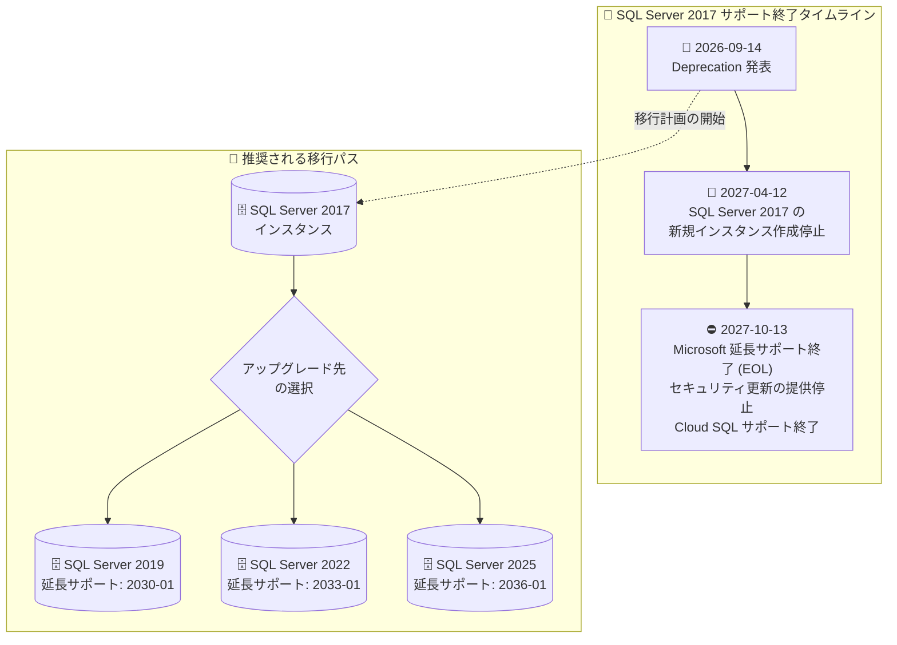

# Cloud SQL for SQL Server: SQL Server 2017 サポート終了 (Deprecation) スケジュール発表

**リリース日**: 2026-09-14

**サービス**: Cloud SQL for SQL Server

**機能**: SQL Server 2017 の新規インスタンス作成停止とサポート終了

**ステータス**: Deprecated

📊 [このアップデートのインフォグラフィックを見る](https://takech9203.github.io/google-cloud-news-summary/20260914-cloud-sql-sql-server-2017-deprecation.html)

## 概要

Google Cloud は、Cloud SQL for SQL Server における SQL Server 2017 のサポート終了スケジュールを発表しました。**2027 年 4 月 12 日以降、Cloud SQL for SQL Server 2017 の新規インスタンスは作成できなくなります**。さらに、**2027 年 10 月 13 日に SQL Server 2017 は Microsoft の延長サポート終了 (EOL) を迎え、Microsoft はセキュリティ更新プログラムの提供を停止します**。Cloud SQL for SQL Server もこの日以降、SQL Server 2017 のサポートを終了します。

SQL Server 2017 は 2022 年 10 月 11 日にすでに Microsoft のメインストリームサポートが終了しており、現在は延長サポート期間中です。今回の発表は、その延長サポート終了 (2027 年 10 月 13 日) に合わせて Cloud SQL 側のサポートも終了することを、約 1 年前に事前告知するものです。

SQL Server 2017 (Standard / Enterprise / Express / Web の全エディション) のインスタンスを運用しているユーザーは、猶予期間のうちに SQL Server 2019 / 2022 / 2025 など、サポート期間が残っているメジャーバージョンへのアップグレード計画を立てる必要があります。Cloud SQL はインプレースのメジャーバージョンアップグレード機能を提供しており、アップグレード時にエディションの変更も同時に行えます。

**アップデート前の課題**

- SQL Server 2017 は 2022 年 10 月にメインストリームサポートが終了済みで、新機能の追加は行われず延長サポート (セキュリティ更新のみ) に依存する状態だった
- Cloud SQL 上の SQL Server 2017 インスタンスをいつまで利用し続けられるか、明確な期限が示されていなかった
- 移行計画を立てるためのマイルストーン (新規作成停止日、サポート終了日) が未確定だった

**アップデート後の改善**

- 新規インスタンス作成停止日 (2027 年 4 月 12 日) とサポート終了日 (2027 年 10 月 13 日) が明確になり、移行計画を具体的に立てられるようになった
- 発表からサポート終了まで約 13 か月の猶予があり、検証・移行の時間を確保できる
- Cloud SQL for SQL Server は MySQL / PostgreSQL と異なり、EOL バージョンに対する延長サポート料金を課金しないため、期限までは追加コストなしで移行準備ができる

## アーキテクチャ図



SQL Server 2017 の Deprecation タイムラインと、インプレースメジャーバージョンアップグレードによる推奨移行パスを示しています。サポート期間の長さを考慮すると、SQL Server 2022 以降への移行が推奨されます。

## サービスアップデートの詳細

### 主要なスケジュール

1. **2027 年 4 月 12 日: 新規インスタンス作成の停止**
   - Cloud SQL for SQL Server 2017 (全エディション) の新規インスタンスを作成できなくなる
   - 既存インスタンスはこの時点では引き続き稼働可能

2. **2027 年 10 月 13 日: SQL Server 2017 の EOL**
   - Microsoft の延長サポートが終了し、セキュリティ更新プログラムの提供が停止される
   - Cloud SQL for SQL Server もこの日以降 SQL Server 2017 のサポートを終了する

3. **対象エディション**
   - SQL Server 2017 Standard / Enterprise / Express / Web (いずれも Cloud SQL でのサポート対象バージョンは CU31)

### Cloud SQL for SQL Server のバージョンサポート状況

Cloud SQL for SQL Server のサポート期限は [Microsoft SQL Server サポートライフサイクル](https://learn.microsoft.com/en-us/lifecycle/products/) に準拠します。

| メジャーバージョン | Cloud SQL サポート開始 | メインストリームサポート終了 | 延長サポート終了 |
|------|------|------|------|
| SQL Server 2025 | 2025 年 11 月 18 日 | 2031 年 1 月 6 日 | 2036 年 1 月 6 日 |
| SQL Server 2022 | 2023 年 6 月 26 日 | 2028 年 1 月 11 日 | 2033 年 1 月 11 日 |
| SQL Server 2019 | 2021 年 6 月 24 日 | 2025 年 2 月 28 日 (終了済) | 2030 年 1 月 8 日 |
| **SQL Server 2017** | 2020 年 2 月 19 日 | **2022 年 10 月 11 日 (終了済)** | **2027 年 10 月 13 日** |

## 技術仕様

### 移行方法: インプレースメジャーバージョンアップグレード

Cloud SQL for SQL Server はインプレースのメジャーバージョンアップグレードをサポートしています。アップグレード時の主な挙動は以下の通りです。

| 項目 | 詳細 |
|------|------|
| 対象操作 | 単一インスタンス、またはプライマリとすべてのレプリカ (カスケード / クロスリージョン含む) の一括アップグレード |
| 事前チェック | アップグレード前に構成の互換性チェックが実行され、非互換があればエラーメッセージで通知 |
| 自動バックアップ | アップグレード直前に「pre-upgrade backup」、完了直後に「post-upgrade backup」がオンデマンドバックアップとして自動作成される |
| ダウンタイム | アップグレード中はインスタンスが利用不可 (数分程度、環境により変動) |
| エディション変更 | アップグレードと同時にエディション変更も可能 (例: 2017 Standard → 2022 Enterprise)。ライセンス料金の変更に注意 |
| 必要ロール | Cloud SQL Owner または Cloud SQL Admin |
| ロールバック | pre-upgrade backup を旧バージョンの新規リカバリインスタンスに復元することで、以前のバージョンに戻せる |

## 設定方法

### 前提条件

1. Cloud SQL Owner または Cloud SQL Admin のロールを保有していること
2. アップグレード先バージョンの[廃止された機能](https://learn.microsoft.com/en-us/sql/database-engine/discontinued-database-engine-functionality-in-sql-server)や破壊的変更を確認し、アプリケーション・スキーマ・データベース設定の非互換に対処済みであること
3. 十分なディスク空き容量があること (自動ストレージ増加の有効化を推奨)
4. 本番環境の前に、[クローンインスタンス](https://docs.cloud.google.com/sql/docs/sqlserver/clone-instance)でアップグレードのドライランを実施すること

### 手順

#### ステップ 1: アップグレード可能なバージョンの確認

```bash
gcloud sql instances describe INSTANCE_NAME
```

出力の `upgradableDatabaseVersions` セクションで、対象インスタンスがアップグレード可能なバージョン (`majorVersion`、`name`、`displayName`) を確認します。

#### ステップ 2: メジャーバージョンアップグレードの実行

```bash
gcloud sql instances patch INSTANCE_NAME \
  --database-version=SQLSERVER_2022_STANDARD
```

`--database-version` にはステップ 1 で確認した対象バージョンの enum (例: `SQLSERVER_2022_STANDARD`、`SQLSERVER_2025_STANDARD`) を指定します。アップグレードには数分かかります。

#### ステップ 3: アップグレード状況の確認

```bash
# オペレーション名の取得
gcloud sql operations list --instance=INSTANCE_NAME

# ステータスの監視
gcloud sql operations describe OPERATION
```

アップグレード完了後、インスタンスの概要ページまたは `gcloud sql instances describe` でバージョンが更新されていることを確認します。

## メリット

### ビジネス面

- **計画的な移行が可能**: 新規作成停止日と EOL 日が約 1 年前に明示されたことで、予算確保・検証・移行のスケジュールを計画的に立てられる
- **追加コストなしの猶予期間**: Cloud SQL for SQL Server は MySQL / PostgreSQL と異なり延長サポート料金を課金しないため、期限までの移行準備に追加費用が発生しない
- **セキュリティリスクの回避**: EOL 前に新バージョンへ移行することで、セキュリティ更新が提供されない状態での運用リスクを回避できる

### 技術面

- **インプレースアップグレードによる移行負荷の軽減**: データ移行用の新環境構築なしに、既存インスタンス上でバージョンアップが完結する
- **自動バックアップによる安全性**: pre/post-upgrade backup が自動作成され、問題発生時は旧バージョンへの復元が可能
- **新バージョンの機能活用**: SQL Server 2019 以降の Intelligent Query Processing、2022 以降のクエリ最適化強化など、新機能・性能改善を利用できる

## デメリット・制約事項

### 制限事項

- 2027 年 4 月 12 日以降、SQL Server 2017 の新規インスタンス作成は不可 (バックアップからの同バージョン復元による切り戻し戦略にも影響し得る)
- 2027 年 10 月 13 日以降、SQL Server 2017 はセキュリティ更新が提供されず、Cloud SQL のサポート対象外となる
- インプレースアップグレード中はインスタンスが利用不可となる (ダウンタイムが発生)

### 考慮すべき点

- 新しいメジャーバージョンには破壊的変更や廃止機能が含まれるため、アプリケーションコード・スキーマ・データベースフラグの互換性検証が必須
- SQL Server 2019 はすでにメインストリームサポートが終了 (2025 年 2 月) しているため、長期運用を見据える場合は SQL Server 2022 / 2025 への移行が望ましい
- エディションを変更する場合はライセンス料金が変わるため、[Cloud SQL のライセンス料金](https://cloud.google.com/sql/pricing#sql-licensing)を事前に確認する
- クロスリージョンレプリカやカスケードレプリカを含む構成では、レプリカを含めたアップグレード計画が必要

## ユースケース

### ユースケース 1: SQL Server 2017 Standard から 2022 Standard へのインプレースアップグレード

**シナリオ**: 社内基幹システムのバックエンドとして SQL Server 2017 Standard の Cloud SQL インスタンスを運用中。EOL 前に、延長サポートが 2033 年まで続く SQL Server 2022 へ移行したい。

**実装例**:
```bash
# 1. クローンを作成してドライラン検証
gcloud sql instances clone prod-sqlserver-2017 test-upgrade-clone

# 2. クローンでアップグレードを検証
gcloud sql instances patch test-upgrade-clone \
  --database-version=SQLSERVER_2022_STANDARD

# 3. アプリケーション動作確認後、本番インスタンスをアップグレード
gcloud sql instances patch prod-sqlserver-2017 \
  --database-version=SQLSERVER_2022_STANDARD
```

**効果**: 新環境の構築やデータ移行作業なしで最小限のダウンタイムでバージョンアップが完了し、2033 年 1 月まで延長サポートが確保される。

### ユースケース 2: アップグレードと同時のエディション変更

**シナリオ**: SQL Server 2017 Standard で運用してきたが、可用性要件の高まりから、アップグレードを機に Enterprise エディションの機能を利用したい。

**効果**: インプレースアップグレードでは 2017 Standard から 2022 / 2025 Enterprise への移行のように、バージョンとエディションを同時に変更できる。移行作業を 1 回にまとめられるため、ダウンタイムと作業コストを削減できる。

## 料金

今回の Deprecation 自体による追加料金はありません。料金面のポイントは以下の通りです。

- Cloud SQL for SQL Server では、MySQL / PostgreSQL と異なり、**EOL バージョンに対する延長サポート料金は課金されない**
- SQL Server のライセンス料金はエディション (Express / Web / Standard / Enterprise) とコア数に応じて課金されるため、アップグレード時にエディションを変更する場合は料金が変動する
- 詳細は [Cloud SQL の料金ページ](https://cloud.google.com/sql/pricing#sql-licensing)を参照

## 関連サービス・機能

- **Database Migration Service (DMS)**: インプレースアップグレードではなく、新規インスタンスへの移行・他エンジンへの移行を行う場合の選択肢
- **Cloud SQL バックアップ / クローン**: アップグレードのドライラン検証 (クローン) と、pre-upgrade backup によるロールバックに利用
- **Cloud Logging**: アップグレード失敗時のエラーログ (`cloudsql.googleapis.com/sqlserver.err`) の確認に利用
- **Cloud Monitoring**: アップグレード前後のパフォーマンス比較・監視に利用

## 参考リンク

- 📊 [インフォグラフィック](https://takech9203.github.io/google-cloud-news-summary/20260914-cloud-sql-sql-server-2017-deprecation.html)
- [公式リリースノート](https://docs.cloud.google.com/release-notes#September_14_2026)
- [Cloud SQL for SQL Server: データベースバージョンとバージョンポリシー](https://docs.cloud.google.com/sql/docs/sqlserver/db-versions)
- [Microsoft SQL Server End of Support Overview](https://learn.microsoft.com/en-us/sql/sql-server/end-of-support/sql-server-end-of-support-overview?view=sql-server-ver17#understand-the-sql-server-lifecycle)
- [メジャーバージョンのインプレースアップグレード](https://docs.cloud.google.com/sql/docs/sqlserver/upgrade-major-db-version-inplace)
- [料金ページ](https://cloud.google.com/sql/pricing)

## まとめ

Cloud SQL for SQL Server 2017 は 2027 年 4 月 12 日に新規インスタンス作成が停止され、2027 年 10 月 13 日の Microsoft 延長サポート終了をもって Cloud SQL でのサポートも終了します。SQL Server 2017 を運用中のユーザーは、クローンインスタンスでのドライラン検証を含めた移行計画を早期に開始し、延長サポート期間が長い SQL Server 2022 / 2025 へのインプレースアップグレードを EOL 前に完了させることを推奨します。

---

**タグ**: #CloudSQL #SQLServer #Deprecation #EOL #データベース #メジャーバージョンアップグレード
