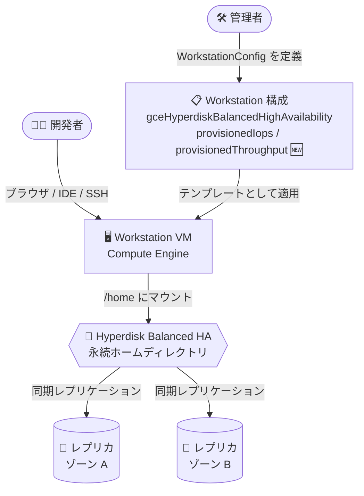

# Cloud Workstations: Hyperdisk Balanced High Availability ディスクの IOPS/スループットのカスタマイズ対応 (Preview)

**リリース日**: 2026-09-14

**サービス**: Cloud Workstations

**機能**: Hyperdisk Balanced High Availability ディスクのプロビジョンド IOPS / スループットのカスタマイズ

**ステータス**: Preview

📊 [このアップデートのインフォグラフィックを見る](https://takech9203.github.io/google-cloud-news-summary/20260914-cloud-workstations-hyperdisk-balanced-ha-provisioning.html)

## 概要

Cloud Workstations において、永続ホームディレクトリのバックエンドとして使用する Hyperdisk Balanced High Availability ディスクのプロビジョンド IOPS とスループットをカスタマイズできるようになりました。本機能は Preview として提供されます。

Hyperdisk Balanced High Availability は、同一リージョン内の 2 つのゾーン間でデータを同期レプリケーションする高可用性ブロックストレージです。今回のアップデートにより、Workstation 構成 (WorkstationConfig) の `GceHyperdiskBalancedHighAvailability` オブジェクトに `provisionedIops` および `provisionedThroughput` フィールドが追加され、ワークロードの I/O 要件に合わせたディスク性能の指定が可能になりました。

大規模なモノレポのビルド、依存関係の解決、コンテナイメージ操作など、ディスク I/O が開発体験のボトルネックになりやすいチームにとって、可用性と性能の両方を要件に応じて調整できる選択肢が広がるアップデートです。

**アップデート前の課題**

- Cloud Workstations で Hyperdisk Balanced High Availability を使用する場合、IOPS とスループットを Workstation 構成から指定できず、ディスクサイズに基づくデフォルト値 (Compute Engine の既定式による割り当て) で動作していた
- I/O 集約的な開発ワークロード (大規模ビルド、`npm install` / `pip install` などの大量の小ファイル I/O) に対して、ディスク性能を引き上げる手段が Workstation 構成レベルで提供されていなかった
- 性能を上げるためにディスクサイズを必要以上に大きくするなど、間接的な調整に頼る必要があった

**アップデート後の改善**

- Workstation 構成の `gceHyperdiskBalancedHighAvailability` に `provisionedIops` (3,000〜100,000) と `provisionedThroughput` (最大 2,400 MB/s) を指定できるようになった
- ディスクサイズとは独立して性能をプロビジョニングできるため、容量要件と性能要件を分離して最適化できるようになった
- 高可用性 (2 ゾーン同期レプリケーション) を維持したまま、チームの I/O 要件に合わせた開発環境のチューニングが可能になった

## アーキテクチャ図



Workstation 構成で新たに指定できる `provisionedIops` / `provisionedThroughput` が、2 ゾーンに同期レプリケーションされる Hyperdisk Balanced High Availability の永続ホームディレクトリに適用される構成を示しています。

## サービスアップデートの詳細

### 主要機能

1. **プロビジョンド IOPS のカスタマイズ (`provisionedIops`)**
   - ディスクが処理できる 1 秒あたりの I/O オペレーション数を指定
   - 指定可能な値は 3,000〜100,000 IOPS (Workstations v1beta API リファレンスより)
   - 省略時は Compute Engine のデフォルト値 (ディスクサイズに基づく) が適用される

2. **プロビジョンド スループットのカスタマイズ (`provisionedThroughput`)**
   - ディスクが処理できる 1 秒あたりのスループット (MB/s) を指定
   - 指定可能な値は最大 2,400 MB/s (Workstations v1beta API リファレンスより)
   - Hyperdisk の仕様上、設定可能なスループット範囲はプロビジョニングした IOPS 値に依存する

3. **高可用性との両立**
   - Hyperdisk Balanced High Availability はリージョン内 2 ゾーンへの同期レプリケーションを提供
   - ゾーン障害時にもホームディレクトリのデータを保護しつつ、性能要件を個別に設定可能

## 技術仕様

### 新規フィールド (v1beta API)

| フィールド | 型 | 説明 |
|------|------|------|
| `provisionedIops` | string (int64) | Optional。ディスクにプロビジョニングする IOPS。3,000〜100,000 の範囲で指定 |
| `provisionedThroughput` | string (int64) | Optional。ディスクにプロビジョニングするスループット (MB/s)。最大 2,400 |

### Hyperdisk Balanced High Availability の主な性能仕様 (Compute Engine)

| 項目 | 詳細 |
|------|------|
| サイズ | 4 GiB〜64 TiB (Workstations で指定できる `sizeGb` は 10 / 50 / 100 / 200 / 500 / 1000、デフォルト 200) |
| IOPS | 3,000〜100,000 IOPS (最大値はディスクサイズに依存: 6〜200 GiB は MIN(500 × サイズ, 100,000)) |
| スループット | 140〜2,400 MiB/s (設定可能な範囲は IOPS 値に依存: 最小 MAX(140, IOPS/256)、最大 MIN(2,400, IOPS/4)) |
| ベースライン性能 | 最初の 3,000 IOPS と 140 MiB/s は無料。それを超えるプロビジョニング分が課金対象 |
| 性能変更の頻度 | プロビジョンド性能の変更は 4 時間ごとに 1 回まで |
| 可用性 | リージョン内 2 ゾーンへの同期レプリケーション |

### 設定例 (WorkstationConfig の JSON)

```json
{
  "persistentDirectories": [
    {
      "mountPath": "/home",
      "gceHyperdiskBalancedHighAvailability": {
        "sizeGb": 200,
        "reclaimPolicy": "DELETE",
        "provisionedIops": "10000",
        "provisionedThroughput": "500"
      }
    }
  ]
}
```

## 設定方法

### 前提条件

1. Cloud Workstations API が有効化された Google Cloud プロジェクト
2. Workstation クラスタが作成済みであること
3. 本機能は Preview のため、v1beta API を使用すること

### 手順

#### ステップ 1: Workstation 構成の作成 (v1beta REST API)

```bash
curl -X POST \
  -H "Authorization: Bearer $(gcloud auth print-access-token)" \
  -H "Content-Type: application/json" \
  "https://workstations.googleapis.com/v1beta/projects/PROJECT_ID/locations/REGION/workstationClusters/CLUSTER_NAME/workstationConfigs?workstationConfigId=CONFIG_NAME" \
  -d '{
    "host": {
      "gceInstance": {
        "machineType": "e2-standard-8"
      }
    },
    "persistentDirectories": [
      {
        "mountPath": "/home",
        "gceHyperdiskBalancedHighAvailability": {
          "sizeGb": 200,
          "provisionedIops": "10000",
          "provisionedThroughput": "500"
        }
      }
    ]
  }'
```

Hyperdisk Balanced High Availability を永続ホームディレクトリとして指定し、IOPS とスループットをカスタマイズした Workstation 構成を作成します。

#### ステップ 2: Workstation の作成と起動

```bash
gcloud workstations create WORKSTATION_NAME \
  --cluster=CLUSTER_NAME \
  --config=CONFIG_NAME \
  --region=REGION
```

作成した構成をもとに Workstation を作成すると、指定した性能でプロビジョニングされたディスクがホームディレクトリとしてマウントされます。

## メリット

### ビジネス面

- **開発者の生産性向上**: ビルドや依存関係インストールなど I/O バウンドな作業の待ち時間を短縮し、開発サイクルを高速化できる
- **コスト最適化**: 性能目的でディスクサイズを過剰に大きくする必要がなくなり、容量と性能を個別に最適化できる

### 技術面

- **容量と性能の分離**: Hyperdisk のアーキテクチャにより、ディスクサイズと独立して IOPS / スループットを設定可能
- **高可用性との両立**: 2 ゾーン同期レプリケーションによるデータ保護を維持したまま性能をチューニングできる
- **構成のテンプレート化**: Workstation 構成として定義するため、チーム全体に一貫した性能設定を再現性をもって適用できる

## デメリット・制約事項

### 制限事項

- 本機能は Preview であり、SLA の対象外。将来仕様が変更される可能性がある
- 設定には v1beta API の使用が必要
- Hyperdisk の仕様上、設定可能なスループット範囲はプロビジョニングした IOPS 値に依存する (最小 MAX(140, IOPS/256) MiB/s、最大 MIN(2,400, IOPS/4) MiB/s)
- プロビジョンド性能の変更は 4 時間ごとに 1 回までという Hyperdisk 側の制約がある

### 考慮すべき点

- ベースライン (3,000 IOPS / 140 MiB/s) を超えてプロビジョニングした性能は課金対象となるため、実際の I/O プロファイルを確認してから設定するのが望ましい
- ディスク性能は接続先インスタンスのマシンタイプの性能上限を超えられないため、Workstation の `machineType` とのバランスを考慮する必要がある
- Workstation を停止していてもディスクのプロビジョニング分 (容量・IOPS・スループット) は課金が継続する

## ユースケース

### ユースケース 1: 大規模モノレポを扱う開発チームのビルド高速化

**シナリオ**: 数十 GB 規模のモノレポを扱うチームで、ワークステーション上でのフルビルドやインクリメンタルビルドのディスク I/O がボトルネックになっている。

**実装例**:
```json
{
  "gceHyperdiskBalancedHighAvailability": {
    "sizeGb": 500,
    "provisionedIops": "20000",
    "provisionedThroughput": "1000"
  }
}
```

**効果**: デフォルト性能に対して IOPS / スループットを引き上げることで、ソースツリーのスキャンやビルド成果物の書き込みを高速化し、ビルド待ち時間を削減する。

### ユースケース 2: 高可用性が求められる規制業界の開発環境

**シナリオ**: 金融など規制の厳しい業界で、開発環境のホームディレクトリにもゾーン障害耐性が求められ、かつコンテナイメージのビルドなど一定の I/O 性能も必要。

**効果**: Hyperdisk Balanced High Availability の 2 ゾーン同期レプリケーションでデータを保護しつつ、必要な性能だけをプロビジョニングすることで、可用性要件と性能要件・コストのバランスを取れる。

## 料金

Cloud Workstations の料金は、管理手数料に加えて、Workstation が使用する Compute Engine リソース (VM、ディスクなど) の料金で構成されます。

Hyperdisk Balanced High Availability は、プロビジョニングした容量・IOPS・スループットに対して課金されます。最初の 3,000 IOPS と 140 MiB/s はベースライン性能として無料で、それを超えてプロビジョニングした分が課金対象です (例: 5,000 IOPS をプロビジョニングした場合、2,000 IOPS 分が課金される)。ディスクは Workstation が停止中でも課金が継続します。

最新の単価は以下の公式料金ページを参照してください。

- [Cloud Workstations の料金](https://cloud.google.com/workstations/pricing)
- [ディスクの料金 (Compute Engine)](https://cloud.google.com/compute/disks-image-pricing#disk)

## 利用可能リージョン

Hyperdisk Balanced High Availability は Compute Engine としてはすべてのリージョンで利用可能です (AI ゾーンを除く)。Cloud Workstations 自体の提供リージョンは [Cloud Workstations のロケーション](https://cloud.google.com/workstations/docs/locations) を参照してください。

## 関連サービス・機能

- **Compute Engine (Hyperdisk)**: 本機能のバックエンドとなるブロックストレージ。IOPS / スループットの制限値や課金体系は Compute Engine 側の仕様に準拠する
- **Cloud Workstations の永続ディレクトリ**: 従来からの `gcePd` (Persistent Disk) や `gceRegionalPersistentDisk` に加え、Hyperdisk Balanced High Availability も永続ホームディレクトリの選択肢となる
- **IAM (Identity and Access Management)**: Workstation 構成の共有・アクセス制御に使用し、チーム単位で性能設定を統一的に配布できる

## 参考リンク

- 📊 [インフォグラフィック](https://takech9203.github.io/google-cloud-news-summary/20260914-cloud-workstations-hyperdisk-balanced-ha-provisioning.html)
- [公式リリースノート](https://docs.cloud.google.com/release-notes#September_14_2026)
- [GceHyperdiskBalancedHighAvailability (v1beta API リファレンス)](https://docs.cloud.google.com/workstations/docs/reference/rest/v1beta/projects.locations.workstationClusters.workstationConfigs#gcehyperdiskbalancedhighavailability)
- [Hyperdisk Balanced High Availability について](https://docs.cloud.google.com/compute/docs/disks/hd-types/hyperdisk-balanced-ha)
- [Cloud Workstations の概要](https://docs.cloud.google.com/workstations/docs/overview)
- [料金ページ (Cloud Workstations)](https://cloud.google.com/workstations/pricing)

## まとめ

Cloud Workstations の永続ホームディレクトリに使用する Hyperdisk Balanced High Availability ディスクで、IOPS とスループットを個別にプロビジョニングできるようになりました (Preview)。I/O 性能がボトルネックになっている開発チームや、高可用性と性能の両立が必要な環境では、v1beta API で `provisionedIops` / `provisionedThroughput` を試験的に設定し、ビルド時間やコストへの影響を検証することを推奨します。

---

**タグ**: Cloud Workstations, Hyperdisk, High Availability, IOPS, スループット, Preview, 開発環境, Compute Engine
