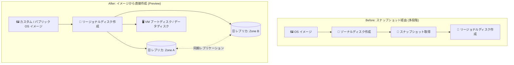

# Compute Engine: OS イメージからのリージョナルディスク作成 (Preview)

**リリース日**: 2026-09-14

**サービス**: Compute Engine

**機能**: カスタム / パブリック OS イメージからのリージョナルディスク作成

**ステータス**: Preview

📊 [このアップデートのインフォグラフィックを見る](https://takech9203.github.io/google-cloud-news-summary/20260914-compute-engine-regional-disks-from-os-images.html)

## 概要

Compute Engine で、カスタム OS イメージおよびパブリック OS イメージから直接リージョナルディスクを作成できるようになりました (Preview)。対象となるディスクタイプには、Hyperdisk Balanced High Availability (HDB-HA) ボリュームと、リージョナル Persistent Disk (pd-standard / pd-balanced / pd-ssd) が含まれます。

リージョナルディスクは同一リージョン内の 2 つのゾーン間でデータを同期レプリケーションするブロックストレージであり、ゾーン障害に対する高可用性 (HA) を実現します。これまでリージョナルディスクは OS イメージから直接作成できず、スナップショット経由の多段階の手順が必要でした。今回のアップデートにより、HA 構成のブートディスクを OS イメージから 1 ステップでプロビジョニングできるようになり、ステートフルな HA ワークロードの構築・運用が大幅に簡素化されます。

ゾーン障害耐性が求められるデータベースや、Microsoft SQL Server Failover Cluster Instances (FCI) などの HA ワークロードを Compute Engine 上で運用するインフラ管理者・Solutions Architect にとって重要なアップデートです。

**アップデート前の課題**

- リージョナル Persistent Disk は OS イメージから (また、OS イメージから作成されたディスクのクローンからも) 作成できないという制限があった
- リージョナルブートディスクを用意するには、「イメージからゾーナルディスクを作成 → スナップショットを取得 → スナップショットからリージョナルディスクを作成」という多段階の手順が必要だった
- ブートディスクを HA 化する際の初期プロビジョニングに手間と時間がかかり、Terraform などの IaC でもワークフローが複雑になっていた

**アップデート後の改善**

- カスタムイメージ・パブリックイメージから直接リージョナルディスク (HDB-HA を含む) を作成できるようになった
- イメージファミリーを指定して、常に最新バージョンのイメージからリージョナルディスクを作成することも可能になった
- 中間スナップショットの作成・管理が不要になり、リージョナルブートディスクのプロビジョニングが 1 ステップに簡素化された

## アーキテクチャ図



従来はスナップショットを経由する 3 ステップの手順が必要でしたが、今回のアップデートにより OS イメージから 2 ゾーンにレプリケートされたリージョナルディスクを直接作成し、ブートディスクやデータディスクとして利用できます。

## サービスアップデートの詳細

### 主要機能

1. **OS イメージからのリージョナルディスク直接作成 (Preview)**
   - カスタムイメージおよびパブリックイメージ (例: `debian-13-trixie-v20260902`) を指定してリージョナルディスクを作成可能
   - `gcloud beta compute disks create` の `--image` フラグ、REST API (beta エンドポイント) の `sourceImage` フィールド、Terraform の `google_compute_region_disk` リソースの `image` 引数で指定

2. **イメージファミリーの指定に対応**
   - `--image-family` フラグでイメージファミリー (例: `debian-13`) を指定すると、そのファミリーの最新バージョンのイメージからディスクを作成
   - ゴールデンイメージ運用において、常に最新イメージからの HA ディスク作成を自動化できる

3. **Hyperdisk Balanced High Availability への対応**
   - ディスクタイプに `hyperdisk-balanced-high-availability` を指定可能
   - HDB-HA は 1 ボリュームあたり最大 100,000 IOPS / 2,400 MiB/s のスループットを指定でき、高性能な HA ワークロードに対応

4. **リージョナルブートディスクのソース拡充**
   - リージョナルブートディスクの作成ソースとして、従来の標準スナップショット・インスタントスナップショットに加え、イメージ (Preview) が選択可能になった

## 技術仕様

### 対応ディスクタイプとサイズ

| ディスクタイプ | 参照名 | 最小サイズ | 最大サイズ | デフォルトサイズ |
|------|------|------|------|------|
| Hyperdisk Balanced High Availability | `hyperdisk-balanced-high-availability` | 4 GiB | 64 TiB | 100 GiB |
| Balanced Persistent Disk | `pd-balanced` | 10 GiB | 64 TiB | 100 GiB |
| Performance (SSD) Persistent Disk | `pd-ssd` | 10 GiB | 64 TiB | 100 GiB |
| Standard Persistent Disk | `pd-standard` | 200 GiB (リージョナル) | 64 TiB | 500 GiB |

### イメージからの作成に固有の制限 (Preview)

| 項目 | 詳細 |
|------|------|
| 作成頻度 | イメージからのリージョナルディスク作成は 1 プロジェクトあたり 5 分間に 1 ディスク |
| 同時リクエスト | 最大 5 リクエストまで同時発行可能。ただし 25 分間に作成できるディスクは最大 5 個 |
| 作成速度 | ゾーナルディスクをイメージから作成する場合よりも時間がかかる |
| API バージョン | gcloud / REST ともに beta バージョンを使用 |

### 必要な権限

イメージからリージョナルディスクを作成するには、通常のディスク作成権限 (`compute.disks.create` など) に加えて、対象イメージに対する以下の権限が必要です。

```text
compute.images.useReadOnly
```

事前定義ロールでは Compute Instance Admin (v1) (`roles/compute.instanceAdmin.v1`) が必要な権限を含みます。

## 設定方法

### 前提条件

1. 対象イメージに対する `compute.images.useReadOnly` 権限を含む IAM ロールが付与されていること
2. ディスクを作成するリージョンと、アタッチ先インスタンスのリージョンが同一であること
3. gcloud CLI の beta コンポーネントが利用可能であること

### 手順

#### ステップ 1: イメージを指定してリージョナルディスクを作成

```bash
gcloud beta compute disks create DISK_NAME \
  --size=DISK_SIZE \
  --type=hyperdisk-balanced-high-availability \
  --region=REGION \
  --replica-zones=ZONE1,ZONE2 \
  --image=IMAGE_NAME
```

`IMAGE_NAME` には特定バージョンのイメージ名 (例: `debian-13-trixie-v20260902`) を指定します。イメージファミリーの最新版を使う場合は `--image` の代わりに `--image-family=IMAGE_FAMILY_NAME` (例: `debian-13`) を指定します。リージョナル Persistent Disk を作成する場合は `--type` に `pd-balanced` などを指定します。

#### ステップ 2: (REST の場合) beta エンドポイントで sourceImage を指定

```bash
POST https://compute.googleapis.com/compute/beta/projects/PROJECT_ID/regions/REGION/disks
{
  "name": "DISK_NAME",
  "region": "projects/PROJECT_ID/regions/REGION",
  "replicaZones": [
    "projects/PROJECT_ID/zones/ZONE1",
    "projects/PROJECT_ID/zones/ZONE2"
  ],
  "sizeGb": "DISK_SIZE",
  "type": "projects/PROJECT_ID/regions/REGION/diskTypes/DISK_TYPE",
  "sourceImage": "projects/IMAGE_PROJECT/global/images/IMAGE_NAME_OR_PATH"
}
```

パブリックイメージを使う場合、`IMAGE_PROJECT` にはイメージを含むプロジェクト (Debian なら `debian-cloud`) を指定します。イメージファミリーの最新版を使う場合は `family/debian-13` のようにパスを指定します。

#### ステップ 3: 作成したディスクをインスタンスにアタッチ

```bash
gcloud compute instances attach-disk INSTANCE_NAME \
  --disk=DISK_NAME \
  --disk-scope=regional
```

作成したリージョナルディスクは、インスタンスのブートディスクとして使用するか、データディスクとしてアタッチできます。

## メリット

### ビジネス面

- **HA 構成の導入コスト低減**: ブートディスクの HA 化に必要だった多段階の手順が不要になり、ゾーン障害に強いシステムを短期間で構築できる
- **運用負荷の削減**: 中間スナップショットの作成・ライフサイクル管理が不要になり、運用対象リソースが減る

### 技術面

- **プロビジョニングの簡素化**: イメージ → ゾーナルディスク → スナップショット → リージョナルディスクという 3 段階の変換が 1 ステップになる
- **ゴールデンイメージ運用との親和性**: イメージファミリー指定により、最新のカスタムイメージから常に HA ディスクを作成する運用を自動化できる
- **IaC との統合**: Terraform の `google_compute_region_disk` リソースで `image` 引数を指定するだけでよく、宣言的な構成管理が容易になる

## デメリット・制約事項

### 制限事項

- Preview 機能であり、Pre-GA Offerings Terms が適用される (サポートが限定的な場合がある)
- イメージからのリージョナルディスク作成は 1 プロジェクトあたり 5 分間に 1 ディスクまで。同時リクエストは最大 5 件、25 分間に作成できるディスクは最大 5 個まで
- イメージからのリージョナルディスク作成は、ゾーナルディスクをイメージから作成する場合より時間がかかる
- リージョナル Persistent Disk をアタッチできるのは E2、N1、N2、N2D マシンタイプの VM のみ。HDB-HA はサポート対象のマシンシリーズ (C3、C4、N4、M3、Z3 など) に限られる

### 考慮すべき点

- マルチライターモードの HDB-HA ボリュームはブートディスクとして使用できない
- リージョナルディスクはゾーナルディスクと性能特性が異なるため、事前に性能要件を確認する必要がある
- リージョナルディスクはサイズの拡張のみ可能で、縮小はできない
- 大量のリージョナルディスクを一括プロビジョニングするケースでは、作成レート制限により従来のスナップショット経由の方法が適する場合がある

## ユースケース

### ユースケース 1: HA データベースサーバーのブートディスク HA 化

**シナリオ**: ゾーン障害時にもサービス継続が求められるデータベースサーバーで、データディスクだけでなくブートディスクもリージョナルディスクにして、フェイルオーバー時に別ゾーンのスタンバイインスタンスへ強制アタッチする構成を組む。

**実装例**:
```bash
# 社内標準のカスタムイメージファミリーからリージョナルブートディスクを作成
gcloud beta compute disks create db-boot-disk \
  --size=100 \
  --type=hyperdisk-balanced-high-availability \
  --region=asia-northeast1 \
  --replica-zones=asia-northeast1-a,asia-northeast1-b \
  --image-family=my-hardened-db-image
```

**効果**: スナップショットの中間作成なしで HA ブートディスクをプロビジョニングでき、ゾーン障害時は `forceAttach` でレプリカゾーンのインスタンスに即座に切り替えられる。

### ユースケース 2: ゴールデンイメージ運用の CI/CD パイプライン

**シナリオ**: Packer などで定期的にビルドするカスタムイメージ (ゴールデンイメージ) から、HA が必要なステートフルワークロード用のリージョナルディスクを Terraform で自動作成する。

**効果**: イメージファミリーを指定するだけで常に最新イメージから HA ディスクが作成され、パイプラインからスナップショット管理のステップを排除できる。

## 料金

イメージからの作成自体に追加料金はなく、作成されたリージョナルディスクに通常のディスク料金が適用されます。

- リージョナルディスクは 2 つのゾーンにレプリケートされるため、対応するゾーナルディスクと比較してバイトあたり 2 倍のコストがかかります
- Hyperdisk Balanced High Availability は、プロビジョニングした容量・IOPS・スループットに対して課金されます。インスタンスにアタッチされていない場合や、インスタンスが停止中でも課金は継続します

詳細は [ディスク料金ページ](https://cloud.google.com/compute/disks-image-pricing#disk) を参照してください。

## 利用可能リージョン

Hyperdisk Balanced High Availability はすべてのリージョンで利用可能です (AI ゾーンを除く)。リージョナル Persistent Disk の利用可能リージョンを含む詳細は [公式ドキュメント](https://docs.cloud.google.com/compute/docs/disks/regional-persistent-disk) を参照してください。

## 関連サービス・機能

- **Hyperdisk Balanced High Availability**: 2 ゾーン間で同期レプリケーションを行う Hyperdisk。今回のアップデートでイメージからの直接作成に対応した
- **OS イメージ (カスタム / パブリック)**: リージョナルディスクの新しい作成ソース。イメージファミリーによるバージョン管理と組み合わせられる
- **スナップショット (標準 / インスタント)**: 従来からのリージョナルディスク作成ソース。既存ディスクの複製にはこちらを使用する
- **リージョナルディスクフェイルオーバー**: ゾーン障害時に `forceAttach` オプションでレプリカゾーンのインスタンスへディスクを切り替える仕組み
- **インスタンステンプレート / マネージドインスタンスグループ**: ステートフルワークロードの HA 構成でリージョナルディスクと組み合わせて使用

## 参考リンク

- 📊 [インフォグラフィック](https://takech9203.github.io/google-cloud-news-summary/20260914-compute-engine-regional-disks-from-os-images.html)
- [公式リリースノート](https://docs.cloud.google.com/release-notes#September_14_2026)
- [ドキュメント: Create and manage regional disks](https://docs.cloud.google.com/compute/docs/disks/regional-persistent-disk)
- [ドキュメント: About Hyperdisk Balanced High Availability](https://docs.cloud.google.com/compute/docs/disks/hd-types/hyperdisk-balanced-ha)
- [ドキュメント: About regional disks (高可用性設計)](https://docs.cloud.google.com/compute/docs/disks/high-availability-regional-persistent-disk)
- [料金ページ](https://cloud.google.com/compute/disks-image-pricing#disk)

## まとめ

OS イメージからリージョナルディスクを直接作成できるようになったことで、ゾーン障害に強い HA 構成のブートディスクプロビジョニングが大幅に簡素化されました。スナップショット経由の多段階手順が不要になり、ゴールデンイメージ運用や IaC との統合も容易になります。HA ワークロードを運用しているチームは、Preview 段階の作成レート制限 (5 分間に 1 ディスク) に留意しつつ、既存のディスクプロビジョニングワークフローの簡素化を検討することを推奨します。

---

**タグ**: Compute Engine, Regional Disk, Hyperdisk, Persistent Disk, High Availability, OS Image, Preview
