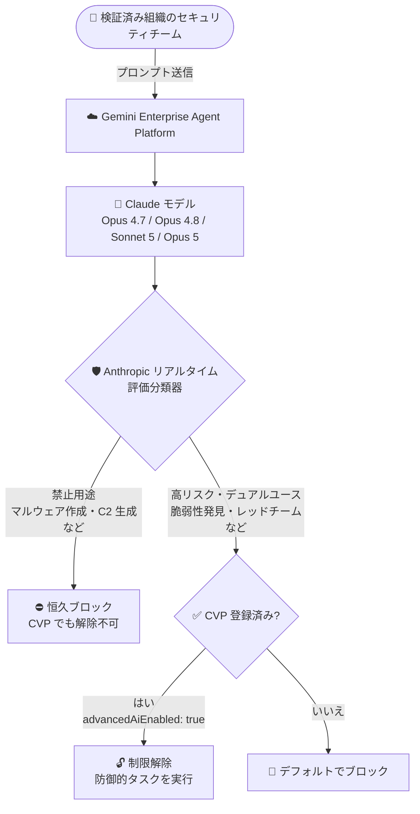

# Gemini Enterprise Agent Platform: Cyber Verification Program for Claude (Preview)

**リリース日**: 2026-09-14

**サービス**: Gemini Enterprise Agent Platform

**機能**: Cyber Verification Program for Claude

**ステータス**: Preview

📊 [このアップデートのインフォグラフィックを見る](https://takech9203.github.io/google-cloud-news-summary/20260914-gemini-enterprise-claude-cyber-verification-program.html)

## 概要

Anthropic の Cyber Verification Program (CVP) が Gemini Enterprise Agent Platform 上で Preview として利用可能になりました。CVP は、検証済みの組織が対象の Claude モデル (Claude Opus 4.7、Claude Opus 4.8、Claude Sonnet 5、Claude Opus 5) を正当な防御的サイバーセキュリティタスクに利用できるようにする信頼フレームワークです。CVP に登録すると、デフォルトで適用されているデュアルユース (両用) 制限が解除されます。

Anthropic はフロンティア Claude モデルに対してリアルタイムのサイバーセーフガードを適用しており、評価分類器 (classifier) がプロンプトと出力を検査してサイバーセキュリティ関連のリスクから保護しています。このセーフガードはアクティビティを 2 つの階層に分類します。1 つ目は「禁止用途 (Prohibited use)」で、ランサムウェア開発、C2 (コマンド & コントロール) インフラの生成、マルウェア作成、自動化された大規模データ流出など、正当な防御的用途がほとんどない高リスクの悪意ある活動です。これらは全ユーザーに対して恒久的にブロックされ、CVP でも解除されません。2 つ目は「高リスク・デュアルユース (High-risk dual-use)」で、脆弱性の発見、悪用可能性の分析、概念実証 (PoC) エクスプロイトの検証、レッドチーミング、攻撃者の攻撃経路シミュレーションなど、正規のセキュリティ運用には不可欠だが脅威アクターに悪用される可能性もある活動です。これらはデフォルトでブロックされますが、検証済み組織は CVP を通じてセーフガードの調整を受けられます。

対象ユーザーは、認可されたペネトレーションテスト、脆弱性リサーチ、セキュリティオペレーションなどの防御的セキュリティワークフローを持つ組織のセキュリティチームです。

**アップデート前の課題**

- Claude モデルにはリアルタイムのサイバーセーフガードが適用されており、脆弱性発見やレッドチーミングなどの高リスク・デュアルユースタスクはデフォルトでブロックされていた
- 正当な防御的セキュリティ業務を行う組織であっても、Gemini Enterprise Agent Platform 上でこれらの制限を解除する仕組みがなかった

**アップデート後の改善**

- 検証済み組織は、CVP への登録により対象 Claude モデルのデュアルユース制限を解除し、脆弱性発見、悪用可能性分析、PoC エクスプロイト検証、レッドチーミング、攻撃経路シミュレーションなどの防御的タスクに利用できるようになった
- Google Cloud コンソール (Model Garden) と `setPublisherModelConfig` API を通じて、プロジェクト・ロケーション・モデル単位で登録と構成が可能になった
- 禁止用途 (マルウェア作成など) は引き続き全ユーザーに対して恒久的にブロックされ、安全性が維持される

## アーキテクチャ図



Anthropic のリアルタイム評価分類器がプロンプトと出力を検査し、禁止用途は常にブロック、高リスク・デュアルユース活動は CVP 登録済みの検証組織にのみ許可されるフローを示しています。

## サービスアップデートの詳細

### 主要機能

1. **2 階層のサイバーセーフガード**
   - 禁止用途: ランサムウェア開発、C2 インフラ生成、マルウェア作成、自動化された大規模データ流出など。全ユーザーに対して恒久的にブロックされ、CVP でも解除されない
   - 高リスク・デュアルユース: 脆弱性発見、悪用可能性分析、PoC エクスプロイト検証、レッドチーミング、攻撃経路シミュレーションなど。デフォルトではブロックされるが、検証済み組織は CVP により調整可能

2. **検証済み組織向けの信頼フレームワーク**
   - Advanced AI Safety Addendum への同意 (Google Cloud コンソールの Model Garden で実施) と、Anthropic の Cyber Use Case 申請フォームの提出・承認を経て登録する
   - 登録したモデルは Google の Advanced AI Safety Addendum のもとで「Advanced AI」として指定される

3. **API によるモデル単位の構成**
   - `setPublisherModelConfig` API (v1beta1) で `advancedAiEnabled: true` を設定してモデルごとに有効化する
   - 構成はプロジェクト、ロケーション、パブリッシャー、モデル単位でスコープされる
   - `fetchPublisherModelConfig` API で設定状態を確認できる

## 技術仕様

### 対象モデルと必要な設定

| モデル | 必要な設定 |
|------|------|
| Claude Opus 4.7 | `advancedAiEnabled: true` |
| Claude Opus 4.8 | `advancedAiEnabled: true` |
| Claude Sonnet 5 | `advancedAiEnabled: true` |
| Claude Opus 5 | `advancedAiEnabled: true` および `dataSharingEnabledProvider: ANTHROPIC` (Anthropic とのデータ共有) |

### 必要な IAM 権限

| 操作 | 必要な権限 | 含まれるロール |
|------|------|------|
| Advanced AI Safety Addendum の同意 | `aiplatform.consents.update` | Agent Platform Administrator (`roles/aiplatform.admin`) |
| パブリッシャーモデル設定の構成 | `aiplatform.endpoints.setPublisherModelConfig` | Agent Platform Administrator (`roles/aiplatform.admin`) |

### データ保持・データ共有

| 項目 | 詳細 |
|------|------|
| データ保持 | CVP 有効化モデルに送信されたプロンプトとレスポンスは、Anthropic の安全ポリシーに従い、不正利用モニタリングのため最大 30 日間保持される |
| データ共有 (Claude Opus 5 のみ) | Anthropic は不正利用モニタリングのためデータ共有の有効化を必須としており、データ保持への同意とデータ共有の構成の両方が必要 |

## 設定方法

### 前提条件

1. Agent Platform API が有効化された Google Cloud プロジェクト
2. 上記の IAM 権限 (`aiplatform.consents.update` および `aiplatform.endpoints.setPublisherModelConfig`)
3. データ保持 (最大 30 日) およびデータ共有 (Claude Opus 5 の場合) の要件の理解

### 手順

#### ステップ 1: Advanced AI Safety Addendum への同意

1. Google Cloud コンソールで **Model Garden** に移動する
2. 対象の Claude モデルを選択する
3. モデル詳細ページで **Cyber Verification Program (Optional)** カードを見つけ、**Steps to enroll** をクリックして登録チェックリストを展開する
4. **Step 1: Accept the Advanced AI Safety Addendum** で規約を確認し、組織を拘束する権限があることを確認するチェックボックスを選択して **Accept** をクリックする

同意は Google Cloud プロジェクトごとに 1 回、権限のある管理者が実施します。このステップに API は用意されておらず、コンソールの Model Garden から実施する必要があります。

#### ステップ 2: Anthropic の Cyber Use Case フォームの提出

1. Anthropic Cyber Use Case フォームにアクセスする
2. **Surface** セクションで **Google Cloud** を選択する
3. 必要情報を入力し、防御的セキュリティワークフローとユースケース (認可されたペネトレーションテスト、脆弱性リサーチ、セキュリティオペレーションなど) を記述して提出する

セキュリティチームの権限のある代表者が Anthropic に直接申請します。

#### ステップ 3: モデルで Advanced AI を有効化

Anthropic の承認後、利用する各 Claude モデルに設定を適用します。

Claude Opus 4.7 / 4.8 / Sonnet 5 の場合:

```bash
curl -X POST \
  -H "Authorization: Bearer $(gcloud auth print-access-token)" \
  -H "Content-Type: application/json" \
  "https://aiplatform.googleapis.com/v1beta1/projects/PROJECT_ID/locations/global/publishers/anthropic/models/MODEL_ID:setPublisherModelConfig" \
  -d '{
    "publisherModelConfig": {
      "claudeFeatureConfig": {
        "advancedAiEnabled": true
      }
    },
    "updateMask": "claudeFeatureConfig.advancedAiEnabled"
  }'
```

Claude Opus 5 の場合 (データ共有の有効化も必要):

```bash
curl -X POST \
  -H "Authorization: Bearer $(gcloud auth print-access-token)" \
  -H "Content-Type: application/json" \
  "https://aiplatform.googleapis.com/v1beta1/projects/PROJECT_ID/locations/global/publishers/anthropic/models/claude-opus-5:setPublisherModelConfig" \
  -d '{
    "publisherModelConfig": {
      "claudeFeatureConfig": {
        "advancedAiEnabled": true
      },
      "dataSharingEnabledProvider": "ANTHROPIC"
    },
    "updateMask": "claudeFeatureConfig.advancedAiEnabled,dataSharingEnabledProvider"
  }'
```

設定の確認は `fetchPublisherModelConfig` で行います。

```bash
curl -X GET \
  -H "Authorization: Bearer $(gcloud auth print-access-token)" \
  "https://aiplatform.googleapis.com/v1beta1/projects/PROJECT_ID/locations/global/publishers/anthropic/models/MODEL_ID:fetchPublisherModelConfig"
```

**API 利用上の注意点:**

- `setPublisherModelConfig` は v1beta1 API サーフェスでサポートされる
- `updateMask` は必須。省略すると `PublisherModelConfig` オブジェクト全体が置き換えられ、`loggingConfig` や `dataSharingEnabledProvider` などの他の設定が意図せず消去される
- このメソッドは long-running operation を返すため、`done: true` になるまでオペレーションをポーリングする
- 構成はプロジェクト、ロケーション、パブリッシャー、モデル単位でスコープされる。複数リージョンでモデルを利用する場合は各エンドポイントで構成が必要

## メリット

### ビジネス面

- **正当なセキュリティ業務での AI 活用**: 認可されたペネトレーションテストや脆弱性リサーチを行う組織が、コンプライアンスを保ちながらフロンティア Claude モデルを防御的タスクに利用できる
- **信頼フレームワークによる安全性の担保**: Addendum への同意と Anthropic による審査を経た検証済み組織のみが制限解除の対象となり、禁止用途は引き続き全ユーザーでブロックされる

### 技術面

- **モデル単位のきめ細かい制御**: プロジェクト、ロケーション、モデル単位で有効化でき、必要なスコープに限定して制限を解除できる
- **API による構成と検証**: `setPublisherModelConfig` / `fetchPublisherModelConfig` により、構成の適用と確認をプログラマティックに実施できる

## デメリット・制約事項

### 制限事項

- Preview 段階の機能であり、Pre-GA Offerings Terms が適用され、サポートが限定される場合がある
- 禁止用途 (ランサムウェア開発、マルウェア作成など) は CVP でも解除できず、全ユーザーに対して恒久的にブロックされる
- Addendum の同意はコンソールの Model Garden からのみ実施可能で、API は提供されていない
- `setPublisherModelConfig` は v1beta1 エンドポイントでのみサポートされる

### 考慮すべき点

- CVP 有効化モデルへのプロンプトとレスポンスは、不正利用モニタリングのため最大 30 日間保持される
- Claude Opus 5 の利用には Anthropic とのデータ共有の有効化が必須となるため、組織のデータガバナンス要件との整合を事前に確認する必要がある
- 推論リクエストは、Anthropic への申請時に提出し Addendum に同意したものと同じ Google Cloud プロジェクトから発行する必要がある
- 正当な防御的プロンプトが誤ってブロックされた場合は、Anthropic の Cyber Block Report and Appeal フォームから誤検知の申し立てが可能

## ユースケース

### ユースケース 1: 認可されたペネトレーションテスト・レッドチーミング

**シナリオ**: セキュリティベンダーや社内レッドチームが、顧客や自社システムに対する認可された攻撃シミュレーションで、攻撃経路の分析やエクスプロイトの検証に Claude モデルを活用したい。

**効果**: CVP 登録により、デフォルトでブロックされるレッドチーミングや攻撃経路シミュレーションのタスクを、検証済み組織として制限なく実行できる。

### ユースケース 2: 脆弱性リサーチと悪用可能性分析

**シナリオ**: セキュリティリサーチチームが、発見した脆弱性の悪用可能性の分析や PoC エクスプロイトの検証を Claude モデルで支援したい。

**効果**: 高リスク・デュアルユースに分類されるこれらのタスクのセーフガードが調整され、脆弱性発見から悪用可能性分析、PoC 検証までのワークフローを AI で加速できる。

## 関連サービス・機能

- **Model Garden**: Advanced AI Safety Addendum への同意と CVP 登録チェックリストの起点となる Google Cloud コンソールの機能
- **Safety classifiers for Claude in Agent Platform**: Agent Platform 上の Claude モデルに適用される安全分類器の仕組み
- **Abuse monitoring in Agent Platform**: CVP 有効化モデルのプロンプト・レスポンス保持 (最大 30 日) を含む不正利用モニタリング
- **Request-response logging (データ共有)**: Claude Opus 5 で必須となる Anthropic とのデータ共有の構成に関連する機能

## 参考リンク

- 📊 [インフォグラフィック](https://takech9203.github.io/google-cloud-news-summary/20260914-gemini-enterprise-claude-cyber-verification-program.html)
- [公式リリースノート](https://docs.cloud.google.com/release-notes#September_14_2026)
- [Cyber Verification Program for Claude (公式ドキュメント)](https://docs.cloud.google.com/gemini-enterprise-agent-platform/models/partner-models/claude/cyber-verification-program)
- [Real-time cyber safeguards on Claude (Anthropic)](https://support.claude.com/en/articles/14604842-real-time-cyber-safeguards-on-claude-opus-and-sonnet)
- [Advanced AI Safety Addendum](https://cloud.google.com/terms/advanced-ai-safety-addendum)
- [Abuse monitoring in Agent Platform](https://docs.cloud.google.com/gemini-enterprise-agent-platform/models/abuse-monitoring)

## まとめ

Cyber Verification Program の Preview 提供により、検証済み組織は Gemini Enterprise Agent Platform 上の Claude モデルを脆弱性リサーチやレッドチーミングなどの防御的サイバーセキュリティタスクに本格活用できるようになりました。防御的セキュリティ業務で Claude モデルの利用を検討している組織は、Advanced AI Safety Addendum の内容とデータ保持・共有要件 (特に Claude Opus 5) を確認したうえで、Model Garden からの同意と Anthropic への申請を進めることを推奨します。

---

**タグ**: Gemini Enterprise Agent Platform, Claude, Anthropic, Cyber Verification Program, セキュリティ, Preview, Model Garden, レッドチーミング, 脆弱性リサーチ
