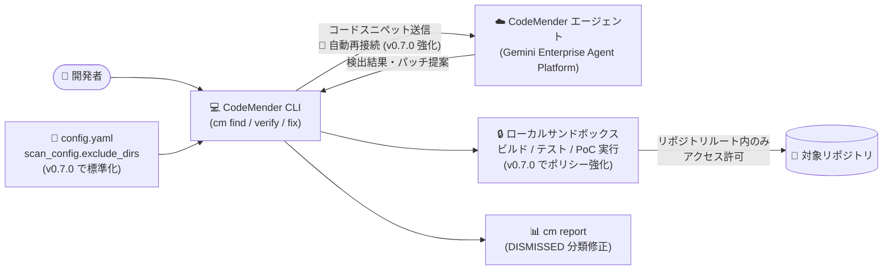

# Gemini Enterprise Agent Platform: CodeMender v0.7.0 アップデート

**リリース日**: 2026-09-14

**サービス**: Gemini Enterprise Agent Platform (CodeMender)

**機能**: CodeMender v0.7.0 アップデート

**ステータス**: Fixed (CodeMender は Preview 提供中)

📊 [このアップデートのインフォグラフィックを見る](https://takech9203.github.io/google-cloud-news-summary/20260914-gemini-enterprise-codemender-v0-7-0.html)

## 概要

Gemini Enterprise Agent Platform 上でホストされるコードセキュリティエージェント「CodeMender」の v0.7.0 がリリースされた。CodeMender は Google DeepMind が開発した AI エージェントで、コードベースの脆弱性スキャン (`cm find`)、PoC エクスプロイトによる実証検証 (`cm verify`)、修正パッチの自動生成 (`cm fix`) をローカル CLI とクラウド側の推論エンジンの連携により実行する。

今回のアップデートは、長時間実行されるスキャン・修復ワークフローの安定性向上 (ネットワークストリームの自動再接続と一時的エラーからの回復)、設定の統一性向上 (ディレクトリ除外ルールの `scan_config.exclude_dirs` への標準化)、および 3 件のバグ修正 (レポート集計の誤分類、サンドボックス権限エラー、サンドボックスコマンドポリシーの強化) を含む。大規模コードベースを対象に CodeMender を運用するセキュリティチーム・開発チームにとって、運用安定性とサンドボックスの安全性が向上するメンテナンスリリースである。

**アップデート前の課題**

- 長時間実行されるスキャンや修復ワークフロー中にネットワークの一時的な障害が発生すると、CLI セッションが不安定になり、処理が中断される可能性があった
- ディレクトリ除外ルールが設定ファイルと CLI のスキャンフラグで統一されておらず、除外設定の管理に一貫性がなかった
- `cm report` のサマリーテーブルで、DISMISSED (却下済み) のファインディングが誤って OPEN として分類されていた
- 子ワーカープロセスがディスク上に内部セッションログを作成しようとして、サンドボックスの権限拒否エラーが発生していた
- サンドボックスのコマンドポリシーに、指定リポジトリルート外 (隣接ディレクトリ) へのディレクトリトラバーサルやファイル参照を許す余地があった

**アップデート後の改善**

- 自動再接続と一時的エラーからの回復機能により、長時間実行されるスキャン・修復ワークフロー中の CLI セッションの安定性が向上した
- ディレクトリ除外ルールが `scan_config.exclude_dirs` の下に標準化され、設定ファイルと CLI スキャンフラグの間で一貫した除外設定が可能になった
- `cm report` のサマリーテーブルで DISMISSED ファインディングが正しく分類されるようになり、トリアージ状況を正確に把握できるようになった
- 子ワーカープロセスによる内部セッションログのディスク書き込みが抑止され、サンドボックス権限拒否エラーが解消された
- サンドボックスコマンドポリシーが強化され、リポジトリルート外へのディレクトリトラバーサルとファイル参照が防止されるようになった

## アーキテクチャ図



ローカル CLI がクラウド側のエージェントと連携してスキャン・検証・修復を行うワークフローにおいて、v0.7.0 では CLI とエージェント間のネットワークストリームの回復性、除外設定の統一、サンドボックスの境界制御がそれぞれ強化された。

## サービスアップデートの詳細

### 主要機能

1. **ネットワークストリームの回復性 (Network stream resilience)**
   - 自動再接続と一時的エラーからの回復により、CLI セッションの安定性が向上
   - 長時間実行されるスキャンや修復ワークフロー中のネットワーク瞬断による処理中断リスクを低減
   - CodeMender はセッションデータを最大 7 日間保持して中断したスキャンの再開を可能にしているが、今回の改善により再開に頼らず処理を継続できるケースが増える

2. **設定の統一性 (Configuration uniformity)**
   - ディレクトリ除外ルールを設定ファイルと CLI スキャンフラグの間で `scan_config.exclude_dirs` の下に標準化
   - `node_modules`、`vendor`、`dist`、`bin` などの依存関係・ビルド成果物ディレクトリの除外設定を一元管理できる
   - 除外設定はスキャンのレイテンシとトークン消費の削減に直結するため、一貫した管理が運用効率に寄与する

3. **バグ修正**
   - **`cm report` の分類修正**: DISMISSED (却下済み) ファインディングがサマリーテーブルで誤って OPEN と分類される問題を修正
   - **サンドボックス権限エラーの解消**: 子ワーカープロセスがディスク上に内部セッションログを作成しようとすることを抑止し、権限拒否エラーを解決
   - **サンドボックスコマンドポリシーの強化**: 指定されたリポジトリルート外の隣接ディレクトリへのディレクトリトラバーサルとファイル参照を防止

## 技術仕様

### v0.7.0 の変更点サマリー

| 項目 | 変更内容 | 分類 |
|------|----------|------|
| ネットワークストリーム | 自動再接続・一時的エラー回復 | 安定性向上 |
| ディレクトリ除外設定 | `scan_config.exclude_dirs` に標準化 | 設定統一 |
| `cm report` | DISMISSED を OPEN と誤分類する問題を修正 | バグ修正 |
| 子ワーカープロセス | 内部セッションログのディスク書き込みを抑止 | バグ修正 |
| サンドボックスポリシー | リポジトリルート外へのトラバーサル防止 | セキュリティ強化 |

### CodeMender の基本アーキテクチャ (参考)

| 項目 | 詳細 |
|------|------|
| ホスティング | Gemini Enterprise Agent Platform 上のヘッドレスエージェント |
| クライアント | ローカル CLI (`cm find` / `cm verify` / `cm fix` / `cm report` など) |
| 実行場所 | 推論・オーケストレーションはクラウド、ビルド・テスト・PoC 実行はローカルサンドボックス |
| 設定ファイル | `.codemender/config.yaml` または `~/.config/codemender/config.yaml` |
| データ保持 | セッションデータは最大 7 日間 (中断スキャンの再開用)、ソースコードのモデル学習利用なし |
| 対応言語 | C/C++、Java、Python、TypeScript/JavaScript、Go、Rust、Ruby |

## 設定方法

### 前提条件

1. Google Cloud プロジェクトで必要な API と IAM ロールを設定済みであること
2. CodeMender CLI バイナリをインストールし、Application Default Credentials (ADC) で認証済みであること
3. スキャン対象のソースコードをワークスペースに配置済みであること

### 手順

#### ステップ 1: CLI を最新バージョンに更新

公式ドキュメントの手順に従い、CodeMender CLI を v0.7.0 に更新する。

```bash
# バージョン確認
cm --version
```

#### ステップ 2: ディレクトリ除外設定を確認・移行

`config.yaml` のディレクトリ除外ルールが `scan_config.exclude_dirs` の下に標準化されたため、既存の除外設定を確認する。

```yaml
# .codemender/config.yaml (例)
scan_config:
  exclude_dirs:
    - node_modules
    - vendor
    - dist
    - bin
```

CLI スキャンフラグとの間で除外ルールが統一されるため、設定ファイル側の記述を確認しておく。

#### ステップ 3: スキャンとレポートの動作確認

```bash
# 対象モジュールをスキャン
cm find ./src/auth/

# レポートで DISMISSED / OPEN の分類が正しいことを確認
cm report
```

## メリット

### ビジネス面

- **長時間スキャンの運用信頼性向上**: ネットワーク瞬断による処理中断が減ることで、大規模コードベースに対するスキャン・修復ジョブの再実行コストとトークン消費の無駄を削減できる
- **正確なトリアージ状況の把握**: `cm report` の分類修正により、却下済みファインディングが未対応として二重にカウントされることがなくなり、セキュリティ対応の進捗管理の精度が上がる

### 技術面

- **設定管理の一元化**: `scan_config.exclude_dirs` への標準化により、設定ファイルと CLI フラグ間の除外ルールの不整合を解消できる
- **サンドボックス境界の強化**: リポジトリルート外へのディレクトリトラバーサル防止により、AI エージェントがローカル環境でコマンドを実行する際の安全性がさらに高まる
- **CI/CD パイプラインの安定化**: ヘッドレス実行時にもネットワーク回復性の恩恵を受けられ、自動化パイプラインでの失敗率低減が期待できる

## デメリット・制約事項

### 制限事項

- CodeMender は Preview 段階の製品であり、Pre-GA Offerings Terms が適用される
- スキャンは 10〜50 ファイル程度のバッチまたは対象モジュール単位での実行が推奨されている

### 考慮すべき点

- ディレクトリ除外ルールの標準化に伴い、既存の `config.yaml` で独自の除外設定を運用している場合は、`scan_config.exclude_dirs` 形式への整合を確認する必要がある
- サンドボックスポリシーの強化により、リポジトリルート外のファイル参照に依存していたビルド・テストプロセスは、`project_paths` などで明示的にアクセスパスを許可する構成を検討する必要がある

## ユースケース

### ユースケース 1: 大規模モノレポの夜間フルスキャン

**シナリオ**: 数百モジュールを含むモノレポに対して、CI/CD パイプラインから夜間に CodeMender のスキャンを実行している。従来はネットワークの一時的な障害でセッションが中断し、翌朝に再実行が必要になるケースがあった。

**実装例**:
```bash
# ヘッドレス実行 (自動再接続により長時間ジョブの安定性が向上)
cm find ./services/payments/ -y
```

**効果**: 自動再接続と一時的エラー回復により、長時間ジョブの完走率が向上し、再実行によるトークン消費と運用工数を削減できる。

### ユースケース 2: トリアージ済みファインディングの進捗レポート

**シナリオ**: セキュリティチームが `cm report` のサマリーテーブルを使って脆弱性対応の進捗を経営層に報告している。従来は DISMISSED が OPEN として集計され、未対応件数が実際より多く見えていた。

**効果**: v0.7.0 では DISMISSED が正しく分類されるため、レポートを手動補正することなく正確な対応状況を報告できる。

## 料金

このアップデートに伴う料金体系の変更は Release Notes に記載されていない。CodeMender の利用条件・料金の詳細は公式ドキュメントを参照。

- [CodeMender ドキュメント](https://docs.cloud.google.com/gemini-enterprise-agent-platform/codemender)

## 関連サービス・機能

- **Gemini Enterprise Agent Platform**: CodeMender をホストするマネージドエージェント基盤。ガバナンス機能と開発者ツール統合を提供
- **VPC Service Controls**: CodeMender の CLI・エージェント間通信にセキュリティ境界を設定し、データ持ち出しリスクを軽減
- **Wiz 連携 (Google AI Threat Defense)**: Wiz Security Graph の文脈情報と組み合わせ、優先度付けされた脆弱性の修復を CodeMender に指示するワークフローを構成可能
- **Gemini モデル (Gemini 3.7 Flash ほか)**: `--model` フラグでスキャン・検証・修復に使用するモデルを選択し、コスト・速度・性能を最適化

## 参考リンク

- 📊 [インフォグラフィック](https://takech9203.github.io/google-cloud-news-summary/20260914-gemini-enterprise-codemender-v0-7-0.html)
- [公式リリースノート](https://docs.cloud.google.com/release-notes#September_14_2026)
- [Google Cloud Blog: Find and fix software vulnerabilities with CodeMender](https://cloud.google.com/blog/products/identity-security/find-and-fix-software-vulnerabilities-with-codemender)
- [CodeMender ドキュメント](https://docs.cloud.google.com/gemini-enterprise-agent-platform/codemender)
- [CodeMender 環境セットアップ (config.yaml)](https://docs.cloud.google.com/gemini-enterprise-agent-platform/codemender/set-up-environment)
- [脆弱性のスキャンと検証](https://docs.cloud.google.com/gemini-enterprise-agent-platform/codemender/scan-and-verify)

## まとめ

CodeMender v0.7.0 は、長時間実行されるスキャン・修復ワークフローの安定性、除外設定の一貫性、サンドボックスの安全性を強化するメンテナンスリリースである。CodeMender を運用中のチームは CLI を更新し、`scan_config.exclude_dirs` への除外設定の整合と、リポジトリルート外アクセスに依存するビルドプロセスの有無を確認することを推奨する。

---

**タグ**: Gemini Enterprise Agent Platform, CodeMender, セキュリティ, 脆弱性スキャン, AI エージェント, CLI, サンドボックス
