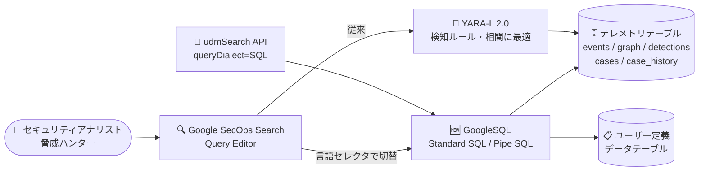

# Google SecOps: Search での GoogleSQL クエリサポート (Public Preview)

**リリース日**: 2026-09-14

**サービス**: Google SecOps

**機能**: [Spotlight] Search での GoogleSQL クエリサポート

**ステータス**: Public Preview

📊 [このアップデートのインフォグラフィックを見る](https://takech9203.github.io/google-cloud-news-summary/20260914-google-secops-googlesql-search.html)

## 概要

Google SecOps の Search で GoogleSQL を使用してセキュリティデータをクエリできる機能が Public Preview として公開された。従来の YARA-L 2.0 に対する、柔軟で強力な業界標準の代替手段として位置付けられており、広範なデータ探索、統計的集計、アドホックな深掘り調査に最適化されている。

クエリ対象は UDM イベント、エンティティグラフ、検知ルール、ケース管理データなどのテレメトリテーブルで、標準的な宣言型 SQL (Standard SQL) と、線形・逐次的な Pipe SQL (Piped SQL) 構文の両方をサポートする。Query Editor の言語セレクタで YARA-L 2.0 と GoogleSQL を切り替えられるほか、`udmSearch` API の `queryDialect` パラメータに `SQL` を指定することでプログラムからの実行も可能である。

対象ユーザーはセキュリティアナリスト、脅威ハンター、検知エンジニアであり、SQL の知識をそのままセキュリティテレメトリの分析に活用できるため、YARA-L の学習コストがオンボーディングの障壁となっていたチームにとって特に価値が大きい。

**アップデート前の課題**

- Google SecOps の Search でセキュリティデータをクエリするには YARA-L 2.0 (events / match / outcome / condition のセクション構造) の習得が必要で、SQL に慣れたアナリストにとって学習コストが高かった
- YARA-L 2.0 はストリーミング検知ルールとマルチイベント相関に最適化されており、広範なデータ探索や統計的な集計・アドホック分析には必ずしも適していなかった
- BI やデータ分析で一般的な SQL のスキルセット・既存クエリ資産をセキュリティ調査に直接転用できなかった

**アップデート後の改善**

- 業界標準の ANSI 準拠 GoogleSQL (`FROM` / `WHERE` / `GROUP BY` / `HAVING` / `SELECT` / `ORDER BY` / `LIMIT`) でセキュリティテレメトリを直接クエリできるようになった
- Standard SQL に加えて、`|>` 演算子でデータを順次変換していく Pipe SQL 構文が利用でき、Source → Filter → Aggregate → Refine という直感的なフローで複雑なクエリを記述・デバッグできるようになった
- UDM イベントだけでなく、エンティティグラフ (`graph`)、検知結果 (`detections`)、ケース管理データ (`cases` / `case_history`)、ユーザー定義のデータテーブルを横断的に JOIN・分析できるようになった

## アーキテクチャ図



アナリストは Search の Query Editor (または udmSearch API) から GoogleSQL と YARA-L 2.0 を切り替えて利用でき、GoogleSQL では UDM イベントを含む複数のテレメトリテーブルとユーザー定義データテーブルを標準 SQL で横断的にクエリできる。

## サービスアップデートの詳細

### 主要機能

1. **Standard SQL (宣言型) 構文のサポート**
   - `SELECT` 句から始まる ANSI 準拠の宣言型クエリでセキュリティデータを検索できる
   - CTE (共通テーブル式) やサブクエリを利用した複雑な分析が可能

2. **Pipe SQL 構文のサポート**
   - `FROM events |> WHERE ... |> SELECT ...` のように、データソースから始めて `|>` 演算子で順次変換を適用する線形の構文
   - Source → Filter → Aggregate → Refine という順序で思考の流れに沿ってクエリを記述・デバッグできる (BigQuery の Pipe query syntax と同じ)

3. **複数のテレメトリテーブルへのアクセス**
   - `events`: UDM イベントデータ (例: `principal.hostname`)
   - `graph`: Entity Context Graph のメタデータ (例: `entity.hostname`)
   - `detections`: カスタムルール・Google キュレートルール双方によるアラート・検知結果
   - `cases` / `case_history`: ケース・インシデント管理データとその監査履歴
   - ユーザー定義の参照データテーブル (例: `threat_intel_list`) もテーブル名で直接クエリ可能

4. **クエリタイプに応じた UI 動作**
   - 特定カラムの射影や集計 (統計クエリ) はフラットなテーブルを返し、迅速な統計分析に最適
   - `SELECT * FROM events` (イベントクエリ) は完全な UDM オブジェクトを返し、Event Viewer や Timeline ウィジェットによるインタラクティブな調査が可能

5. **API 統合**
   - `udmSearch` API 呼び出しで `queryDialect=SQL` を指定することで、プログラムから SQL クエリを実行できる

## 技術仕様

### YARA-L 2.0 と GoogleSQL の比較

| 項目 | YARA-L 2.0 | GoogleSQL |
|------|------------|-----------|
| クエリ構造 | セクション型 (events / match / outcome / condition の論理フロー) | 宣言型 (取得したいデータを句で定義) |
| 主要構成要素 | events, match, outcome, condition セクション | FROM, WHERE, GROUP BY, HAVING, SELECT, ORDER BY, LIMIT 句 |
| 得意分野 | ストリーミング検知ルール、マルチイベント相関 | 広範なデータ探索、統計集計、アドホックな深掘り分析 |

### 構文例

```sql
-- Standard SQL 構文
SELECT principal.hostname, target.hostname
FROM events
WHERE principal.hostname = "my-host"

-- Pipe SQL 構文 (同じクエリ)
FROM events
|> WHERE principal.hostname = "my-host"
|> SELECT principal.hostname, target.hostname
```

### JOIN のルール

```sql
-- OK: WHERE ... IN サブクエリでは SELECT * が使用可能
SELECT * FROM events
WHERE target.hostname IN (SELECT entity.hostname FROM graph)

-- OK: 標準 JOIN では明示的なカラム指定が必要
SELECT A.metadata.product_name, B.entity.hostname
FROM events A JOIN graph B
ON A.principal.hostname = B.entity.hostname
```

## 設定方法

### 前提条件

1. Google SecOps 環境で本 Preview 機能が有効になっていること (表示されない場合は [プレビュー機能の管理](https://docs.cloud.google.com/chronicle/docs/secops/preview-features-manage)を確認するか、システム管理者に問い合わせる)
2. Pre-GA Offerings Terms (Google SecOps Service Specific Terms) が適用される点を確認すること

### 手順

#### ステップ 1: Query Editor で言語を切り替える

Google SecOps の Search ページを開き、Query Editor の言語セレクタで YARA-L 2.0 から GoogleSQL に切り替える。

#### ステップ 2: クエリを実行する

```sql
-- インタラクティブ調査用 (Event Viewer / Timeline が有効)
SELECT * FROM events

-- 統計分析用 (フラットなテーブルを返す)
SELECT MyEvent.principal.hostname AS MyHost,
       MyEvent.metadata.event_type AS MyAction
FROM events AS MyEvent
```

#### ステップ 3: (任意) API から実行する

```
# udmSearch API 呼び出しで SQL ダイアレクトを指定
queryDialect=SQL
```

## メリット

### ビジネス面

- **オンボーディングの高速化**: SQL は業界標準スキルであり、YARA-L 2.0 を新たに習得しなくてもアナリストが即戦力として調査を開始できる
- **既存スキル・資産の活用**: BigQuery やデータ分析基盤で培った SQL の知見・クエリパターンをセキュリティ運用に転用できる

### 技術面

- **柔軟なデータ探索**: 宣言型 SQL の合成可能な構造により、統計集計や複雑なアドホック分析が YARA-L より容易
- **横断的な分析**: events / graph / detections / cases などのテーブルとユーザー定義データテーブルを JOIN して、テレメトリとコンテキストを組み合わせた分析ができる
- **可読性の高い Pipe SQL**: 線形なメンタルモデルで複雑なクエリの記述・レビュー・デバッグがしやすい

## デメリット・制約事項

### 制限事項

- **単一ステートメントのみ**: CTE やサブクエリは使用できるが、セミコロン区切りの複数ステートメントは不可
- **読み取り専用**: `INSERT` / `UPDATE` / `DELETE` などの DML、`CREATE TABLE` などの DDL は使用不可
- **結果行数の上限**: すべての検索に 1,000,000 行のシステム上限があり、これを超える LIMIT 指定は上書きされる
- **SELECT \* の制約**: 標準 JOIN や `UNNEST` との組み合わせでは `SELECT *` を使用できず、カラムを明示的に指定する必要がある。また、ワイルドカード選択 (`A.*` や `*`) と明示的なカラム射影を同一 SELECT 文で混在させることもできない

### 考慮すべき点

- Public Preview (Pre-GA) 機能であり、サポートが限定される場合や、GA までに互換性のない変更が入る可能性がある
- ストリーミング検知ルールやマルチイベント相関は引き続き YARA-L 2.0 が最適であり、GoogleSQL は置き換えではなく用途に応じた使い分けが前提
- 特定カラムを射影する統計クエリでは Event Viewer / Timeline などのインタラクティブ UI 機能が無効になるため、調査目的に応じて `SELECT *` と使い分ける必要がある

## ユースケース

### ユースケース 1: 統計的なログ分析・ダッシュボード用集計

**シナリオ**: ホスト別・イベントタイプ別のログイン失敗数を集計し、傾向を把握したい。

**実装例**:
```sql
FROM events
|> WHERE metadata.event_type = "USER_LOGIN"
|> WHERE security_result.action = "FAIL"
|> AGGREGATE COUNT(*) AS fail_count GROUP BY principal.hostname
|> ORDER BY fail_count DESC
|> LIMIT 100
```

**効果**: YARA-L の outcome セクションを組むことなく、SQL の集計イディオムで迅速に統計分析ができる。

### ユースケース 2: エンティティグラフと突合した脅威ハンティング

**シナリオ**: エンティティグラフに登録されているホストで発生したイベントだけを抽出して調査したい。

**実装例**:
```sql
SELECT * FROM events
WHERE target.hostname IN (SELECT entity.hostname FROM graph)
```

**効果**: `SELECT *` により完全な UDM オブジェクトが返るため、Event Viewer と Timeline を使ったインタラクティブな深掘り調査ができる。

### ユースケース 3: 脅威インテリジェンスリストとの照合

**シナリオ**: ユーザー定義のデータテーブル (例: `threat_intel_list`) に登録した IoC とテレメトリを照合する。

**効果**: 参照テーブルをテーブル名で直接クエリ・JOIN でき、アドホックな IoC マッチングを SQL だけで完結できる。

## 料金

GoogleSQL クエリサポートは Google SecOps の Search 機能の一部として提供され、追加機能としての個別料金は Release Notes に記載されていない。Google SecOps はパッケージ (Standard / Enterprise / Enterprise Plus) ベースのライセンス体系で提供される。詳細は料金ページを参照。

- [Google Security Operations の料金](https://cloud.google.com/security/products/security-operations)

## 利用可能リージョン

リージョン固有の記載は Release Notes になし。利用可否は各環境の Preview 機能設定に依存する ([プレビュー機能の管理](https://docs.cloud.google.com/chronicle/docs/secops/preview-features-manage)を参照)。

## 関連サービス・機能

- **YARA-L 2.0**: 既存のクエリ・検知言語。ストリーミング検知ルールとマルチイベント相関に最適化されており、GoogleSQL と用途に応じて併用する
- **BigQuery (Pipe query syntax)**: GoogleSQL の Pipe SQL 構文は BigQuery の Pipe query syntax と共通であり、BigQuery ユーザーは同じ構文知識を活用できる
- **Unified Data Model (UDM)**: `events` テーブルのスキーマ。フィールド定義は UDM field dictionary を参照
- **Entity Context Graph**: `graph` テーブルとして GoogleSQL からクエリできるエンティティコンテキスト情報
- **Google SecOps SOAR (ケース管理)**: `cases` / `case_history` テーブルを通じてケース・インシデント管理データを SQL で分析できる

## 参考リンク

- 📊 [インフォグラフィック](https://takech9203.github.io/google-cloud-news-summary/20260914-google-secops-googlesql-search.html)
- [公式リリースノート](https://docs.cloud.google.com/release-notes#September_14_2026)
- [Get started with GoogleSQL (ドキュメント)](https://docs.cloud.google.com/chronicle/docs/reference/standard-sql/getting-started-googlesql)
- [Pipe query syntax (BigQuery)](https://docs.cloud.google.com/bigquery/docs/reference/standard-sql/pipe-syntax)
- [UDM field dictionary reference](https://docs.cloud.google.com/chronicle/docs/reference/udm-field-list)
- [Understand search (UDM Search)](https://docs.cloud.google.com/chronicle/docs/investigation/udm-search)
- [料金ページ (Google Security Operations)](https://cloud.google.com/security/products/security-operations)

## まとめ

Google SecOps の Search が業界標準の GoogleSQL に対応したことで、SQL スキルを持つアナリストがそのままセキュリティテレメトリの探索・統計分析・アドホック調査を行えるようになった。ストリーミング検知には引き続き YARA-L 2.0 を使いつつ、探索的分析には GoogleSQL を使うという役割分担が現実的である。まずは Query Editor の言語セレクタで GoogleSQL に切り替え、Pipe SQL 構文による集計クエリから試すことを推奨する。

---

**タグ**: Google SecOps, Chronicle, GoogleSQL, Pipe SQL, YARA-L, UDM, Search, セキュリティ分析, 脅威ハンティング, Public Preview
