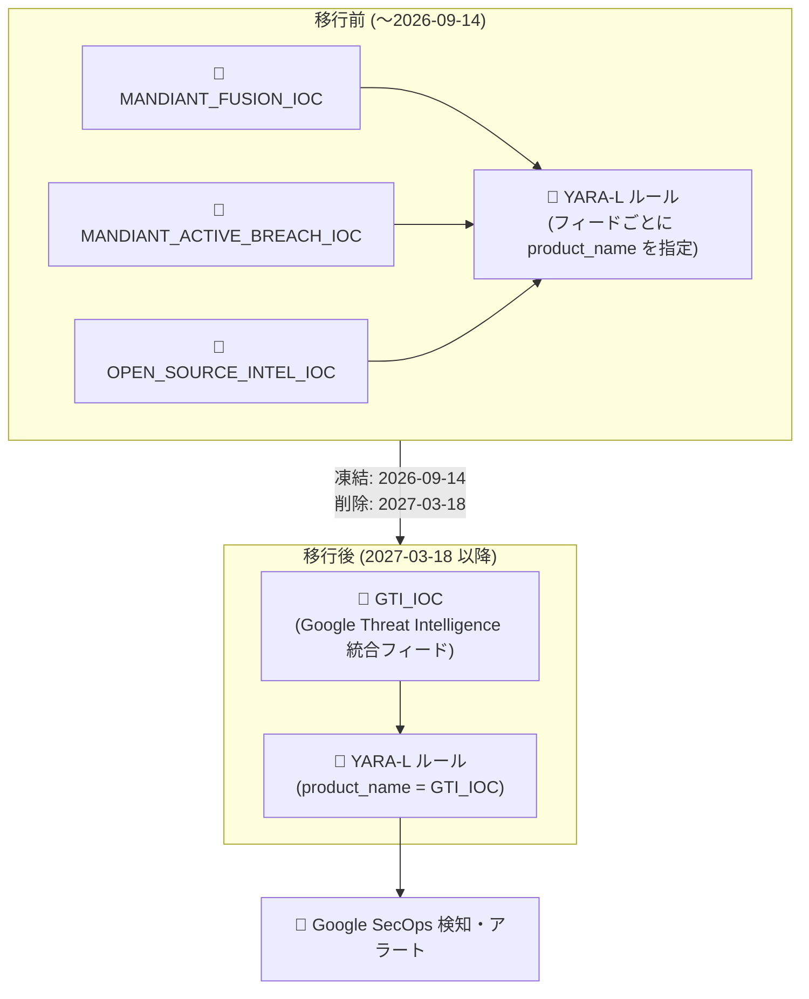

# Google SecOps: Mandiant レガシー IOC フィード (MANDIANT_ACTIVE_BREACH_IOC / MANDIANT_FUSION_IOC / OPEN_SOURCE_INTEL_IOC) の非推奨化

**リリース日**: 2026-09-14

**サービス**: Google SecOps / Google SecOps SIEM

**機能**: Mandiant レガシー IOC フィードの GTI_IOC フィードへの統合 (非推奨化)

**ステータス**: Deprecated

📊 [このアップデートのインフォグラフィックを見る](https://takech9203.github.io/google-cloud-news-summary/20260914-google-secops-mandiant-ioc-feeds-deprecation.html)

## 概要

Google SecOps および Google SecOps SIEM において、脅威インテリジェンスの IOC (Indicators of Compromise) フィードである `MANDIANT_ACTIVE_BREACH_IOC`、`MANDIANT_FUSION_IOC`、`OPEN_SOURCE_INTEL_IOC` の 3 つのフィードが非推奨 (Deprecated) となりました。これらのフィードの IOC コンテンツは、統合された `GTI_IOC` (Google Threat Intelligence) フィードに移行されます。

既存の 3 フィードは非推奨日 (2026 年 9 月 14 日) から凍結 (フリーズ) され、新規の IOC は追加されなくなります。その後、**2027 年 3 月 18 日** のシャットダウン日をもって製品から削除されます。これらのフィードを参照する YARA-L 検知ルールを運用している検知エンジニアやアナリストは、脅威カバレッジを途切れさせないために、シャットダウン日までにルールを `GTI_IOC` を参照する構文へ更新する必要があります。

この統合は、Google が Mandiant・VirusTotal・Google の脅威リサーチを統合した Google Threat Intelligence (GTI) への脅威インテリジェンスデータソースの一本化の一環であり、より広範な IOC セットの提供とインテグレーションの簡素化を目的としています。

**アップデート前の課題**

- 脅威インテリジェンスのソースが `MANDIANT_FUSION_IOC` (Mandiant がキュレーションした IOC)、`MANDIANT_ACTIVE_BREACH_IOC` (進行中の侵害調査由来の IOC)、`OPEN_SOURCE_INTEL_IOC` (検証済みオープンソースインテリジェンス) の 3 つのフィードに分散しており、YARA-L ルールでフィードごとに個別の `product_name` を指定する必要があった
- フィードごとに参照方法が異なるため、複数フィードを横断する検知ルールの管理が煩雑だった

**アップデート後の改善**

- 3 つのレガシーフィードの IOC コンテンツが単一の `GTI_IOC` フィードに統合され、ルール記述とインテグレーションが簡素化される
- Google Threat Intelligence (GTI) 統合フィードにより、より広範な IOC セットが提供される
- Rules Management 画面に影響を受けるルールの警告表示と Gemini によるルール更新支援 (Suggested Fix の提示と Apply to Editor) が組み込まれ、移行作業が半自動化される

## アーキテクチャ図



3 つの Mandiant レガシー IOC フィードが単一の `GTI_IOC` フィードに統合され、YARA-L ルールは `GTI_IOC` を参照する構文へ移行します。レガシーフィードは 2026 年 9 月 14 日から凍結され、2027 年 3 月 18 日に削除されます。

## サービスアップデートの詳細

### 主要な変更点

1. **3 つのレガシー IOC フィードの非推奨化**
   - `MANDIANT_ACTIVE_BREACH_IOC`、`MANDIANT_FUSION_IOC`、`OPEN_SOURCE_INTEL_IOC` が 2026 年 9 月 14 日付で非推奨
   - 非推奨日以降、既存フィードは凍結 (新規 IOC の追加が停止)
   - 2027 年 3 月 18 日に製品から削除 (シャットダウン)

2. **GTI_IOC フィードへの統合**
   - IOC コンテンツは Google Threat Intelligence (GTI) の統合フィード `GTI_IOC` に移行
   - より広範な IOC セットの提供とインテグレーションの簡素化が目的

3. **Gemini によるルール移行支援**
   - Rules Management / Lister ページに、影響を受けるルールがある場合はグローバルバナーが表示される
   - レガシーフィードを参照するルールには警告アイコンと「Update Required」ツールチップが表示される
   - ルールエディタからGemini サイドパネルを起動でき、エンタイトルメントに応じたフィードのマッピング説明と Suggested Fix (修正候補コード) が提示され、「Apply to Editor」でワンクリック適用が可能

## 技術仕様

### フィード名のマッピングとライセンス階層

| レガシー Mandiant フィード名 | 新しい GTI プロダクト名 | ライセンス階層 |
|------|------|------|
| `MANDIANT_FUSION_IOC` | `GTI_IOC` | Enterprise または Enterprise+ |
| `OPEN_SOURCE_INTEL_IOC` | `GTI_IOC` | Enterprise または Enterprise+ |
| `MANDIANT_ACTIVE_BREACH_IOC` | `GTI_IOC` | Enterprise+ |

### 移行スケジュール

| 日付 | イベント |
|------|------|
| 2026 年 9 月 14 日 | 非推奨化。レガシーフィードは凍結され、新規 IOC の追加が停止 |
| 2027 年 3 月 18 日 | シャットダウン。レガシーフィードが製品から削除 |

### YARA-L ルールの移行リファレンス

履歴データと新しい GTI データの両方にマッチさせる推奨構文は以下のとおりです。

**旧構文:**

```
$mandiant.graph.metadata.product_name = "MANDIANT_FUSION_IOC"
```

**推奨される新構文:**

```
(
  $mandiant.graph.metadata.product_name = "GTI_IOC"
  $mandiant.graph.metadata.threat_intel.stable = true
)
```

## 設定方法

### 前提条件

1. Google SecOps Enterprise または Enterprise+ ライセンス (`MANDIANT_ACTIVE_BREACH_IOC` 相当のコンテンツは Enterprise+ が必要)
2. レガシーフィード名 (`MANDIANT_FUSION_IOC` など) を参照する YARA-L ルールの棚卸し

### 手順 (移行ワークフロー)

#### ステップ 1: 影響を受けるルールの特定

Rules Management / Lister ページを開きます。テナントに影響を受けるルールがある場合、グローバルバナーが表示されます。レガシーフィードを参照するルールには警告アイコンまたは「Update Required」ツールチップが表示されます。

#### ステップ 2: ルール詳細の分析

影響を受けるルールを開くと、ルールエディタがレガシー構文 (例: `$mandiant.graph.metadata.product_name = "MANDIANT_FUSION_IOC"`) をハイライト表示します。エディタヘッダーの移行ボタンから Gemini サイドパネルを起動します。

#### ステップ 3: Gemini 支援による更新の適用

Gemini がエンタイトルメントに基づく旧フィードと新 GTI フィードのマッピングを説明し、Suggested Fix コードブロックを提示します。更新後の YARA-L ロジック (履歴カバレッジのためレガシー参照を維持しつつ `GTI_IOC` を追加) を確認し、「Apply to Editor」をクリックして適用します。手動で更新する場合は、上記「YARA-L ルールの移行リファレンス」の構文を使用します。

#### ステップ 4: 新しい構文の確認

更新した `GTI_IOC` 構文でルールを保存すると、エディタおよび Rules Lister ページから「Update Required」警告アイコンが消え、フラグ付きルールを解消するごとに移行ステータスがリアルタイムで更新されます。

## メリット

### ビジネス面

- **脅威カバレッジの拡大**: 統合 GTI フィードにより、Mandiant・オープンソースインテリジェンスを含むより広範な IOC セットが単一フィードで利用可能になる
- **運用コストの削減**: フィードが一本化されることで、検知ルールの管理・保守の負担が軽減される

### 技術面

- **ルール記述の簡素化**: 3 つのフィード名を個別に指定する必要がなくなり、`GTI_IOC` への単一参照でカバーできる
- **Gemini による移行支援**: 影響ルールの自動検出と修正候補の提示により、移行作業のミスと工数を削減できる

## デメリット・制約事項

### 制限事項

- 2026 年 9 月 14 日以降、レガシー 3 フィードは凍結され、新規 IOC が追加されない (最新の脅威情報を得るには GTI_IOC への移行が必須)
- 2027 年 3 月 18 日以降、レガシーフィードは削除され、これらを参照するルールは機能しなくなる
- `MANDIANT_ACTIVE_BREACH_IOC` 相当のコンテンツ (Breach Analytics) は Enterprise+ ライセンスが必要

### 考慮すべき点

- 移行期間中は、履歴データとのマッチングを維持するため、推奨構文 (`GTI_IOC` + `threat_intel.stable = true`) への更新、または新旧両方を参照するルール構成を検討する
- レガシーフィード名をハードコードしたカスタムダッシュボード、レポート、SOAR プレイブックなどがある場合は、YARA-L ルール以外の参照箇所も棚卸しが必要

## ユースケース

### ユースケース 1: 既存の Fusion Feed ベース検知ルールの移行

**シナリオ**: SOC チームが `MANDIANT_FUSION_IOC` を参照する YARA-L ルールでファイルハッシュの IOC マッチングを行っている。凍結後も最新の IOC で検知を継続したい。

**実装例**:
```
events:
  // 旧: $context_graph.graph.metadata.product_name = "MANDIANT_FUSION_IOC"
  $context_graph.graph.metadata.product_name = "GTI_IOC"
  $context_graph.graph.metadata.threat_intel.stable = true
  $context_graph.graph.metadata.entity_type = "FILE"
  $ioc = $context_graph.graph.entity.file.md5
  $ioc = $e1.principal.process.file.md5
match:
  $ioc over 1h
```

**効果**: 凍結されるレガシーフィードに依存せず、GTI の最新 IOC による検知カバレッジを維持できる。

### ユースケース 2: Gemini 支援によるテナント全体の一括移行

**シナリオ**: 多数の YARA-L ルールを運用しており、どのルールがレガシーフィードを参照しているか把握しきれていない。

**効果**: Rules Management ページのバナーと警告アイコンで影響ルールを網羅的に特定し、Gemini の Suggested Fix を順次適用することで、シャットダウン日 (2027 年 3 月 18 日) までに漏れなく移行を完了できる。

## 料金

このアップデート自体はフィードの置き換え (非推奨化) であり、追加料金は発生しません。ただし、利用できる IOC コンテンツは Google SecOps のライセンス階層に依存します (Enterprise / Enterprise+)。詳細は [Google SecOps の料金ページ](https://cloud.google.com/security/products/security-operations) を参照してください。

## 関連サービス・機能

- **Google Threat Intelligence (GTI)**: Mandiant、VirusTotal、Google の脅威リサーチを統合した脅威インテリジェンス。今回の移行先である `GTI_IOC` フィードの提供元
- **Applied Threat Intelligence (ATI) Fusion Feed**: 既知の脅威アクター、マルウェア、アクティブなキャンペーンに関連する IOC のコレクション。今回非推奨となる `MANDIANT_FUSION_IOC` の基盤
- **YARA-L / コンテキストアウェア分析**: IOC フィードをコンテキストエンティティとして参照する検知ルールエンジン。移行対象のルールはこの仕組みで記述されている
- **Gemini in Google SecOps**: 影響を受けるルールの特定と修正候補の提示により、今回の移行を支援

## 参考リンク

- 📊 [インフォグラフィック](https://takech9203.github.io/google-cloud-news-summary/20260914-google-secops-mandiant-ioc-feeds-deprecation.html)
- [公式リリースノート](https://docs.cloud.google.com/release-notes#September_14_2026)
- [Google SecOps 製品の非推奨情報](https://docs.cloud.google.com/chronicle/docs/deprecations)
- [Mandiant レガシーフィードから GTI への移行ガイド](https://docs.cloud.google.com/chronicle/docs/detection/ati-fusion-feed#migrateToGTI)
- [Applied Threat Intelligence Fusion Feed ドキュメント](https://docs.cloud.google.com/chronicle/docs/detection/ati-fusion-feed)

## まとめ

Google SecOps の Mandiant レガシー IOC フィード 3 種が非推奨となり、2026 年 9 月 14 日から凍結、2027 年 3 月 18 日に削除されます。これらのフィードを参照する YARA-L ルールを運用しているチームは、Rules Management の警告表示と Gemini 支援機能を活用し、`GTI_IOC` を参照する推奨構文への移行をシャットダウン日までに完了させることを強く推奨します。

---

**タグ**: #GoogleSecOps #SIEM #ThreatIntelligence #GTI #Mandiant #IOC #Deprecation #YARA-L
