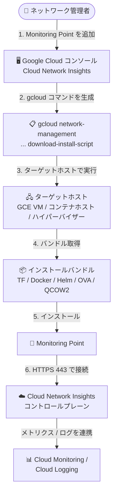

# Network Intelligence Center: Cloud Network Insights が Monitoring Point インストールバンドルをダウンロードする gcloud CLI コマンドの生成に対応

**リリース日**: 2026-09-14

**サービス**: Network Intelligence Center (Cloud Network Insights)

**機能**: Monitoring Point インストールバンドルをダウンロードする Google Cloud CLI コマンドのコンソール生成

**ステータス**: GA (Feature)

📊 [このアップデートのインフォグラフィックを見る](https://takech9203.github.io/google-cloud-news-summary/20260914-network-intelligence-center-monitoring-point-cli-bundles.html)

## 概要

Network Intelligence Center の Cloud Network Insights において、新しい Google Cloud Compute Engine、コンテナ (Docker/Podman、Helm)、または VM (VMware/KVM) の Monitoring Point を追加する際に、Monitoring Point インストールバンドルをダウンロードするための Google Cloud CLI (gcloud) コマンドを Google Cloud コンソール上で生成できるようになりました。

Cloud Network Insights は、AppNeta by Broadcom とのパートナーシップにより提供されるネットワーク監視ソリューションで、軽量エージェントである Monitoring Point がアクティブな合成プローブ (synthetic probing) を実行し、マルチクラウド・ハイブリッド環境のネットワーク健全性とアプリケーションパフォーマンスを可視化します。Monitoring Point の導入にはインストールバンドル (Docker Compose、Helm、Terraform 構成ファイル、OVA/QCOW2 用構成ファイルなど) をターゲットホストに配置する必要があり、その取得手段が今回強化されました。

対象ユーザーは、Google Cloud VPC、オンプレミスデータセンター、他クラウド環境などに Monitoring Point を多数展開するネットワーク運用チームです。gcloud コマンドをコンソールから生成できるため、ターゲットホスト上での取得作業が簡素化され、スクリプト化・自動化にも組み込みやすくなります。

**アップデート前の課題**

従来、Monitoring Point インストールバンドルの取得方法には次のような制約がありました。

- コンソールから「Download locally」でローカルにダウンロードした後、手動でターゲットホストにファイルを転送する必要があった
- 「Run a command on the host」を選ぶ場合、Cloud Shell を開いてトークンを生成し、テキストフィールドに貼り付けて curl コマンドを生成するという複数ステップの操作が必要だった
- 生成された curl コマンドは有効期限が 1 時間に制限されており、時間を置いた再利用や繰り返しの実行に向いていなかった

**アップデート後の改善**

- Compute Engine、コンテナ、VM の Monitoring Point 追加フローで、インストールバンドルをダウンロードする gcloud CLI コマンドをコンソール上で直接生成できるようになった
- Google Cloud CLI がインストール済みのターゲットホストであれば、生成されたコマンドを実行するだけでバンドルを直接取得でき、ローカルダウンロード後のファイル転送が不要になった
- gcloud コマンドは IAM 認証に基づいて実行されるため、トークンの手動生成・貼り付けの手間なく、運用スクリプトや自動化パイプラインへの組み込みが容易になった

## アーキテクチャ図



コンソールで生成した gcloud コマンドをターゲットホスト上で実行してインストールバンドルを取得し、Monitoring Point をインストールするまでの流れを示しています。インストール後、Monitoring Point は Cloud Network Insights コントロールプレーンに接続し、収集データは Cloud Monitoring / Cloud Logging に連携されます。

## サービスアップデートの詳細

### 主要機能

1. **gcloud CLI コマンドのコンソール生成**
   - コンソールの「Add monitoring point」フローで、インストールバンドルをダウンロードする gcloud コマンドを生成できる
   - Google Cloud CLI がインストールされたターゲットホスト上でそのまま実行可能

2. **複数の Monitoring Point タイプに対応**
   - Google Cloud (Compute Engine): Terraform 構成ファイル (TF) のバンドル
   - コンテナ: Docker/Podman (`CONTAINER`)、Kubernetes 向け Helm (`HELM`)
   - VM: VMware (OVA) / KVM (QCOW2) 用の構成ファイル

3. **既存のダウンロード方法との併用**
   - 従来どおり「Download locally」(ローカルダウンロード) と「Run a command on the host」(トークンベースの curl コマンド、有効期限 1 時間) も引き続き利用可能
   - 環境や運用フローに応じて取得方法を選択できる

## 技術仕様

### gcloud コマンドの構文 (コンテナ型 Monitoring Point の例)

```bash
gcloud network-management network-monitoring-providers \
  monitoring-points download-install-script \
  --network-monitoring-provider=PROVIDER_NAME \
  --location=global \
  --monitoring-point-type=MP_TYPE \
  --hostname=HOST_NAME \
  --output-file=compose.HOST_NAME.tar.gz
```

| パラメータ | 説明 |
|------|------|
| `PROVIDER_NAME` | プロバイダー名 (デフォルトは `external`) |
| `--location` | `global` を指定 |
| `MP_TYPE` | Monitoring Point のタイプ。Docker/Podman は `CONTAINER`、Helm (Kubernetes) は `HELM` |
| `HOST_NAME` | Monitoring Point をインストールするホスト名 |
| `--output-file` | 出力するバンドルのファイル名 |

### 必要な IAM ロール

| ロール | 用途 |
|------|------|
| Cloud Network Insights Editor (`roles/networkmanagement.CloudNetworkInsightsEditor`) | Cloud Network Insights を有効化したプロジェクトで Monitoring Point を追加 |
| Compute Admin (`roles/compute.admin`) | Terraform で Compute Engine Monitoring Point をデプロイする場合 |

### ファイアウォール要件

Monitoring Point はコントロールプレーンへのアウトバウンドインターネットアクセスが必要です。

| プロトコル | ポート | 説明 |
|------|------|------|
| TCP | 443 (HTTPS) | 必須。Cloud Network Insights コントロールプレーンへの接続 |
| UDP | 123 (NTP) | 必須。時刻同期がないと接続に失敗する |
| UDP/TCP | 53 (DNS) | 必須。エンドポイントの名前解決 |
| UDP | 3239, 33434 | テストトラフィック。標準の Network Path 監視 (デュアルエンド) に必要 |
| ICMP | Type 8 (echo request) | シングルエンドパス (例: 8.8.8.8 への ping) に必要 |

## 設定方法

### 前提条件

1. プロジェクトで Cloud Network Insights が有効化されており、Cloud Network Insights Editor ロールが付与されていること
2. ターゲットホストに Google Cloud CLI (gcloud) がインストールされ、認証済みであること
3. Monitoring Point がコントロールプレーンと通信できるようにファイアウォールルールが構成されていること

### 手順

#### ステップ 1: コンソールで Monitoring Point を追加

```text
Google Cloud コンソール > Network Intelligence > Cloud Network Insights > Monitoring Points
> Add monitoring point
```

Platform Type で「Google Cloud」「Docker/Podman」「Helm (Kubernetes)」「KVM」「VMware」のいずれかを選択し、Hostname などの必要項目を入力します。

#### ステップ 2: 生成された gcloud コマンドをターゲットホストで実行

```bash
# 例: Docker/Podman 用インストールバンドルのダウンロード
gcloud network-management network-monitoring-providers \
  monitoring-points download-install-script \
  --network-monitoring-provider=external \
  --location=global \
  --monitoring-point-type=CONTAINER \
  --hostname=my-mp-host \
  --output-file=compose.my-mp-host.tar.gz
```

ダウンロードしたバンドルを展開し、AppNeta のドキュメントに従って Monitoring Point をインストールします。

#### ステップ 3: インストールを確認

```text
Google Cloud コンソール > Network Intelligence Center > Cloud Network Insights
```

2〜5 分後に Monitoring Point が「Active」ステータスでテーブルに表示されます。10 分以内に表示されない場合はトラブルシューティングドキュメントを参照してください。

## メリット

### ビジネス面

- **展開スピードの向上**: バンドル取得がワンライナーのコマンドで完結し、多数の Monitoring Point を展開する際のリードタイムを短縮できる
- **運用負荷の軽減**: ローカルダウンロード後のファイル転送や Cloud Shell でのトークン生成といった手作業が減り、オペレーションミスのリスクを低減できる

### 技術面

- **自動化との親和性**: gcloud コマンドは IAM 認証で実行できるため、構成管理ツールや CI/CD パイプラインへの組み込みが容易
- **有効期限の制約の回避**: トークンベースの curl コマンド (有効期限 1 時間) と異なり、gcloud 認証情報が有効な限り必要なタイミングで実行できる
- **一貫したツールチェーン**: 他の Google Cloud リソース管理と同じ gcloud CLI で完結し、学習コストが低い

## デメリット・制約事項

### 制限事項

- gcloud 方式を利用するにはターゲットホストに Google Cloud CLI がインストールされている必要がある (インストールできない環境では従来の curl / ローカルダウンロード方式を利用)
- コンテナ型 Monitoring Point は導入後に構成 (プロキシ、NTP、タイムゾーン) を変更できないため、変更が必要な場合は削除して再追加する必要がある
- Monitoring Point の削除は Google Cloud コンソールではなく AppNeta 側で行う必要がある

### 考慮すべき点

- Cloud Network Insights を有効化したプロジェクトや監視対象のワークロード上への Monitoring Point のインストールは推奨されていない (ベストプラクティスに従い、中央 VPC やリモート拠点など戦略的なネットワークセグメントに配置する)
- Monitoring Point はコントロールプレーンへのアウトバウンドインターネットアクセスが必要なため、閉域環境ではファイアウォール構成や Private Service Connect (Compute Engine の場合) の検討が必要

## ユースケース

### ユースケース 1: 複数 VPC への Monitoring Point の一括展開

**シナリオ**: 複数プロジェクト・複数 VPC にまたがるハイブリッド環境で、各セグメントに Docker ベースの Monitoring Point を展開してレイテンシ・パケットロスを常時監視したい。

**実装例**:
```bash
# 各ターゲットホストで実行 (ホスト名のみ変えてスクリプト化)
for HOST in mp-vpc-central mp-vpc-east mp-branch-01; do
  gcloud network-management network-monitoring-providers \
    monitoring-points download-install-script \
    --network-monitoring-provider=external \
    --location=global \
    --monitoring-point-type=CONTAINER \
    --hostname=$HOST \
    --output-file=compose.$HOST.tar.gz
done
```

**効果**: トークン生成やファイル転送なしにバンドル取得をスクリプト化でき、展開作業を大幅に効率化できる。

### ユースケース 2: GKE クラスタへの Helm ベース Monitoring Point の導入

**シナリオ**: GKE 上のマイクロサービスのネットワークパフォーマンスを監視するため、Helm チャートで Monitoring Point をクラスタに導入したい。

**効果**: `--monitoring-point-type=HELM` を指定した gcloud コマンドで Helm 用バンドルを取得し、既存の Kubernetes デプロイフローに組み込める。

## 料金

今回のアップデート (gcloud コマンド生成機能) 自体に追加料金はありません。Cloud Network Insights および Monitoring Point を稼働させる Compute Engine VM などのリソースには通常の料金が適用されます。詳細は料金ページを参照してください。

- [Network Intelligence Center の料金](https://cloud.google.com/network-intelligence-center/pricing)

## 利用可能リージョン

Monitoring Point リソースはグローバルリソースとして管理されます (gcloud コマンドでは `--location=global` を指定)。Monitoring Point 自体は Google Cloud VPC、オンプレミス、他クラウド (AWS、Azure) など任意の監視対象環境に配置できます。

## 関連サービス・機能

- **Cloud Monitoring**: Monitoring Point が収集したパフォーマンスメトリクス (レイテンシ、ロス、ジッター) のダッシュボード表示とアラートポリシー設定
- **Cloud Logging**: AppNeta のアラーム・イベントログのエクスポート先。ログベースのアラートに利用
- **Private Service Connect**: Compute Engine Monitoring Point が AppNeta と通信する際のプライベート接続オプション
- **Cloud Marketplace / Terraform / Infrastructure Manager**: Compute Engine Monitoring Point のデプロイ手段
- **VPC Flow Logs / Flow Analyzer**: Monitoring Point の配置場所を決定する際のトラフィック分析に活用

## 参考リンク

- 📊 [インフォグラフィック](https://takech9203.github.io/google-cloud-news-summary/20260914-network-intelligence-center-monitoring-point-cli-bundles.html)
- [公式リリースノート](https://docs.cloud.google.com/release-notes#September_14_2026)
- [Cloud Network Insights ドキュメント](https://docs.cloud.google.com/network-intelligence-center/docs/cloud-network-insights/)
- [Monitoring Point の追加](https://docs.cloud.google.com/network-intelligence-center/docs/cloud-network-insights/add-monitoring-points)
- [コンテナ Monitoring Point のデプロイ](https://docs.cloud.google.com/network-intelligence-center/docs/cloud-network-insights/deploy-container-monitoring-points)
- [Compute Engine Monitoring Point のデプロイ](https://docs.cloud.google.com/network-intelligence-center/docs/cloud-network-insights/deploy-gce-monitoring-points)
- [VM Monitoring Point のデプロイ](https://docs.cloud.google.com/network-intelligence-center/docs/cloud-network-insights/deploy-vms-monitoring-points)
- [料金ページ](https://cloud.google.com/network-intelligence-center/pricing)

## まとめ

Cloud Network Insights の Monitoring Point 展開において、インストールバンドルの取得を gcloud CLI コマンドで行えるようになり、手動ダウンロードやトークンベースの curl コマンド (有効期限 1 時間) に頼らないシンプルで自動化しやすいワークフローが実現しました。多数の Monitoring Point をハイブリッド・マルチクラウド環境に展開している、または展開を計画しているチームは、コンソールの「Add monitoring point」フローで生成される gcloud コマンドを運用スクリプトに組み込むことを検討してください。

---

**タグ**: Network Intelligence Center, Cloud Network Insights, Monitoring Point, gcloud CLI, AppNeta, ネットワーク監視, 合成監視
