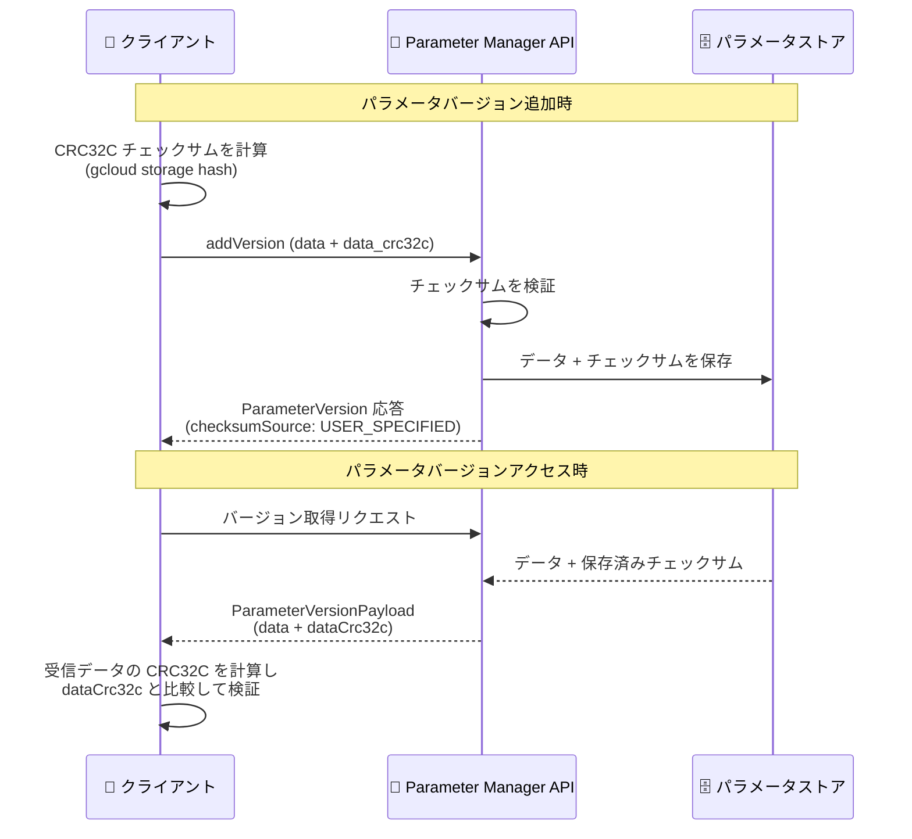

# Secret Manager (Parameter Manager): CRC32C チェックサムによるデータ整合性検証

**リリース日**: 2026-09-14

**サービス**: Secret Manager (Parameter Manager)

**機能**: パラメータバージョンの CRC32C チェックサムによるデータ整合性検証

**ステータス**: Feature

📊 [このアップデートのインフォグラフィックを見る](https://takech9203.github.io/google-cloud-news-summary/20260914-secret-manager-parameter-manager-crc32c.html)

## 概要

Parameter Manager が、パラメータバージョンの追加時およびアクセス時に CRC32C チェックサムを使用してデータの整合性を検証する機能をサポートしました。チェックサムはデータの「指紋」のようなもので、CRC32C アルゴリズムによりパラメータデータから生成される短いコードです。パラメータデータが 1 ビットでも変化するとチェックサムも変化するため、偶発的なデータの変更や破損を検出できます。

Parameter Manager は Secret Manager の拡張サービスであり、データベース接続文字列、API キー、環境別設定などのワークロード構成パラメータを一元管理するサービスです。Secret Manager のシークレットには以前から同様の CRC32C チェックサム機能が提供されていましたが、今回のアップデートによりパラメータでも同等のデータ整合性保証が利用できるようになりました。

構成データの破損はアプリケーションの誤動作に直結するため、CI/CD パイプラインやランタイムで構成を動的に取得するワークロードを運用するユーザーにとって、転送中・保存中のデータ整合性をエンドツーエンドで検証できることは重要な改善です。

**アップデート前の課題**

- Parameter Manager にはパラメータデータの整合性を検証するチェックサムの仕組みが提供されていなかった
- Secret Manager のシークレットでは CRC32C チェックサムによる整合性検証が利用できたが、パラメータでは同等の機能が使えなかった

**アップデート後の改善**

- パラメータバージョンの追加時に、クライアントが計算した CRC32C チェックサムをサーバー側で検証し、データとともに保存できるようになった
- パラメータバージョンのアクセス時に、データとともにチェックサムが返却され、受信したデータが保存されているデータと完全に一致することをクライアント側で検証できるようになった
- Google Cloud コンソールでパラメータバージョンを追加する際は、値の入力時にチェックサムが自動計算されるようになった

## アーキテクチャ図



パラメータバージョンの追加時はクライアントが計算したチェックサムをサーバーが検証・保存し、アクセス時はサーバーが返すチェックサムをクライアントが検証することで、双方向のデータ整合性を保証します。

## サービスアップデートの詳細

### 主要機能

1. **追加時のチェックサム検証**
   - パラメータバージョンの追加時に、`payload` の `data_crc32c` フィールドで CRC32C チェックサムを指定できる
   - Parameter Manager がパラメータデータの CRC32C チェックサムを計算し、パラメータデータとともに保存する
   - `ParameterVersion` 応答には、サーバーがチェックサムを正常に受信・検証したかを示すフィールドが含まれる (例: `"checksumSource": "USER_SPECIFIED"`)

2. **アクセス時のチェックサム返却**
   - パラメータバージョンにアクセスすると、`ParameterVersionPayload` にデータとともにチェックサム (`dataCrc32c`) が含まれて返却される
   - クライアントは受信データから CRC32C を再計算して比較することで、Parameter Manager に保存されているデータと完全に一致することを検証できる

3. **コンソールでの自動計算**
   - Google Cloud コンソールからパラメータバージョンを追加する場合、パラメータの値を入力するとチェックサムが自動的に計算される

4. **グローバル / リージョナル両対応**
   - グローバルエンドポイント (`parametermanager.googleapis.com`) とリージョナルエンドポイント (`parametermanager.LOCATION.rep.googleapis.com`) の両方でチェックサム付きのバージョン追加が可能

## 技術仕様

### チェックサムの仕様

| 項目 | 詳細 |
|------|------|
| アルゴリズム | CRC32C |
| エンコード形式 | 10 進数の整数 (`ParameterVersionPayload` proto では int64) |
| 指定フィールド | `payload.data_crc32c` |
| 応答フィールド | `payload.dataCrc32c`、`checksumSource` |
| チェックサム計算ツール | `gcloud storage hash` (16 進数出力を 10 進数に変換して使用) |

### アクセス時の応答例

```json
{
  "name": "projects/PROJECT_ID/locations/global/parameters/PARAMETER_ID/versions/VERSION_ID",
  "payload": {
    "data": "cG9ydDogODA4MAo=",
    "dataCrc32c": "1739307059"
  },
  "checksumSource": "USER_SPECIFIED"
}
```

## 設定方法

### 前提条件

1. Parameter Manager API (`parametermanager.googleapis.com`) が有効化されていること
2. パラメータバージョンを追加できる IAM 権限 (`parametermanager.parameterVersions.create` を含むロール) を持っていること

### 手順

#### ステップ 1: チェックサムの計算

```bash
# ファイルに保存されたパラメータデータのチェックサムを計算
gcloud storage hash "/path/to/file.yaml" --hex

# パラメータデータを Base64 エンコードしてシェル変数に保存
PARAMETER_DATA=$(echo "port: 8080" | base64)

# コマンドラインで渡すデータのチェックサムを計算
gcloud storage hash --hex cat <(echo "${PARAMETER_DATA}")
```

チェックサムは 10 進数形式に変換する必要があります (`ParameterVersionPayload` proto では int64 としてエンコードされます)。

#### ステップ 2: チェックサム付きでパラメータバージョンを追加 (グローバル)

```bash
curl "https://parametermanager.googleapis.com/v1/projects/PROJECT_ID/locations/global/parameters/PARAMETER_ID/versions?parameter_version_id=PARAMETER_VERSION_ID" \
  --request "POST" \
  --header "authorization: Bearer $(gcloud auth print-access-token)" \
  --header "content-type: application/json" \
  --data "{\"payload\": {\"data\": \"${PARAMETER_DATA}\", \"data_crc32c\": $CHECKSUM}}"
```

リージョナルパラメータの場合は、エンドポイントを `https://parametermanager.LOCATION.rep.googleapis.com/v1/projects/PROJECT_ID/locations/LOCATION/parameters/PARAMETER_ID/versions?parameter_version_id=PARAMETER_VERSION_ID` に置き換えます。

## メリット

### ビジネス面

- **構成データの信頼性向上**: アプリケーションの動作を左右する構成パラメータの破損を検出でき、誤った構成によるインシデントのリスクを低減できる
- **コンプライアンス対応**: データ整合性の検証プロセスを構成管理ワークフローに組み込むことで、変更管理・監査要件への対応を強化できる

### 技術面

- **エンドツーエンドの整合性検証**: 追加時 (クライアント → サーバー) とアクセス時 (サーバー → クライアント) の双方向でデータ破損を検出できる
- **Secret Manager と一貫した運用**: Secret Manager のシークレットと同じ CRC32C ベースの検証手法をパラメータにも適用でき、整合性検証の実装を統一できる
- **1 ビットの変化も検出**: CRC32C アルゴリズムにより、データのわずかな変化・破損も検出可能

## デメリット・制約事項

### 制限事項

- 顧客管理の暗号鍵 (CMEK) で暗号化され、2026 年 8 月 24 日より前に作成されたパラメータバージョンには、チェックサムが保存されていない

### 考慮すべき点

- チェックサムは CRC32C アルゴリズムで計算し、10 進数の整数としてエンコードする必要がある (`gcloud storage hash` の 16 進数出力は変換が必要)
- アクセス時の検証はクライアント側で受信データのチェックサムを計算・比較する実装が必要

## ユースケース

### ユースケース 1: CI/CD パイプラインでの構成デプロイの整合性保証

**シナリオ**: CI/CD パイプラインから環境別の構成ファイル (YAML/JSON) をパラメータバージョンとして登録する際、転送中の破損がないことを保証したい。

**実装例**:
```bash
# 構成ファイルのチェックサムを計算してからバージョンを追加
gcloud storage hash "config/prod.yaml" --hex
# 10 進数に変換した値を data_crc32c に指定して API を呼び出す
```

**効果**: パイプラインからアップロードした構成データがサーバーに正しく保存されたことを、`checksumSource` フィールドで確認できる。

### ユースケース 2: ランタイムでの構成取得時の検証

**シナリオ**: アプリケーションが起動時や実行中に Parameter Manager から構成を動的に取得する際、受信した構成データが保存されているものと一致することを検証したい。

**効果**: 応答に含まれる `dataCrc32c` とクライアント側で計算したチェックサムを比較することで、破損した構成データによるアプリケーションの誤動作を防止できる。

## 料金

このアップデートに固有の料金情報は Release Notes およびドキュメントには記載されていません。Secret Manager / Parameter Manager の料金の詳細は公式料金ページを参照してください。

- [Secret Manager 料金ページ](https://cloud.google.com/secret-manager/pricing)

## 利用可能リージョン

チェックサム機能はグローバルパラメータとリージョナルパラメータの両方で利用できます。Parameter Manager がサポートするリージョナルエンドポイントの一覧は [Parameter Manager のロケーション](https://docs.cloud.google.com/secret-manager/docs/locations#parameter_manager_locations) を参照してください。

## 関連サービス・機能

- **Secret Manager**: Parameter Manager の親サービス。シークレットバージョンでは以前から同様の CRC32C チェックサムによるデータ整合性検証が提供されており、今回パラメータにも同等の機能が拡張された
- **Cloud KMS (CMEK)**: 顧客管理の暗号鍵でパラメータバージョンを暗号化できる。CMEK で暗号化され 2026 年 8 月 24 日より前に作成されたバージョンにはチェックサムが保存されていない点に注意
- **IAM (Identity and Access Management)**: パラメータバージョンの追加・アクセスには `parametermanager.parameterVersions.create` / `get` などの権限が必要
- **Cloud Storage**: `gcloud storage hash` コマンドを CRC32C チェックサムの計算に利用できる。Cloud Storage 自体もオブジェクトの整合性検証に CRC32C を採用している

## 参考リンク

- 📊 [インフォグラフィック](https://takech9203.github.io/google-cloud-news-summary/20260914-secret-manager-parameter-manager-crc32c.html)
- [公式リリースノート](https://docs.cloud.google.com/release-notes#September_14_2026)
- [ドキュメント: Data integrity assurance (Parameter Manager)](https://docs.cloud.google.com/secret-manager/parameter-manager/docs/data-integrity)
- [Parameter Manager 概要](https://docs.cloud.google.com/secret-manager/parameter-manager/docs/overview)
- [パラメータバージョンの追加](https://docs.cloud.google.com/secret-manager/parameter-manager/docs/add-parameter-version)
- [料金ページ](https://cloud.google.com/secret-manager/pricing)

## まとめ

Parameter Manager が CRC32C チェックサムによるデータ整合性検証をサポートし、Secret Manager のシークレットと同等の整合性保証がパラメータでも利用できるようになりました。構成データを Parameter Manager で管理しているチームは、バージョン追加時の `data_crc32c` 指定とアクセス時のクライアント側検証をワークフローに組み込むことを推奨します。CMEK 利用時は、2026 年 8 月 24 日より前に作成されたバージョンにチェックサムが保存されていない点に留意してください。

---

**タグ**: #SecretManager #ParameterManager #CRC32C #DataIntegrity #Security #Configuration
