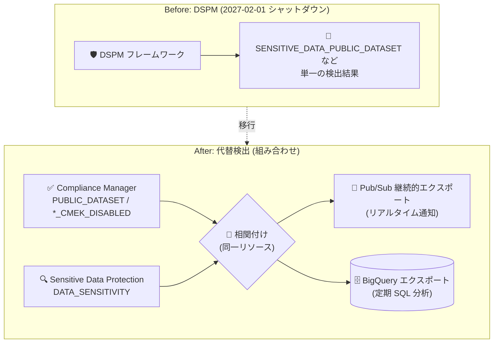

# Security Command Center: Data Security Posture Management (DSPM) の非推奨化

**リリース日**: 2026-09-14

**サービス**: Security Command Center

**機能**: Data Security Posture Management (DSPM) の非推奨化 (2027 年 2 月 1 日シャットダウン)

**ステータス**: Deprecated

📊 [このアップデートのインフォグラフィックを見る](https://takech9203.github.io/google-cloud-news-summary/20260914-security-command-center-dspm-deprecation.html)

## 概要

Security Command Center の Data Security Posture Management (DSPM) が非推奨 (Deprecated) となり、**2027 年 2 月 1 日にシャットダウン** されることが発表された。DSPM は、組織内の機密データの所在を特定し、そのデータに対するセキュリティ体制 (公開アクセス、CMEK 未使用、過剰な権限など) を継続的に評価・監視するデータ中心のセキュリティ機能で、Security Command Center の Standard / Premium / Enterprise 各ティアで提供されてきた。

シャットダウン後も同等の検出を継続できるよう、公式ドキュメントでは DSPM の各データセキュリティコントロールに対応する **代替の検出機能** が案内されている。具体的には、Compliance Manager の検出器 (例: `PUBLIC_DATASET`、`BIGQUERY_TABLE_CMEK_DISABLED`) と Sensitive Data Protection の `DATA_SENSITIVITY` 検出結果を組み合わせることで、「機密データを含むリソースのセキュリティ違反」という DSPM 相当の検出を再現できる。

DSPM を利用している組織の管理者やセキュリティチームは、シャットダウン日までに代替検出への移行計画を立てる必要がある。なお、関連情報として Security Command Center Enterprise ティア自体も 2027 年 5 月 21 日にシャットダウンされ、対象組織は Premium ティアへ自動移行される予定である。

**アップデート前の状況 (DSPM で提供されていた機能)**

- 「Data security and privacy essentials」フレームワークが組織に自動適用され、機密データを含む BigQuery / Cloud SQL リソースの公開アクセスや CMEK 未使用を単一の検出結果 (例: `SENSITIVE_DATA_PUBLIC_DATASET`) として通知していた
- データセキュリティダッシュボードで、機密度やプロジェクトによるフィルタリングを含むデータマップの可視化が可能だった
- Data Access Governance (許可されていないユーザーによる機密データアクセスの検出) や Data Flow Governance (地理的管轄をまたぐ機密データフローの検出) などの高度なコントロールを利用できた

**アップデート後の影響と対応**

- DSPM は 2027 年 2 月 1 日にシャットダウンされ、DSPM 固有の検出結果やダッシュボードは利用できなくなる
- 基本的なコントロールは、Compliance Manager の検出器と Sensitive Data Protection の `DATA_SENSITIVITY` 検出結果の組み合わせで代替できる
- 2 つの検出結果の相関付けは、Pub/Sub への継続的エクスポートによるリアルタイム処理、または BigQuery エクスポートに対する定期的な SQL 分析で実装する必要がある

## アーキテクチャ図



DSPM が単一の検出結果として提供していた「機密データ + セキュリティ違反」の検出は、移行後は Compliance Manager と Sensitive Data Protection の 2 つの検出結果を同一リソース上で相関付けることで再現する。

## サービスアップデートの詳細

### 非推奨化のスケジュール

| 日付 | イベント |
|------|---------|
| 2026 年 9 月 14 日 | DSPM の非推奨化を発表 |
| 2027 年 2 月 1 日 | DSPM のシャットダウン |
| (参考) 2027 年 5 月 21 日 | Security Command Center Enterprise ティアのシャットダウン (Premium へ自動移行) |

### 影響を受ける主なコントロールと代替検出機能

DSPM の「Data security and privacy essentials」フレームワークに含まれる基本コントロールは、Compliance Manager の検出器に Sensitive Data Protection の `DATA_SENSITIVITY` 検出結果を組み合わせることで代替できる。

| DSPM コントロール | Compliance Manager の代替検出器 | 組み合わせる検出結果 |
|------------------|--------------------------------|---------------------|
| `SENSITIVE_DATA_BIGQUERY_TABLE_CMEK_DISABLED` | `BIGQUERY_TABLE_CMEK_DISABLED` | `DATA_SENSITIVITY` |
| `SENSITIVE_DATA_DATASET_CMEK_DISABLED` | `DATASET_CMEK_DISABLED` | `DATA_SENSITIVITY` |
| `SENSITIVE_DATA_PUBLIC_DATASET` | `PUBLIC_DATASET` | `DATA_SENSITIVITY` |
| `SENSITIVE_DATA_PUBLIC_SQL_INSTANCE` | `PUBLIC_SQL_INSTANCE` および `SQL_PUBLIC_IP` | `DATA_SENSITIVITY` |
| `SENSITIVE_DATA_SQL_CMEK_DISABLED` | `SQL_CMEK_DISABLED` | `DATA_SENSITIVITY` |

### シャットダウンにより影響を受ける DSPM の機能

1. **データセキュリティダッシュボード**
   - データマップエクスプローラーによるデータ所在の可視化、機密度・プロジェクトによるフィルタリング
   - ポリシー違反の検出結果、フレームワークのデプロイ状況・カバレッジの表示

2. **データセキュリティフレームワーク**
   - 組織に自動適用される「Data security and privacy essentials」フレームワークと、そのコピーによるカスタムフレームワーク
   - 組織・フォルダ・プロジェクト・App Hub アプリケーションへの適用

3. **高度なデータセキュリティコントロール (Premium / Enterprise)**
   - Data Access Governance: 許可されていないプリンシパルによる機密データアクセスの検出 (BigQuery、Cloud Storage、Agent Platform)
   - Data Flow Governance: 地理的管轄をまたぐ機密データフローの検出
   - 機密データの CMEK 強制、最大保持期間の管理などのコントロール

## 技術仕様

### 代替検出における相関付けの方法

2 つの検出結果 (Compliance Manager の検出器と `DATA_SENSITIVITY`) を同一リソース上で相関付ける方法として、以下の 2 つが案内されている。

| 方法 | 仕組み | 適した用途 |
|------|--------|-----------|
| Pub/Sub リアルタイムアラート | `ACTIVE` 検出結果をフィルタする継続的エクスポートを構成し、Cloud Run functions などで両方の検出結果が存在する場合にアラートを発報 | リアルタイム通知が必要な場合 |
| BigQuery 定期分析 | 検出結果を BigQuery にエクスポートし、`findings` テーブルを `resource_name` で自己結合して両方が `ACTIVE` のリソースを抽出 | 定期レポート、監査証跡 |

### BigQuery での相関クエリの考え方

```sql
-- findings テーブルを resource_name で自己結合し、
-- Compliance Manager の検出結果と DATA_SENSITIVITY の
-- 両方が ACTIVE のリソースを抽出する
SELECT a.resource_name
FROM findings AS a
JOIN findings AS b
  ON a.resource_name = b.resource_name
WHERE a.category = 'PUBLIC_DATASET'
  AND b.category = 'DATA_SENSITIVITY'
  AND a.state = 'ACTIVE'
  AND b.state = 'ACTIVE';
```

## 移行方法

### 前提条件

1. Security Command Center が組織レベルで有効化されていること
2. Sensitive Data Protection の検出スキャン (データプロファイリング) が有効で、`DATA_SENSITIVITY` の検出結果が生成されていること

### 手順

#### ステップ 1: DSPM への依存状況の棚卸し

現在デプロイしている DSPM フレームワーク (組み込み / カスタム) と、運用で利用している検出結果のカテゴリ (例: `SENSITIVE_DATA_PUBLIC_DATASET`) を洗い出す。

#### ステップ 2: 代替検出器の有効化の確認

Compliance Manager の対応する検出器 (`PUBLIC_DATASET`、`BIGQUERY_TABLE_CMEK_DISABLED` など) と Sensitive Data Protection の検出が有効であることを確認する。

#### ステップ 3: 相関付けパイプラインの構築

```bash
# 例: ACTIVE な検出結果を Pub/Sub に継続的エクスポートする設定を作成
gcloud scc notifications create dspm-migration-export \
  --organization=ORGANIZATION_ID \
  --pubsub-topic=projects/PROJECT_ID/topics/scc-findings \
  --filter='state="ACTIVE"'
```

Pub/Sub 経由のリアルタイム処理、または BigQuery エクスポート + 定期 SQL のいずれかで、2 つの検出結果を相関付ける仕組みを構築する。

#### ステップ 4: 通知・運用フローの切り替え

DSPM の検出結果に依存していたアラート、チケット起票、レポートを新しい相関付けの結果に切り替え、2027 年 2 月 1 日までに移行を完了する。

## デメリット・制約事項

### 制限事項

- DSPM のシャットダウン (2027 年 2 月 1 日) 以降、DSPM のダッシュボード、フレームワーク、DSPM 固有の検出結果は利用できなくなる
- 代替方式では「機密データ + セキュリティ違反」が単一の検出結果として提供されず、2 つの検出結果の相関付けをユーザー側で実装する必要がある
- Data Access Governance には従来から読み取りオペレーションのみ対象、サービスアカウントは対象外、リンクされたデータセット非対応などの制限があった

### 考慮すべき点

- 相関付けパイプライン (Pub/Sub + Cloud Run functions、または BigQuery エクスポート) の構築・運用コストが新たに発生する
- Enterprise ティア利用組織は、DSPM のシャットダウンに加えて 2027 年 5 月 21 日の Enterprise ティアのシャットダウン (Premium への自動移行) も踏まえた移行計画が必要
- カスタムのデータセキュリティフレームワークを運用している場合、要件を Compliance Manager 側の構成に読み替える作業が必要

## ユースケース

### ユースケース 1: 公開 BigQuery データセット上の機密データ検出の移行

**シナリオ**: DSPM の `SENSITIVE_DATA_PUBLIC_DATASET` を使って、機密データを含む公開データセットを検出・通知していた組織が、シャットダウンに備えて検出を移行する。

**実装例**:
```
1. Compliance Manager の PUBLIC_DATASET 検出器が有効であることを確認
2. Sensitive Data Protection のデータプロファイリングで DATA_SENSITIVITY を生成
3. 検出結果を BigQuery にエクスポートし、resource_name で自己結合する
   定期クエリをスケジュール実行
4. 両方が ACTIVE のリソースを抽出してアラートを発報
```

**効果**: DSPM シャットダウン後も、機密データを含む公開データセットの検出を継続できる。

### ユースケース 2: リアルタイムのデータリスク通知への移行

**シナリオ**: DSPM の検出結果をトリガーにインシデント対応フローを起動していたセキュリティ運用チームが、リアルタイム性を維持したまま移行する。

**効果**: `ACTIVE` 検出結果の Pub/Sub 継続的エクスポートと Cloud Run functions による相関判定で、従来と同等のリアルタイム通知を維持できる。

## 料金

DSPM は Security Command Center のサービスティアに含まれる機能として提供されてきた。代替検出に利用する Compliance Manager、Sensitive Data Protection の料金の詳細は、料金ページを参照。

- [Security Command Center の料金](https://cloud.google.com/security-command-center/pricing)
- [Sensitive Data Protection の料金](https://cloud.google.com/sensitive-data-protection/pricing)

## 関連サービス・機能

- **Compliance Manager**: DSPM の基本コントロールに対応する検出器 (`PUBLIC_DATASET`、`SQL_CMEK_DISABLED` など) を提供する代替手段
- **Sensitive Data Protection**: 機密データの検出・分類を担い、`DATA_SENSITIVITY` 検出結果を代替検出の相関付けに利用する
- **Pub/Sub / Cloud Run functions**: 検出結果の継続的エクスポートとリアルタイム相関判定に使用
- **BigQuery**: 検出結果のエクスポート先として、定期的な相関分析 (自己結合クエリ) に使用

## 参考リンク

- 📊 [インフォグラフィック](https://takech9203.github.io/google-cloud-news-summary/20260914-security-command-center-dspm-deprecation.html)
- [公式リリースノート](https://docs.cloud.google.com/release-notes#September_14_2026)
- [DSPM の概要 (コントロールと代替検出機能)](https://docs.cloud.google.com/security-command-center/docs/dspm-data-security#data-security-framework)
- [DSPM の有効化と使用](https://docs.cloud.google.com/security-command-center/docs/dspm-use-data-security)
- [Security Command Center のサービスティア](https://docs.cloud.google.com/security-command-center/docs/service-tiers)

## まとめ

Security Command Center の DSPM が非推奨となり、2027 年 2 月 1 日にシャットダウンされる。DSPM を利用中の組織は、Compliance Manager の検出器と Sensitive Data Protection の `DATA_SENSITIVITY` を組み合わせた代替検出への移行が必要であり、Pub/Sub または BigQuery を用いた相関付けパイプラインの設計・構築を早めに開始することを推奨する。

---

**タグ**: Security Command Center, DSPM, Deprecated, Compliance Manager, Sensitive Data Protection, データセキュリティ
