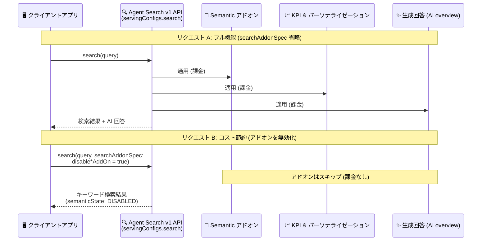

# Vertex AI Search: Agent Search 設定可能な料金向け検索クエリアドオン仕様 (searchAddonSpec) GA

**リリース日**: 2026-09-14

**サービス**: Vertex AI Search (Agent Search)

**機能**: 設定可能な料金 (Configurable Pricing) のための検索クエリアドオン仕様 `searchAddonSpec`

**ステータス**: GA (一般提供)

📊 [このアップデートのインフォグラフィックを見る](https://takech9203.github.io/google-cloud-news-summary/20260914-vertex-ai-search-search-addon-spec-ga.html)

## 概要

Vertex AI Search (Agent Search) において、設定可能な料金 (Configurable Pricing) モデル向けの検索クエリアドオン仕様 `searchAddonSpec` が v1 API で一般提供 (GA) になりました。`searchAddonSpec` を使うと、プログラムから実行する個別の検索リクエストごとにアドオン (Semantic クエリ、KPI & パーソナライゼーション、生成回答 (AI overview)) を無効化でき、そのリクエストに対するアドオン課金を回避してコストを節約できます。

Agent Search のカスタム検索には、従量課金の General モデルと、サブスクリプション (クエリスループット QPM + ストレージ) にアドオンを組み合わせる Configurable モデルの 2 つの料金モデルがあります。Configurable モデルでは、検索リクエストアドオンは「適用可能な場合はデフォルトで適用」され、適用されたアドオンごとに対応する SKU で課金されます。そのため、不要なアドオンの課金を避けるには明示的な無効化が必要であり、その API レベルの制御手段が今回 GA になった `searchAddonSpec` です。

対象ユーザーは、Configurable Pricing を利用して検索コストを最適化したい開発者・アーキテクトです。キーワード検索だけで十分なクエリでは Semantic アドオンや生成回答をオフにするなど、リクエスト単位できめ細かなコスト制御ができるようになります。

**アップデート前の課題**

- `searchAddonSpec` は v1beta API の Preview 機能であり、Pre-GA 提供条件 (サポート制限、互換性が保証されない変更の可能性) が適用されていたため、本番ワークロードでの利用にはリスクがあった
- 検索リクエストアドオンは適用可能な条件が揃うと自動的に適用されるため、Configurable Pricing 下では意図しないアドオン課金が発生し得た (例: データストアで Semantic embedding アドオンが有効だと、明示的に要求しなくても Semantic クエリアドオンが適用・課金される)
- ウィジェット利用時はウィジェットの UI 設定でアドオンを制限できたが、API から直接検索を実行するアプリケーションでは GA 版のリクエスト単位の制御手段がなかった

**アップデート後の改善**

- `searchAddonSpec` が v1 API で GA となり、SLA を伴う本番環境でリクエスト単位のアドオン制御を利用できるようになった
- `disableSemanticAddOn`、`disableKpiPersonalizationAddOn`、`disableGenerativeAnswerAddOn` の 3 フィールドで、検索リクエストごとに不要なアドオンを無効化し、そのリクエスト分のアドオン課金を回避できるようになった
- クエリの性質 (単純なキーワード検索か、セマンティック検索や AI 回答が必要か) に応じて、アプリケーション側でコストと機能のトレードオフを動的に選択できるようになった

## アーキテクチャ図



`searchAddonSpec` を省略するとアドオンは適用可能な範囲でデフォルト適用・課金され、リクエストごとに `disable*AddOn` を `true` に設定するとそのアドオンはスキップされて課金も発生しません。

## サービスアップデートの詳細

### 主要機能

1. **リクエスト単位のアドオン無効化 (v1 API で GA)**
   - `engines.servingConfigs.search` メソッドのリクエストボディに `searchAddonSpec` オブジェクトを指定
   - アドオンを無効化すると、Agent Search はそのリクエストにアドオンを適用せず、課金も発生しない
   - フィールドを省略または未設定のままにすると、該当アドオンは適用可能な場合にデフォルトで適用される

2. **3 種類の検索リクエストアドオンを個別制御**
   - `disableSemanticAddOn`: Semantic クエリアドオン (embeddings を使った長く複雑なクエリのセマンティック検索) を無効化
   - `disableKpiPersonalizationAddOn`: KPI & パーソナライゼーションアドオン (ユーザーイベントに基づく再ランキング・パーソナライズ) を無効化
   - `disableGenerativeAnswerAddOn`: 生成回答 (AI overview) アドオン (生成サマリー、フォローアップ質問) を無効化

3. **レスポンスでの適用状態の確認**
   - Semantic アドオンを無効化した場合、レスポンスに `"semanticState": "DISABLED"` が含まれ、適用状態を確認できる
   - 検索結果には `rankSignals` (keywordSimilarityScore、topicalityRank など) が含まれ、キーワード検索としてのランキング根拠を確認できる

## 技術仕様

### searchAddonSpec のフィールド

| フィールド | 型 | 説明 |
|------|------|------|
| `disableSemanticAddOn` | boolean | `true` で Semantic クエリアドオンを無効化。前提: データストアの Semantic embedding アドオン |
| `disableKpiPersonalizationAddOn` | boolean | `true` で KPI & パーソナライゼーションアドオンを無効化 |
| `disableGenerativeAnswerAddOn` | boolean | `true` で生成回答 (AI overview) アドオンを無効化。生成回答は Semantic クエリアドオンが前提 |

### アドオンの適用ルール

| 項目 | 詳細 |
|------|------|
| デフォルト動作 | 適用可能な場合、アドオンはデフォルトで適用・課金される (明示的に要求しなくても適用) |
| 無効化の手段 (API) | リクエストごとに `searchAddonSpec` で無効化 (今回 GA) |
| 無効化の手段 (ウィジェット) | Google Cloud コンソールのアプリ設定 (UI タブ) でアドオンを選択。検索タイプ「Search」では Semantic クエリアドオンを無効化可能。「Search with an answer」「Search with follow-ups」では Semantic は常時オン |
| 必要な権限 | アドオン管理に特別なロール・権限は不要 |
| 適用対象 | Configurable Pricing は Agent Search のアプリ・データストアのみに適用 (Gemini Enterprise 用データストアは General モデルを選択) |

### リクエスト例 (v1 API)

```json
{
  "query": "BigQuery data platform",
  "searchAddonSpec": {
    "disableSemanticAddOn": true,
    "disableKpiPersonalizationAddOn": true,
    "disableGenerativeAnswerAddOn": true
  }
}
```

## 設定方法

### 前提条件

1. Agent Search アプリとデータストアが作成済みであること
2. プロジェクトレベルで Configurable Pricing モデルを有効化し、対象のアプリとデータストアを個別に登録していること (未登録リソースは従量課金レートで課金)

### 手順

#### ステップ 1: 検索リクエストで searchAddonSpec を指定する

```bash
curl -X POST -H "Authorization: Bearer $(gcloud auth print-access-token)" \
  -H "Content-Type: application/json" \
  "https://discoveryengine.googleapis.com/v1/projects/PROJECT_ID/locations/global/collections/default_collection/engines/APP_ID/servingConfigs/default_search:search" \
  -d '{
    "query": "QUERY",
    "searchAddonSpec": {
      "disableSemanticAddOn": BOOL_DISABLE_SEMANTIC,
      "disableKpiPersonalizationAddOn": BOOL_DISABLE_KPI,
      "disableGenerativeAnswerAddOn": BOOL_DISABLE_GEN_ANSWER
    }
  }'
```

`PROJECT_ID`、`APP_ID`、`QUERY` を置き換え、無効化したいアドオンのフィールドを `true` に設定します。

#### ステップ 2: レスポンスで適用状態を確認する

```bash
# レスポンス例 (抜粋): Semantic アドオンが無効化されている
# {
#   "results": [ ... ],
#   "semanticState": "DISABLED"
# }
```

Semantic アドオンを無効化した場合、レスポンスの `semanticState` が `DISABLED` になっていることを確認します。

## メリット

### ビジネス面

- **リクエスト単位のコスト最適化**: 高度な機能が不要なクエリではアドオンをオフにすることで、Configurable Pricing 下のアドオン課金 (Semantic $0.75/1,000 クエリ、KPI & パーソナライゼーション $0.20/1,000 クエリ、Core Generative Answers $2.00/1,000 クエリ) を回避できる
- **予測可能なコスト管理**: サブスクリプション (QPM + ストレージ) にアドオンの利用量を明示的に制御して組み合わせることで、月次コストの見通しが立てやすくなる

### 技術面

- **GA による本番利用**: v1 API での GA により、Pre-GA 提供条件の制約なしに本番ワークロードへ組み込める
- **動的な機能選択**: クエリの種別 (SKU 検索のような単純なルックアップと、自然言語の複雑な質問) をアプリケーション側で判定し、リクエストごとに最適な機能セットを適用できる
- **デフォルト動作との共存**: フィールド未設定時はデフォルト適用となるため、既存リクエストへの影響なしに、コストを抑えたい経路にだけ段階的に導入できる

## デメリット・制約事項

### 制限事項

- Configurable Pricing は Agent Search のアプリ・データストアのみに適用される (Gemini Enterprise アプリ用データストアは General 料金モデルを選択する必要がある)
- Configurable Pricing モデルで作成したデータストアは、同じく Configurable Pricing モデルの検索アプリからのみ利用できる
- 生成回答 (AI overview) アドオンは Semantic クエリアドオンが前提のため、Semantic を無効化した状態で生成回答だけを利用することはできない
- ウィジェット利用時、検索タイプ「Search with an answer」「Search with follow-ups」では Semantic クエリアドオンを無効化できない

### 考慮すべき点

- アドオンは「適用可能なら自動適用・課金」がデフォルトのため、コストを抑えたい場合は無効化を明示する運用ルールが必要 (無効化し忘れると課金が発生する)
- Semantic アドオンを無効化するとキーワードベースの検索になり、長く複雑な自然言語クエリの検索品質が低下する可能性がある。コスト削減と検索品質のトレードオフを評価すること
- サブスクリプションの QPM を超えた利用はオーバーレッジとして General モデルの Standard Edition レート ($1.50/1,000 クエリ) で課金される

## ユースケース

### ユースケース 1: クエリ種別に応じたアドオンの出し分け

**シナリオ**: EC サイトの検索バックエンドで、型番・SKU などの単純なキーワード検索と、自然言語の商品相談クエリが混在している。単純なクエリにまで Semantic アドオンや生成回答が適用されるとコストが嵩む。

**実装例**:
```json
// 型番検索など単純なクエリ: アドオンをすべて無効化
{
  "query": "SKU-12345",
  "searchAddonSpec": {
    "disableSemanticAddOn": true,
    "disableKpiPersonalizationAddOn": true,
    "disableGenerativeAnswerAddOn": true
  }
}

// 自然言語の相談クエリ: アドオンをデフォルト適用 (searchAddonSpec 省略)
{
  "query": "冬の登山に向いた防水性の高いジャケットは?"
}
```

**効果**: 単純なクエリではアドオン課金 (Semantic + KPI + 生成回答で合計 $2.95/1,000 クエリ相当) を回避しつつ、複雑なクエリでは高い検索品質を維持できる。

### ユースケース 2: バッチ処理・内部システムからの大量検索のコスト削減

**シナリオ**: データ品質チェックやコンテンツ棚卸しのため、内部バッチジョブから Agent Search に大量の機械的な検索リクエストを発行している。パーソナライズや AI 回答は不要。

**効果**: バッチ経路のリクエストで全アドオンを無効化することで、人間のユーザー向け検索体験に影響を与えずに、大量リクエスト分のアドオン課金をゼロにできる。

## 料金

Agent Search の Configurable Pricing は、コアサブスクリプション (クエリスループット QPM + ストレージ) と、従量課金のアドオンで構成されます。最低月間コミットメントは 1,000 QPM および 50 GB ストレージです。検索リクエストアドオンは適用されたリクエスト分だけ課金され、`searchAddonSpec` で無効化したリクエストには課金されません。

### 料金例 (Configurable Pricing、標準レート)

| 項目 | 料金 (USD) |
|--------|-----------------|
| コアサブスクリプション - Query Unit | $0.008219178 / QPM / 時間 (約 $6 / QPM / 月) |
| コアサブスクリプション - Storage Unit | $0.001369863 / GiB / 時間 (約 $1 / GB / 月) |
| Semantic アドオン | $0.75 / 1,000 クエリ |
| KPI & パーソナライゼーションアドオン | $0.20 / 1,000 クエリ |
| Core Generative Answers アドオン | $2.00 / 1,000 クエリ |
| Advanced Generative Answers (AI Mode) | $4.00 / 1,000 クエリ |
| オーバーレッジ (QPM 超過分) | $1.50 / 1,000 クエリ (General モデル Standard Edition レート) |

最新の料金は [Agent Search の料金ページ](https://cloud.google.com/generative-ai-app-builder/pricing) を参照してください。

## 利用可能リージョン

公式ドキュメントおよびリリースノートにリージョン固有の記載はありません。詳細は [Agent Search のドキュメント](https://docs.cloud.google.com/generative-ai-app-builder/docs/enable-configurable-pricing) を参照してください。

## 関連サービス・機能

- **Discovery Engine API (`discoveryengine.googleapis.com`)**: `searchAddonSpec` を指定する `engines.servingConfigs.search` メソッドを提供する API
- **検索ウィジェット**: ウィジェットでアプリをホストする場合は、コンソールの UI 設定でウィジェットレベルのアドオン制御が可能 (API のリクエスト単位制御と併用できる)
- **Gemini Enterprise**: Gemini Enterprise アプリ用のデータストアは Configurable Pricing の対象外で、General 料金モデルを選択する必要がある
- **Cloud Billing**: Configurable Pricing ではアドオンごとに対応する SKU で課金されるため、請求レポートでアドオン別のコストを追跡できる

## 参考リンク

- 📊 [インフォグラフィック](https://takech9203.github.io/google-cloud-news-summary/20260914-vertex-ai-search-search-addon-spec-ga.html)
- [公式リリースノート](https://docs.cloud.google.com/release-notes#September_14_2026)
- [ドキュメント: 検索リクエストに適用するアドオンの制御](https://docs.cloud.google.com/generative-ai-app-builder/docs/enable-configurable-pricing#control-addons)
- [ドキュメント: 検索クエリアドオンの Configurable Pricing の管理](https://docs.cloud.google.com/generative-ai-app-builder/docs/enable-configurable-pricing#search-configurable)
- [料金ページ: Agent Search Configurable Pricing](https://cloud.google.com/generative-ai-app-builder/pricing#vertex-ai-search-configurable-pricing)

## まとめ

`searchAddonSpec` の v1 API での GA により、Vertex AI Search (Agent Search) の Configurable Pricing 利用者は、検索リクエスト単位でアドオンのオン/オフとコストを本番品質で制御できるようになりました。アドオンは適用可能な場合にデフォルトで適用・課金されるため、Configurable Pricing を利用中のチームはまずクエリの種別を棚卸しし、高度な機能が不要な経路に `searchAddonSpec` による無効化を導入することを推奨します。

---

**タグ**: #VertexAISearch #AgentSearch #ConfigurablePricing #searchAddonSpec #GA #コスト最適化 #DiscoveryEngine
