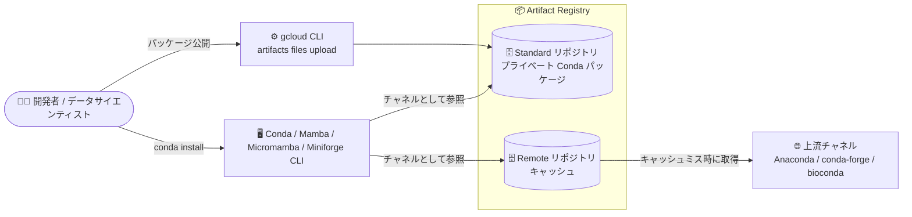

# Artifact Registry: Conda パッケージ管理サポート (Preview)

**リリース日**: 2026-09-15

**サービス**: Artifact Registry

**機能**: Conda パッケージの管理サポート

**ステータス**: Preview

📊 [このアップデートのインフォグラフィックを見る](https://takech9203.github.io/google-cloud-news-summary/20260915-artifact-registry-conda-packages.html)

## 概要

Artifact Registry で Conda パッケージを管理する機能が Preview として利用可能になりました。Conda リポジトリを Artifact Registry 上に作成し、プライベートな Conda パッケージのアップロード・インストール・バージョン管理を Google Cloud 上で完結できます。

Conda はデータサイエンスや機械学習の分野で広く使われているパッケージ・環境管理ツールです。今回のアップデートにより、Docker、Maven、npm、Python (PyPI) などと同様に、Conda パッケージも Artifact Registry の統一されたアーティファクト管理基盤 (IAM によるアクセス制御、gcloud CLI、Google Cloud コンソール) で扱えるようになります。標準 (standard) リポジトリと、Anaconda や conda-forge などの外部チャネルをプロキシ・キャッシュするリモート (remote) リポジトリの両モードに対応しています。

**アップデート前の課題**

- Artifact Registry は Conda 形式に対応しておらず、Conda パッケージを Artifact Registry のリポジトリで管理できなかった
- Conda を使う ML/データサイエンスチームは、プライベートパッケージの配布に Artifact Registry の IAM ベースのアクセス制御や Google Cloud 統合を活用できなかった

**アップデート後の改善**

- Artifact Registry にプライベート Conda リポジトリ (standard モード) を作成し、`gcloud artifacts files upload` でパッケージをアップロードできるようになった
- リモート (remote) リポジトリとして Anaconda (`pkgs/main`、`pkgs/r`、`pkgs/msys2`)、conda-forge、bioconda といった公開チャネルのパッケージをキャッシュできるようになった
- Conda / Mamba / Micromamba / Miniforge の各パッケージマネージャーから、Artifact Registry のリポジトリをチャネルとして追加してパッケージをインストールできるようになった
- IAM ロール (Reader / Writer / Repository Administrator) によるパッケージの閲覧・インストール・追加・削除の権限管理が可能になった

## アーキテクチャ図



開発者は gcloud CLI でプライベート Conda パッケージを standard リポジトリにアップロードし、Conda 系 CLI から Artifact Registry のリポジトリをチャネルとして参照してインストールします。remote リポジトリは Anaconda や conda-forge などの上流チャネルのプロキシとして動作し、初回リクエスト時にパッケージをキャッシュします。

## サービスアップデートの詳細

### 主要機能

1. **Standard リポジトリでのプライベート Conda パッケージ管理**
   - `gcloud artifacts files upload --source=PACKAGE_NAME` で単一パッケージを、`--source-directory=DIRECTORY` でローカルフォルダ内の複数パッケージを一括アップロード可能
   - Google Cloud コンソールおよび gcloud CLI でパッケージ・バージョン・ファイルの一覧表示、削除が可能

2. **Remote リポジトリによる公開チャネルのプロキシ・キャッシュ**
   - 以下の上流アドレスを利用可能:
     - `https://repo.anaconda.com/pkgs/main`
     - `https://repo.anaconda.com/pkgs/r`
     - `https://repo.anaconda.com/pkgs/msys2`
     - `https://conda.anaconda.org/conda-forge`
     - `https://conda.anaconda.org/bioconda`
   - キャッシュ済みコピーがない場合は上流から取得してキャッシュしてから配信。2 回目以降はキャッシュから配信される

3. **複数の Conda 系パッケージマネージャーに対応**
   - Conda、Mamba、Micromamba、Miniforge をサポート
   - リポジトリを Conda のチャネルとして設定ファイルに追加し、`conda install` / `mamba install` などでインストール

4. **IAM によるアクセス制御**
   - パッケージの閲覧・ダウンロード・インストール: Artifact Registry Reader (`roles/artifactregistry.reader`)
   - パッケージの追加: Artifact Registry Writer (`roles/artifactregistry.writer`)
   - パッケージの削除: Artifact Registry Repository Administrator (`roles/artifactregistry.repoAdmin`)

## 技術仕様

| 項目 | 詳細 |
|------|------|
| ステータス | Preview (Pre-GA Offerings Terms が適用) |
| 対応リポジトリモード | standard、remote |
| 対応パッケージマネージャー | Conda、Mamba、Micromamba、Miniforge |
| チャネル URL 形式 | `https://$TOKEN@LOCATION-conda.pkg.dev/PROJECT/REPOSITORY` |
| 認証 | OAuth アクセストークン (`gcloud auth print-access-token`) をチャネル URL に埋め込み。トークンの有効期限は 1 時間 |
| 必要な gcloud CLI バージョン | 354.0.0 以降 |
| リポジトリロケーション | リージョンまたはマルチリージョン |

## 設定方法

### 前提条件

1. Google Cloud CLI (バージョン 354.0.0 以降) のインストールと初期化
2. Conda / Mamba / Micromamba / Miniforge のいずれかのインストール (Cloud Shell には gcloud CLI と Conda がプリインストール済み)
3. Artifact Registry に Conda リポジトリを作成済みであること

### 手順

#### ステップ 1: 認証の設定 (チャネルの追加)

```bash
# OAuth アクセストークンを変数に格納
export TOKEN="oauth2accesstoken:$(gcloud auth print-access-token)"

# Artifact Registry のリポジトリを Conda チャネルとして追加
conda config --add channels \
  https://$TOKEN@LOCATION-conda.pkg.dev/PROJECT/REPOSITORY
```

`LOCATION` はリポジトリのロケーション、`PROJECT` はプロジェクト ID、`REPOSITORY` はリポジトリ ID です。`--add` はチャネルリストの先頭に追加します (末尾に追加する場合は `--append`)。OAuth トークンは 1 時間で失効するため、失効後はチャネルを削除して新しいトークンで再追加する必要があります。

#### ステップ 2: パッケージのアップロード (standard リポジトリ)

```bash
# 単一パッケージのアップロード
gcloud artifacts files upload \
  --source=PACKAGE_NAME \
  --repository=REPO_NAME \
  --project=PROJECT \
  --location=LOCATION

# フォルダ内の複数パッケージを一括アップロード
gcloud artifacts files upload \
  --source-directory=DIRECTORY \
  --repository=REPO_NAME \
  --project=PROJECT \
  --location=LOCATION
```

#### ステップ 3: パッケージのインストール

```bash
# 最新の安定版をインストール
conda install -n ENVIRONMENT_NAME PACKAGE_NAME

# 特定バージョンをインストールする場合はパッケージ名の後にバージョンを指定
```

すでに環境をアクティベート済みの場合は `-n ENVIRONMENT_NAME` を省略できます。

#### ステップ 4: パッケージの確認

```bash
# リポジトリ内のパッケージ一覧
gcloud artifacts packages list --repository=REPOSITORY --location=LOCATION

# パッケージのバージョン一覧
gcloud artifacts versions list --package=PACKAGE \
  --repository=REPOSITORY --location=LOCATION
```

remote リポジトリの場合、一覧にはキャッシュ済みのパッケージのみが表示されます。

## メリット

### ビジネス面

- **アーティファクト管理の一元化**: コンテナイメージや他言語パッケージと同じ Artifact Registry で Conda パッケージも管理でき、ガバナンスと運用を統一できる
- **可用性とレイテンシの改善**: remote リポジトリで公開チャネルのパッケージを Google Cloud 内にキャッシュすることで、上流の障害時にもキャッシュ済みパッケージを利用でき、取得レイテンシも低減できる

### 技術面

- **IAM ベースの権限管理**: Reader / Writer / Repository Administrator のロールで閲覧・追加・削除を細かく制御できる
- **既存ツールチェーンとの互換性**: Conda / Mamba / Micromamba / Miniforge の標準的なチャネル設定・インストールコマンドをそのまま利用できる
- **依存関係のキャッシュ**: remote リポジトリはパッケージとその依存関係をキャッシュし、2 回目以降のインストールを高速化する

## デメリット・制約事項

### 制限事項

- Preview 機能のため Pre-GA Offerings Terms が適用され、サポートが限定される場合がある
- Conda リポジトリの操作には gcloud CLI 354.0.0 以降が必要
- OAuth トークンの有効期限は 1 時間で、失効時はチャネルの削除と再追加による再認証が必要
- remote リポジトリの一覧表示ではキャッシュ済みパッケージのみが表示される
- 削除したパッケージは復元できない

### 考慮すべき点

- 本番環境での利用は GA を待つか、Pre-GA の利用条件を確認した上で判断する
- remote リポジトリの上流は用意されたアドレス (Anaconda、conda-forge、bioconda) から選択する

## ユースケース

### ユースケース 1: 社内 ML チーム向けプライベート Conda パッケージの配布

**シナリオ**: 機械学習チームが社内共通の前処理ライブラリを Conda パッケージとして開発しており、社外に公開せずにチームメンバーへ配布したい。

**実装例**:
```bash
# standard リポジトリにパッケージをアップロード
gcloud artifacts files upload \
  --source=my-ml-utils-1.0.tar.bz2 \
  --repository=ml-conda-repo \
  --project=my-project \
  --location=asia-northeast1

# メンバーはチャネルを追加してインストール
conda install -n ml-env my-ml-utils
```

**効果**: IAM でアクセスを制御しながら、Conda の標準的なワークフローで社内パッケージを配布できる。

### ユースケース 2: conda-forge / bioconda パッケージのキャッシュ

**シナリオ**: CI/CD パイプラインや学習ジョブが conda-forge や bioconda のパッケージに依存しており、上流障害時のビルド失敗や取得レイテンシを避けたい。

**効果**: remote リポジトリが上流パッケージを Google Cloud 内にキャッシュするため、上流が利用できない場合でもキャッシュ済みパッケージでビルドを継続でき、同一リージョン内での取得により高速化とデータ転送コスト削減が期待できる。

## 料金

Artifact Registry の料金はストレージとネットワークデータ転送に基づきます。無料枠として月あたり 0.5 GB のストレージが提供されます。詳細は[料金ページ](https://cloud.google.com/artifact-registry/pricing)を参照してください。

## 利用可能リージョン

Conda リポジトリはリージョンまたはマルチリージョンのロケーションに作成できます。利用可能なロケーションの一覧は[リポジトリのロケーション](https://cloud.google.com/artifact-registry/docs/repo-locations)を参照してください。

## 関連サービス・機能

- **Cloud Shell**: gcloud CLI と Conda がプリインストールされており、追加セットアップなしで Conda リポジトリの操作を試せる
- **IAM**: Artifact Registry の事前定義ロール (Reader / Writer / Repository Administrator) でパッケージ操作の権限を管理
- **Artifact Registry の他フォーマット (Docker、Maven、npm、Python など)**: 同一のアーティファクト管理基盤上で、コンテナイメージや他言語パッケージと合わせて一元管理が可能

## 参考リンク

- 📊 [インフォグラフィック](https://takech9203.github.io/google-cloud-news-summary/20260915-artifact-registry-conda-packages.html)
- [公式リリースノート](https://docs.cloud.google.com/release-notes#September_15_2026)
- [ドキュメント: Get started with Conda packages](https://cloud.google.com/artifact-registry/docs/conda)
- [ドキュメント: Store Conda packages in Artifact Registry](https://docs.cloud.google.com/artifact-registry/docs/conda/store-conda)
- [ドキュメント: Manage Conda packages](https://docs.cloud.google.com/artifact-registry/docs/conda/manage-packages)
- [料金ページ](https://cloud.google.com/artifact-registry/pricing)

## まとめ

Artifact Registry が Conda 形式に対応したことで、データサイエンス・機械学習チームはプライベート Conda パッケージの配布と公開チャネルのキャッシュを Google Cloud の統一されたアーティファクト管理基盤で実現できるようになりました。Conda を利用しているチームは、Preview の利用条件を確認した上で、standard リポジトリでの社内パッケージ配布や remote リポジトリでの conda-forge キャッシュから試すことをおすすめします。

---

**タグ**: #ArtifactRegistry #Conda #Preview #パッケージ管理 #DevOps #MLOps
