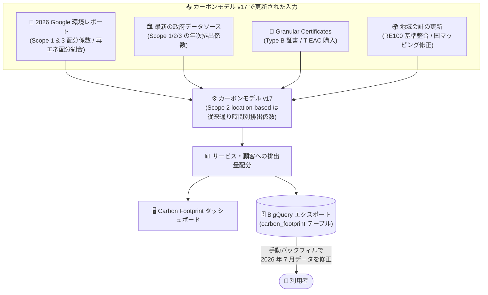

# Carbon Footprint: カーボンモデル v17 へのアップグレード (2026 年 7 月データリリース)

**リリース日**: 2026-09-15

**サービス**: Carbon Footprint

**機能**: カーボンモデル v17 (半期ごとのメソドロジー更新)

**ステータス**: Changed (既存機能の変更)

📊 [このアップデートのインフォグラフィックを見る](https://takech9203.github.io/google-cloud-news-summary/20260915-carbon-footprint-model-v17.html)

## 概要

Google Cloud Carbon Footprint の 2026 年 7 月データリリース (2026 年 9 月中旬公開) において、カーボンモデルがバージョン 17 にアップグレードされました。Carbon Footprint は 2024 年 1 月データ以降、年 2 回 (1 月データと 7 月データ) の半期ごとのメソドロジー改善スケジュールを採用しており、今回はその 2026 年後半の定期更新にあたります。

v17 では、(1) 2026 Google 環境レポートに基づく Scope 1 & 3 排出量の配分係数の更新、(2) Scope 2 マーケットベース排出量計算の入力データ更新 (再生可能電力の年次配分割合の更新、政府データソースに基づく年次排出係数の刷新、Granular Certificates の購入分の組み込み)、(3) 地域会計・バウンダリの更新 (欧州のクリーンエネルギーマッチング境界の RE100 基準への整合、アジア一部リージョンの国マッピング修正) の 3 領域が更新されています。

対象ユーザーは、Carbon Footprint ダッシュボードや BigQuery エクスポートを利用して GHG (温室効果ガス) 排出量のレポーティングを行っているすべての組織です。特に、排出量データを ESG レポートや社内サステナビリティ指標に利用している場合、2026 年 7 月分のデータを正しく反映するには手動のデータバックフィルが必要になる点に注意が必要です。

**アップデート前の課題**

- Scope 1 & 3 の配分係数や再生可能電力の割合は 2025 年版 Google 環境レポートに基づく古い企業データを使用していた
- 年次排出係数の背景データが最新の政府データソースを反映していなかった
- 欧州のクリーンエネルギーマッチング境界が更新前の RE100 基準に基づいていた
- 年次排出係数スクリプトの国マッピング設定に誤りがあり、一部のアジア市場リージョン (asia-east2、asia-northeast3 など) で過去データに不整合が生じていた

**アップデート後の改善**

- 2026 Google 環境レポートの全社データに基づき Scope 1 & 3 の配分係数が刷新された
- Scope 2 マーケットベース計算の入力として、再生可能電力の年次配分割合と、Scope 1/2/3 にわたる政府データソース由来の年次排出係数が更新された
- 炭素集約度の高いリージョンの電力負荷の相当部分をカバーする Granular Certificates (Type B 証書 / T-EAC) のマーケットプレイス購入が、マーケットベース会計の配分として組み込まれた
- 欧州のクリーンエネルギーマッチング境界が更新後の RE100 基準に整合し、アジア一部リージョンの国マッピング誤りが修正され、過去データの不整合が解消された

## アーキテクチャ図



カーボンモデル v17 では、2026 Google 環境レポート・政府統計・Granular Certificates 購入・地域会計更新という 4 系統の入力が刷新され、その結果がダッシュボードと BigQuery エクスポートに反映されます。既存の BigQuery エクスポート利用者は、7 月分データの修正に手動バックフィルが必要です。

## サービスアップデートの詳細

### 主要機能

1. **Scope 1 & 3 排出量 (Google コーポレートフットプリント由来) の更新**
   - 2026 Google 環境レポートの全社データを用いて、Scope 1 および Scope 3 の配分係数を刷新
   - コーポレートの Scope 1 & 3 排出量をクラウドの各プロダクト・サービスにどのように配分するかは、メソドロジードキュメントの「非電力排出源」セクションに記載

2. **Scope 2 マーケットベース排出量計算の入力更新**
   - 2026 Google 環境レポートに準拠して、再生可能電力の年次配分割合を更新
   - Scope 1、Scope 2、Scope 3 にわたり、最新の政府データソースに基づく背景の年次排出係数を刷新 (Scope 2 location-based 排出量は従来通り時間別の GHG 排出係数で計算)
   - 炭素集約度の高いリージョン群における電力負荷の相当部分をカバーする Granular Certificates (Type B 証書 / T-EAC) のマーケットプレイス購入を組み込み。Granular Certificate の購入はマーケットベース会計上の配分を表す
   - 排出量の最小化を目指す顧客には、新規ワークロードで Carbon Free Energy (CFE) スコアの高いリージョンを優先することが推奨されている

3. **地域会計・バウンダリの更新**
   - 欧州のクリーンエネルギーマッチング境界を、更新された RE100 基準に整合
   - 年次排出係数スクリプトの国マッピング設定を修正し、一部のアジア市場リージョン (例: asia-east2、asia-northeast3) における過去データの不整合を解消
   - 2026 年 7 月の排出量データを修正するには、当該月の手動データバックフィルのスケジュールが必要

## 技術仕様

### カーボンモデル v17 の概要

| 項目 | 詳細 |
|------|------|
| モデルバージョン | v17 (v16 までから更新) |
| 更新サイクル | 半期ごと (1 月データと 7 月データのリリース時、2024 年 1 月データ以降) |
| 対象データリリース | 2026 年 7 月データ (2026 年 9 月中旬公開) |
| Scope 1 & 3 | 2026 Google 環境レポートの全社データで配分係数を更新 |
| Scope 2 market-based | 再エネ年次配分割合・年次排出係数の更新、Granular Certificates (Type B / T-EAC) 購入の組み込み |
| Scope 2 location-based | 従来通り時間別 GHG 排出係数で計算 (変更なし) |
| 地域会計 | 欧州のマッチング境界を RE100 基準に整合、アジア一部リージョン (asia-east2、asia-northeast3 など) の国マッピング修正 |
| 既存データへの影響 | 2026 年 7 月分の修正には手動バックフィルが必要 |

### BigQuery エクスポートのデータ提供タイミング

Carbon Footprint のデータは BigQuery Data Transfer Service 経由でエクスポートされ、各月のデータは翌月 15 日にエクスポートされます (半月のタイムラグ)。転送設定作成後は毎月 15 日に自動でエクスポートされ、2021 年 1 月まで遡る履歴データのバックフィルをリクエストできます。

## 設定方法

### 前提条件

1. Carbon Footprint の BigQuery エクスポート (転送設定) が作成済みであること
2. エクスポート先プロジェクトに対する必要な IAM 権限 (`resourcemanager.projects.update`、`serviceusage.services.enable`、`bigquery.transfers.update`) と、請求先アカウントに対する `billing.accounts.getCarbonInformation` 権限があること

### 手順 (2026 年 7 月データの修正バックフィル)

#### ステップ 1: コンソールからバックフィルをスケジュール

1. BigQuery Data Transfer Service で、Carbon Footprint の転送設定の詳細を開く
2. **Schedule Backfill** (バックフィルのスケジュール) をクリック
3. **Run for a date range** (日付範囲で実行) を選択し、2026 年 7 月データを含むエクスポート実行日を範囲に指定して実行

Carbon Footprint のエクスポートは半月のタイムラグがあるため (各月のデータは翌月 15 日にエクスポート)、修正対象月のデータを含むエクスポート実行日を指定する必要があります。

#### ステップ 2: bq コマンドラインでバックフィルを実行する場合

```bash
bq mk \
  --transfer_run \
  --start_time=START_TIME \
  --end_time=END_TIME \
  CONFIG
```

`CONFIG` には転送設定の識別子 (例: `projects/0000000000000/locations/us/transferConfigs/00000000-...`) を指定します。REST API を使用する場合は `transferConfigs.startManualRuns` エンドポイントでも同様のバックフィルをリクエストできます。

## メリット

### ビジネス面

- **排出量レポーティングの精度向上**: 2026 Google 環境レポートと最新の政府データソースに基づく係数更新により、ESG レポートやサステナビリティ開示に利用する排出量データの鮮度と正確性が向上する
- **過去データの不整合解消**: asia-east2 や asia-northeast3 などアジア一部リージョンの国マッピング誤りが修正され、履歴データの信頼性が改善される

### 技術面

- **マーケットベース会計の高度化**: Granular Certificates (Type B / T-EAC) の購入がマーケットベースの配分として組み込まれ、炭素集約度の高いリージョンの Scope 2 market-based 排出量計算に反映される
- **国際基準との整合**: 欧州のクリーンエネルギーマッチング境界が更新後の RE100 基準に整合し、業界標準に沿った会計となる

## デメリット・制約事項

### 制限事項

- 2026 年 7 月分の排出量データを修正するには、手動でデータバックフィルをスケジュールする必要がある (自動では修正されない)
- メソドロジーやデータソースの更新により、現在および過去の顧客別 GHG 排出量データが大きく変動 (調整) される可能性がある
- Carbon Footprint が提供する顧客別 GHG 排出量データは第三者による検証・保証を受けていない

### 考慮すべき点

- 排出量の削減を目指す場合、新規ワークロードは CFE (Carbon Free Energy) スコアの高いリージョンへの配置を優先することが推奨されている
- モデルバージョン間でデータの前提が変わるため、期間をまたいだ排出量比較を行う際はメソドロジー変更の影響を考慮する必要がある

## ユースケース

### ユースケース 1: ESG レポート用データの修正

**シナリオ**: BigQuery エクスポートで Carbon Footprint データを蓄積し、四半期ごとの ESG レポートに利用している企業が、2026 年 7 月分のデータを v17 モデルの修正内容で最新化したい。

**実装例**:
```bash
# 転送設定に対して 7 月データを含む実行日のバックフィルをリクエスト
bq mk --transfer_run \
  --start_time=START_TIME \
  --end_time=END_TIME \
  projects/PROJECT_NUMBER/locations/us/transferConfigs/CONFIG_ID
```

**効果**: 国マッピング修正や最新係数を反映した正確な 7 月分データがレポートに反映される。

### ユースケース 2: CFE スコアに基づく低炭素リージョン選定

**シナリオ**: 新規ワークロードのデプロイ先リージョンを、レイテンシやコストに加えて炭素影響も考慮して選定したい。

**効果**: CFE% の高いリージョン (Google Cloud の region-carbon ページ、BigQuery 公開データセット、Region Picker ツールで確認可能) を優先することで、ワークロードの gross 排出量を削減できる。Organization Policy の resource locations 制約 (`us-low-carbon-locations` などの値グループ) で低炭素リージョンへのリソース作成を強制することも可能。

## 料金

Carbon Footprint のダッシュボード自体の利用に追加料金はかかりませんが、BigQuery エクスポートを構成した場合、エクスポートされたデータの保存とクエリに使用する BigQuery リソースに対して課金されます。詳細は [BigQuery の料金ページ](https://cloud.google.com/bigquery/pricing) を参照してください。

## 関連サービス・機能

- **BigQuery / BigQuery Data Transfer Service**: Carbon Footprint データのエクスポート先。データは月次パーティションテーブル `carbon_footprint` に格納され、バックフィルによる履歴データの再取得が可能
- **Cloud Billing**: Carbon Footprint のレポートは Cloud Billing アカウント単位で提供され、エクスポート設定でも請求先アカウント ID を指定する
- **Carbon-free energy for Google Cloud regions / Region Picker**: リージョンごとの CFE% を公開しており、低炭素リージョン選定の判断材料となる。BigQuery 公開データセットや GitHub リポジトリでも機械可読形式で取得可能
- **Organization Policy Service (resource locations 制約)**: 低炭素リージョンのみにリソース作成を制限するガバナンスに利用できる

## 参考リンク

- 📊 [インフォグラフィック](https://takech9203.github.io/google-cloud-news-summary/20260915-carbon-footprint-model-v17.html)
- [公式リリースノート](https://docs.cloud.google.com/release-notes#September_15_2026)
- [Carbon Footprint メソドロジードキュメント](https://docs.cloud.google.com/carbon-footprint/docs/methodology)
- [非電力排出源の配分 (メソドロジー)](https://docs.cloud.google.com/carbon-footprint/docs/methodology#non-electricity-allocation)
- [Scope 2 market-based 配分 (メソドロジー)](https://docs.cloud.google.com/carbon-footprint/docs/methodology#market-based-allocation)
- [Carbon Footprint のエクスポート](https://docs.cloud.google.com/carbon-footprint/docs/export)
- [Carbon-free energy for Google Cloud regions](https://cloud.google.com/sustainability/region-carbon)
- [BigQuery 料金ページ](https://cloud.google.com/bigquery/pricing)

## まとめ

カーボンモデル v17 は、2026 Google 環境レポートと最新の政府データに基づく係数更新に加え、Granular Certificates 購入の組み込みや RE100 基準への整合など、マーケットベース会計を大きく前進させる半期定期更新です。BigQuery エクスポートを利用している組織は、2026 年 7 月分データの修正のために手動バックフィルを忘れずに実施してください。また、新規ワークロードの配置では CFE スコアの高いリージョンを優先することが排出量削減の観点から推奨されます。

---

**タグ**: Carbon Footprint, サステナビリティ, GHG 排出量, Scope 2, CFE, BigQuery, カーボンモデル v17
