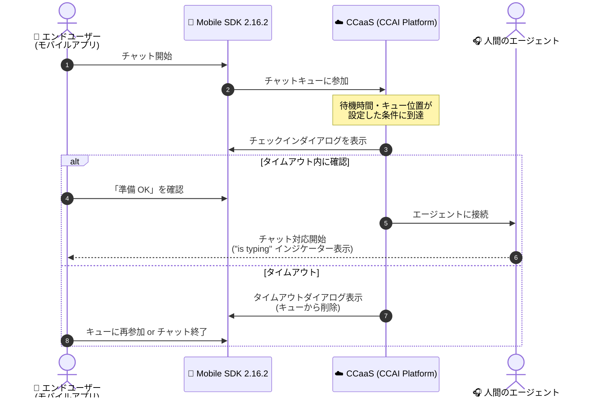

# Google Cloud Contact Center as a Service (CCaaS): Mobile SDKs 2.16.2 リリース (チャットチェックイン・入力中インジケーター対応)

**リリース日**: 2026-09-15

**サービス**: Google Cloud Contact Center as a Service (CCaaS) / Contact Center AI Platform (CCAI Platform)

**機能**: Mobile SDKs 2.16.2 (チャットチェックイン、"is typing" インジケーター、各種バグ修正)

**ステータス**: リリース済み (Announcement / Feature / Fixed)

📊 [このアップデートのインフォグラフィックを見る](https://takech9203.github.io/google-cloud-news-summary/20260915-ccaas-mobile-sdk-2-16-2.html)

## 概要

Google Cloud Contact Center as a Service (CCaaS、旧 Contact Center AI Platform) のモバイル SDK (Android SDK / iOS SDK) のバージョン 2.16.2 がリリースされました。モバイル SDK は、iOS / Android アプリ内から音声通話とチャットによるカスタマーサポートを直接提供するためのコンポーネントです。

今回のリリースの目玉は、モバイル SDK での**チャットチェックイン (Chat check-in)** 対応です。チャットチェックインは、システムがエンドユーザーを人間のエージェントに接続する前に、エンドユーザーが実際にその場にいて会話できる状態であることを確認する機能です。チャットを放棄したエンドユーザーをエージェントが待ち続けることで失われていた時間を排除し、平均処理時間 (AHT: Average Handle Time) を短縮します。

このほか、エージェントが入力中であることをエンドユーザーに表示する **"is typing" インジケーター**の追加と、チェックインダイアログ・着信通話・チャット終了通知などに関する複数のバグ修正が含まれています。モバイルアプリでカスタマーサポートを提供する企業のコンタクトセンター運用効率と、エンドユーザーのチャット体験を改善するアップデートです。

**アップデート前の課題**

- モバイル SDK ではチャットチェックイン機能が利用できず、チャットを途中で放棄したエンドユーザーにもエージェントが接続され、応答を待つ時間が無駄になっていた
- エンドユーザーはエージェントが返信を入力中かどうかを確認できず、応答を待つべきか判断しづらかった
- チェックインのタイムアウトダイアログ表示中にアプリを強制終了すると、再起動後にチェックインダイアログが再表示されない問題があった
- モバイルの着信通話 (inbound call) が接続されない問題があった
- (iOS) 仮想エージェントが会話を終了した際に、チャット終了通知が重複して届く問題があった

**アップデート後の改善**

- モバイル SDK でチャットチェックインが利用可能になり、エンドユーザーの在席確認を経てからエージェントに接続することで、放棄チャットによるエージェントの待機時間を削減し、平均処理時間を短縮できるようになった
- エージェントが入力中であることを示す "is typing" インジケーターがエンドユーザーに表示されるようになり、チャット体験が向上した
- チェックインダイアログ、着信通話、チャット終了通知などの複数の不具合が修正され、モバイルチャネルの安定性が向上した

## アーキテクチャ図

モバイル SDK 2.16.2 のチャットチェックインフロー。エージェント接続前にエンドユーザーの在席確認を行い、タイムアウトしたユーザーはキューから削除されるため、放棄チャットへのエージェント接続を防止します。

## サービスアップデートの詳細

### 主要機能

1. **チャットチェックイン (Chat check-in) のモバイル SDK 対応**
   - エンドユーザーが人間のエージェントに接続される前に、在席していて会話の準備ができていることを確認する機能
   - 設定した条件 (待機時間とキュー位置の組み合わせ) に基づいてチェックインダイアログを表示。エンドユーザーが指定時間内に確認しない場合はキューから削除される
   - チャットキューへの参加時、別の人間のエージェントへのコールドトランスファー時、仮想エージェントから人間のエージェントへのエスカレーション時に適用可能
   - タイムアウトしたエンドユーザーには「キューに再参加」「チャットを終了」の選択肢が表示され、再参加時のキュー配置 (先頭寄り / 末尾) も設定可能
   - アプリがバックグラウンドで動作中の場合は、プッシュ通知でチェックインを促すことが可能
   - 営業時間外に再参加しようとした場合のアフターアワーダイアログの表示オプションも設定可能 (次回対応可能時刻メッセージや Start over ボタンの非表示化)

2. **"is typing" インジケーターの追加**
   - エージェントが入力中の場合に、エンドユーザー側に「入力中」インジケーターを表示
   - エンドユーザーが応答を待つべきかを判断しやすくなり、チャット体験が向上

3. **バグ修正 (Android / iOS SDK 共通)**
   - チェックインのタイムアウトダイアログ表示中にモバイルアプリを強制終了した後、アプリ再起動時にチェックインダイアログが再表示されない問題を修正
   - モバイルの着信通話が接続されない問題を修正

4. **バグ修正 (iOS SDK のみ)**
   - 仮想エージェントが会話を終了した際に、エンドユーザーにチャット終了通知が重複して届く問題を修正
   - チャットのエスカレーション時に、仮想エージェントの最後のメッセージが順序どおりに表示されない問題を修正
   - サーバーが相対 URL を返した場合にアプリがログをアップロードしない問題を修正

5. **バグ修正 (Android SDK のみ)**
   - セッション作成から最初のチャット取得までに 5 秒の遅延が発生し、メッセージの表示が大幅に遅れる問題を修正

## 技術仕様

### チャットチェックインの設定項目

チェックインはグローバルレベル (Settings > Chat > Web & Mobile Chat Settings) またはキューレベル (Settings > Queue > Custom Chat Configuration) で設定できます。

| 設定項目 | 詳細 |
|------|------|
| チェックイン要求までの待機時間 (秒) | エンドユーザーが指定秒数待機した後にチェックインダイアログを表示 |
| チェックイン表示のキュー位置しきい値 | エンドユーザーが指定のキュー位置に到達した時点でチェックインダイアログを表示 (キュー位置はアクティブなエージェント数と待機ユーザー数に基づく) |
| チェックインのタイムアウト (秒) | 指定秒数以内に確認しない場合、タイムアウトダイアログを表示しキューから削除 |
| 再参加時のキュー配置 | 「キューの先頭側に再接続」または「キューの末尾に再接続」を選択 (優先ユーザー > 転送ユーザー > その他の順のバケット内で配置) |

### チェックインダイアログの動作

| 項目 | 詳細 |
|------|------|
| 通知音 | エンドユーザーが Confirm をクリックするかタイムアウトするまで 10 秒ごとに通知音を再生 |
| 確認時 | エージェントが対応可能になり次第接続 |
| タイムアウト時 | キューから削除し、タイムアウトダイアログ (Rejoin queue / Exit chat) を表示 |
| バックグラウンド時 | プッシュ通知で復帰を促すことが可能 (アプリのプッシュ通知設定とエンドユーザーの通知許可に依存) |

## 設定方法

### 前提条件

1. CCaaS (CCAI Platform) のインスタンスが構成済みであること
2. モバイルアプリに Android SDK または iOS SDK (バージョン 2.16.2) が統合されていること (Flutter / React Native 経由の統合にも対応)
3. バックグラウンド時のチェックイン通知を利用する場合は、アプリのプッシュ通知が設定済みであること

### 手順

#### ステップ 1: グローバルレベルでチェックインを有効化

1. CCAI Platform ポータルで **Settings > Chat** をクリック
2. **Web & Mobile Chat Settings** ペインに移動
3. **Check In** セクションで **Mobile** のトグルをオンにする
4. 待機時間 (秒)、キュー位置しきい値、タイムアウト (秒)、再参加時のキュー配置を設定
5. **Save Chat Settings** をクリック

#### ステップ 2: (任意) キューレベルでチェックインを設定

1. CCAI Platform ポータルで **Settings > Queue** をクリック
2. **Mobile** ペインで **Edit / View** をクリックし、対象キューを選択
3. **Custom Chat Configuration** セクションで **Configure** をクリック
4. **Check In** セクションのトグルをオンにし、各設定値を入力して **Save** をクリック

#### ステップ 3: SDK 側のオプション設定

- Android: [SDK configuration](https://docs.cloud.google.com/contact-center/ccai-platform/docs/android-sdk-guide#sdk-configuration) を参照し、チェックイン関連の設定を行う
- iOS: [Chat check-in after-hours options](https://docs.cloud.google.com/contact-center/ccai-platform/docs/ios-sdk-guide#chat_check-in_after-hours_options) を参照し、アフターアワーダイアログの表示オプション (次回対応可能時刻メッセージ、Start over ボタンの非表示化) を設定する

## メリット

### ビジネス面

- **平均処理時間 (AHT) の短縮**: チャットを放棄したエンドユーザーをエージェントが待つ時間を排除し、コンタクトセンターの生産性を向上
- **エージェントの稼働率向上**: 在席が確認されたエンドユーザーのみをエージェントに接続するため、エージェントのアイドル時間を削減
- **エンドユーザー体験の向上**: "is typing" インジケーターにより、エンドユーザーはエージェントの応答状況を把握しながら待機できる

### 技術面

- **柔軟な設定**: グローバルレベルとキューレベルの両方でチェックインを設定でき、待機時間・キュー位置・タイムアウトを個別に調整可能
- **プッシュ通知連携**: アプリがバックグラウンドにあってもプッシュ通知でチェックインを促せるため、モバイル特有の離脱を軽減
- **安定性の向上**: チェックインダイアログの再表示、着信通話の接続、重複通知、初回メッセージ表示遅延 (Android の 5 秒遅延) などの不具合が修正

## デメリット・制約事項

### 考慮すべき点

- チェックインのタイムアウト時間が長すぎると、エージェントがアイドル状態で待機するボトルネックが発生しうる (公式ドキュメントでは、まずタイムアウト時間の短縮を推奨)
- キュー位置しきい値を高くしすぎると、放棄チャットがエージェントに接続される可能性が高まり、低すぎるとチェックイン後の待機時間が長くなる可能性がある
- バックグラウンド時のチェックイン通知はアプリのプッシュ通知設定とエンドユーザーの通知許可に依存する。通知が許可されていない場合、エンドユーザーはアプリに戻った時点でチェックインダイアログを確認することになる
- 放棄チャットの割合が高い場合は、チェックインだけでなくオーバーキャパシティ・デフレクション (別キュー / 別チャネルへの誘導) の設定も併せて検討が必要

## ユースケース

### ユースケース 1: モバイルアプリ内チャットサポートの処理効率改善

**シナリオ**: 小売業のモバイルアプリでチャットサポートを提供しているが、待ち時間中に離脱したユーザーにエージェントが接続され、応答のない相手を待つ時間が AHT を押し上げている。

**実装例**: グローバルレベルで Mobile のチェックインを有効化し、「待機 N 秒後にチェックイン要求」「キュー位置 N 到達でダイアログ表示」「タイムアウト N 秒」を自社のトラフィックに合わせて設定。バックグラウンド離脱対策としてプッシュ通知も構成する。

**効果**: 在席確認済みのユーザーのみがエージェントに接続され、放棄チャットによる待機時間が排除されて AHT が短縮される。

### ユースケース 2: 仮想エージェントから人間のエージェントへのエスカレーション品質向上

**シナリオ**: 仮想エージェント (バーチャルエージェント) で一次対応を行い、解決しない場合に人間のエージェントへエスカレーションしているが、エスカレーション待ちの間にユーザーが離脱するケースが多い。

**効果**: エスカレーション時にもチェックインを適用することで、実際に待っているユーザーのみをエージェントに接続できる。また iOS SDK の修正により、エスカレーション時の仮想エージェント最終メッセージの表示順序や、仮想エージェント終了時の重複通知の問題も解消される。

## 関連サービス・機能

- **CCaaS Web SDK**: チャットチェックインは Web チャネルでも利用可能。Web SDK ではチェックインイベントをリッスンするヘッドレス構成にも対応
- **仮想エージェント (Virtual Agent)**: 仮想エージェントから人間のエージェントへのエスカレーション時にもチェックインを適用可能
- **プッシュ通知 (FCM / APNs)**: アプリがバックグラウンドにある場合のチェックイン促進に利用 (Android / iOS の SDK ガイドで設定)
- **Flutter / React Native**: モバイル SDK は Flutter・React Native 経由でのモバイルアプリへの統合にも対応

## 参考リンク

- 📊 [インフォグラフィック](https://takech9203.github.io/google-cloud-news-summary/20260915-ccaas-mobile-sdk-2-16-2.html)
- [公式リリースノート (Google Cloud)](https://docs.cloud.google.com/release-notes#September_15_2026)
- [CCAI Platform リリースノート](https://docs.cloud.google.com/contact-center/ccai-platform/docs/release-notes)
- [Chat check-in ドキュメント](https://docs.cloud.google.com/contact-center/ccai-platform/docs/chat-check-in)
- [Mobile SDK 概要](https://docs.cloud.google.com/contact-center/ccai-platform/docs/mobileSDK-overview)
- [Android SDK ガイド (SDK configuration)](https://docs.cloud.google.com/contact-center/ccai-platform/docs/android-sdk-guide#sdk-configuration)
- [iOS SDK ガイド (Chat check-in after-hours options)](https://docs.cloud.google.com/contact-center/ccai-platform/docs/ios-sdk-guide#chat_check-in_after-hours_options)

## まとめ

Mobile SDKs 2.16.2 は、チャットチェックインのモバイル対応により、放棄チャットへのエージェント接続を防いで平均処理時間を短縮できる、コンタクトセンター運用に直結するアップデートです。モバイルアプリで CCaaS のチャットサポートを提供している場合は、SDK を 2.16.2 に更新した上で、自社のトラフィックパターンに合わせてチェックインの待機時間・キュー位置・タイムアウトを設定し、プッシュ通知と併せて効果を検証することを推奨します。

---

**タグ**: #CCaaS #ContactCenterAI #CCAIPlatform #MobileSDK #Android #iOS #Chat #ContactCenter
