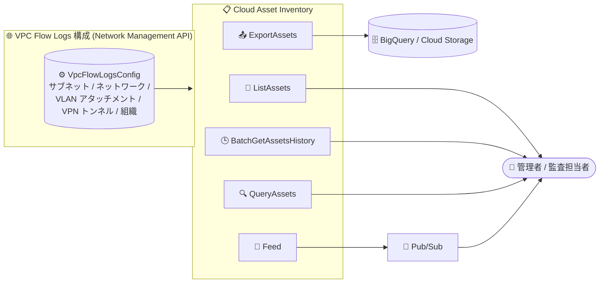

# Cloud Asset Inventory: VpcFlowLogsConfig リソースタイプのサポート追加

**リリース日**: 2026-09-15

**サービス**: Cloud Asset Inventory

**機能**: Network Management API `VpcFlowLogsConfig` リソースタイプの公開サポート

**ステータス**: 一般公開 (Publicly Available)

📊 [このアップデートのインフォグラフィックを見る](https://takech9203.github.io/google-cloud-news-summary/20260915-cloud-asset-inventory-vpc-flow-logs-config.html)

## 概要

Cloud Asset Inventory で、Network Management API のリソースタイプ `networkmanagement.googleapis.com/VpcFlowLogsConfig` が、ExportAssets、ListAssets、BatchGetAssetsHistory、QueryAssets、Feed の各 API を通じて公開利用可能になりました。

`VpcFlowLogsConfig` は、Network Management API で管理される VPC Flow Logs の構成リソースです。プロジェクトレベル (サブネット、VPC ネットワーク、Cloud Interconnect の VLAN アタッチメント、Cloud VPN トンネルをターゲットとする構成) と組織レベル (組織全体に適用される構成) の両方の VPC Flow Logs 構成を表現します。今回のアップデートにより、これらの構成を Cloud Asset Inventory の標準的なワークフロー (一覧取得、BigQuery / Cloud Storage へのエクスポート、変更履歴の取得、SQL クエリ、Pub/Sub フィードによる変更監視) で扱えるようになりました。

組織全体のネットワーク可観測性の設定状況を棚卸ししたいクラウド管理者、セキュリティ監査担当者、ガバナンスを自動化したい SRE / プラットフォームチームが主な対象ユーザーです。

**アップデート前の課題**

- Cloud Asset Inventory のサポート対象に `VpcFlowLogsConfig` が含まれておらず、VPC Flow Logs 構成の棚卸しには Network Management API (`gcloud network-management vpc-flow-logs-configs list` など) をプロジェクトや組織ごとに個別に呼び出す必要があった
- VPC Flow Logs 構成の変更履歴やスナップショットを、他のアセットと同じ仕組み (BigQuery エクスポートや Pub/Sub フィード) で一元的に扱うことができなかった

**アップデート後の改善**

- ListAssets / ExportAssets により、組織・フォルダ・プロジェクト配下の VPC Flow Logs 構成を他のアセットと同様に一括で一覧化・エクスポートできるようになった
- BatchGetAssetsHistory により、VPC Flow Logs 構成の変更履歴 (Cloud Asset Inventory は 5 週間のメタデータ履歴を保持) を取得できるようになった
- QueryAssets により、SQL ライクなクエリで VPC Flow Logs 構成を検索・分析できるようになった
- Feed API により、VPC Flow Logs 構成の作成・変更・削除を Pub/Sub 経由でリアルタイムに監視できるようになった

## アーキテクチャ図



Network Management API で管理される VPC Flow Logs 構成が Cloud Asset Inventory に取り込まれ、一覧取得・エクスポート・履歴取得・SQL クエリ・変更監視の 5 つの API で利用できるようになります。

## サービスアップデートの詳細

### 主要機能

1. **ListAssets / ExportAssets による棚卸し**
   - 組織・フォルダ・プロジェクトをスコープとして、`networkmanagement.googleapis.com/VpcFlowLogsConfig` タイプのアセットを一覧取得
   - BigQuery や Cloud Storage へのエクスポートに対応し、大規模環境の構成監査を効率化

2. **BatchGetAssetsHistory による変更履歴の取得**
   - 指定した時間枠における VPC Flow Logs 構成の変更履歴を取得
   - Cloud Asset Inventory は 5 週間分のアセットメタデータ履歴を時系列データベースに保持

3. **QueryAssets による SQL クエリ**
   - SQL ライクなクエリで VPC Flow Logs 構成を検索・集計

4. **Feed API による変更監視**
   - VPC Flow Logs 構成の変更を Pub/Sub トピックに通知
   - フローログの無効化や sampling レート変更などの構成変更をほぼリアルタイムで検知可能

## 技術仕様

### 対象リソースタイプ

| 項目 | 詳細 |
|------|------|
| アセットタイプ | `networkmanagement.googleapis.com/VpcFlowLogsConfig` |
| 提供元 API | Network Management API (`networkmanagement.googleapis.com`) |
| 対応する Cloud Asset Inventory API | ExportAssets、ListAssets、BatchGetAssetsHistory、QueryAssets、Feed |
| 非対応の API | 分析 API (AnalyzeIamPolicy 等) と検索 API (SearchAllResources 等) では利用不可 (公式ドキュメント記載) |
| Effective tags | 非サポート (公式ドキュメント記載) |

### VpcFlowLogsConfig リソースの構成 (Network Management API)

| 項目 | 詳細 |
|------|------|
| プロジェクトレベル構成の名前形式 | `projects/{project_id}/locations/global/vpcFlowLogsConfigs/{config_id}` |
| 組織レベル構成の名前形式 | `organizations/{organization_id}/locations/global/vpcFlowLogsConfigs/{config_id}` |
| ターゲットリソース (プロジェクトレベル) | サブネット、VPC ネットワーク、Interconnect アタッチメント、VPN トンネルのいずれか 1 つ |
| スコープ | SUBNET / COMPUTE_API_SUBNET / NETWORK / VPN_TUNNEL / INTERCONNECT_ATTACHMENT / ORGANIZATION |
| 主な設定項目 | `state` (ENABLED/DISABLED)、`aggregationInterval`、`flowSampling` (0 < x <= 1)、`metadata`、`filterExpr`、`crossProjectMetadata` (組織構成のみ) |

## 設定方法

### 前提条件

1. Cloud Asset API (`cloudasset.googleapis.com`) が有効化されていること
2. 対象スコープ (プロジェクト / フォルダ / 組織) に対する Cloud Asset Inventory の閲覧権限 (例: `roles/cloudasset.viewer`) を持っていること

### 手順

#### ステップ 1: VPC Flow Logs 構成の一覧取得 (ListAssets)

```bash
gcloud asset list \
  --organization=ORGANIZATION_ID \
  --asset-types="networkmanagement.googleapis.com/VpcFlowLogsConfig" \
  --content-type=resource
```

組織配下のすべての VPC Flow Logs 構成をメタデータ付きで一覧取得します。`--project` や `--folder` でスコープを絞ることも可能です。

#### ステップ 2: BigQuery へのエクスポート (ExportAssets)

```bash
gcloud asset export \
  --organization=ORGANIZATION_ID \
  --asset-types="networkmanagement.googleapis.com/VpcFlowLogsConfig" \
  --content-type=resource \
  --bigquery-table="projects/PROJECT_ID/datasets/DATASET_ID/tables/vpc_flow_logs_configs" \
  --output-bigquery-force
```

VPC Flow Logs 構成のスナップショットを BigQuery テーブルにエクスポートし、SQL で分析できるようにします。

#### ステップ 3: 変更監視用フィードの作成 (Feed)

```bash
gcloud asset feeds create vpc-flow-logs-config-feed \
  --organization=ORGANIZATION_ID \
  --asset-types="networkmanagement.googleapis.com/VpcFlowLogsConfig" \
  --content-type=resource \
  --pubsub-topic="projects/PROJECT_ID/topics/TOPIC_ID"
```

VPC Flow Logs 構成の作成・変更・削除が Pub/Sub トピックに通知されます。

## メリット

### ビジネス面

- **監査・コンプライアンス対応の効率化**: ネットワーク可観測性 (フローログ) の有効化状況を組織全体で一括棚卸しでき、監査エビデンスの収集が容易になる
- **ガバナンスの強化**: フローログ構成の無効化・変更を Pub/Sub フィードで検知し、ポリシー逸脱への迅速な対応が可能になる

### 技術面

- **一元的なインベントリ管理**: Network Management API を個別に呼び出すことなく、他の Google Cloud アセットと同じ API・同じワークフローで VPC Flow Logs 構成を扱える
- **変更履歴の追跡**: BatchGetAssetsHistory により、構成がいつ・どのように変更されたかを Cloud Asset Inventory の履歴 (5 週間保持) から確認できる
- **既存パイプラインへの統合**: BigQuery / Cloud Storage エクスポートや Pub/Sub フィードなど、既存の Asset Inventory ベースの自動化パイプラインにそのまま組み込める

## デメリット・制約事項

### 制限事項

- `VpcFlowLogsConfig` は分析 API (analyze policy) および検索 API (SearchAllResources / SearchAllIamPolicies) では利用できない (公式ドキュメント記載)
- Effective tags はサポートされない (公式ドキュメント記載)

### 考慮すべき点

- Compute Engine API 経由で設定された従来のサブネット単位のフローログ構成は `COMPUTE_API_SUBNET` スコープとして扱われるなど、Network Management API と Compute Engine API の 2 系統の構成が存在するため、棚卸し時にはスコープの違いを考慮する必要がある

## ユースケース

### ユースケース 1: 組織全体のフローログ有効化状況の監査

**シナリオ**: セキュリティチームが、組織内のすべてのプロジェクトで VPC Flow Logs が適切に構成されているか (有効化状態、サンプリングレートなど) を定期的に監査したい。

**実装例**:
```bash
gcloud asset export \
  --organization=ORGANIZATION_ID \
  --asset-types="networkmanagement.googleapis.com/VpcFlowLogsConfig" \
  --content-type=resource \
  --bigquery-table="projects/PROJECT_ID/datasets/audit/tables/vpc_flow_logs_configs"
```

**効果**: BigQuery 上で構成のスナップショットを SQL で分析でき、`state=DISABLED` の構成やサンプリングレートが低い構成を横断的に抽出できる。

### ユースケース 2: フローログ構成変更のリアルタイム検知

**シナリオ**: プラットフォームチームが、VPC Flow Logs 構成の無効化や削除などの変更をリアルタイムに検知し、意図しない可観測性の低下を防ぎたい。

**効果**: Feed API + Pub/Sub により構成変更が即座に通知され、Cloud Run functions などと組み合わせて自動修復や通知のワークフローを構築できる。

## 料金

このアップデートに固有の料金情報は Release Notes に記載されていません。Cloud Asset Inventory の料金の詳細は、公式の料金ページを参照してください。

- [Cloud Asset Inventory の料金](https://docs.cloud.google.com/asset-inventory/pricing)

なお、エクスポート先の BigQuery / Cloud Storage、フィード通知先の Pub/Sub には各サービスの料金が適用されます。

## 関連サービス・機能

- **Network Management API / Network Intelligence Center**: `VpcFlowLogsConfig` リソースの提供元。VPC Flow Logs の構成 (サブネット / ネットワーク / VLAN アタッチメント / VPN トンネル / 組織スコープ) を管理する
- **VPC Flow Logs**: 本リソースが構成対象とするネットワークフローのロギング機能
- **BigQuery / Cloud Storage**: ExportAssets のエクスポート先として構成スナップショットの分析・保管に利用
- **Pub/Sub**: Feed API による構成変更通知の配信先
- **Security Command Center**: QueryAssets などの SQL ライクなアセットクエリと連携するセキュリティ管理基盤

## 参考リンク

- 📊 [インフォグラフィック](https://takech9203.github.io/google-cloud-news-summary/20260915-cloud-asset-inventory-vpc-flow-logs-config.html)
- [公式リリースノート](https://docs.cloud.google.com/release-notes#September_15_2026)
- [サポートされているアセットタイプ](https://docs.cloud.google.com/asset-inventory/docs/asset-types)
- [アセットの一覧表示 (ListAssets)](https://cloud.google.com/asset-inventory/docs/listing-assets)
- [ExportAssets API リファレンス](https://cloud.google.com/asset-inventory/docs/reference/rest/v1/TopLevel/exportAssets)
- [VpcFlowLogsConfig リファレンス (Network Management API)](https://docs.cloud.google.com/network-intelligence-center/docs/reference/networkmanagement/rest/v1/projects.locations.vpcFlowLogsConfigs)
- [料金ページ](https://docs.cloud.google.com/asset-inventory/pricing)

## まとめ

VPC Flow Logs 構成が Cloud Asset Inventory の主要 API (ExportAssets、ListAssets、BatchGetAssetsHistory、QueryAssets、Feed) でサポートされ、ネットワーク可観測性設定の棚卸し・監査・変更監視を他のアセットと統一されたワークフローで行えるようになりました。組織全体でフローログの有効化状況をガバナンスしたいチームは、BigQuery エクスポートによる定期監査と Pub/Sub フィードによる変更検知の導入を検討することを推奨します。

---

**タグ**: Cloud Asset Inventory, Network Management API, VPC Flow Logs, ガバナンス, 監査, インベントリ管理
