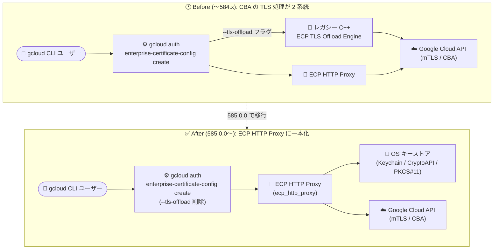

# Cloud SDK (gcloud CLI): 585.0.0 リリース (Breaking Changes を含む)

**リリース日**: 2026-09-15

**サービス**: Cloud SDK (gcloud CLI)

**機能**: gcloud CLI 585.0.0 リリース (Breaking Changes および複数サービスの新機能)

**ステータス**: GA (一部機能は Alpha / Beta / GA 昇格)

📊 [このアップデートのインフォグラフィックを見る](https://takech9203.github.io/google-cloud-news-summary/20260915-cloud-sdk-585-0-0.html)

## 概要

2026 年 9 月 15 日、Google Cloud CLI (gcloud) のバージョン 585.0.0 がリリースされました。本リリースには **2 つの Breaking Changes** が含まれており、Cloud Storage Anywhere Cache の `--admission-policy` フラグにおける `ADMIT_ON_SECOND_MISS` 選択肢の非推奨化と、Certificate-Based Access (CBA) で使用されるレガシー `--tls-offload` フラグの削除 (レガシー C++ ECP TLS Offload Engine の非推奨化) が発表されました。CBA リクエストは今後 ECP HTTP Proxy (`ecp_http_proxy`) のみを使用します。

Breaking Changes に加えて、App Topology の GA 昇格、API Gateway のレスポンスストリーミング対応 (`--enable-streaming`)、Backup and DR の自動保護ポリシー関連コマンド群の追加 (Alpha / Beta)、Memorystore のトークン認証 GA 昇格、Cloud CDN キャッシュ無効化の拡張マッチャー対応など、幅広いサービスにわたる CLI 機能強化が含まれています。

gcloud CLI を CI/CD パイプラインや運用スクリプトで利用しているすべてのユーザー、特に Anywhere Cache の管理や企業証明書による CBA を利用している組織は、アップグレード前に影響範囲の確認が推奨されます。

**アップデート前の課題**

- Anywhere Cache の作成・更新時に `--admission-policy=ADMIT_ON_SECOND_MISS` を指定するスクリプトが存在し、非推奨化により将来的な動作継続が保証されなくなった
- CBA の TLS 処理はレガシー C++ ECP TLS Offload Engine (`--tls-offload` フラグで指定) と ECP HTTP Proxy の 2 系統が併存しており、構成が複雑だった
- API Gateway はレスポンスストリーミング (SSE、HTTP チャンク転送、WebSocket、gRPC/HTTP2 双方向ストリーミング) を提供するゲートウェイを CLI から作成できなかった
- Backup and DR の自動保護ポリシーを gcloud から管理するコマンド群が存在しなかった
- Memorystore のトークン認証 (basic auth) 機能は GA 前のリリーストラックでのみ利用可能だった

**アップデート後の改善**

- CBA リクエストの TLS 処理が ECP HTTP Proxy (`ecp_http_proxy`) に一本化され、認証経路がシンプルになった
- `gcloud api-gateway gateways create --enable-streaming` により、ストリーミング対応ゲートウェイを作成時に構成できるようになった
- `gcloud backup-dr auto-protection-policies` などの新コマンド群 (Alpha / Beta) により、Backup and DR の自動保護を CLI から管理できるようになった
- Memorystore の `--authorization-mode=token-auth` およびトークン認証ユーザー管理コマンド群が GA に昇格した
- tmux 環境での ANSI エスケープシーケンスとカラー表示に対応し、ターミナル体験が改善された

## アーキテクチャ図



585.0.0 以降、Certificate-Based Access (CBA) のリクエストはレガシー C++ ECP TLS Offload Engine を経由せず、すべて ECP HTTP Proxy 経由で mTLS 接続を行います。

## サービスアップデートの詳細

### Breaking Changes

1. **Cloud Storage: Anywhere Cache の `ADMIT_ON_SECOND_MISS` 非推奨化**
   - `gcloud storage buckets anywhere-caches create` および `gcloud storage buckets anywhere-caches update` の `--admission-policy` フラグにおいて、`ADMIT_ON_SECOND_MISS` の選択肢が非推奨 (Deprecated) となった
   - キャッシュアドミッションポリシーは、キャッシュミス発生時にミスしたブロックをキャッシュに挿入するかどうかを決定する設定で、従来は `ADMIT_ON_FIRST_MISS` と `ADMIT_ON_SECOND_MISS` の 2 択だった
   - 既存スクリプトで `ADMIT_ON_SECOND_MISS` を指定している場合は、`ADMIT_ON_FIRST_MISS` への移行を検討する必要がある

2. **Google Cloud CLI: レガシー `--tls-offload` フラグの削除と C++ ECP TLS Offload Engine の非推奨化**
   - `gcloud auth enterprise-certificate-config create` からレガシー `--tls-offload` フラグが削除された
   - レガシー C++ ECP TLS Offload Engine が非推奨となり、Certificate-Based Access (CBA) のリクエストは今後 ECP HTTP Proxy (`ecp_http_proxy`) のみを使用する
   - `certificate_config.json` の `libs.tls_offload` に依存した構成を利用している場合は影響を確認する必要がある

### 主要な新機能・GA 昇格

1. **App Topology の GA / Beta 昇格**
   - `gcloud app-topology` コマンド群が GA および Beta に昇格した

2. **Cloud API Gateway: レスポンスストリーミング対応**
   - `gcloud api-gateway gateways create` に `--enable-streaming` フラグが追加された
   - Server-Sent Events (SSE)、HTTP チャンク転送、WebSocket、gRPC/HTTP2 双方向ストリーミングを提供するゲートウェイを作成可能
   - ストリーミングモードはゲートウェイの**作成時のみ**設定でき、作成後の変更は不可

3. **Cloud Backup DR: 自動保護コマンド群の追加 (Alpha / Beta)**
   - `gcloud backup-dr auto-protection-policies`: 自動保護ポリシーの管理
   - `gcloud backup-dr auto-protection-bindings`: 自動保護バインディングの管理
   - `gcloud backup-dr applied-auto-protection-policies`: 適用済み自動保護ポリシーの確認
   - `gcloud backup-dr binding-matching-resources`: バインディングに一致するリソースの管理

4. **Cloud Memorystore: トークン認証機能の GA 昇格**
   - `gcloud memorystore instances create/update` の `--authorization-mode=token-auth` フラグが GA に昇格
   - `create-token-auth-user`、`token-auth-users` (create-auth-token / delete / describe / list)、`token-auth-users auth-tokens` (delete / describe / list) の各コマンド群が GA に昇格
   - `gcloud memcache instances create` の `--tags` フラグも GA に昇格

5. **Compute Engine: CDN キャッシュ無効化の拡張と image-views の GA 昇格**
   - `gcloud beta compute url-maps invalidate-cdn-cache` に `--content-type`、`--http-status`、`--backend-bucket`、`--backend-service` フラグが追加され、拡張された無効化マッチャーに対応
   - `--host` フラグでワイルドカード (`--host="*.example.com"`) のマッチングに対応
   - `gcloud compute image-views describe` が GA に、`image-views list` が Beta / GA に昇格
   - コマンド引数でプロジェクト番号の使用が可能になり、Interconnect Attachments のラベル更新の不具合も修正

### その他のアップデート

| サービス | 内容 |
|----------|------|
| BigLake | `gcloud biglake delta-sharing catalogs create/update` に `--cross-cloud-cache` を追加 (カタログごとのクロスクラウドキャッシュ設定) |
| Cloud Dataflow | `gcloud dataflow jobs run` に `--additional-pipeline-options` を追加 (クラシックテンプレートの共通ランタイムオプション指定) |
| Cloud Filestore | `gcloud filestore instances create` に `--psc-requested-ip-address` を追加 (PSC 用の希望 IP アドレス指定) |
| Cloud IAM | `gcloud iam workforce-pools providers` の `--scim-usage` フラグで `enabled-for-users-groups` オプションが GA に昇格 |
| Cloud Workstations | `--disk-provisioned-iops` / `--disk-provisioned-throughput` (configs)、`--console-base-url` (clusters) を Beta に追加 |
| Compute OS Config | `--endpoint-mode` によるリージョナルエンドポイント (REP) サポートを追加 |
| GKE Hub | `gcloud container fleet rolloutsequences upgrade` に `--ignore-maintenance-policies`、`--patch-only`、soak duration 上書き系フラグなどを追加 |
| Kubernetes Engine | デフォルト kubectl を 1.35.7 → 1.35.8 に更新、RAPID チャネル向けに kubectl 1.37.0 を追加 (1.31.14〜1.37.0 の追加バージョンを同梱) |
| Transfer | `gcloud transfer jobs create/update` に `--include-storage-classes` を追加 (`--clear-include-storage-classes` も update に追加) |
| gcloud CLI 共通 | tmux 環境での ANSI エスケープシーケンスとカラー表示に対応 |

## 技術仕様

### Breaking Changes の影響対象

| 項目 | 詳細 |
|------|------|
| 対象バージョン | gcloud CLI 585.0.0 (2026-09-15) 以降 |
| Anywhere Cache | `--admission-policy=ADMIT_ON_SECOND_MISS` が非推奨 (create / update コマンド) |
| CBA / ECP | `--tls-offload` フラグ削除、レガシー C++ ECP TLS Offload Engine 非推奨、ECP HTTP Proxy (`ecp_http_proxy`) に一本化 |
| ECP 設定ファイル | Linux / macOS: `~/.config/gcloud/certificate_config.json`、Windows: `%APPDATA%\gcloud\certificate_config.json` |
| ECP 対応キーストア | macOS Keychain、Windows CryptoAPI、Linux PKCS #11 |

### ECP 証明書設定の例 (macOS)

```json
{
  "cert_configs": {
    "macos_keychain": {
      "issuer": "Google Endpoint Verification"
    }
  },
  "libs": {
    "ecp": "<YOUR_GCLOUD_INSTALL_PATH>/google-cloud-sdk/bin/ecp",
    "ecp_client": "<YOUR_GCLOUD_INSTALL_PATH>/google-cloud-sdk/platform/enterprise_cert/libecp.dylib"
  }
}
```

## 設定方法

### 前提条件

1. gcloud CLI がインストールされていること
2. CBA を利用する場合は、ECP ヘルパーコンポーネント (`enterprise-certificate-proxy`) がインストールされていること

### 手順

#### ステップ 1: gcloud CLI を 585.0.0 に更新

```bash
gcloud components update
gcloud version
```

現在のバージョンとインストール済みコンポーネントを確認します。

#### ステップ 2: Breaking Changes の影響を確認

```bash
# Anywhere Cache のアドミッションポリシー指定を確認 (ADMIT_ON_SECOND_MISS を使用していないか)
grep -r "ADMIT_ON_SECOND_MISS" ./scripts/

# CBA を利用している場合、ECP 設定を再作成 (--tls-offload は指定不可)
gcloud auth enterprise-certificate-config create macos \
  --issuer="Google Endpoint Verification"
```

`--tls-offload` を指定していた既存の自動化スクリプトは、フラグを削除して再実行する必要があります。

#### ステップ 3: 新機能の利用例 (API Gateway ストリーミング)

```bash
gcloud api-gateway gateways create my-streaming-gateway \
  --api=my-api \
  --api-config=my-config \
  --location=asia-northeast1 \
  --enable-streaming
```

ストリーミングモードはゲートウェイ作成時のみ設定可能です。

## メリット

### ビジネス面

- **セキュリティ構成の簡素化**: CBA の TLS 処理経路が ECP HTTP Proxy に一本化され、企業証明書運用のトラブルシューティングコストが低減する
- **バックアップ運用の自動化**: Backup and DR の自動保護ポリシーを CLI で管理でき、保護対象リソースの追加漏れリスクを軽減できる

### 技術面

- **リアルタイム API の CLI 管理**: API Gateway で SSE / WebSocket / gRPC 双方向ストリーミングを提供するゲートウェイを IaC / スクリプトから作成可能になった
- **CDN 運用の柔軟性向上**: コンテンツタイプ、HTTP ステータス、バックエンド単位、ワイルドカードホストでの CDN キャッシュ無効化が可能になった
- **Memorystore の認証強化**: トークン認証が GA となり、本番環境でパスワードベースの認証管理を安全に運用できる

## デメリット・制約事項

### 制限事項

- API Gateway のストリーミングモードはゲートウェイ**作成時のみ**設定可能で、既存ゲートウェイに後から追加できない
- Backup DR の自動保護関連コマンド群は Alpha / Beta トラックであり、GA 前に変更される可能性がある
- Anywhere Cache の `ADMIT_ON_SECOND_MISS` は非推奨であり、将来のバージョンで削除される可能性がある

### 考慮すべき点

- `--tls-offload` フラグを含む既存の CBA セットアップスクリプトは 585.0.0 以降エラーになるため、アップグレード前に修正が必要
- CI/CD 環境で gcloud CLI のバージョンを固定していない場合、自動更新により Breaking Changes の影響を受ける可能性がある
- kubectl のデフォルトバージョンが 1.35.8 に更新されるため、クラスタバージョンとのスキュー (バージョン差) ポリシーを確認すること

## ユースケース

### ユースケース 1: CBA 利用組織での gcloud CLI アップグレード対応

**シナリオ**: 企業証明書による Certificate-Based Access (CBA) を全社の開発端末で利用しており、セットアップスクリプトで `--tls-offload` フラグを指定している。

**実装例**:
```bash
# 修正前 (585.0.0 でエラーになる)
# gcloud auth enterprise-certificate-config create linux \
#   --label="Google Endpoint Verification" \
#   --module=/usr/lib/x86_64-linux-gnu/pkcs11/libcredentialkit_pkcs11.so.0 \
#   --slot=0x1234567 \
#   --tls-offload=/path/to/libtls_offload.so

# 修正後
gcloud auth enterprise-certificate-config create linux \
  --label="Google Endpoint Verification" \
  --module=/usr/lib/x86_64-linux-gnu/pkcs11/libcredentialkit_pkcs11.so.0 \
  --slot=0x1234567
```

**効果**: ECP HTTP Proxy 一本化により構成が簡素化され、アップグレード後もセットアップスクリプトが正常に動作する。

### ユースケース 2: リアルタイム生成 AI アプリ向けの API Gateway 構築

**シナリオ**: LLM のトークンストリーミング応答 (SSE) をクライアントに中継する API を API Gateway で公開したい。

**効果**: `--enable-streaming` によりゲートウェイでレスポンスストリーミングが利用でき、リアルタイム性の高い UX を API Gateway の認証・管理機能と両立できる。

## 料金

gcloud CLI 自体は無料で利用できます。各コマンドが操作する対象サービス (Cloud Storage Anywhere Cache、API Gateway、Backup and DR、Memorystore など) には、それぞれのサービスの料金が適用されます。

- [Cloud Storage の料金](https://cloud.google.com/storage/pricing)
- [API Gateway の料金](https://cloud.google.com/api-gateway/pricing)
- [Backup and DR の料金](https://cloud.google.com/backup-disaster-recovery/pricing)

## 利用可能リージョン

gcloud CLI 585.0.0 はすべての環境で利用可能です。各機能の利用可能リージョンは対象サービスのドキュメントを参照してください。

## 関連サービス・機能

- **Cloud Storage (Anywhere Cache)**: バケットに対するゾーン単位の SSD キャッシュ。アドミッションポリシー設定が今回の Breaking Change の対象
- **Access Context Manager / Certificate-Based Access (CBA)**: 企業証明書とデバイスの信頼性に基づくアクセス制御。ECP HTTP Proxy への一本化の影響を受ける
- **Endpoint Verification**: デバイス証明書のプロビジョニングに使用され、ECP 構成と連携する
- **API Gateway**: `--enable-streaming` によるストリーミング対応ゲートウェイの作成
- **Backup and DR Service**: 自動保護ポリシーの CLI 管理 (Alpha / Beta)
- **Memorystore**: トークン認証 (basic auth) の GA 昇格

## 参考リンク

- 📊 [インフォグラフィック](https://takech9203.github.io/google-cloud-news-summary/20260915-cloud-sdk-585-0-0.html)
- [公式リリースノート](https://docs.cloud.google.com/release-notes#September_15_2026)
- [gcloud CLI リリースノート購読 (google-cloud-sdk-announce)](https://groups.google.com/forum/#!forum/google-cloud-sdk-announce)
- [gcloud storage buckets anywhere-caches create リファレンス](https://docs.cloud.google.com/sdk/gcloud/reference/storage/buckets/anywhere-caches/create)
- [企業証明書による CBA の有効化 (ECP 設定)](https://docs.cloud.google.com/access-context-manager/docs/enable-cba-enterprise-certificates)
- [Enterprise Certificate Proxy (GitHub)](https://github.com/googleapis/enterprise-certificate-proxy)

## まとめ

gcloud CLI 585.0.0 は、Anywhere Cache の `ADMIT_ON_SECOND_MISS` 非推奨化と CBA の `--tls-offload` フラグ削除という 2 つの Breaking Changes を含む重要なリリースです。CI/CD やセットアップスクリプトで該当フラグを使用している組織は、アップグレード前に影響範囲を確認し、修正を実施してください。あわせて、API Gateway のストリーミング対応や Backup DR の自動保護コマンド群、Memorystore トークン認証の GA など、活用価値の高い新機能も導入されています。

---

**タグ**: Cloud SDK, gcloud CLI, Breaking Change, Cloud Storage, Anywhere Cache, Certificate-Based Access, ECP, API Gateway, Backup and DR, Memorystore, App Topology
